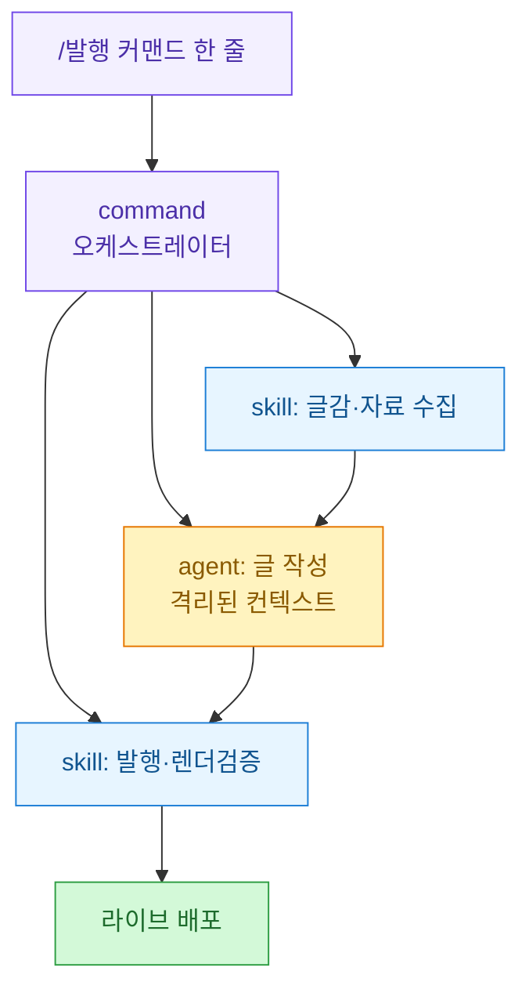
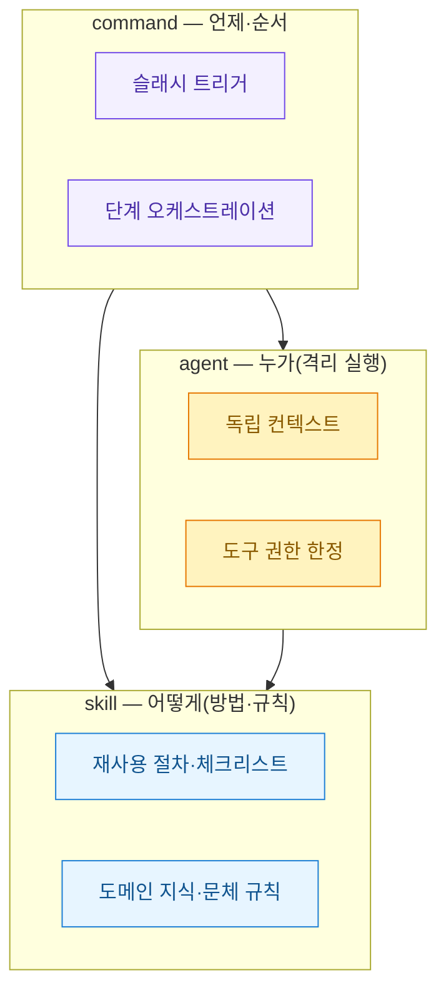
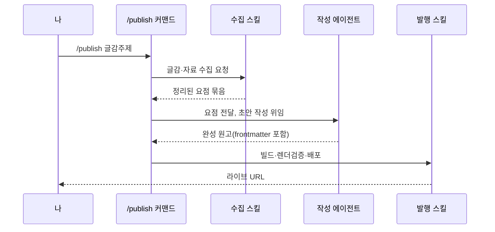

슬래시 커맨드 한 줄로 "글감 하나 던지면 글이 발행까지 되는" 흐름을 만들고 싶었다. 처음엔 단순하게 생각했다. 커맨드 파일 하나에 "자료 모아서, 이런 문체로 쓰고, 빌드해서 배포해"라고 전부 적어 넣으면 되는 줄 알았다. 실제로 그렇게 만들었더니 첫 두세 번은 돌아갔다. 그런데 글이 길어지거나 자료가 많아지면 후반부에서 문체 규칙을 잊거나 발행 체크리스트를 건너뛰었다. 한 프롬프트가 수집·작성·발행을 동시에 짊어지니 컨텍스트(모델이 한 번에 들고 있는 대화·지시의 총량)가 뒤엉킨 탓이었다.

그래서 역할을 셋으로 쪼갰다. Claude Code에는 마침 성격이 다른 세 가지 확장 지점이 있다. **skill**(반복 절차·규칙 묶음), **agent**(격리된 컨텍스트에서 도는 서브 실행자), **command**(슬래시로 부르는 진입점). 이 셋을 "무엇을·어떻게·누가"로 갈라 붙였더니 그제야 안정적으로 돌았다.



## 왜 한 프롬프트에 다 넣으면 안 됐나?

원인은 두 가지였다. 하나는 컨텍스트 오염이다. 수집 단계에서 웹페이지 원문을 잔뜩 읽어 들이면 그 텍스트가 대화에 그대로 남는다. 정작 글을 쓸 때는 이미 정리된 요점만 필요한데 원자료가 계속 시야를 차지하니 모델이 산만해졌다. 다른 하나는 규칙 유실이다. 발행 체크리스트(빌드 성공 확인·mermaid 렌더 점검·한글 강조 깨짐 회귀)는 매번 똑같은데 매번 커맨드 본문에 길게 복붙되어 있었다. 커맨드가 비대해질수록 후반 지시가 밀려났다.

핵심은 **"언제 하느냐"와 "어떻게 하느냐"를 한 파일이 같이 들고 있으면 안 된다**는 것이었다. 순서를 정하는 일과 방법을 정하는 일은 수명이 다르다. 방법(문체·체크리스트)은 거의 안 바뀌고 순서는 자주 손댄다.

## 세 계층은 각자 무슨 일을 하나?

역할을 이렇게 못 박았다. command는 **오직 순서만** 안다. 내용은 모른다. skill은 **방법만** 안다. 언제 불리는지는 모른다. agent는 **격리된 몸**이다. 자기만의 깨끗한 컨텍스트에서 위임받은 일만 하고 결과만 돌려준다.



표로 대조하면 경계가 더 선명하다.

| 계층 | 답하는 질문 | 파일 위치 | 바뀌는 빈도 |
|---|---|---|---|
| command | 언제·어떤 순서로 | `.claude/commands/*.md` | 자주 |
| skill | 어떤 방법·규칙으로 | `.claude/skills/*/SKILL.md` | 드물게 |
| agent | 누가 격리된 채로 | `.claude/agents/*.md` | 드물게 |

문체 규칙을 예로 들면, 이건 전형적인 skill감이다. 커맨드마다 복붙할 게 아니라 한 곳에 두고 참조시킨다.

```yaml
# .claude/skills/blog-style/SKILL.md
---
name: blog-style
description: 블로그 글의 1인칭 독백체·질문형 소제목·mermaid 도식 규칙. 글 작성 시 참조.
---
# 문체 규칙
- 1인칭 회고체, 강의체 금지
- H2 소제목은 질문형(~?)
- 섹션마다 mermaid 도식, mindmap 금지
- 발행 전 체크리스트는 publish-check 스킬 참조
```

## 커맨드 하나가 어떻게 전체를 오케스트레이션하나?

command 파일은 짧아졌다. 이제 "무엇을 어떤 순서로 부를지"만 적는다. 방법은 각 스킬이 알고 있으니 커맨드는 지휘만 한다.

```markdown
# .claude/commands/publish.md
글감 "$ARGUMENTS"로 블로그 글을 발행한다.

1) 수집: research-collect 스킬로 자료를 모아 요점만 정리한다.
2) 작성: blog-writer 서브에이전트에 요점을 넘겨 초안을 받는다.
   (문체는 blog-style 스킬을 따르도록 지시한다)
3) 발행: publish-check 스킬로 빌드·렌더검증 후 배포한다.
```

`$ARGUMENTS`는 슬래시 뒤에 붙인 인자가 그대로 꽂히는 자리다. `/publish MCP 3계층 설계`처럼 부르면 그 문자열이 들어온다. 실행되는 순서를 시간축으로 그리면 이렇다.



여기서 눈여겨볼 대목은 **수집 스킬이 커맨드에 돌려주는 게 원문 전체가 아니라 "정리된 요점"**이라는 것이다. 원자료의 무게를 여기서 덜어낸다.

## 서브에이전트를 왜 따로 띄웠나?

작성을 굳이 agent로 뺀 이유가 이 글의 핵심이다. 서브에이전트는 **자기만의 새 컨텍스트에서 시작한다.** 부모 대화에 쌓인 수집 원문·검색 로그·이전 시행착오를 물려받지 않는다. 작성 에이전트가 받는 건 딱 두 개다. 정리된 요점, 그리고 "blog-style 스킬을 따르라"는 지시. 그러니 글쓰기에만 집중한다.

```markdown
# .claude/agents/blog-writer.md
---
name: blog-writer
description: 정리된 요점을 받아 블로그 초안을 쓴다. 문체는 blog-style 스킬을 따른다.
tools: Read, Write
---
너는 블로그 글 작성자다. 넘겨받은 요점만으로 글을 쓴다.
웹 재검색은 하지 마라(이미 정리됐다). blog-style 규칙을 지켜라.
```

`tools`를 `Read, Write`로 좁힌 것도 의도다. 작성 단계에서 굳이 웹을 다시 뒤지거나 배포 명령을 실행할 이유가 없다. 권한을 좁히면 엉뚱한 짓을 할 여지가 준다. 실제로 이 원칙 덕에 "글 쓰다 말고 자료를 또 검색하느라 컨텍스트를 태우는" 사고가 사라졌다.

재밌는 건 지금 이 글도 그렇게 쓰였다는 점이다. 오케스트레이터가 나를(작성 서브에이전트) 격리된 채로 띄웠고, 나는 문체 가이드 파일과 배정 글감만 받아 이 원고를 쓰고 있다. 설계가 곧 실물인 셈이다.

## 실제로 굴려보니 뭘 배웠나?

세 가지가 남았다. 첫째, **command는 얇게 유지해야 한다.** 커맨드에 방법을 적기 시작하면 계층 분리가 무너진다. 커맨드가 길어지려 하면 "이건 스킬로 빠질 내용 아닌가"를 먼저 의심한다.

둘째, **에이전트 경계는 곧 컨텍스트 경계다.** 위임할 때 넘기는 정보를 최소로 줄일수록 결과가 깨끗했다. 원문을 통째로 넘기면 격리의 이점이 사라진다. 요점으로 압축해 넘기는 그 한 단계가 품질을 갈랐다.

셋째, **skill은 여러 커맨드가 공유할 때 진가가 난다.** 문체 스킬과 발행 체크 스킬은 블로그뿐 아니라 다른 자동화에서도 부른다. 한 번 잘 써두면 계속 재사용된다. 반대로 딱 한 곳에서만 쓰는 규칙이면 굳이 스킬로 안 뺀다. 과분리도 비용이다.

다음엔 발행 스킬 안의 렌더 검증을 더 조여볼 생각이다. mermaid 문법 오류나 한글 강조 깨짐을 배포 전에 자동으로 잡아내는 부분이다. 결국 이 3계층 설계의 목적은 하나다. **한 번에 하나의 일만 시키기.** 커맨드는 순서만, 스킬은 방법만, 에이전트는 격리된 실행만. 사람이 팀을 나누는 방식과 똑같았다.
