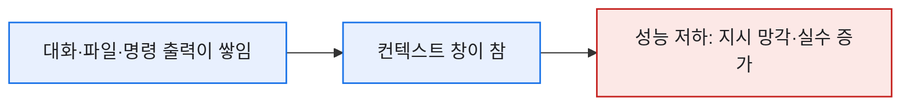
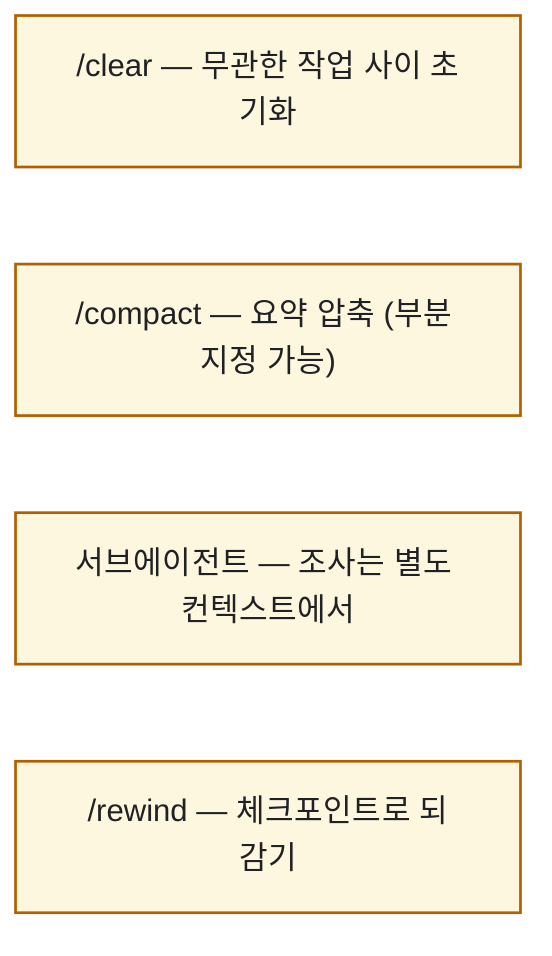

# 효율적인 CLAUDE.md 관리와 컨텍스트 최적화

> Claude Code를 오래 쓰다 보면 이상한 순간이 온다. 분명 CLAUDE.md에 규칙을 적어놨는데 Claude가 자꾸 무시하는 거다. 처음엔 '왜 말을 안 듣지' 했는데, 알고 보니 **파일이 너무 길어서 정작 중요한 규칙이 소음에 묻힌** 거였다. 이 글은 Anthropic 공식 Best practices 문서를 내 언어로 다시 정리하면서, 그날의 삽질을 복기한 기록이다.

## 왜 거의 모든 규칙이 '컨텍스트' 하나로 수렴하나?

Claude Code의 모범 사례를 파고들면 결국 **한 문장**으로 모인다.

> 컨텍스트 창은 빨리 차고, 차면 성능이 떨어진다.

컨텍스트 창(context window)은 대화 전체 — 모든 메시지, Claude가 읽은 모든 파일, 실행한 모든 명령의 출력 — 를 담는 공간이다. 디버깅 한 세션, 코드베이스 탐색 한 번이 수만 토큰을 순식간에 먹는다. 그리고 이게 차오를수록 Claude는 앞의 지시를 '잊거나' 실수가 늘어난다.

그래서 CLAUDE.md 관리도, /clear도, 서브에이전트도 전부 **'가장 소중한 자원인 컨텍스트를 아끼는 법'** 이라는 하나의 목적을 향한다. 이 관점을 쥐고 나면 나머지가 전부 이어진다.

## CLAUDE.md엔 무엇을 넣고, 무엇을 빼나?

CLAUDE.md는 매 대화 시작 때 Claude가 읽는 특별한 파일이다. 매번 로드되니까 **'항상 넓게 적용되는 것'만** 넣어야 한다. 판단 기준은 딱 하나다.

> 이 줄을 지우면 Claude가 실수를 하게 되나? 아니라면, 지운다.

```mermaid
flowchart TB
  classDef inc fill:#e6f4ea,stroke:#188038,stroke-width:1.4px,color:#202124
  classDef exc fill:#fce8e6,stroke:#c5221f,stroke-width:1.4px,color:#202124
  subgraph IN ["✅ 넣을 것"]
    direction TB
    i1["추측 못 하는 Bash 명령"]
    i2["기본값과 다른 코드 스타일"]
    i3["테스트 실행법·선호 러너"]
    i4["브랜치·PR 규칙"]
    i5["이 프로젝트만의 아키텍처 결정"]
    i6["환경 변수 등 개발환경 특이점"]
  end
  subgraph EX ["❌ 뺄 것"]
    direction TB
    e1["코드 읽으면 알 수 있는 것"]
    e2["Claude가 이미 아는 표준 관례"]
    e3["상세 API 문서 (링크로 대체)"]
    e4["자주 바뀌는 정보"]
    e5["파일별 코드베이스 설명"]
    e6["'깨끗한 코드 작성' 같은 자명한 말"]
  end
  class i1,i2,i3,i4,i5,i6 inc
  class e1,e2,e3,e4,e5,e6 exc
```

핵심 신호가 두 개 있다. **Claude가 규칙을 계속 어기면** → 파일이 너무 길어 규칙이 묻힌 것(과감히 쳐낸다). **CLAUDE.md에 있는 걸 Claude가 되물으면** → 문구가 모호한 것. CLAUDE.md는 코드처럼 다뤄야 한다 — 문제가 생기면 리뷰하고, 주기적으로 가지치기하고, 바꾼 뒤 실제로 행동이 달라지는지 관찰한다.

가끔 쓰는 도메인 지식이나 워크플로는 CLAUDE.md가 아니라 **스킬(skill)** 로 뺀다. 그러면 매 대화를 부풀리지 않고 필요할 때만 로드된다. 강조가 필요하면 `IMPORTANT`·`YOU MUST` 같은 표현으로 준수율을 올릴 수 있고, `@경로` 문법으로 다른 파일을 불러올 수도 있다.

## CLAUDE.md는 어디에 두나?

위치마다 적용 범위가 다르다. 이걸 알면 '팀 공유용'과 '나만의 메모'를 깔끔히 가를 수 있다.

| 위치 | 범위 | 언제 |
|---|---|---|
| `~/.claude/CLAUDE.md` | 내 모든 세션 | 개인 전역 규칙 |
| `./CLAUDE.md` | 프로젝트(git 공유) | 팀 공유 규칙 |
| `./CLAUDE.local.md` | 프로젝트(비공유) | 개인 메모 (.gitignore) |
| 상위/하위 디렉터리 | 모노레포·온디맨드 | 하위는 그 폴더 파일 읽을 때 자동 로드 |

## 컨텍스트는 어떻게 '공격적으로' 관리하나?

CLAUDE.md를 다듬는 게 예방이라면, 세션 중 컨텍스트 관리는 치료다. 나는 이 네 가지를 습관으로 삼았다.

- **/clear**: 서로 무관한 작업 사이에는 컨텍스트를 통째로 비운다. 긴 세션에 쌓인 잡음이 성능을 깎으니까.
- **/compact**: 한도에 가까워지면 자동 요약되지만, `/compact API 변경에 집중해`처럼 방향을 줄 수도 있다.
- **서브에이전트(subagent)**: 코드베이스 조사처럼 파일을 잔뜩 읽는 일은 **별도 컨텍스트 창**에서 시키고 요약만 받는다. "이 인증 로직을 서브에이전트로 조사해줘" 하면 메인 대화가 깨끗하게 유지된다. 컨텍스트가 근본 제약이라, 서브에이전트는 가장 강력한 도구 중 하나다.
- **/rewind**: 모든 프롬프트가 체크포인트다. 위험한 시도를 해보고 안 되면 되감으면 된다.

## 자주 밟는 지뢰는?

공식 문서가 꼽는 실패 패턴들인데, 나도 전부 밟아봤다.

| 패턴 | 증상 | 처방 |
|---|---|---|
| **잡탕 세션** | 한 세션에서 무관한 일들을 섞음 | 작업 사이 `/clear` |
| **교정 무한루프** | 두 번 넘게 같은 걸 고쳐도 여전히 틀림 | 2회 실패 시 `/clear` 후 더 나은 프롬프트로 재시작 |
| **과잉 CLAUDE.md** | 파일이 길어 규칙이 묻힘 | 무자비하게 가지치기, 규칙은 훅(hook)으로 |
| **믿고 안 본 검증 공백** | 그럴듯한데 엣지케이스를 놓침 | 테스트·스크립트·스크린샷으로 항상 검증 |
| **무한 탐색** | 범위 없이 '조사해줘' → 수백 파일 읽음 | 범위를 좁히거나 서브에이전트로 |

특히 **교정을 두 번 넘게 했다면**, 이미 컨텍스트가 실패한 시도들로 오염된 거다. 긴 세션에 교정을 쌓느니, 배운 걸 담아 새 프롬프트로 `/clear` 하는 게 거의 항상 낫더라.

## 오늘의 정리

돌아보면 내 Claude Code 생산성이 확 오른 건 더 좋은 프롬프트를 배웠을 때가 아니라, **컨텍스트를 자원으로 의식하기 시작했을 때**였다. CLAUDE.md는 짧게, 잡음은 /clear로, 무거운 조사는 서브에이전트로 — 결국 전부 "가장 소중한 창을 아낀다"는 한 문장의 실천이었다. CLAUDE.md를 코드처럼 주기적으로 가지치기하는 습관, 그거 하나가 절반이다.

*Anthropic의 공식 "Best practices for Claude Code" 문서를 바탕으로 제 경험을 얹어 정리했습니다.*
