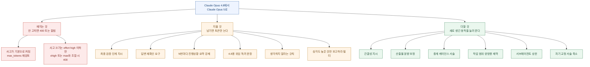
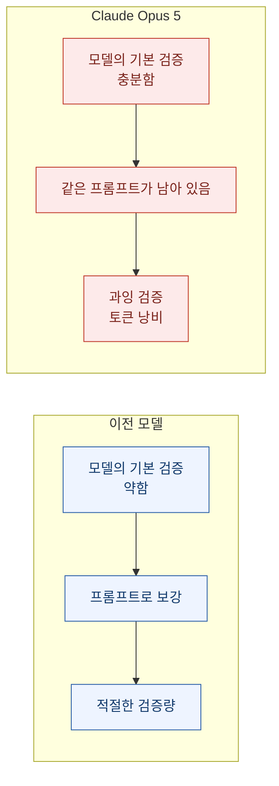
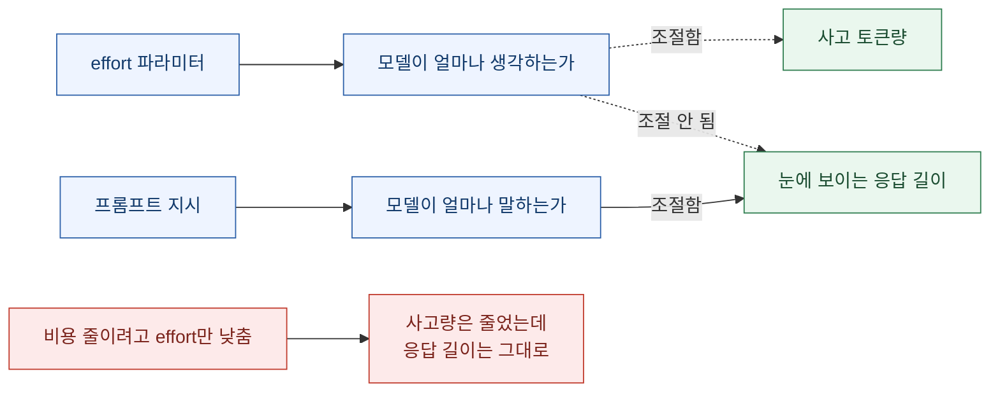
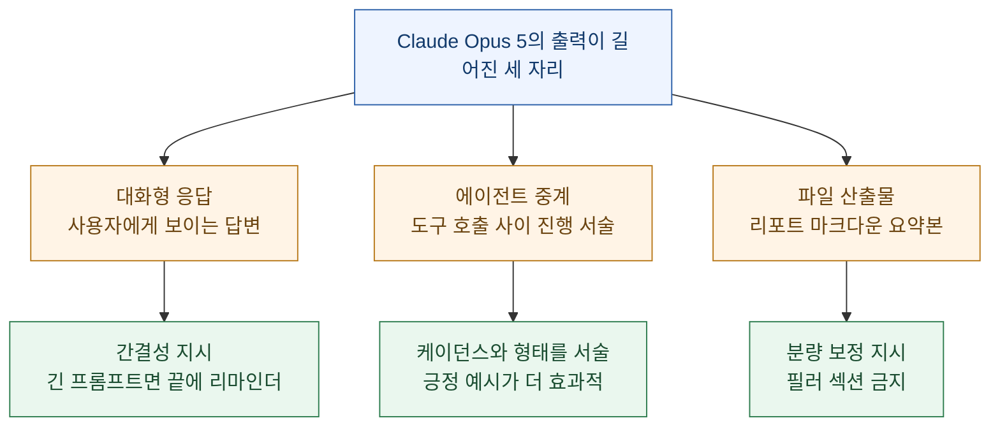
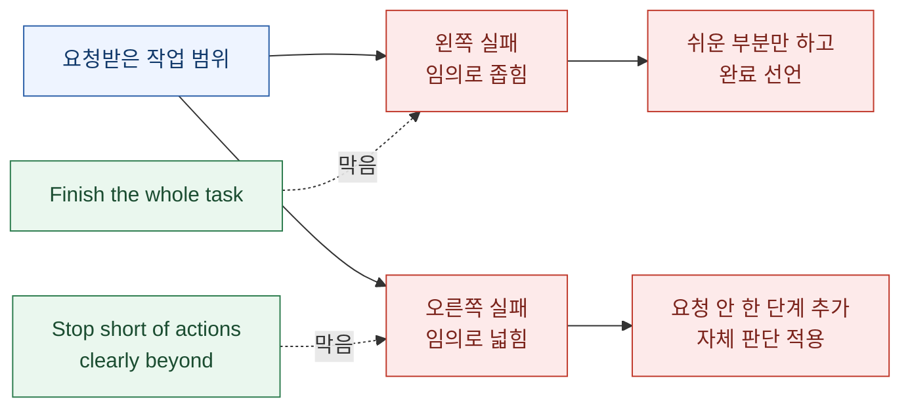
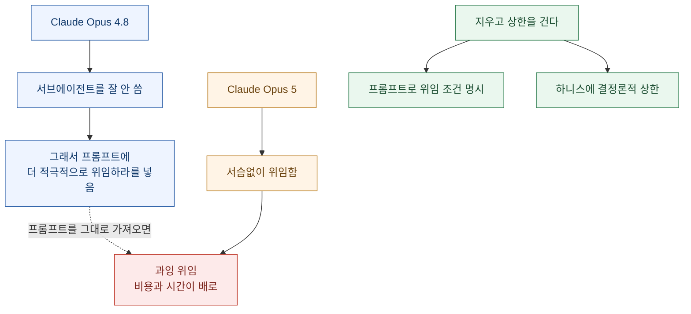
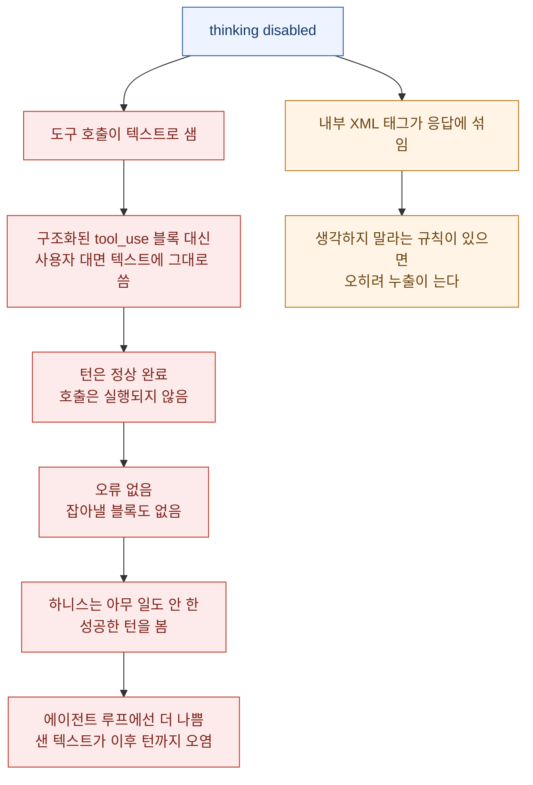
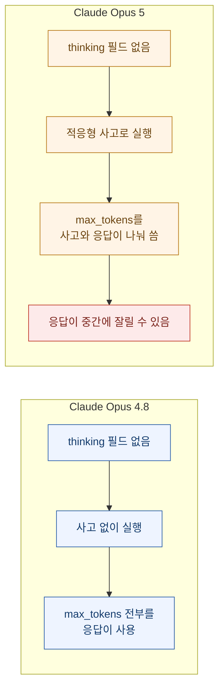
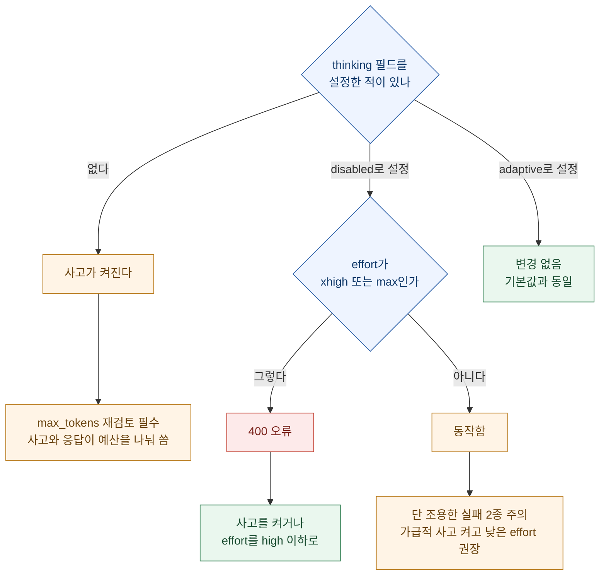

지난주에 나는 앤트로픽 직원이 쓴 글 하나를 정리했다. 제목은 **"규칙을 80% 지웠더니 더 잘했다"**. 클로드 코드 시스템 프롬프트에서 규칙의 80% 이상을 지웠는데 코딩 평가 손실이 측정되지 않았다는 이야기였다. 그때 나는 그 글을 "사내 실천을 공유한 비공식 글"로 읽었다.

오늘 같은 이야기가 **공식 문서**로 올라왔다. 앤트로픽이 플랫폼 문서에 **Claude Opus 5 전용 프롬프트 가이드**를 추가했고, **Claude Opus 4.8 → Claude Opus 5 마이그레이션 가이드**가 함께 갱신됐다. 비공식 관찰이 스펙이 된 셈이다.

새 모델 문서를 열 때 개발자가 기대하는 건 대개 하나다. **같은 프롬프트로 더 좋은 결과.** 그리고 문서도 그렇게 시작한다 — "기존 Claude Opus 4.8 프롬프트에서 별도 손질 없이 잘 동작한다(performs well out of the box)". 그런데 바로 다음 문장부터 문서 전체가 **가장 자주 손봐야 하는 동작들**을 하나씩 짚는다.

읽고 나서 남은 문장은 하나였다.

**이전 모델을 달래려고 써 둔 지시를 지우는 일이, 새 지시를 추가하는 일보다 중요하다.**

예전 클로드에게 "작업이 끝나면 반드시 검증 단계를 넣어라"라고 적어 두었다면 Opus 5에서는 그 문장이 **과잉 검증**을 유발한다. "진행 상황을 3번의 도구 호출마다 요약하라"라고 적어 두었다면 이제는 **중복 서술**이 된다. 모델이 알아서 하게 된 일을 계속 시키면 토큰만 늘고 결과는 나아지지 않는다.

이 글은 두 문서를 합쳐 정리한 것이다. 확인 기준은 2026년 7월 28일이고, 1차 출처는 [Prompting Claude Opus 5](https://platform.claude.com/docs/en/build-with-claude/prompt-engineering/prompting-claude-opus-5)와 [What's new in Claude Opus 5](https://platform.claude.com/docs/en/about-claude/models/whats-new-opus-5), 그리고 [Migration guide](https://platform.claude.com/docs/en/about-claude/models/migration-guide)다. 두 문서는 같은 이야기를 각각 **프롬프트 관점**과 **API 관점**에서 서술하고 있어서, 실제로 모델을 갈아 끼울 때는 둘을 함께 봐야 빠지는 항목이 없다.

덧붙이자면, 나는 이 모델을 매일 쓴다. 이 블로그의 발행 자동화도 클로드 코드로 돌린다. 그래서 문서에 적힌 동작 변화 중 몇 개는 읽기 전부터 체감하고 있던 것들이었다 — 특히 응답이 길어진 것과, 시키지 않아도 자기가 확인하러 가는 것.

## 문서 전체를 한 장으로 보면 어떻게 되나?

가장 먼저 해야 할 구분이 있다. **틀리면 400 에러가 나는 것**과 **틀려도 돌아가지만 손해인 것**은 완전히 다른 항목이다. 마이그레이션 가이드는 이걸 `[BLOCKS]`와 `[TUNE]`으로 태그해 둔다. 이 구분을 축으로 놓으면 두 문서가 한 장에 들어온다.



가운데 주황색 기둥이 이 문서의 성격을 말해 준다. **새 모델 가이드인데 지울 것이 여섯 줄이고 더할 것이 여섯 줄이다.** 보통 새 모델 문서는 "이런 걸 새로 할 수 있습니다"만 적는다.

## 왜 지우는 게 더 중요한가?

핵심 논리는 **겹침**이다.

모델이 이미 하는 일을 프롬프트로 또 시키면, 두 개가 더해지는 게 아니라 **곱해진다**. 문서 표현으로는 "모델 자체 동작과 겹쳐서(compound with the model's own behavior) 결과 개선 없이 비용만 더한다".



문서가 검증에 대해 못 박는 문장은 이거다. **Claude Opus 5는 시키지 않아도 자기 작업을 검증한다.** 프롬프트에 "사소하지 않은 작업에는 반드시 최종 검증 단계를 포함하라"나 "서브에이전트를 써서 검증하라" 같은 명시적 검증 지시가 들어 있다면 **제거해야 한다.** 그리고 원문이 붙이는 결론이 중요하다 — 제거하면 **품질 손실 없이 낭비되는 토큰만 줄어든다.**

이건 고쳐 쓰라는 게 아니라 **지우라는 것**이다.

자기 교정(self-correction) 절에서도 같은 이야기가 반복된다. "답변을 다시 확인하라"나 "응답 전에 재검증하라"처럼 **모델이 이미 수행하는 재확인을 지시하지 말라**고 명시한다.

그리고 프롬프트뿐 아니라 **하니스 쪽 레거시 스캐폴딩**에도 같은 원칙이 적용된다. 별도의 검증 단계를 코드로 덧붙여 둔 파이프라인이 있다면 그것도 재검토 대상이다.

### 이 조언이 프롬프트 엔지니어링 상식과 어긋난다는 점

여기가 이 문서에서 제일 조심해서 읽어야 할 대목이다.

**"모델에게 자기 점검을 시켜라"는 거의 모든 프롬프트 가이드에서 권장 사항으로 등장한다.** 체인 오브 소트, 셀프 컨시스턴시, 리플렉션 — 이름은 달라도 뿌리는 같다. 한 번 더 보게 만들면 정확도가 오른다는 것.

그런데 이 모델에서는 그 상식이 **반대로 작동한다.** 프롬프트 라이브러리를 만들어 두고 모든 모델에 같은 규칙을 적용하고 있다면, Claude Opus 5에는 **예외 조항**을 두는 편이 낫다.

나는 이 대목에서 잠깐 멈췄다. 내가 가진 프롬프트 자산은 대부분 "모든 모델에 통하는 일반 규칙"으로 써 놨기 때문이다. **모델마다 다른 규칙을 관리해야 한다면, 프롬프트도 버전 관리 대상이 된다.** 이건 운영 비용이 늘어나는 이야기지 줄어드는 이야기가 아니다. 그런데 대안이 없다 — 안 하면 토큰을 계속 태운다.

## effort를 낮추면 응답이 짧아지나?

**안 짧아진다.** 이게 이 문서에서 제일 반직관적인 대목이고, 실무에서 제일 자주 걸릴 함정이다.



원문 표현을 그대로 옮기면 이렇다. **effort 파라미터는 모델이 얼마나 사고하는지를 제어하지 얼마나 말하는지를 제어하지 않는다.** effort를 낮추면 사고 분량은 줄어들지만 **눈에 보이는 응답이 확실하게 짧아지지는 않는다.**

그러니까 분량은 **프롬프트로 직접 요구해야 한다.**

앤트로픽이 제시하는 방법은 놀랄 만큼 단순하다. 짧은 간결성 지시 하나면 충분하다는 것. 여러 턴이 오가는 사용자 대면 제품이라면 다음 문장을 시스템 프롬프트에 넣으라고 권한다.

```text
Keep responses focused, brief, and concise. Keep disclaimers and caveats short,
and spend most of the response on the main answer. When asked to explain something,
give a high-level summary unless an in-depth explanation is specifically requested.
```

그리고 시스템 프롬프트가 이미 길다면, 위 지시와 함께 **프롬프트 끝부분**에 짧은 리마인더를 한 번 더 배치하라고 권한다.

```text
<tone_preference>
Keep outputs reasonably concise.
</tone_preference>
```

이 두 번째 조언이 은근히 실무적이다. **긴 프롬프트에서는 앞쪽 지시가 묻힌다**는 걸 문서가 인정하고 있는 셈이다. 나는 CLAUDE.md가 꽤 긴 편이라 이 패턴을 바로 적용할 생각이다.

## 분량은 한 겹이 아니라 세 겹이다

문서를 읽다 보면 "길어졌다"는 이야기가 세 군데에서 따로 나온다. 그리고 **각각 손잡이가 다르다.** 이걸 하나로 뭉뚱그리면 한 군데만 고치고 나머지 두 군데는 그대로 남는다.



### 첫째, 대화형 응답

위에서 다룬 간결성 지시가 여기 해당한다.

### 둘째, 에이전트 세션의 중계 멘트

Claude Opus 5는 에이전트 작업 중에 **서슴없이 상황을 중계한다.** 무엇을 하려는지 미리 말하는 경향이 있고, 에이전트 세션에서 메시지 하나당 출력량 자체가 이전 모델보다 길다.

이 특성은 **원하는 케이던스와 형태를 서술**하면 조절할 수 있다. 중계를 줄이고 싶다면 문서가 제시하는 예시는 이렇다.

```text
Before your first tool call, say in one sentence what you're about to do.
While working, give a brief update only when you find something important or
change direction. When you finish, lead with the outcome: your first sentence
should answer "what happened" or "what did you find," with supporting detail
after it for readers who want it.
```

같은 레버가 **반대 방향으로도 작동한다.** 중계를 오히려 늘리거나 스타일을 바꾸고 싶다면 원하는 업데이트가 어떤 모습이어야 하는지 명시하고 예시를 주면 된다.

여기서 문서가 덧붙이는 조언이 눈여겨볼 만하다. **하지 말아야 할 것을 나열하는 지시보다, 원하는 커뮤니케이션 스타일의 긍정 예시를 보여 주는 쪽이 더 효과적이다.**

이건 오래된 프롬프트 격언인데("don't 대신 do로 써라"), 이번 문서에서는 특별히 중계 스타일 항목에 붙어 있다. 금지 목록은 회피 경로를 남기지만 예시는 목표를 고정한다는 뜻으로 읽었다.

### 셋째, 디스크에 쓰는 산출물

대화 자체의 장황함과는 **별개로**, Claude Opus 5가 파일로 써 내려가는 산출물도 이전 모델보다 길다. 리포트, 마크다운 문서, 요약본이 모두 여기 해당한다. 클로드가 작성한 문서를 제품에 포함시킨다면 분량 보정을 명시적으로 추가하라고 권한다.

```text
Match the length of written documents to what the task needs: cover the substance,
but do not pad with filler sections, redundant summaries, or boilerplate.
```

이 항목은 나한테 특히 직접적이다. 이 블로그 글 자체가 "클로드가 파일로 쓰는 산출물"이기 때문이다. 실제로 최근 발행한 글들의 분량이 예전보다 늘어난 걸 확인했는데, 그게 내가 요구해서 늘어난 건지 모델이 길게 쓰게 된 건지 이제야 구분이 된다. **둘 다였다.**

## 작업 범위는 왜 양방향으로 막아야 하나?

Claude Opus 5는 작업 범위를 스스로 넓히기도 한다. 요청하지 않은 단계를 추가하거나, 이 작업이 무엇이어야 하는지에 대해 자체 판단을 적용한다. 범위가 좁은 작업이라면 다음처럼 명시적으로 제약하라고 문서는 말한다.

```text
Deliver what was asked, at the scope intended. Make routine judgment calls yourself,
and check in only when different readings of the request would lead to materially
different work. If the request seems mistaken or a better approach exists, say so in
a sentence and continue with the task as asked rather than quietly narrowing, widening,
or transforming it. Finish the whole task, and stop short of actions that are clearly
beyond what was asked.
```

이 지시문을 처음 읽었을 때는 그냥 "범위 넘지 마라"로 읽었는데, 뜯어 보니 **두 방향을 동시에 막고 있다.**



앞부분이 요청 범위를 넘어서는 **확장**을 막고, 뒷부분의 `Finish the whole task`가 반대로 작업을 임의로 좁혀 **조기에 완료를 선언하는 것**을 막는다.

**확장과 축소 중 한쪽만 막으면 다른 쪽으로 샌다.** 이게 이 지시문이 저렇게 긴 이유다. "범위를 지켜라"만 적으면 모델이 안전한 쪽 — 즉 덜 하는 쪽 — 으로 기울 수 있다.

마이그레이션 가이드에 실린 확장판에는 문장이 하나 더 붙어 있다. 정말로 완료할 수 없는 부분이 있으면 **나머지를 다 하고 무엇이 빠졌는지 분명히 말하라**는 것. 조용히 축소하는 것과 명시적으로 보고하는 것을 갈라 놓는 문장이다.

## 서브에이전트는 왜 방향이 뒤집혔나?

이 항목이 이번 문서에서 가장 실질적인 함정이라고 본다. **성능이 좋아진 게 아니라 성향이 반대로 바뀌었기 때문이다.**



Claude Opus 4.8은 서브에이전트를 잘 쓰지 않아서 **오히려 "이런 경우에는 위임하라"고 독려하는 지시를 넣어야 했다.** 4.8용 프롬프트를 그대로 들고 왔다면 그 독려 문장이 이제는 과잉 위임을 부추긴다.

왜 과잉 위임이 비싼가. 서브에이전트 하나가 뜰 때마다 **맥락을 다시 세우고, 다시 탐색하고, 보고하고, 그 보고를 다시 읽는** 과정이 반복되기 때문이다. 진짜로 독립적이고 규모가 있는 작업 갈래라면 이득이지만, 작은 작업에 적용하면 손해가 확정이다.

문서가 제시하는 상한 지시는 이렇다.

```text
Delegate to a subagent only for large tasks that are genuinely independent and
parallelizable, such as a wide multi-file investigation. Do not delegate work you
can finish yourself in a handful of tool calls, and do not use subagents to verify
or double-check your own work. If one subagent can complete the task, use one rather
than several, and keep spawn counts low.
```

그리고 하니스가 서브에이전트를 지원한다면, 프롬프트 지시와 함께 **몇 개까지 띄울 수 있는지 결정론적 상한을 코드로 거는 방법**도 권한다. 프롬프트는 확률이고 코드는 확정이라는 이야기다.

한 가지 더. 위 지시문에 들어 있는 `do not use subagents to verify or double-check your own work`는 **앞 절의 과잉 검증 문제와 같은 뿌리를 공유한다.** 검증을 서브에이전트에 맡기지 말라는 것은, 검증 자체를 지시하지 말라는 조언을 위임 관점에서 다시 말한 것이다.

**같은 문제가 두 절에 나눠 실려 있다.** 문서를 앞에서부터 순서대로 읽으면 별개 항목으로 보이는데, 사실 하나다.

## 자기 교정 서술은 왜 줄여야 하나?

Claude Opus 5는 앞서 한 발언을 정정하는 과정을 이전 모델보다 자주 서술한다. **내부적으로 실수를 잡아내는 것 자체는 좋은 일**이지만, 사용자 대면 제품에서는 이 서술이 불필요한 잡음으로 읽힐 수 있다.

사용자에게 실제로 영향을 주는 정정만 남기려면 이렇게 적으라고 권한다.

```text
Only correct an earlier statement when the error would change the user's code,
conclusions, or decisions. State corrections plainly and briefly, then continue
the task. For slips that change nothing for the user, make the fix and move on
without noting it.
```

기준이 명확해서 좋은 지시문이다. **"바꿔야 하나"가 아니라 "사용자의 코드·결론·결정이 바뀌나"** 로 판정한다. 판정 기준을 결과에 두면 애매한 자기 검열이 줄어든다.

마이그레이션 가이드의 확장판에는 한 문단이 더 붙어 있는데, 그게 더 아프다. **후속 질문이 들어왔다는 사실 자체가 내가 틀렸다는 신호는 아니라는 것.** 정확했던 진술은 정정할 필요가 없고, 어떻게 표현했는지·어떻게 검증했는지를 다시 감사할 필요도 없다. 질문을 받으면 재감사부터 하는 습관을 명시적으로 끊는 문장이다.

## thinking을 끄면 무엇이 조용히 실패하나?

Claude Opus 5는 사고(thinking)가 **기본으로 켜져 있고**, effort가 `high` 이하일 때만 끌 수 있다. 그런데 사고를 껐을 때 눈에 보이는 출력에 이따금 나타나는 아티팩트가 두 가지 있다. **둘 다 조용히 실패하는 유형이라 특히 조심해야 한다.**



**첫째, 도구 호출이 텍스트로 새어 나온다.** 구조화된 `tool_use` 블록을 내보내는 대신 사용자 대면 텍스트 안에 도구 호출을 그대로 써 버린다. 이때 턴은 정상적으로 완료되고 **호출은 실행되지 않는다.** 오류도 없고 잡아낼 `tool_use` 블록도 없으니, 하니스 입장에서는 **아무 일도 하지 않은 성공한 턴**을 보게 된다.

이게 오늘 아침에 내가 다른 글에서 쓴 주제와 정확히 같은 모양이라 좀 놀랐다. 기록은 정상이고, 로그도 정상이고, 상태 코드도 정상인데, **실제로는 아무 일도 일어나지 않은 것.** 검색처럼 도구를 많이 쓰는 워크로드에서 가장 흔하게 발생한다고 한다.

에이전트 루프에서는 더 나쁘다. **새어 나온 텍스트가 대화 기록에 남아 이후 턴까지 영향을 준다.**

**둘째, 내부 XML 태그가 응답에 섞인다.** 모델이 `<thinking>` 태그나 다른 내부 XML 태그를 눈에 보이는 응답에 방출한다.

여기서 가이드가 짚는 대응이 **반직관적**인데, 시스템 프롬프트에 "생각하지 말라"거나 "추론하지 말라"는 규칙이 있다면 **그것을 제거하라**는 것이다. 그런 종류의 지시는 태그 누출을 억제하는 게 아니라 **오히려 늘린다.**

두 문제 모두에 대한 1차 대응은 같다. **사고를 켜 둔 채 낮은 effort로 토큰 비용을 제어하는 쪽이 사고를 끄는 것보다 낫다.** 문서는 대부분의 작업에서 이렇게 못 박는다 — *"thinking enabled at low effort performs better than thinking disabled at similar cost."* 비슷한 비용이라면 켜 두는 쪽이 결과가 낫다는 뜻이다.

그럼에도 사고를 반드시 꺼야 하는 통합 환경이라면, 두 아티팩트를 한꺼번에 완화하는 결합 지시 하나를 권한다.

```text
When you use a tool, you may say a brief sentence first. If no tool can express
what the user asked for, say so instead of guessing. Do not include internal or
system XML tags in your response.
```

세 부분으로 구성돼 있다. ① 도구 호출 전에 **말할 권한을 명시적으로 주고**(누출이 "말하고 싶은데 못 하게 막아서" 생기는 것으로 보이기 때문), ② 맞는 도구가 없을 때의 대안을 제시하고, ③ 내부 태그에 대한 일반 규칙을 둔다.

마지막 한 가지가 더 있다. **사고 태그를 이름으로 지목하는 지시는 일반형보다 효과가 떨어진다.** `<thinking>`을 콕 집어 언급하는 대신 위처럼 "내부 또는 시스템 XML 태그"라는 일반적 표현을 쓰라고 권한다.

이유는 안 적혀 있는데, 짐작은 간다. 특정 문자열을 금지하면 그 문자열만 피하고 다른 태그로 새어 나올 수 있다. **금지 목록은 회피 경로를 남긴다** — 위에서 나온 "부정 예시보다 긍정 예시" 조언과 뿌리가 같다.

## 마이그레이션에서 실제로 깨지는 것은 무엇인가?

여기부터는 API 관점이다. 요약하면 Claude Opus 5는 Claude Opus 4.8과 **동일한 가격**(입력 100만 토큰당 5달러, 출력 100만 토큰당 25달러)의 드롭인 업그레이드이고, 모델 ID 한 줄만 바꾸면 대부분 동작한다.

```python
model = "claude-opus-4-8"  # Before
model = "claude-opus-5"    # After
```

`claude-opus-5`는 **날짜 접미사가 없는 고정 ID**로, `claude-opus-4-8`과 같은 명명 규칙을 따른다. 그리고 4.8에서 이미 돌아가고 있는 코드 기준으로 파괴적 변경이 **두 가지** 있다.

### 파괴적 변경 ①: 사고가 기본으로 켜진다

Claude Opus 4.8에서는 `thinking` 필드가 없는 요청이 **사고 없이** 실행됐다. Claude Opus 5에서는 같은 요청이 **적응형 사고(adaptive thinking)로** 실행된다. 와이어 포맷은 그대로이고 `thinking: {"type": "adaptive"}`도 여전히 유효하며 기본값과 동일하다. **바뀐 것은 기본값 자체다.**

이것이 **조용한 비용 증가이자 잘림(truncation) 위험**인 이유는 `max_tokens`가 **사고와 응답 텍스트를 합친 총 출력의 하드 리밋**이기 때문이다.



Claude Opus 4.8에서 사고 없이 돌아가던 워크로드가 답변 길이에 딱 맞춰 `max_tokens`를 좁게 잡아 두었다면, Opus 5에서는 **응답이 중간에 잘릴 수 있다.** `thinking`을 **한 번도 설정하지 않았던 모든 경로**에서 `max_tokens`를 다시 검토해야 한다.

이 항목이 위험한 이유는 **에러가 안 나기 때문**이다. `stop_reason`이 `max_tokens`로 돌아올 뿐이고, 그걸 안 보면 그냥 답이 좀 짧게 온 것처럼 보인다.

한 가지 더. Claude Opus 5에서 **원시 사고 토큰은 반환되지 않는다.** `thinking.display`의 기본값은 `"omitted"`이고, `"summarized"`로 설정하면 요약을 받는다. 사고 내용을 UI에 흘리던 제품이라면 이것도 확인 대상이다.

### 파괴적 변경 ②: 사고 끄기는 effort high 이하에서만

`thinking: {"type": "disabled"}`는 effort가 **`high` 이하일 때만** 허용된다. `xhigh`나 `max`와 조합하면 **400 오류**를 반환한다. Claude Opus 4.8은 이 조합을 받아들이므로, 사고를 끄는 요청이 있다면 마이그레이션 전에 감사해야 한다.

**검사는 요청 단위로 독립 수행된다.** 대화 앞부분의 요청들이 통과했더라도, 사고를 끈 상태로 effort를 `xhigh`로 올리는 후속 요청은 거부된다.

```python
# Claude Opus 4.8에서는 통과, Claude Opus 5에서는 400
client.messages.create(
    model="claude-opus-5",
    max_tokens=16000,
    thinking={"type": "disabled"},
    output_config={"effort": "xhigh"},
    messages=[{"role": "user", "content": "..."}],
)
```

해결책은 둘 중 하나다.

```python
# 방법 1: 사고를 켠다 (기본값이므로 필드 제거)
client.messages.create(
    model="claude-opus-5",
    max_tokens=16000,
    output_config={"effort": "xhigh"},
    messages=[{"role": "user", "content": "..."}],
)

# 방법 2: 사고를 끄고 effort를 낮춘다
client.messages.create(
    model="claude-opus-5",
    max_tokens=16000,
    thinking={"type": "disabled"},
    output_config={"effort": "high"},  # 또는 "medium", "low"
    messages=[{"role": "user", "content": "..."}],
)
```

앞서 살펴본 사고 비활성화 부작용을 감안하면, **지연 시간 때문에 `xhigh`와 사고 끄기를 함께 쓰던 경로는 대개 `medium`에 사고를 켜 두는 쪽이 더 나은 선택**이다.

### 결정 트리로 정리하면



## effort는 왜 다시 재야 하나?

Claude Opus 5는 다섯 단계의 effort를 모두 지원하며, **각 단계 뒤의 토큰 배분이 Claude Opus 4.8과 달라졌다.** 이전 모델에 맞춰 튜닝한 값을 그대로 가져오지 말고 **자체 평가셋으로 스윕을 다시 돌리라**고 권하는 이유다.

| effort | 설명 | 대표 용도 |
|---|---|---|
| `max` | 토큰 지출에 제약을 두지 않는 최대 역량 | 가장 깊은 추론과 철저한 분석이 필요한 작업 |
| `xhigh` | 장기 실행 작업을 위한 확장 역량 | 30분 이상 이어지는 에이전트, 까다로운 코딩 |
| `high` | **기본값**. 파라미터를 넣지 않은 것과 동일 | 복잡한 추론, 어려운 코딩, 에이전트 작업 |
| `medium` | 균형점. 적당한 토큰 절감 | 속도·비용·성능의 균형이 필요한 에이전트 작업 |
| `low` | 가장 효율적. 상당한 토큰 절감과 약간의 역량 감소 | 서브에이전트처럼 단순하고 빠른 작업 |

문서가 권하는 순서는 이렇다. **기본값 `high`에서 출발해 양방향으로 조정한다.** 품질이 유지되는 구간에서는 단계를 내려 토큰과 지연 시간을 아끼고, 가장 까다로운 작업에서는 올린다.

여기서 이 모델의 특징이 하나 나온다. 프롬프트 가이드가 **`low`와 `medium`을 유난히 밀어 준다**는 점이다. 원문 표현으로 두 단계가 "높은 설정 대비 토큰과 지연 시간의 일부만 쓰면서도 강한 품질"을 내므로, 품질이 유지되는 구간에서는 **토큰 비용과 응답 시간의 1차 제어 수단으로 적극 쓰라**고 한다.

`max`는 역량이 비용보다 중요할 때만 시험해 보되, **토큰 사용량 증가 대비 수익이 체감할 수 있고 단순한 작업에서는 과잉 사고로 흐를 수 있다**는 점을 감안하라고 적혀 있다. 그리고 `xhigh`나 `max`로 돌릴 때는 서브에이전트와 도구 호출 전반에 걸쳐 사고하고 행동할 여유가 필요하므로 **`max_tokens`를 최소 64k 정도로 크게 잡고 조정**하라고 권한다.

한 가지 주의할 점을 적어 둔다. 프롬프트 가이드는 "기본값 `high`에서 시작"이라고 쓰고, 마이그레이션 가이드 쪽은 코딩·에이전트 작업에는 `xhigh`에서 시작해 아래로 스윕하라는 뉘앙스가 더 강하다. **두 문서의 강조점이 미묘하게 다르다.** 어느 쪽이든 결론은 같다 — **물려받은 값을 그대로 쓰지 말고 직접 재라.**

## 함께 챙기면 좋은 것들

파괴적 변경은 아니지만 마이그레이션 시점에 같이 손보면 이득인 항목들이다. 이 절에 **문서를 정독해야만 걸리는 것들**이 몇 개 숨어 있다.

### 프롬프트 캐시 최소 길이가 512 토큰으로

Claude Opus 4.8에서는 1,024 토큰이었다. 짧아서 캐시가 안 걸린다고 포기했던 프롬프트들이 **코드 변경 없이** 캐시 엔트리를 만들게 된다. 다시 점검해 볼 가치가 있다.

⚠️ 그런데 여기 함정이 하나 있다. **이 최소값은 세대 순으로 단조롭지 않다.**

| 모델 | 캐시 최소 길이 |
|---|---:|
| Claude Opus 5 | **512 토큰** |
| Claude Opus 4.8 | 1,024 토큰 |
| Claude Opus 4.7 | 2,048 토큰 |
| Claude Opus 4.6 / 4.5 / Haiku 4.5 | **4,096 토큰** |

3천 토큰짜리 프롬프트는 Claude Opus 5와 4.8에서는 캐시되고, **Opus 4.6이나 Haiku 4.5에서는 조용히 캐시되지 않는다.** 에러도 안 나고 `cache_creation_input_tokens`가 0으로 올 뿐이다. "최신 모델일수록 낮다"는 직관으로 계산하면 틀린다.

### 대화 중 도구 변경 (베타)

베타 헤더 `mid-conversation-tool-changes-2026-07-01`을 보내면 **대화 턴 사이에 도구를 추가하거나 제거하면서도 이전 턴의 프롬프트 캐시 히트를 유지할 수 있다.** 기존에는 도구 목록이 바뀌면 캐시된 프리픽스 **전체**가 무효화됐다. 도구는 렌더 순서상 맨 앞(`tools` → `system` → `messages`)에 오기 때문이다.

구체적인 사용법이 문서에 있는데, 붙여 놓은 요약본에는 빠져 있어서 적어 둔다. 두 가지 제약이 있다.

**첫째, 추가할 도구는 미리 `tools[]`에 `defer_loading: true`로 선언돼 있어야 한다.** 즉 요청에는 존재하지만 컨텍스트에는 안 올라가 있는 상태로 대기시켜 두고, `tool_addition`이 그것을 꺼내는 구조다.

```python
tools = [
    {"name": "get_weather", "description": "Get weather",
     "input_schema": {"type": "object", "properties": {"city": {"type": "string"}}}},
    {"name": "get_forecast", "description": "Get 5-day forecast",
     "input_schema": {"type": "object", "properties": {"city": {"type": "string"}}},
     "defer_loading": True},
]
```

**둘째, 추가와 제거는 `role: "system"` 메시지의 콘텐츠 블록으로 보낸다.**

```python
messages = [
    {"role": "user", "content": "What tools do you have for weather in Paris?"},
    {"role": "system", "content": [
        {"type": "tool_addition", "tool": {"type": "tool_reference", "name": "get_forecast"}},
    ]},
]
```

`tool_removal` 블록은 **어시스턴트 메시지 바로 앞이나 `messages`의 맨 끝**에 있어야 한다. 그리고 도구의 **정의 자체를 바꾸려면** 한 요청에서 옛 정의를 제거하고, 다음 요청의 `tools[]`에 갱신된 항목을 넣는 **두 단계**를 밟아야 한다.

⚠️ 이 기능의 **초기 프리뷰는 다른 베타 헤더와 다른 블록 모양**을 썼고 둘 다 폐기됐다. 옛 예제를 보고 구현했다면 헤더와 블록 모양을 **같이** 바꿔야 한다. 그리고 SDK 타입 정의가 이 블록들을 아직 못 따라가서, 파이썬은 평범한 dict로 넘기고 타입스크립트는 `@ts-expect-error`를 붙이라고 안내한다.

### fallbacks "default" 모드

Claude Opus 5에는 사이버보안 안전 분류기가 붙어 있어서 특정 요청이 거절될 수 있고, 이 경우 `stop_reason: "refusal"`이 담긴 **정상 200 응답**이 돌아온다. `response.content[0]`을 무조건 읽는 코드는 여기서 깨진다.

베타 헤더 `server-side-fallback-2026-07-01`과 함께 `fallbacks: "default"`를 넣으면 **거절 범주에 따라 앤트로픽이 권장하는 폴백 모델로 자동 재시도**한다. 사이버 범주 거절은 **Claude Opus 4.8로 라우팅**된다.

문서가 `"default"`를 권하는 이유가 설득력 있다. 폴백 모델마다 분류기가 다르기 때문에 **올바른 대체 모델은 왜 거절됐는지에 달려 있고**, 게다가 모델을 직접 지정해 두면 그 모델이 폐기될 때 마이그레이션이 또 생긴다. 목록 관리를 안 하는 쪽이 낫다는 것.

⚠️ 헤더 날짜에 주의. `"default"` 스칼라 형식은 `-2026-07-01`, 명시적 모델 배열 형식은 `-2026-06-01`이다. **한쪽 헤더에 다른 쪽 형식을 넣으면 400**이다.

### 지원되지 않는 것 둘

- **web fetch 도구는 Claude Opus 5에서 지원되지 않는다.** 쓰고 있었다면 대안을 준비해야 한다. (web search는 지원된다.)
- **Priority Tier도 Claude Opus 5에서는 지원되지 않는다.** Claude Opus 4.8은 계속 지원하므로, Priority Tier 약정이 있다면 용량 계획을 따로 세워야 한다.

### 레이트 리밋이 별도 버킷이다

이건 붙여 놓은 요약본에 없는데 운영상 꽤 중요해서 따로 적는다. **Opus 4.8/4.7/4.6/4.5는 하나의 합산 Opus 리밋을 공유하는데, Claude Opus 5는 거기서 끌어 쓰지 않는다.**

즉 트래픽을 Opus 5로 옮겨도 **기존 버킷의 여유가 생기지도 않고, 기존 한도를 물려받지도 않는다.** 볼륨을 옮기기 전에 자기 티어의 Claude Opus 5 한도를 따로 확인해야 한다. "같은 가격이니 그냥 갈아 끼우면 된다"고 생각하고 대량 트래픽을 넘겼다가 429를 맞을 수 있는 지점이다.

### Fast mode

Claude Opus 5에서 쓸 수 있지만 **Claude API 한정**이다. Amazon Bedrock, Google Cloud, Microsoft Foundry에서는 제공되지 않는다. 가격은 입력 100만 토큰당 10달러, 출력 100만 토큰당 50달러다. 표준 Opus와 **별도의 레이트 리밋**을 쓴다.

### 두 모델 차이 한눈에

| 항목 | Claude Opus 4.8 | Claude Opus 5 |
|---|---|---|
| `thinking` 필드 생략 시 | 사고 없이 실행 | **적응형 사고로 실행** |
| `thinking: disabled` 허용 범위 | effort와 무관하게 허용 | **effort high 이하만, 그 위는 400** |
| effort 단계 | low ~ max | low ~ max (**토큰 배분 재조정**) |
| 프롬프트 캐시 최소 길이 | 1,024 토큰 | **512 토큰** |
| 컨텍스트 윈도우 | 100만 토큰 | 100만 토큰 (기본이자 최대) |
| 최대 출력 토큰 | 128k | 128k |
| 가격 (100만 토큰) | 입력 5달러 / 출력 25달러 | **동일** |
| web fetch 도구 | 지원 | **미지원** |
| Priority Tier | 지원 | **미지원** |
| 레이트 리밋 버킷 | Opus 4.x 합산 | **별도 버킷** |
| Fast mode | 지원 | 지원 (**Claude API 한정**) |

## 내 환경에 옮기면 무엇이 걸리나?

문서를 읽고 내 설정을 실제로 훑어봤다. 결과를 적어 둔다. 남의 사례가 자기 점검 체크리스트로 쓸모 있을 것 같아서다.

| 점검 항목 | 내 상태 | 조치 |
|---|---|---|
| `thinking` 미설정 경로의 `max_tokens` | 클로드 코드가 관리 — 직접 호출 코드 없음 | 해당 없음 |
| `thinking: disabled` + `xhigh` 조합 | 없음 | 해당 없음 |
| 검증 지시 | 🔴 **CLAUDE.md와 발행 체크리스트에 다수** | 지울 것 |
| 진행상황 강제 요약 | 없음 | 해당 없음 |
| 위임 독려 문장 | 🟡 일부 스킬 문서에 존재 | 상한으로 교체 |
| 산출물 분량 보정 | 🔴 없음 | 추가할 것 |
| 캐시 512 토큰 | 해당 프롬프트 있음 | 재점검 |

가장 뜨끔했던 건 **검증 지시** 줄이다. 내 발행 체크리스트에는 "빌드 확인 → 린터 → 라이브 렌더 검증 → 링크 검증"이 명시적으로 적혀 있다. 문서 기준으로는 지워야 할 항목처럼 보인다.

그런데 여기서 한 번 더 생각해야 한다. **문서가 지우라고 한 것은 "모델이 이미 하는 재확인을 또 시키는 지시"지, 도메인 고유의 검증 절차가 아니다.**

내 mermaid 린터는 모델이 알아서 하는 일이 아니다. 그건 **이 블로그에서만 나는 특정 렌더 버그**를 잡는 도구고, 모델의 일반적 자기 검증으로는 절대 안 잡힌다(실제로 소스 grep으로도 못 잡아서 라이브 스윕까지 만들었다). 지난주 컨텍스트 엔지니어링 글에서 정리한 원칙이 여기에 그대로 적용된다 — **CLAUDE.md에는 뻔한 것 말고 함정(gotcha)을 적어라.**

그래서 내 조치는 이렇게 갈렸다.

- **지울 것**: "작업 후 반드시 검증하라", "결과를 다시 확인하라" 같은 **일반 재확인 요구**. 이건 모델 기본 동작과 겹친다.
- **남길 것**: mermaid 린터 실행, 라이브 렌더 스윕, KaTeX 잔여 확인 같은 **환경 고유 절차**. 이건 모델이 모르는 정보다.
- **바꿀 것**: 절차를 **글이 아니라 스크립트로**. 문서가 "결정론적 상한을 코드로 걸라"고 한 것과 같은 논리다. 프롬프트에 적으면 확률이고, 스크립트로 만들면 확정이다.

**"검증 지시를 지워라"를 "검증을 하지 마라"로 읽으면 안 된다.** 지울 것은 지시고, 검증 자체는 스크립트로 내려보내는 게 맞다.

## 정리하면 무엇을 지우고 무엇을 더하나

가이드 전체를 실행 가능한 형태로 압축하면 두 개의 목록이 남는다. 새 모델로 옮길 때 프롬프트를 처음부터 다시 쓸 필요는 없고, 아래 항목만 확인하면 된다.

### 지울 것

| 지울 것 | 왜 |
|---|---|
| 최종 검증 단계를 넣으라는 지시 | 모델이 이미 함 → 과잉 검증 |
| 서브에이전트로 검증하라는 지시 | 위 항목의 위임 버전 |
| "답변을 다시 확인하라" 류 재확인 요구 | 모델 기본 동작과 겹침 |
| 하니스에 별도로 붙여 둔 검증 스텝 | 프롬프트 밖에서도 같은 문제 |
| N번의 도구 호출마다 요약하라는 강제 중계 | 이제 알아서 중계함 → 중복 |
| 4.8용 "더 적극적으로 위임하라" | **성향이 반대로 뒤집힘** |
| "생각하지 말라", "추론하지 말라" 규칙 | **태그 누출을 오히려 늘림** |
| 리뷰 프롬프트의 "심각도 높은 것만" 필터 | 문자 그대로 따라 보고량이 줄어듦 |

### 더할 것

| 더할 것 | 왜 |
|---|---|
| 대화형 응답 간결성 지시 (+ 긴 프롬프트면 끝에 리마인더) | effort로는 응답이 안 짧아짐 |
| 파일 산출물 분량 보정 지시 | 디스크에 쓰는 문서도 길어짐 |
| 에이전트 중계 케이던스·형태 서술 | 긍정 예시가 금지 목록보다 효과적 |
| 작업 범위 제약 (넓히지도 좁히지도 말 것) | 한쪽만 막으면 다른 쪽으로 샘 |
| 서브에이전트 위임 조건 + 결정론적 상한 | 프롬프트는 확률, 코드는 확정 |
| 사용자에게 영향 주는 정정만 남기라는 지시 | 판정 기준을 결과에 둠 |
| 사고 끈 경로의 결합 완화 지시 | 도구 호출 누락은 조용히 실패함 |

### 마이그레이션 관점에서 셋 더

1. `thinking`을 한 번도 설정하지 않은 경로에서 **`max_tokens` 재검토** — 안 하면 잘림
2. `thinking: disabled`와 `xhigh`/`max` 조합 **감사** — 안 하면 400
3. 자체 평가셋 기준의 **effort 스윕 재실행** — 비용과 품질의 균형점 재탐색

앞의 둘은 하지 않으면 잘림이나 400 오류로 이어지고, 마지막 하나는 성능이 아니라 **경제성**의 문제다.

## 내가 이 문서에서 가져갈 문장

지난주 컨텍스트 엔지니어링 글에서 제일 좋았던 예시는 이거였다. 옛 규칙 "주석 쓰지 마라"는 **결과를 지정**해서 일부 상황에서 반드시 틀렸고, 새 규칙 "주변 코드처럼 읽히게 하라"는 **기준을 지정**해서 짧은데 더 넓게 맞았다.

오늘 문서는 그 이야기의 다른 절반이다. **기준을 새로 잘 쓰는 것보다, 낡은 결과 지정을 지우는 게 먼저다.**

낡은 지시가 남아 있으면 두 가지 방식으로 손해를 본다. 첫째는 단순한 중복 — 모델이 하는 일을 또 시켜서 토큰만 는다. 둘째가 더 나쁘다 — **서브에이전트처럼 성향이 뒤집힌 항목에서는, 옛 지시가 도움이 아니라 정확히 반대 방향의 압력이 된다.** 4.8에게 "더 위임하라"고 한 문장이 Opus 5에게는 "과하게 위임하라"가 된다.

그래서 모델을 갈아 끼울 때 실제로 해야 할 일은 프롬프트를 개선하는 게 아니라 **감사하는 것**이다. 한 줄씩 짚으면서 묻는다.

**"이 문장은 지금 모델이 안 하는 일을 시키고 있나, 이미 하는 일을 또 시키고 있나, 아니면 반대로 하라고 하고 있나?"**

세 번째가 있으면 지우는 것만으로는 부족하고 뒤집어야 한다.

---

### 출처

- Anthropic, [Prompting Claude Opus 5](https://platform.claude.com/docs/en/build-with-claude/prompt-engineering/prompting-claude-opus-5) — 응답 분량·중계·작업 범위·서브에이전트 위임·자기 교정·사고 비활성화 아티팩트
- Anthropic, [What's new in Claude Opus 5](https://platform.claude.com/docs/en/about-claude/models/whats-new-opus-5) — 신규 기능·동작 변경·가격·가용성
- Anthropic, [Migration guide](https://platform.claude.com/docs/en/about-claude/models/migration-guide) — 파괴적 변경, `[BLOCKS]` / `[TUNE]` 체크리스트
- Anthropic, [Prompting best practices](https://platform.claude.com/docs/en/build-with-claude/prompt-engineering/claude-prompting-best-practices) — 전 모델 공통 원칙
- Anthropic, [Effort](https://platform.claude.com/docs/en/build-with-claude/effort) · [Thinking](https://platform.claude.com/docs/en/build-with-claude/thinking) · [Prompt caching](https://platform.claude.com/docs/en/build-with-claude/prompt-caching) · [Task budgets](https://platform.claude.com/docs/en/build-with-claude/task-budgets)
- 함께 읽으면 좋은 글: [규칙을 80% 지웠더니 더 잘했다](https://dbhyeong.github.io/blog/context-engineering-claude-5-rules) — 오늘 문서의 비공식 선행판
