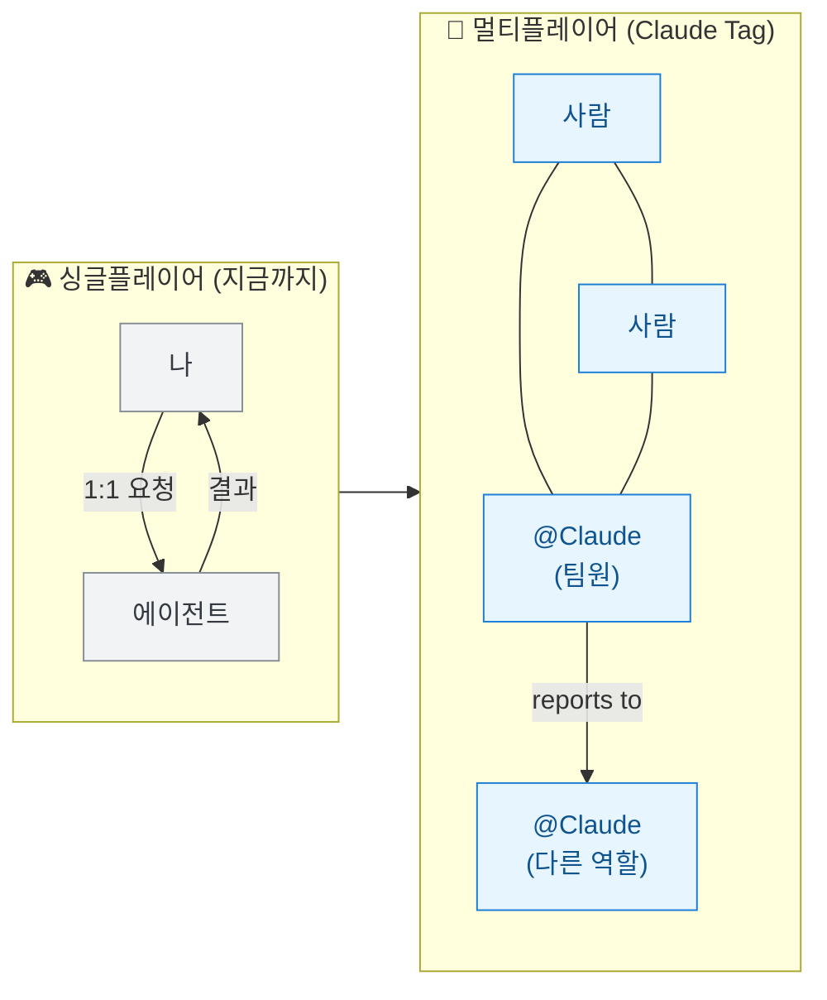
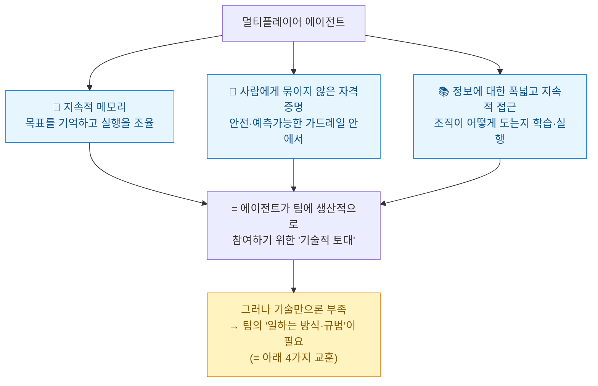
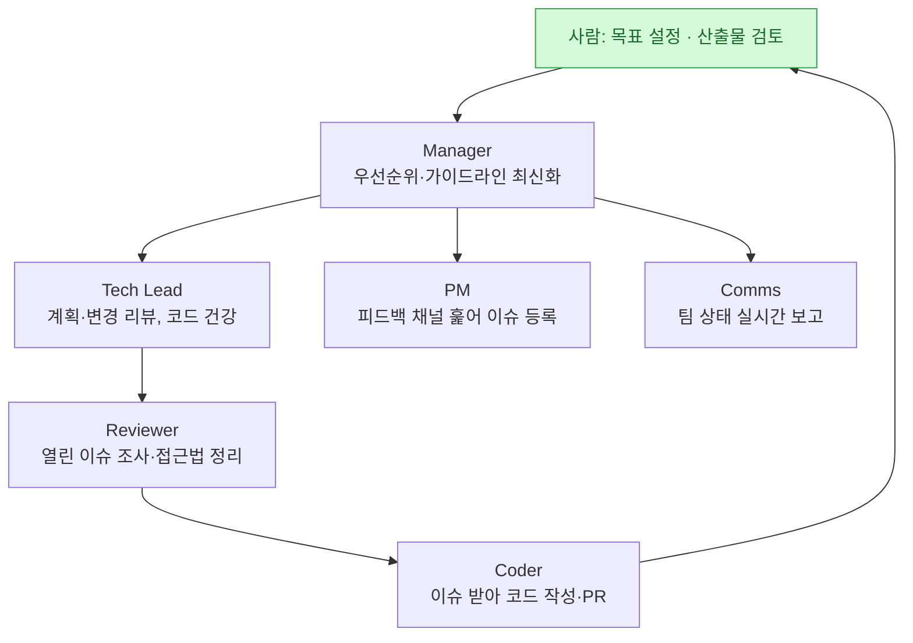
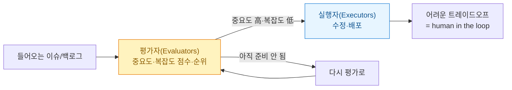
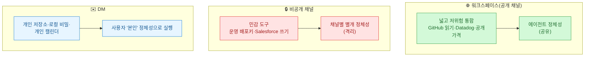

> **하네스 3부작** — ① [[planning-harness-detailed-spec-automation|기획 하네스: 혼자 상세기획 자동화]] · ② [[design-md-claude-design-portable-design-system|디자인 하네스: DESIGN.md 한 장]] · **③ 팀 하네스: Claude Tag(이 글)**

[[planning-harness-detailed-spec-automation|1부(기획 하네스)]]에서 나는 "바탕화면에 폴더 하나 파고 `CLAUDE.md` 규칙서를 깔면, AI가 딴짓 못 하게 가둔 나만의 파이프라인이 된다"는 이야기를 했다. 그건 **혼자 쓰는 하네스**였다. 컨텍스트·도구·가드레일·검증을 내 로컬 폴더에 심는 것.

그런데 Anthropic이 6월 23일 공개한 **Claude Tag**는 정확히 그 하네스를 **팀 전체로 끌어올린 버전**이다. AI와 일하는 방식이 **싱글플레이어(한 사람이 한 채팅창에서 한 에이전트와 1:1)에서 멀티플레이어(여러 사람 + 여러 에이전트가 한 팀)로** 넘어간다는 선언이다. 데이터·마케팅 자동화를 혼자 굴려 온 입장에서, 이 글은 "그럼 이걸 어떻게 팀으로 확장하지?"에 대한 가장 구체적인 청사진이었다.

## 싱글플레이어에서 멀티플레이어로, 뭐가 달라지나?

핵심은 **Slack**이다. 관리자가 특정 채널에 Claude를 초대하고 도구·데이터·코드베이스를 연결해 주면, 그 채널의 **누구나 `@Claude`를 멘션해 일을 위임**할 수 있다. Claude는 채널 맥락을 기억하며 일을 이어받고, 앞으로 할 일을 스스로 계획한다. Anthropic은 이를 **"Claude Code의 진화"**라고 부른다.

> ⚠️ 먼저 사실관계를 정확히. (1) Claude Tag는 **Claude Enterprise·Team 대상 베타**이고 **Opus 4.8 위에서** 동작한다. 기존 'Claude in Slack' 앱을 대체하며 관리자는 30일 내 마이그레이션한다. (2) "**제품 팀 코드의 65%를 사내 Claude Tag가 만든다**"는 수치는 **Anthropic의 자체 발표**다 — 인상적이지만 독립 검증된 값은 아니고, 'PR의 65%'가 아니라 '코드의 65%'라는 점도 정확히 옮겨야 한다. (3) Claude가 작업할 때는 **Anthropic이 호스팅하는 임시 샌드박스**에서 돈다(내 컴퓨터·사내망이 아니다) — 대화가 끝나면 폐기된다. 즉 사내 데이터가 어디로 흐르는지는 도입 전에 따질 문제다.

## @Claude를 '태그'한다는 게 뭐가 다른가?

Claude Code를 써봤다면 작동은 친숙하다 — 멘션하고 평이하게 요청하면, 작업을 단계로 쪼개 도구로 처리하고 스레드에 결과를 보고한다. 다만 '태그'에는 1:1 채팅에 없던 네 가지가 붙는다.

| 특징 | 무엇이 달라지나 |
|---|---|
| **멀티플레이어** | 한 채널엔 모두와 상호작용하는 **하나의 Claude**. 누구나 진행 상황을 보고, 앞 사람이 멈춘 곳에서 이어받는다 |
| **시간이 지나며 학습** | 채널 흐름을 따라가며 맥락을 쌓아 **매번 처음부터 설명할 필요가 없다**. (단, 비공개 채널 내용은 밖으로 보고 안 함) |
| **주도적으로 행동** | 앰비언트 모드가 켜지면 조용해진 스레드·미해결 작업을 **먼저 챙겨** 알린다 |
| **비동기로 작업** | 맡겨 두면 다른 일에 집중하는 동안 처리하고, **스스로 미래 시점에 예약**해 며칠짜리 프로젝트도 끌고 간다 |

데이터 분석가로서 가장 와닿은 건 **멀티플레이어**였다. "제안 단계에 머문 거래들 살펴봐 달라"고 한 사람이 호출하면 Claude가 표·차트를 만들고, **다른 동료가 그 결과를 그대로 받아 간다.** 지금까지 각자 개인 AI 창을 열어 같은 지표를 따로따로 뽑던 낭비가, 한 번만 계산해 모두가 같은 숫자를 보는 구조로 바뀐다.

## 멀티플레이어 에이전트란 무엇인가?

Anthropic의 정의는 **"동시에 여러 사람과 함께 일하는 AI 모델"**이다. 일반 에이전트처럼 자기 **메모리와 스킬**을 갖지만, 결정적 차이가 둘 있다 — **사람에게 묶이지 않은 자기 자격증명**을 갖고, **일이 실제로 벌어지는 장소(Slack) 안에 상주**한다.

## Anthropic이 몇 달 굴려보고 남긴 네 가지 교훈

여기부터가 진짜다. 흥미롭게도 네 가지 모두 **"AI를 위한 특별한 기술"이 아니라 "건강한 팀의 오래된 습관"**이다.

### 교훈 1 — 공개적으로 일하고, 넓은 맥락을 준다

에이전트는 팀이 **검색 가능하게 만든 텍스트**(Slack·코드·문서·회의록)로만 이해를 쌓는다. 개인 메시지, 복도 대화, 접근 제한 문서는 맥락이 될 수 없다. Anthropic의 표현이 강렬하다 — **"에이전트에게는, 적혀 있지 않고 접근할 수 없다면 그것은 존재하지 않는 것."**

그래서 문서·채널을 하나씩 열지 말지 고민하는 대신 **워크스페이스 수준의 소수의 명확한 보안 경계**를 쓴다. 경계 안에서는 사람이든 AI든 맥락이 흐르고, "이 채널 공개? 이 문서 공유해도 되나?" 같은 **결정 피로가 사라진다.**

### 교훈 2 — 모든 사람·에이전트에게 역할과 도구를 명확히

인간-에이전트 팀은 **하나의 명단(roster)·산출물·작업공간**을 공유하되, 에이전트마다 다른 역할·자격증명·도구를 갖는다. 코드베이스 유지보수를 이렇게 나눈다:

포인트는 **각 에이전트가 자기 주기(cadence)로 돈다**는 것 — Comms는 반시간마다, PM은 몇 시간마다, Coder는 하루에 여러 번, Reviewer는 주 며칠. 그리고 **역할을 정의하는 '스킬 파일(Skill File)'**을 쓰면 전문화가 쉬워지고 회사 누구나 같은 유형 에이전트를 빠르게 세운다. (1부의 `/sequence_diagram` 스킬이 여기선 '역할'로 커진 셈이다.)

### 교훈 3 — 북극성을 세워 에이전트를 주도적으로

**북극성(North Star)** — 어떤 작업이 옳은지 팀이 판단하도록 돕는 야심찬 목표. 항상 **사람이 정하고** 글로 명시한 뒤 에이전트와 공유하고, **어떤 에이전트가 새 워크스트림을 주도적으로 제안할지도 사람이 지정**한다. 예: "제품 온보딩을 더 돕자"는 북극성을 가진 팀에서 한 에이전트가 온보딩 오류 문구 수정을 먼저 제안 → 다음 주 온보딩 성공률이 측정 가능하게 올랐다.

### 교훈 4 — 시간을 들여 신뢰를 쌓는다 (그리고 Doer-Verifier)

엔지니어들이 에이전트에게 **500건의 버그 수정**을 독립적으로 맡긴 적도 있지만, 처음부터 그런 건 아니었다. **입증된 신뢰성에 비례해 자율성을 넓혔다.**

가장 중요한 대목 — **"가장 뛰어난 장기 실행 에이전트는 사람이 보기 전에 자기 작업을 검증할 여러 방법을 갖고 있다."** 코드엔 테스트, 기술문서엔 루브릭·스타일가이드. 그리고 **한 에이전트는 작업을 하고, 다른 에이전트는 그 작업을 검사**한다 — 이걸 **도어-베리파이어(Doer-Verifier) 에이전트 하네스**라고 부른다.

이게 바로 [[planning-harness-detailed-spec-automation|1부]]에서 말한 하네스의 **'검증' 기둥**이고, `pi-subagents`의 **6단계 수락 게이트**(auto→…→verified→reviewed)와 정확히 같은 사상이다. **maker≠checker.** 매주 에이전트에게 **"교훈과 실수(lessons & missteps)"** 주간 보고서를 쓰게 해 같은 실수를 반복하지 않게 한 것도 인상적이었다. 그리고 리더는 에이전트에게 **"인간의 주의(attention)는 희소 자원"**이라고 코칭했다 — 질문은 모아서, 핵심 맥락은 반복해서, 한 번에 보는 항목 수는 제한.

## 누구 권한으로 움직이나? — 에이전트 정체성

여기 까다로운 전제가 숨어 있다. 에이전트가 잘 일하려면 사람과 같은 도구·문서·맥락에 닿아야 하는데, **채널에 여러 사람이 앉아 있으면 누구 권한으로 움직여야 하나?** 싱글플레이어에선 "내 계정 연결 → 나 대신 행동"이면 됐지만, 멀티플레이어에선 무너진다.

Anthropic의 답은 **"Claude가 특정 사용자를 대신하지 않고 '자기 자신'으로 행동한다"** — **에이전트 정체성(Agent Identity)**이다. Claude는 닿는 시스템마다 자기 계정을 갖는다: Slack엔 Claude 앱으로, PR은 Claude GitHub App으로, 웨어하우스는 관리자가 만든 서비스 계정으로. **개인 자격증명이 개입 안 하니, 공유 채널이 누군가의 비공개 문서로 들어가는 옆문이 될 일이 없다.**

관리자는 워크스페이스 수준에서 기본 **정체성**(연결·스킬·저장소·커넥터·상시지침)을 정하고 채널이 상속받으며, 채널별로 재정의한다. **정체성을 회수하면 그게 쓰이던 모든 곳에서 접근이 한 번에 끊긴다.** 비공개 채널은 각자 별개 정체성, 공개 채널은 워크스페이스 정체성을 공유한다. 법무 채널의 Claude는 엔지니어링 코드에 못 닿고, 그 반대도 마찬가지 — **메모리도 이 경계를 존중한다.**

> ⚠️ 이 모델의 **날카로운 면**을 짚어 둔다. 에이전트 정체성은 "이 사용자가 뭘 할 수 있나"를 **"이 에이전트가 이 구획에서 뭘 할 수 있나"**로 바꾼다. 즉 **저장소에 직접 권한이 없는 채널 멤버라도, 채널 프로필이 Claude에게 그 권한을 줬다면 Claude에게 그 저장소를 읽어 달라 할 수 있다.** 편리하지만 위험할 수 있어서, 관리자는 채널 프로필을 **가장 권한 낮은 멤버**에 맞춰 좁히고, Enterprise는 RBAC로 '누가 Claude를 호출할 수 있는지'까지 정해야 한다. 감사(audit) 측면에선 에이전트 자격증명으로 한 모든 행위가 로그로 남고 연결된 시스템 자체 로그에도 남는다. Anthropic은 향후 **적시 자격증명 부여(just-in-time)**와 **정체성 인식 오버레이**(채널+요청자 권한이 둘 다 허용할 때만 행동)를 더한다고 밝혔다.

## 결국 '새로울 게 없다'는 게 핵심

Anthropic 글의 결론이 좋았다. **강력한 북극성, 분명한 역할, 탄탄한 문서화, 품질에 대한 공통 기준, 실수에서 배울 여지** — 수십 년간 알려진 건강한 팀의 습관이다. **에이전트는 이 기본기를 '건너뛰지 않는 것'을 더 중요하게 만들 뿐이다.** 에이전트에게서 가장 많이 얻는 팀은, 이 기본기를 가장 의도적으로 적용하는 팀이다.

바꿔 말하면, 멀티플레이어 에이전트가 던지는 질문은 **"어떤 모델이 더 똑똑한가"가 아니라 "우리 조직이 에이전트와 함께 일할 준비가 됐는가"**다. 그리고 그 '준비'는 정확히 [[planning-harness-detailed-spec-automation|1부]]·[[design-md-claude-design-portable-design-system|2부]]에서 만든 하네스를 팀 규모로 문서화·경계화한 것이다.

## 내 일에 적용한다면

| 내 작업 | Claude Tag 교훈의 적용점 |
|---|---|
| 지표·리포트 자동화 | "각자 AI로 따로 뽑기"를 멈추고 **멀티플레이어 에이전트가 한 번 계산 → 모두 같은 숫자**. 데이터 분석가에게 가장 직접적인 이득 |
| 팀 문서화 | 결정·회의록·산출물을 **에이전트가 찾을 수 있게** 남긴다("안 적혀 있으면 존재하지 않는 것") |
| 역할 설계 | 사람·에이전트 **명단**을 적고 각자 소유를 명시, 역할별 **스킬 파일** 작성 |
| 검증 | 모든 산출물에 **루브릭/테스트** + **Doer-Verifier**(maker≠checker) — pi-subagents·1부와 동일 사상 |
| 보안·거버넌스 | 넓은 통합은 공개 채널, 민감 키는 비공개 채널, 개인 비밀은 DM으로 **구획화**. 최소권한으로 시작해 감사로그 보며 넓힌다 |

혼자 폴더에 하네스를 깔던 이야기가([[planning-harness-detailed-spec-automation|1부]]), 결국 **팀 전체가 같은 규칙·역할·검증 위에서 사람과 에이전트가 함께 일하는 인프라**로 이어졌다. 다만 이렇게 자율성이 커질수록 남는 질문 하나 — **"그럼 우리는 우리가 만든 시스템을 여전히 이해하고 있나?"** 그 불편한 질문은 [[the-coming-loop-armin-ronacher-harness-critique|다음 글]]에서 정면으로 다룬다.

## 참고자료

- [Anthropic — Introducing Claude Tag](https://www.anthropic.com/news/claude-tag)
- [Anthropic — Building effective human-agent teams](https://www.anthropic.com/news/building-effective-human-agent-teams)
- [Anthropic — Agent identity in Claude Tag](https://www.anthropic.com/news/agent-identity-claude-tag)
- [Anthropic — Claude Tag product page & docs](https://www.claude.com/claude-tag)
- [GeekNews(하다) — Claude Tag / 멀티플레이어 에이전트 정리](https://news.hada.io/)

<!-- 안전: 회사 실데이터·고객/제3자 PII·API키/쿠키/토큰 없음. Anthropic 공개 발표 기반 정리(자체발표 수치는 ⚠️ 표기). -->
