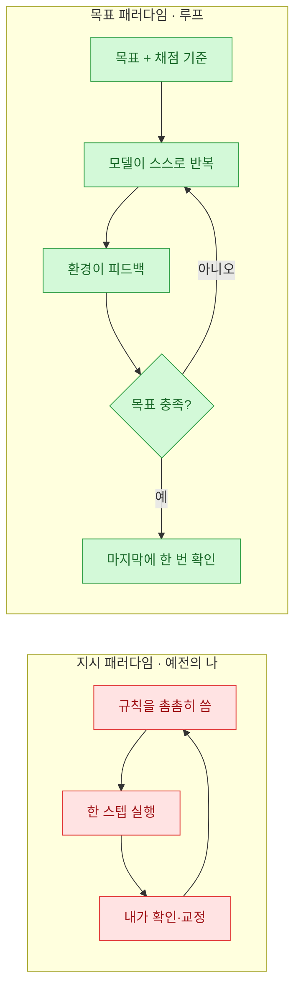
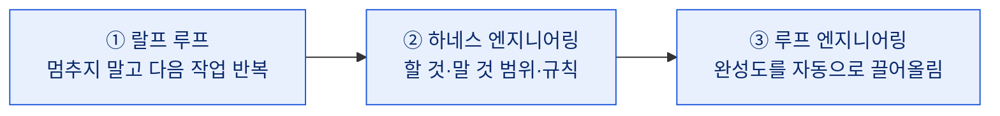
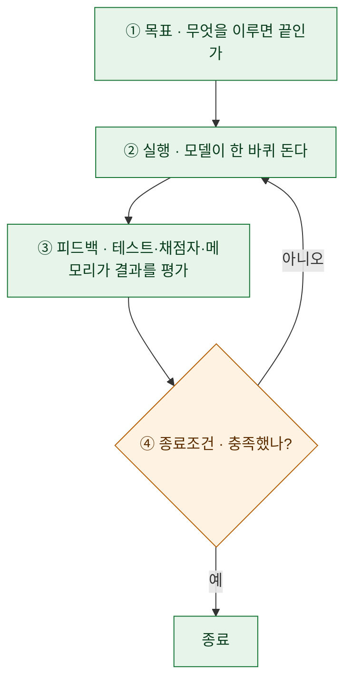

# Anthropic도 '루프 입문'을 공식화했다

> Anthropic의 개발자 계정 **ClaudeDevs**가 X에 장문 아티클을 하나 올렸다(2026-07-06). 제목이 **"Getting started with loops"**. 공개된 미리보기 첫 문장이 딱 내 생각을 대신 말해줬다 — *"요즘 다들 코딩 에이전트에게 '프롬프팅'하는 대신 '루프를 설계'하라고 말한다. 그런데 X에서 루프가 정확히 뭔지 짚어보려 하면, 제각각인 정의만 잔뜩 마주친다."* 나도 몇 달째 이걸 붙들고 [시리즈](#관련-글)를 써왔다. 그래서 이 글은, 그 화두 위에 **내가 정리한 '루프 입문'**을 얹는 기록이다. (아티클 전문은 X 로그인이 필요해, 나는 공개된 전제와 내 시리즈에 기대어 쓴다.)

## 왜 갑자기 다들 '루프'를 말하나?

에이전트와 일하는 방식이 한 단계 넘어가고 있어서다. 예전엔 내가 **한 스텝 한 스텝 지시**했다 — 규칙을 촘촘히 적고, 실행을 지켜보고, 어긋나면 프롬프트를 고쳐 다시 밀어 넣고. 나는 감독이자 조종사였다.

그런데 모델이 길고 복잡한 과제를 스스로 밀어붙일 만큼 좋아지면서, 무게 중심이 옮겨갔다. **"지시"가 아니라 "목표를 주고 물러서기"**로. 이 전환을 나는 [[fable5-from-instructing-agents-to-designing-loops|지시에서 목표로]] 편에서 정리한 적이 있다.

'루프'란 결국 이 오른쪽 그림, **스스로 돌면서 목표에 수렴하는 반복 구조**를 가리키는 말이다.

## 그런데 왜 '루프'가 뭔지 헷갈리나?

ClaudeDevs가 짚은 대로, 사람마다 '루프'로 부르는 게 다르기 때문이다. 나는 이 혼란을 [[loop-vs-harness-vs-ralph-when-to-use|랄프 루프·하네스·루프 엔지니어링]] 편에서 **세 층위**로 갈라 정리했다. 서로 대립이 아니라 **뒤엣것이 앞엣것을 품는 중첩**이다.

- **랄프 루프** — "다음 거, 다음 거"를 매번 시키기 귀찮아서 → 알아서 반복.
- **하네스** — "이건 하지 마"를 매번 말하기 귀찮아서 → 규칙으로 박제.
- **루프 엔지니어링** — "더 고쳐"를 매번 하기 귀찮아서 → 그 반복마저 자동화.

누군가 "루프"라고 할 때, 셋 중 어느 층을 말하는지만 구분해도 대화의 절반은 정리된다.

## 루프의 최소 구성요소는 뭔가?

정의가 제각각이어도, 작동하는 루프엔 **네 조각**이 반드시 있다. 이게 없으면 그건 루프가 아니라 그냥 긴 프롬프트다.

핵심은 **③ 피드백**과 **④ 종료조건**이다. 사람들은 보통 목표와 실행만 생각하는데, 루프를 루프답게 만드는 건 **"스스로 채점하고, 언제 멈출지 아는"** 뒷부분이다. 채점자가 없으면 모델은 자기가 잘했는지 모른 채 헛돈다.

## 그래서 어디서부터 시작하나?

내가 권하는 시작법은 거창하지 않다. **가장 작은 루프 하나**부터다.

포인트는 **"채점 가능한 목표"**로 시작하는 것이다. "코드 예쁘게 고쳐"는 루프가 안 된다(끝을 모델이 판단 못 함). "이 테스트를 통과시켜"는 루프가 된다(통과/실패가 자동 채점됨). 그래서 첫 루프는 **테스트·린트·빌드처럼 기계가 합격을 판정해 주는 작업**이 제일 좋다. 거기서 감을 잡고, 점점 채점 기준을 사람의 판단이 필요한 쪽으로 넓혀가면 된다.

## 언제 루프를 쓰지 '말아야' 하나?

여기가 내 시리즈에서 제일 강조한 부분이라 다시 적는다. **루프는 공짜가 아니다.** 채점자를 만들고, 종료조건을 정의하고, 무인 반복을 감시하는 비용이 든다.

- 한두 스텝이면 끝나는 작업 → 그냥 직접 하거나 한 번 지시하는 게 빠르다.
- 완료를 기계가 판정할 수 없는 작업 → 루프로 감싸도 헛돈다. 먼저 "채점 가능하게" 문제를 바꾸는 게 순서다.
- 규모가 작은 개인 프로젝트 → 하네스·루프를 촘촘히 까는 게 오히려 배보다 배꼽이다.

루프는 **"같은 종류의 반복이 충분히 많고, 합격을 기계가 판정할 수 있을 때"** 복리로 이득이 난다. 그 조건이 아니면, 안 쓰는 게 맞다.

## 정리하며

ClaudeDevs가 이 주제를 공식 아티클로 냈다는 건, '루프'가 일부 얼리어답터의 은어에서 **표준 어휘**로 넘어가고 있다는 신호다. 정의가 제각각이라던 그 혼란도, 이렇게 큰 계정이 "입문"이라는 이름으로 정리에 나서면 곧 수렴할 거다.

내 요약은 이렇다. **루프는 "목표 + 실행 + 피드백 + 종료조건"으로 스스로 수렴하는 반복이고, 시작은 '채점 가능한 작은 작업' 하나면 충분하며, 안 맞는 규모엔 안 쓰는 게 정답이다.**

> 프롬프팅이 "한 문장을 잘 쓰는 기술"이었다면, 루프는 "잘 도는 구조를 설계하는 기술"이다. 문장에서 구조로. 나는 그 이동의 한복판에 서 있는 기분이다.

---

## 관련 글

- 원문: ClaudeDevs, [Getting started with loops](https://x.com/ClaudeDevs/status/2074208949205881033) (X 아티클, 2026-07-06 · 전문은 X 로그인 필요)
- 내 루프 시리즈: [[loop-engineering-four-loops-loopcraft|루프 엔지니어링 4단계]] · [[loop-vs-harness-vs-ralph-when-to-use|랄프·하네스·루프, 언제 쓰나]] · [[fable5-from-instructing-agents-to-designing-loops|지시에서 목표로]]

> 이 글은 공개된 제목·미리보기와 내 기존 정리에 근거해 쓴 **내 관점의 루프 입문**이다. 아티클의 구체적 서술을 옮긴 게 아니니, 원문의 결론은 위 링크에서 직접 확인하시길.
