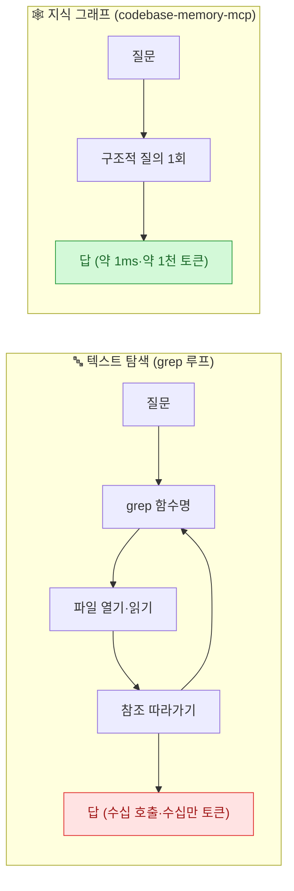
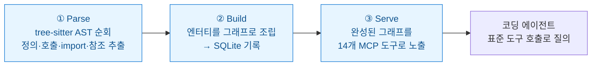

내 개인 지식 볼트(codex_loof)는 **평문 마크다운 + 무벡터 검색**을 지향한다. 임베딩·벡터DB 없이 구조와 링크로 답을 찾는 방식이다. 그래서 오늘 이 프로젝트가 유난히 반가웠다 — **codebase-memory-mcp**는 똑같은 철학을 *코드베이스*에 적용한다. 임베딩 없이, **코드의 구조 자체를 지식 그래프로 만들어** AI 에이전트가 질의하게 한다.

출발점은 누구나 겪은 장면이다. AI 코딩 에이전트에게 **"이 함수 고치면 어디가 깨지나?"**를 물으면, grep으로 함수 이름을 찾고 매칭된 파일을 하나씩 열어 읽고 다시 참조를 따라가며 같은 과정을 반복한다. 작은 프로젝트에선 괜찮지만, 저장소가 커지면 **답 하나에 수십 번의 도구 호출과 수십만 토큰**이 든다.

## 왜 텍스트 검색이 그렇게 비싼가?

문제의 근원은 **미스매치**다. LLM 에이전트는 비정형 **텍스트** 위에서 도는데, 개발자의 질문은 본질적으로 **구조적**이다 — 호출 그래프, 의존성 사슬, 모듈 경계, 영향도 분석. 텍스트 검색은 참조를 한 단계씩 따라가지 않으면 이런 **전이적(transitive) 관계**를 못 잡고, 매 단계마다 토큰을 더 쓰며 맥락을 잃는다.



기존 대안도 한계가 뚜렷하다. **코드 속성 그래프(CPG)·CodeQL**은 강력하지만 전용 DB와 질의 언어를 요구하는 무거운 도구라 LLM이 직접 쓰게 설계되지 않았다. **임베딩 RAG**는 의미적 유사도엔 강하지만 "이 함수를 **누가** 호출하는가" 같은 **관계형 질의엔 약하다.**

## 발상: 코드 구조를 1급 지식 그래프로

codebase-memory-mcp는 코드의 구조 자체를 **질의 가능한 1급(first-class) 지식 그래프**로 만들고 이를 **MCP(Model Context Protocol)로 LLM에 직접 노출**한다. 함수·클래스·호출 체인·HTTP 라우트·서비스 연결을 노드와 엣지로 표현해 두면, 에이전트는 파일을 하나씩 읽는 대신 **구조적 질의 한 번**으로 답을 얻는다.

베를린 샤리테(Charité) 의대 등 **독일 연구진**이 공개한 오픈소스이고, 설계·벤치마크는 프리프린트 논문(**arXiv:2603.27277**)에 있다. **의존성 없는 단일 정적 C 바이너리** — Docker·런타임 의존성·API 키가 필요 없고, **100% 로컬**이라 코드가 기기를 벗어나지 않는다.



tree-sitter 문법을 C 소스로 바이너리에 **내장(vendoring)**하고, 파이프라인·그래프 저장·MCP 프로토콜·Cypher 질의 엔진·백그라운드 동기화가 모두 C로 구현돼 상태는 **단일 SQLite 파일**에 담긴다. 그래프엔 코드뿐 아니라 **인프라 정의**(Dockerfile·K8s·Kustomize)도 노드로 들어가고, `HTTP_CALLS`·`ASYNC_CALLS` 엣지로 **여러 언어에 걸친 마이크로서비스도 하나의 그래프**로 표현된다.

> ⚠️ 버전에 따라 지원 언어 수가 다르다 — **논문이 평가한 v0.5.5는 66개 언어**, 현재 공개 릴리스는 158개로 확장됐다. "158개 언어 지원"을 논문 성능과 묶어 말하면 시점이 어긋난다. 인덱싱은 RAM 우선(LZ4·인메모리 SQLite·Aho-Corasick)이라 그래프 완성 후 대부분 질의가 **1밀리초 미만**으로 응답된다(논문 Table 8). 선택적 UI를 켜면 `localhost:9749`에서 3D 그래프를 탐색할 수 있다.

## 14개 MCP 도구

에이전트가 쓰는 도구는 네 갈래다.

| 갈래 | 도구 |
|---|---|
| **인덱싱** | `index_repository` · `index_status` · `list_projects` · `delete_project` |
| **질의** | `search_graph`(심볼) · `trace_call_path`(방향·깊이 지정 호출체인) · `query_graph`(Cypher 유사) · `ingest_traces`(런타임 트레이스) |
| **분석** | `detect_changes`(git diff 영향도) · `get_graph_schema` · `get_architecture` |
| **코드** | `get_code_snippet` · `search_code`(전문검색) · `manage_adr`(아키텍처 결정 기록) |

각 도구는 **LLM이 곧바로 처리할 구조화된 JSON**을 돌려준다. 특히 `query_graph`는 임의의 그래프 순회를 위한 Cypher 유사 언어를, `trace_call_path`는 인바운드/아웃바운드 방향과 깊이를 지정한 호출 체인 추적을 제공한다.

## 정확도의 핵심: 6단계 호출 해소

그래프 정확도를 좌우하는 건 `pkg.Func` 같은 **원시 호출 이름을 실제 노드로 연결하는 호출 해소(call resolution)**다. 신뢰도 점수가 매겨진 **6단계 캐스케이드**로 처리한다.

| 단계 | 방식 | 신뢰도 |
|---|---|---|
| 1 | import 맵 정확 매칭 | 0.95 |
| 2 | 동일 모듈 매칭 | 0.90 |
| 3 | import 맵 suffix | 0.85 |
| 4 | 고유 이름(프로젝트 내 후보 1개) | 0.75 |
| 5 | suffix 매칭(import 거리로 최근접) | 0.55 |
| 6 | 퍼지(문자열 유사도) 최후 매칭 | 0.30~0.40 |

저자 관찰로 **잘 구조화된 코드베이스에선 1~3단계가 호출의 약 80%를 해소**하고, 4~6단계가 교차 모듈·동적 디스패치를 처리한다. 이름 기반이라 타입을 못 쫓는 경우(Go 리시버·C/C++ 포인터·C++ 템플릿)를 위해 **LSP 스타일 하이브리드 타입 해소** 패스를 두는데, 논문은 3개 언어(Go·C·C++), 현재 릴리스는 11개 언어로 확장했다.

## 성능: 그래프 질의 vs 파일 탐색 (숫자를 정확히)

여기서 **자주 잘못 옮겨지는 수치를 바로잡아야 한다.** 논문은 31개 언어를 실제 저장소로 평가하며 **codebase-memory-mcp의 14개 도구를 쓰는 에이전트**와 **grep·파일읽기 탐색(Explorer) 에이전트**를 같은 질문으로 비교했다(둘 다 백엔드 Claude Opus 4.6).

> ⚠️ **"파일 탐색 대비 답변 품질 83%"는 오해다.** 83%는 **MCP 에이전트의 절대 품질 점수**이고, 파일 탐색 에이전트는 **92%**였다. 즉 MCP 에이전트는 **탐색 에이전트 품질의 약 90% 수준**을 유지하면서 **토큰을 10배, 도구 호출을 2.1배 적게** 썼다.

| 지표 | 파일 탐색 | 그래프(MCP) |
|---|---|---|
| 절대 품질 점수 | 92% | 83% (탐색의 ~90%) |
| 질문당 도구 호출 | 4.8회 | **2.3회** |
| 질문당 토큰 | 약 10,000 | **약 1,000** |
| 질의 지연 | 10~30초 | **1ms 미만** |

허브 탐지·호출자 순위처럼 **미리 만든 그래프 엣지를 따라가는 질의**에선 31개 중 19개 언어에서 탐색과 같거나 나았다. 반대로 **전체 소스 맥락이 필요하거나(16/31) 모든 호출지점을 훑는 grep(10/31)**에선 탐색이 우세했다 — 그래프가 **의도적으로 소스 줄(line)을 저장하지 않기** 때문이다(가장 약한 건 매크로 많은 C, 0.58 대 1.00). 그래서 저자 결론은 명확하다: **"구조적 질의는 그래프로, 소스 수준 작업은 파일 탐색으로"** — 하이브리드가 최적이다.

특정 사례에선 **5개 구조적 질의 약 3,400토큰 vs 파일 단위 약 412,000토큰 = 약 99% 절감**도 나왔다(단, 이건 특정 케이스 수치이고 '10배'가 31개 저장소 평균이다). 규모의 상단에서는 **리눅스 커널(2,800만 LOC)을 약 3분에 인덱싱**해 210만 노드·490만 엣지를 만들었고, 증분 재인덱싱은 XXH3 해시로 약 1.2초(전체 대비 ~4배 빠름)다.

## 보너스: MCP 공급망 신뢰 문제에 대한 답

논문이 적지 않은 분량을 **보안**에 쓴 게 인상적이었다. MCP 서버는 독특한 신뢰 문제를 안는다 — **호스트 에이전트의 전체 권한으로 실행되는데도, 사용자는 서드파티에서 받은 불투명한 바이너리로 설치**한다. LLM이 승인 없이 도구를 자동 호출하는 환경에선 위험이 더 크다(오늘 다이제스트의 '증류·데이터 유출' 우려와 같은 결의 문제다).

이들의 답은 **심층 방어**다: 8단계 CI 감사(위험 libc 함수 허용목록 대조·하드코딩 URL/자격증명 스캔·strace egress 감시), 코드 수준 보호(셸 인자 검증·SQLite authorizer·realpath 격리), 릴리스 파이프라인(**Sigstore cosign 서명·SLSA 출처·CodeQL 게이트·VirusTotal 70+ 엔진 무관용·SBOM**). 저자들은 "이 수준의 자동 바이너리 검증은 GitHub 배포 오픈소스 MCP에서 흔치 않다"고 자평하는데, 실제로 **MCP를 깔 때마다 내가 뭘 신뢰하는지**를 되묻게 만드는 좋은 사례다.

## 한계 (저자들이 솔직히 밝힌)

> ⚠️ 벤치마크는 **단일 LLM 백엔드(Claude Opus 4.6)·언어당 단일 저장소**로 수행됐고 **채점도 제1저자**가 맡아, 다른 모델·프롬프트로 일반화되지 않을 수 있다. 지식 그래프는 **정적 구조만** 잡아 런타임 동작·리플렉션·동적 디스패치는 표현 못 한다. `query_graph`는 기본 10만 행 상한이라 초대형 코드베이스에선 과소 집계될 수 있다. 채택 지표(**공개 첫 4주에 900+ 스타·~100 포크**, 2026-02-25 초기 릴리스)는 인상적이나 초기 수치다.

## 설치, 그리고 내 볼트와의 연결

macOS·Linux는 한 줄이면 된다(그래프 UI는 `--ui`):

```bash
curl -fsSL https://raw.githubusercontent.com/DeusData/codebase-memory-mcp/main/install.sh | bash
```

설치 스크립트가 **11개 코딩 에이전트**(Claude Code·Codex CLI·Gemini CLI·Zed·OpenCode·Antigravity·Aider·KiloCode·VS Code·OpenClaw·Kiro)를 자동 감지해 각 MCP 항목·지침·훅을 설정하고, 재시작 후 **"Index this project"**라 말하면 인덱싱이 시작된다. **MIT 라이선스**.

내게 이 프로젝트의 의미는 분명하다. 내 지식 볼트가 "문서를 임베딩 없이 구조·링크로 검색"하듯, 이건 **"코드를 임베딩 없이 그래프로 검색"**한다. 무벡터·평문·구조 우선이라는 같은 원칙이, 문서에서 코드로 확장된 셈이다. RAG의 '의미 유사도'와 그래프의 '관계 정확도'를 **하이브리드로 쓰라**는 결론도, 내가 볼트를 다루는 방식과 정확히 겹친다.

## 참고자료

- [GitHub — DeusData/codebase-memory-mcp](https://github.com/DeusData/codebase-memory-mcp)
- [프로젝트 페이지](https://deusdata.github.io/codebase-memory-mcp/)
- [arXiv:2603.27277 — Codebase-Memory: Tree-Sitter-Based Knowledge Graphs for LLM Code Exploration via MCP](https://arxiv.org/abs/2603.27277)
- [GeekNews(하다) — codebase-memory-mcp 정리](https://news.hada.io/)

<!-- 안전: 회사 실데이터·고객/제3자 PII·API키/쿠키/토큰 없음. 공개 논문·저장소 기반 정리 + 수치 팩트체크(83%=절대점수 정정). -->
