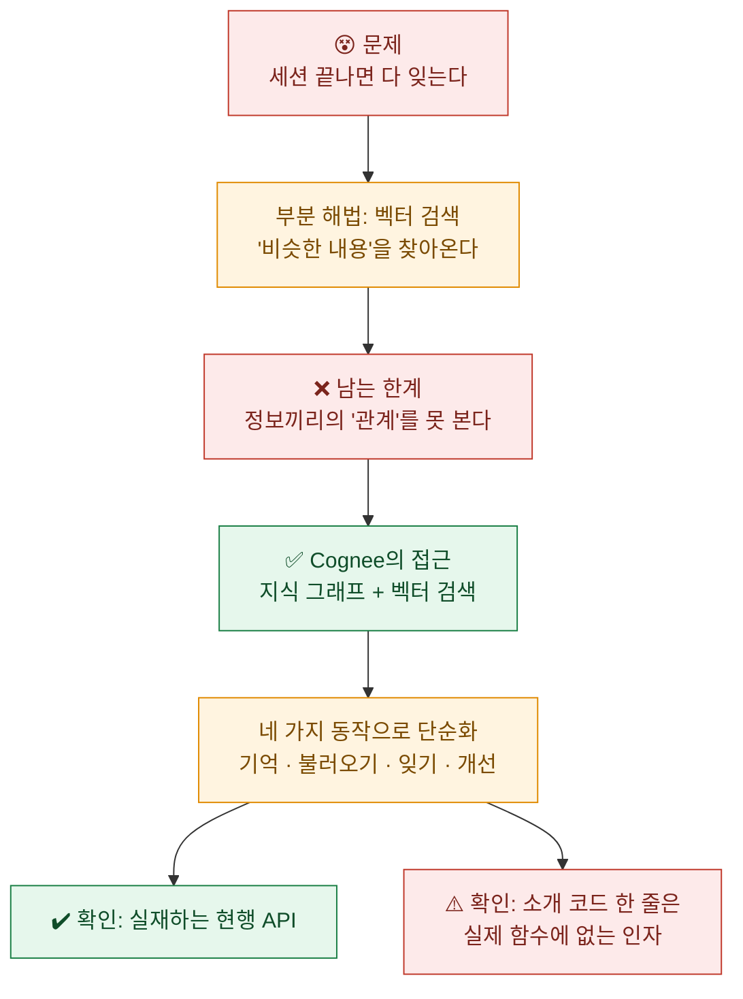
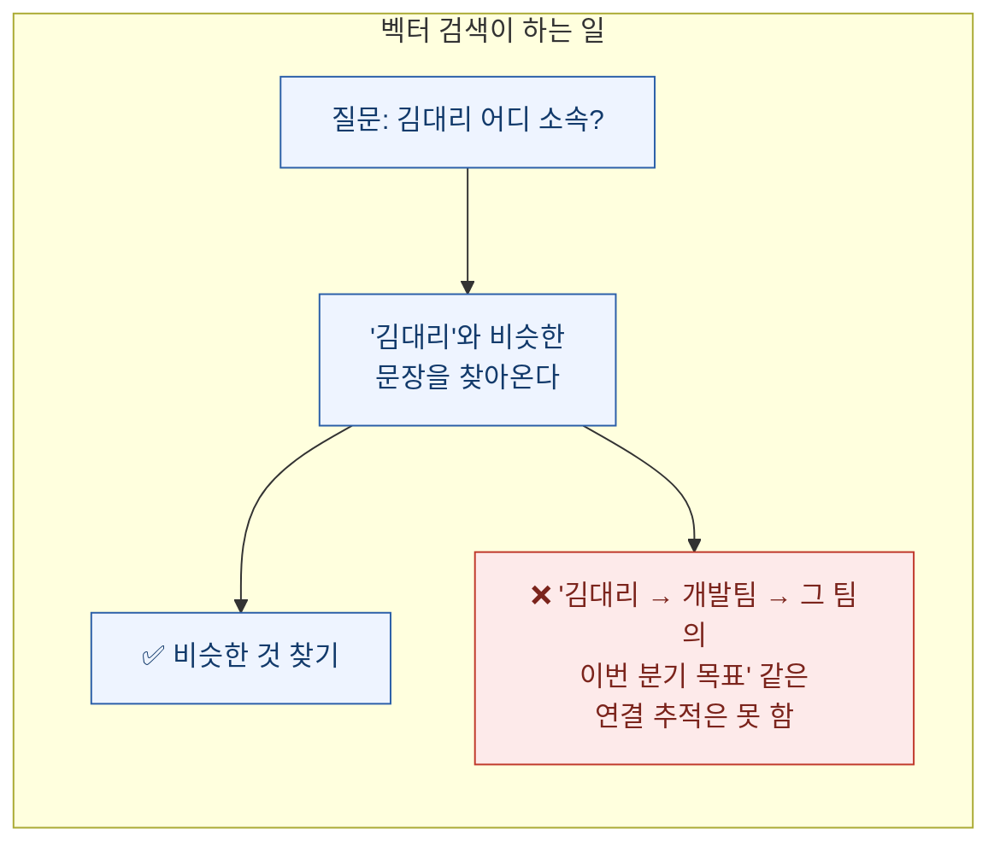
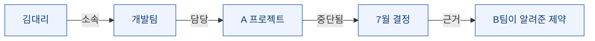
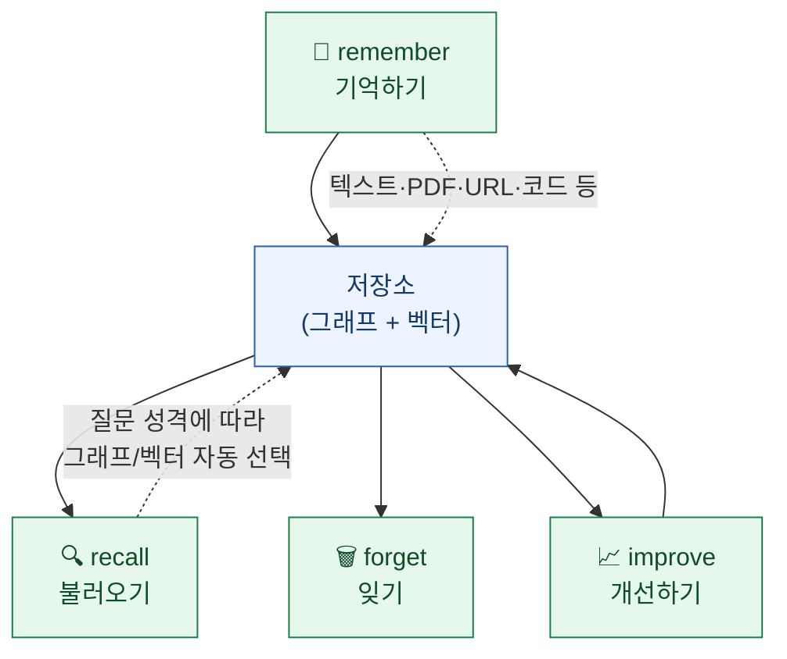
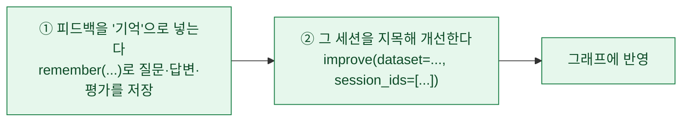
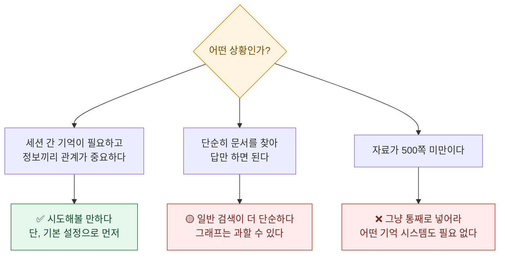

AI와 한참 이야기하며 뭔가를 정리해놓고, 다음 날 새 창을 열었더니 **아무것도 기억 못 하는** 경험. 다들 한 번쯤 해봤을 것이다.

이건 결함이 아니라 구조다. 대부분의 AI 서비스는 **대화 세션이 끝나면 맥락을 버린다.** 그래서 다음 대화에서 같은 설명을 처음부터 다시 해야 한다.

**Cognee**는 여기에 장기 기억을 붙이는 오픈소스다. 접근이 재밌어서 소스를 직접 열어봤는데, **널리 인용되는 소개 코드 하나가 실제로는 동작하지 않는다**는 걸 발견했다. 그 얘기까지 같이 정리한다.

## 이 글 요약



## 왜 벡터 검색만으로는 부족한가?

먼저 배경. AI에게 기억을 주는 가장 흔한 방법은 **벡터 검색**이다.

문장을 숫자 목록으로 바꿔 저장해두면, 나중에 질문했을 때 **뜻이 비슷한 것**을 찾아올 수 있다. 단어가 안 겹쳐도 찾아준다는 게 강점이다.

그런데 이 방식이 못 하는 게 있다.



**벡터 검색은 "닮은 것"을 찾지 "이어진 것"을 못 따라간다.**

예를 들어 이런 질문이 어렵다.

> "지난달에 내가 A안을 접기로 한 이유가, 그때 B팀이 알려준 제약 때문이었나?"

이건 **A안 → 접은 결정 → 그 이유 → B팀의 제약**이라는 **연결을 여러 번 타고 가야** 답이 나온다. 비슷한 문장 몇 개를 가져오는 것으로는 부족하다.

## 지식 그래프가 뭔가?

여기서 나오는 게 **지식 그래프**다. 이름이 거창한데 개념은 단순하다. **점과 선으로 정보를 적어두는 것**이다.

- **점**: 사람, 프로젝트, 문서, 결정, 개념 같은 것들
- **선**: 그것들 사이의 관계 (누가 무엇을 맡았다, 무엇이 무엇 때문에 바뀌었다)



이렇게 적어두면 **선을 따라가면서** 답을 만들 수 있다. "김대리 → 개발팀 → A 프로젝트 → 7월 결정 → B팀 제약". 벡터 검색으로는 어려운 일이다.

**그래서 둘을 같이 쓰는 게 요즘 방향이다.**

| 방식 | 잘하는 것 | 못하는 것 |
|---|---|---|
| **벡터 검색** | 표현이 달라도 비슷한 내용 찾기 | 관계를 따라가기 |
| **지식 그래프** | 연결을 여러 번 타고 가기 | 애매하게 표현된 것 찾기 |

Cognee는 **입력을 그래프의 점과 선으로 바꿔 저장하면서, 동시에 벡터로도 저장한다.** 그리고 질문이 들어오면 **어느 쪽으로 찾을지 자동으로 고른다.**

## 네 가지 동작만 알면 된다

Cognee 설계에서 마음에 든 부분이다. 복잡한 내부를 감추고 **동작 네 개**로 정리했다.



사람의 기억을 흉내 낸 구성이다. **기억하고, 떠올리고, 잊고, 다듬는다.**

특히 **개선하기**가 눈에 띈다. 한 번 저장하고 끝이 아니라, 쓰면서 **기억의 품질을 다듬는** 단계를 API로 만들어뒀다.

## 🔴 그런데 소개 코드가 실제와 다르다

여기가 이 글에서 제일 실용적인 부분이다.

Cognee를 소개하는 글들에서 이런 코드를 흔히 본다.

```python
# 흔히 보이는 소개 코드
await cognee.improve(feedback="이 답변이 더 정확했으면 좋겠습니다.")
```

읽으면 자연스럽다. "피드백을 주면 기억이 개선된다"는 얘기니까. **그런데 소스를 열어보니 `improve()` 함수에 `feedback`이라는 인자가 없다.**

실제 시그니처는 이렇다.

```python
improve(
    dataset="main_dataset",
    *,
    run_in_background=False,
    node_name=None,
    session_ids=None,              # ← 피드백은 여기로 들어가지 않는다
    build_global_context_index=False,
    build_truth_subspace=False,
    **kwargs,
)
```

`feedback`이 없다. 그럼 `**kwargs`로 흡수되지 않을까 싶지만, **그 kwargs를 넘겨받는 내부 함수가 고정 시그니처라 거기서 걸린다.** 결과적으로 실행하면 이런 에러가 난다.

```
TypeError: memify() got an unexpected keyword argument 'feedback'
```

**그럼 피드백은 어떻게 주나?** 실제 흐름은 두 단계다.



즉 **`improve()`에 피드백을 직접 넘기는 게 아니라, 피드백을 먼저 기억으로 저장한 뒤 그 세션을 지목해 개선**한다. 설계로 보면 오히려 일관적이다 — 모든 입력은 `remember`로 들어간다는 원칙이 지켜진다.

**여기서 얻은 교훈이 이 글의 핵심이다.**

소개 글의 코드는 **읽으면 자연스럽고, 문법도 맞고, 실행해보기 전엔 틀린 걸 알 수 없다.** AI가 정리한 소개글이든 사람이 쓴 튜토리얼이든 마찬가지다. **함수 시그니처는 소스나 공식 문서에서 확인하는 게 30초면 끝난다.**

## 확인한 것들 — 사실 대조표

소개글에 나온 다른 항목들도 소스로 대조했다.

| 항목 | 소개글 | 실제 확인 |
|---|---|---|
| 라이선스 | Apache 2.0 | ✅ 맞음 (LICENSE 파일 확인) |
| Python 버전 | 3.10 \~ 3.13 | ⚠️ **3.10 \~ 3.14** (설정 파일에 `>=3.10,<3.15`) |
| 네 가지 동작 | remember / recall / forget / improve | ✅ 실재하는 현행 API |
| `improve(feedback=...)` | 예제로 제시 | 🔴 **해당 인자 없음 → 에러** |
| Neo4j | "권장" | ✅ **선택 사항.** 기본은 외부 DB 없이 도는 내장 엔진 |
| CLI 명령 | `cognee-cli` | ✅ 실재 |
| Claude Code 플러그인 | 있음 | ✅ 실재(별도 저장소) |

**Python 버전이 한 칸 밀린 것**과 **Neo4j를 필수처럼 읽히게 쓴 것**은 사소해 보이지만, 설치 단계에서 막히게 만드는 종류의 오차다.

**Neo4j 부분은 특히 중요하다.** "그래프 데이터베이스를 따로 깔아야 한다"고 읽으면 진입 장벽이 확 올라간다. 실제로는 **아무것도 안 깔고 시작할 수 있다.** 기본 설정이 내장 엔진이고, 벡터 저장소도 기본값이 파일 기반이다.

프로젝트 상태도 확인했다. **별 약 2.9만, 기여자 200명 이상, 최근 커밋이 하루 전.** 활발히 유지되고 있다.

## 성능 논문은 어떻게 읽어야 하나

Cognee 팀이 낸 논문도 있다. 지식 그래프와 AI를 잇는 설정값들을 **자동으로 최적화**하면 성능이 얼마나 오르는지 실험한 내용이다.

숫자가 화려하다.

| 벤치마크 | 기본 설정 | 최적화 후 | 상승률 |
|---|---|---|---|
| HotPotQA (정확도) | 0.476 | 0.815 | +71% |
| HotPotQA (F1) | 0.169 | 0.840 | **+397%** |
| MuSiQue (F1) | 0.145 | 0.654 | **+351%** |

**F1이 400% 가까이 올랐다**는 건 보통 일이 아니다. 그래서 논문 본문을 봤는데, **저자들이 직접 그 이유를 설명해뒀다.**

**성능이 아니라 답변 형식 때문이었다.**

기본 설정이 **대화체로 길게 답하도록** 맞춰져 있었는데, 이 벤치마크들은 **짧고 건조한 정답**을 기대한다. 그래서 내용이 맞아도 채점에서 0점이 나왔다. 실제로 기본 설정의 완전일치 점수는 **0.000**이었다.

**즉 400%는 "똑똑해진 것"이 아니라 "답을 요구된 형식으로 쓰기 시작한 것"에 가깝다.** 저자들이 이걸 숨기지 않고 적었다는 점이 오히려 신뢰를 준다.

**⚠️ 그리고 표본이 아주 작다.**

| 항목 | 실제 |
|---|---|
| 데이터셋당 학습 문항 | **24개** |
| 데이터셋당 평가 문항 | **12개** |
| 문항 선별 | 무작위 추출 후 **수작업으로 걸러냄** |

**총 36문항짜리 실험이다.** 이 규모에서 나온 상승률을 "성능이 4배" 같은 말로 옮기면 과장이 된다.

논문의 결론 문장도 조심스럽다 — *"이득은 지표와 데이터셋 양쪽에 민감하다"*, *"모든 벤치마크에서 최고인 단일 설정은 없었다"*.

**한 가지 더.** 저자 4명 중 3명이 Cognee 회사 소속이다. 자사 도구를 자사가 만든 최적화기로 평가한 결과이고, **아직 피어리뷰를 거치지 않은 프리프린트**다. 논문 1쪽에 *"예비 버전이며 개정·확장판을 준비 중"* 이라고 적혀 있다.

이걸 **못 믿을 논문**이라고 말하려는 게 아니다. 오히려 한계를 본문에 다 적어둔 성실한 쪽이다. 다만 **인용할 때 "+397%"만 떼어 오면 원문이 하지 않은 주장이 된다.**

## 그래서 이걸 써볼 만한가

내 판단은 이렇다.



**세 번째가 제일 중요하다.** 기억이니 그래프니 하는 장치는 **자료가 한 번에 안 들어갈 때** 필요한 것이다. 자료가 적으면 그냥 다 넣는 게 더 정확하고 더 싸다.

써보기로 했다면 이 순서를 권한다.

**① 아무것도 추가로 깔지 말고 기본 설정으로 시작한다.** Neo4j는 나중에 필요해지면 붙이면 된다.
**② 코드는 소개글이 아니라 저장소 예제와 함수 시그니처를 본다.** 위에서 본 이유 때문이다.
**③ 피드백은 `improve(feedback=...)`가 아니라 `remember` → `improve(session_ids=[...])` 순서로 준다.**

## 남는 생각

이 글을 쓰면서 계속 든 생각이 있다.

**소개 글의 코드는 "읽어서 그럴듯한가"로 검증되지 않는다.** 위의 `improve(feedback=...)`는 문법도 맞고 의미도 자연스럽고, 심지어 그 라이브러리 철학에도 부합해 보인다. 그런데 안 돈다.

돌려보거나 소스를 열어보기 전까지는 **"그럴듯함"과 "맞음"이 구별되지 않는다.** 그리고 요즘은 소개 글이 대량으로 생산되기 때문에, 이 구별 비용이 예전보다 더 중요해졌다.

다행히 확인 비용은 낮다. **함수 하나 찾아보는 데 30초**다. 그 30초를 안 쓰면 설치하고 실행하고 에러 메시지를 검색하는 데 30분을 쓴다.

---

## 참고

- Cognee — GitHub `topoteretes/cognee`, **Apache 2.0**, Python 3.10\~3.14, 최신 v1.4.0 (2026-07-17)
- 기본 그래프 엔진은 내장형이며 Neo4j·Kuzu·Postgres 등은 **선택**. 벡터 저장소는 LanceDB(기본)·PGVector 등 내장, 그 외는 커뮤니티 어댑터
- 논문 — Marković, Obradović, Hajdu, Pavlović, *"Optimizing the Interface Between Knowledge Graphs and LLMs for Complex Reasoning"* (arXiv:2505.24478, 2025-05-30). **저자 4명 중 3명이 Cognee Inc. 소속, 피어리뷰 전 프리프린트**
- 논문 실험 규모: 데이터셋당 학습 24문항 / 평가 12문항, 무작위 추출 후 수작업 선별
- 본문의 API 시그니처와 버전 정보는 **저장소 소스를 직접 열어 확인**한 것이다(조회 시점 2026-07-21)

*⚠️ 오픈소스는 빠르게 바뀐다. 이 글의 시그니처·버전 정보도 시간이 지나면 달라질 수 있으니, 쓰기 전에 저장소에서 다시 확인하는 걸 권한다. 이 글이 하려는 말이 정확히 그것이기도 하다.*
