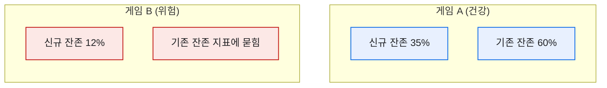
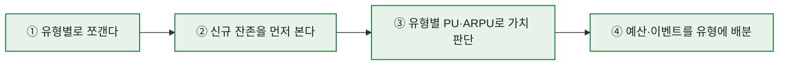

# 신규·복귀·기존을 나눠 보는 코호트: M+1 리텐션 SQL

> "리텐션 몇 퍼센트예요?"라는 질문에 숫자 하나로 답하던 시절이 있었다. 그런데 그 한 숫자는 신규·복귀·기존 유저를 몽땅 섞은 평균이라, 사실상 아무것도 말해주지 않았다. 코호트(cohort) — 같은 시점에 들어온 유저를 한 무리로 묶어 추적한다는 이 개념을 손에 넣고서야 리텐션이 말을 걸어오기 시작했다.

## 왜 전체 평균 하나로는 안 되나?

같은 40% 리텐션이어도 속은 완전히 다를 수 있다. 아래 두 게임은 평균이 같지만 건강 상태가 정반대다.



게임 B는 신규가 줄줄 새고 있는데 기존 유저 덕에 평균이 가려진다. **코호트로 쪼개지 않으면 이 구멍이 안 보인다.**

## 코호트 테이블은 어떤 모양인가?

내가 즐겨 쓰던 형태는 '유입 유형 × 지표'의 격자다. 유형별로 MAU·리텐션·PU·ARPU를 한 줄씩.

| 유입 유형 | MAU | Retention(M+1) | PU% | ARPU(원) |
|---|--:|--:|--:|--:|
| 신규(NRU) | 4,200 | 33% | 2.1% | 320 |
| 복귀(RAU) | 1,500 | 41% | 4.0% | 990 |
| 기존 | 6,800 | 62% | 6.2% | 1,850 |

이 표만 있으면 "어디에 마케팅 예산을 더 넣을까", "복귀 유저 리텐션이 신규보다 높으니 컴백 캠페인이 효율적일까" 같은 대화가 바로 된다.

## M+1 리텐션을 SQL로 어떻게 뽑나?

핵심은 **가입 코호트 테이블**과 **접속 로그**를 self-join 하는 것이다. 아래는 합성 스키마 기준의 개념 쿼리다. (테이블·컬럼명은 예시다.)

```sql
-- 이번 달 신규 코호트가 '다음 달'에도 접속했는지
SELECT
    u.join_type,                              -- 신규/복귀/기존
    COUNT(DISTINCT u.user_id)                        AS cohort_size,
    COUNT(DISTINCT nxt.user_id)                      AS retained,
    1.0 * COUNT(DISTINCT nxt.user_id)
        / COUNT(DISTINCT u.user_id)                  AS retention_m1
FROM user_cohort AS u
LEFT JOIN login_log AS nxt
       ON nxt.user_id = u.user_id
      AND nxt.login_month = DATEADD(MONTH, 1, u.join_month)
WHERE u.join_month = '2026-06-01'
GROUP BY u.join_type;
```

포인트는 두 가지다. ① 잔존은 **DISTINCT 유저 수**로 세야 중복 접속에 안 속고, ② `LEFT JOIN` 이라야 '다음 달에 안 온 유저'가 0으로 남아 분모에서 사라지지 않는다. 이 둘을 놓쳐서 리텐션이 100%로 찍히는 실수를 나도 초반에 했었다.

## 코호트를 볼 때 챙기는 순서



## 오늘의 기록

코호트를 쓰기 시작한 뒤로, 리텐션은 '보고용 숫자 하나'에서 '의사결정을 바꾸는 표'가 됐다. 평균은 친절해 보이지만 자주 거짓말을 한다. 유저를 같은 무리로 묶어 따로 따라가는 것 — 그게 데이터가 진짜 말을 하게 만드는 첫 단추였다.

*합성 스키마·수치 기준입니다. 실제 게임·회사의 테이블 구조나 데이터와 무관합니다.*
