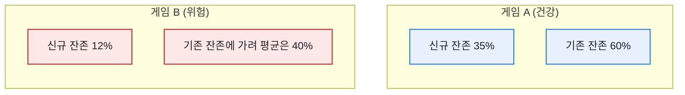
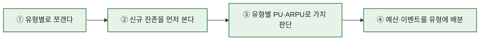
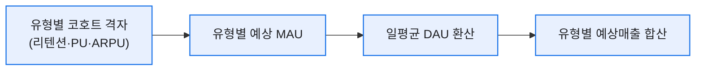

# 신규·복귀·기존을 나눠 보는 코호트: M+1 리텐션 SQL

> "리텐션 몇 퍼센트예요?"라는 질문에 숫자 하나로 답하던 시절이 있었다. 그런데 매출 시뮬레이션을 만들면서 깨달았다 — 신규·복귀·기존을 몽땅 섞은 그 한 숫자는 예측에 쓸 수가 없었다. 유형마다 다음 달 남는 비율이 완전히 달랐으니까. 코호트(cohort) — 같은 조건으로 묶은 유저 무리를 따로 추적한다는 이 개념을 손에 넣고서야 리텐션이 예측의 재료가 됐다. (수치·구조는 일반화한 합성 기준이다.)

## 왜 전체 평균 하나로는 안 되나?

같은 40% 리텐션이어도 속은 완전히 다르다.



게임 B는 신규가 줄줄 새는데 기존 유저 덕에 평균이 가려진다. **코호트로 쪼개지 않으면 이 구멍이 안 보인다.** 매출 시뮬레이션에서 유형별 리텐션을 따로 곱한 이유가 바로 이거였다.

## 코호트 테이블은 어떤 모양인가?

내가 쓴 형태는 '유형 × 지표'의 격자다. 유형별로 MAU·리텐션·PU·ARPU를 한 줄씩.

| 유입 유형 | MAU | Retention(M+1) | PU% | ARPU(원) |
|---|--:|--:|--:|--:|
| 신규(NRU) | 4,200 | 33% | 2.1% | 320 |
| 복귀(RAU) | 1,500 | 41% | 4.0% | 990 |
| 기존 | 6,800 | 62% | 6.2% | 1,850 |

이 표만 있으면 "복귀 리텐션이 신규보다 높으니 컴백 캠페인이 효율적일까" 같은 대화가 바로 된다. 실제로 나는 이 격자를 매출 시뮬레이션의 입력값으로 그대로 썼다.

## M+1 리텐션을 SQL로 어떻게 뽑나?

핵심은 **가입 코호트**와 **접속 로그**를 이어붙이는 것이다. 개념 쿼리는 이렇다.

```sql
-- 이번 달 신규 코호트가 '다음 달'에도 접속했는지, 유형별로
SELECT
    u.join_type,                                     -- 신규/복귀/기존
    COUNT(DISTINCT u.user_id)                        AS cohort_size,
    COUNT(DISTINCT nxt.user_id)                      AS retained,
    1.0 * COUNT(DISTINCT nxt.user_id)
        / COUNT(DISTINCT u.user_id)                  AS retention_m1
FROM user_cohort AS u
LEFT JOIN login_log AS nxt
       ON nxt.user_id = u.user_id
      AND nxt.login_month = DATEADD(MONTH, 1, u.join_month)
WHERE u.join_month = '2026-06-01'
GROUP BY u.join_type;
```

포인트가 둘이다. ① 잔존은 **DISTINCT 유저 수**로 세야 중복 접속에 안 속고, ② `LEFT JOIN`이라야 '다음 달에 안 온 유저'가 분모에서 사라지지 않는다. 이 둘을 놓쳐 리텐션이 100%로 찍히는 실수를 나도 초반에 했다. 그리고 실무에선 이런 반복 추출을 **임시테이블에 코호트를 먼저 적재**해두고 재사용했다 — 매번 원본 로그를 스캔하면 느리니까.

## 코호트를 볼 때 챙기는 순서



## 코호트를 매출 예측에 어떻게 연결했나?

코호트 격자를 만든 진짜 이유는 보고가 아니라 **예측**이었다. 유형별 리텐션·PU·ARPU가 손에 있으면, 그걸 그대로 매출 시뮬레이션의 입력값으로 넣을 수 있었다.



즉 코호트 표의 각 줄이 시뮬레이션의 한 세그먼트가 됐다. 신규의 리텐션이 지난달보다 떨어졌다면, 그 숫자가 다음 달 예상 MAU를 자동으로 낮추고, 결국 예상매출까지 흘러 내려간다. **코호트는 리포트가 아니라 예측 엔진의 연료**였던 셈이다.

그래서 나는 코호트를 매주 갱신하며, 특히 신규 리텐션의 추세를 지켜봤다. 이 한 줄이 흔들리면 한 달 뒤 매출이 흔들린다는 걸 알았으니까. 평균 하나로 뭉뚱그렸다면 이 연결은 애초에 불가능했다.

## 오늘의 기록

코호트를 쓰기 시작한 뒤로, 리텐션은 '보고용 숫자 하나'에서 '예측을 굴리는 표'가 됐다. 평균은 친절해 보이지만 자주 거짓말을 한다. 유저를 같은 무리로 묶어 따로 따라가는 것 — 그게 데이터가 진짜 말을 하게 만드는 첫 단추였고, 매출 시뮬레이션의 정확도를 끌어올린 열쇠이기도 했다.

*실제 코호트 분석 경험을 바탕으로 하되, 스키마·수치는 일반화한 합성 기준입니다.*
