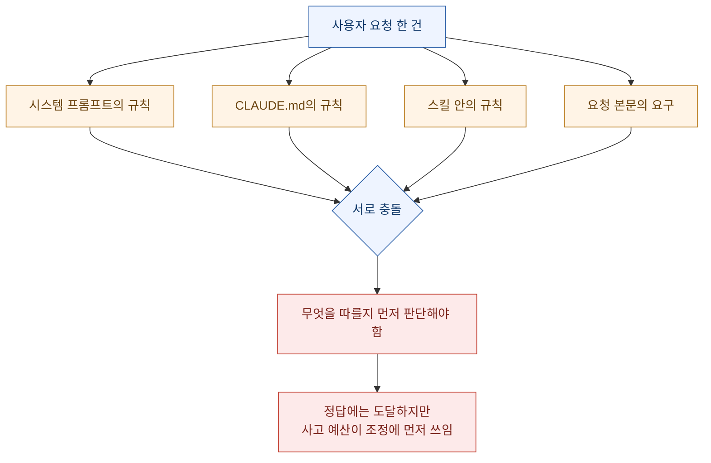
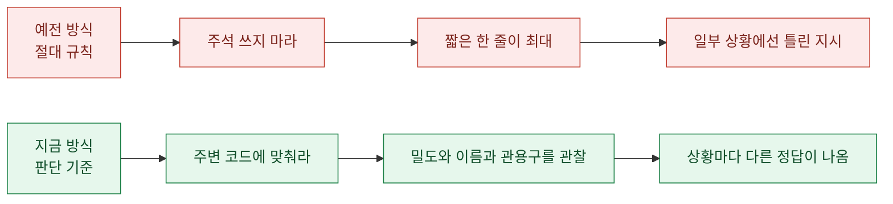
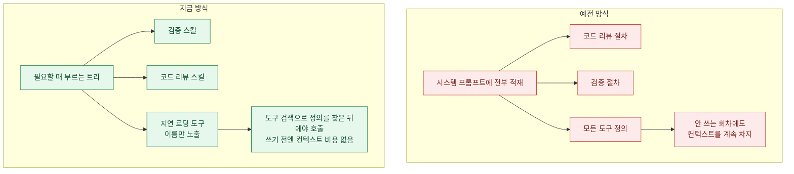
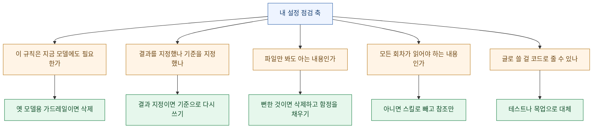

> "제약을 하나 더 쓰는 건 공짜가 아니다. 토큰을 먹는 게 아니라 판단을 흐린다."

앤트로픽의 타릭 시히파르(Thariq Shihipar)가 클로드 5 세대 모델을 위한 컨텍스트 엔지니어링 지침을 정리해 공개했다. 읽고 나서 내 설정 파일들을 전부 열어 봤는데, 결론이 좀 뼈아팠다. **내가 쓴 규칙의 상당수는 지금 모델을 위한 게 아니라 예전 모델을 위한 것이었다.**

가장 센 숫자가 첫머리에 나온다.

> 클로드 오퍼스 5와 클로드 페이블 5 같은 모델에 대해 **클로드 코드 시스템 프롬프트의 80% 이상을 제거했고, 코딩 평가에서 측정 가능한 손실이 없었다.**

이 문장이 왜 무거운가. 시스템 프롬프트는 회사가 가장 공들여 쓰는 지시문이다. 그런데 그 8할이 **없어도 되는 것**이었다는 뜻이다. 없어도 되는 정도가 아니라, 뒤에서 보겠지만 일부는 **있어서 해로운 것**이었다.

같은 날 나는 [세레브라스 지식베이스 구축기](/blog/cerebras-knowledge-base-index-time-design)도 정리했는데, 두 글이 결국 같은 말을 하고 있었다. **전부 앞에 쌓지 말고 필요할 때 불러라.** 저쪽은 데이터를, 이쪽은 지시를.

> 📌 **범위 고지**: 앤트로픽 쪽 지침 글을 읽고 정리한 것이다. 지침과 수치는 원문에서 왔고, 내 설정에 적용해 본 부분은 내 것이다. 개념적 배경은 앤트로픽의 공개 문서 [Effective context engineering for AI agents](https://www.anthropic.com/engineering/effective-context-engineering-for-ai-agents)와 [프롬프팅 모범 사례](https://docs.anthropic.com/en/docs/build-with-claude/prompt-engineering/claude-4-best-practices)에 이어져 있다.

## 왜 규칙을 지우면 오히려 잘하나?

원문이 쓴 표현은 **"언호블링(unhobbling)"** 이다. 발목에 채운 족쇄를 푼다는 뜻이다. 자기들이 클로드 코드를 **과하게 제약하고 있었다**는 진단이다. 시스템 프롬프트만이 아니라 CLAUDE.md와 스킬을 통해서도.

증거로 든 게 인상적이다. 사내에서 클로드 코드를 쓴 기록(transcript)을 읽어 보니, **한 요청 안에 서로 충돌하는 메시지가 여러 개** 들어 있더라는 것이다.

- 한쪽에서는 "적절하게 문서를 남겨라"
- 다른 쪽에서는 "주석을 절대 달지 마라"

시스템 프롬프트, 스킬, 사용자 요청이 서로 부딪히고 있었다. 원문의 판단은 이렇다. **클로드는 대체로 사용자 의도를 읽어 옳은 답에 도달하지만, 그렇게 겹치고 충돌하는 지시를 두고 무엇을 할지 정하기 전에 더 신중하게 생각해야 한다.**

이 대목이 핵심이다.

**규칙의 비용은 토큰이 아니라 조정 부담이다.** 규칙 다섯 줄을 더 썼을 때 드는 진짜 비용은 그 다섯 줄의 길이가 아니라, 모델이 "이 다섯 줄과 아까 그 세 줄 중 뭐가 우선인가"를 매번 푸는 일이다.

그리고 원문이 덧붙인 이유가 하나 더 있다. 예전엔 **CLAUDE.md가 기억이자 정보이자 지침이었다.** 지금은 메모리·아티팩트·스킬이 따로 있고, 클로드가 세션 사이에 컨텍스트를 싣고 나르는 새로운 방법을 스스로 만들 수 있다. **한 파일이 모든 역할을 겸할 이유가 사라진 것이다.**

## 여섯 가지가 어떻게 뒤집혔나?

원문은 "한때 모범 사례였다가 미신이 된 것들"을 여섯 쌍으로 정리했다.

| 예전 | 지금 | 왜 바뀌었나 |
|---|---|---|
| 규칙을 준다 | **판단을 맡긴다** | 최신 모델은 명시적 규칙 없이도 이런 결정을 잘 처리한다 |
| 예시를 준다 | **인터페이스를 설계한다** | 예시가 오히려 탐색 공간을 특정 방향으로 가둔다 |
| 전부 앞에 넣는다 | **점진적으로 공개한다** | 필요한 시점에 맞는 컨텍스트를 스스로 불러온다 |
| 반복해서 말한다 | **도구 설명을 단순하게** | 반복 없이도 지시를 놓치지 않는다 |
| CLAUDE.md에 기억을 쌓는다 | **자동 메모리** | 관련 있는 것을 알아서 저장한다 |
| 단순한 스펙 | **풍부한 레퍼런스** | 더 복잡한 참조를 다룰 수 있게 됐다 |

하나씩 뜯어보면 각각에 배울 게 따로 있다.

## 규칙 대신 판단 — 주석 예시가 왜 좋은가?

이 절의 예시가 이 글 전체에서 제일 좋았다.

클로드 코드 초기에는 최악의 상황(예: 파일 삭제)을 피하는 게 중요했다. 그래서 **항상 참은 아니지만 강한 지침**을 줬다. 예전 시스템 프롬프트의 문구를 옮기면 대략 이렇다.

> 코드에서는 기본적으로 주석을 쓰지 마라. 여러 문단짜리 독스트링이나 여러 줄 주석 블록은 절대 쓰지 마라 — 짧은 한 줄이 최대다. 사용자가 요청하지 않는 한 계획·결정·분석 문서를 만들지 마라 — 중간 파일이 아니라 대화 맥락에서 작업하라.

문제는 **일부 요청에 대해 이 지침이 틀린다**는 것이다. 사용자에게 자기 취향이 있을 수 있고, 아주 복잡한 코드의 어떤 부분은 여러 줄 주석 블록이 정말 필요하다.

그럼에도 예전 모델에는 이 가드레일이 없으면 주석이 자주 틀렸고, 그래서 **트레이드오프를 감수했다**는 게 원문의 설명이다. 지금은 그럴 필요가 없어졌다. 새 시스템 프롬프트는 이렇게 바뀌었다.

> 주변 코드처럼 읽히는 코드를 써라. 주석 밀도와 이름 짓기와 관용구를 주변에 맞춰라.

두 지시의 성격 차이를 보자. 앞엣것은 **결과를 지정**한다. 뒤엣것은 **판단 기준을 지정**한다. 뒤엣것은 문장이 훨씬 짧은데 커버하는 상황은 훨씬 넓다. 주석이 빽빽한 레거시 파일에서는 빽빽하게 쓰고, 주석이 없는 모던한 파일에서는 안 쓴다. **하나의 규칙으로 두 상황을 다 맞히려면 규칙이 아니라 기준을 줘야 한다.**

내 CLAUDE.md에도 "결과를 지정한 규칙"이 여럿 있었다. 다시 보니 대부분 "주변을 보고 맞춰라"로 줄일 수 있는 것들이었다.

## 예시가 왜 오히려 가두나?

이것도 직관에 반한다. 도구 사용의 1번 규칙은 **"클로드에게 사용법 예시를 줘라"** 였다. 그런데 최신 모델에서는 예시가 **탐색 공간을 특정 영역으로 제약한다**는 걸 발견했다고 한다.

예시를 주는 대신 하라는 것은 **도구·스크립트·파일의 설계 자체를 고민하는 것**이다. 클로드가 쓸 수 있는 파라미터가 무엇이고, 그것을 얼마나 더 표현력 있게 만들 수 있는가.

원문이 든 예가 할 일 관리 도구다.

| 설계 요소 | 그것이 전달하는 것 |
|---|---|
| `status`를 `pending`·`in_progress`·`completed` 열거형으로 둠 | 이 도구를 **어떻게 쓰는 물건인지** 그 자체로 암시된다 |
| "한 번에 하나만 `in_progress`로 유지하라"는 안내 | 우리가 **요구하는 행동**을 정의한다 |

즉 **열거형이 곧 사용법 설명**이다. 상태가 세 개뿐이고 이름이 명확하면, "먼저 pending으로 만들고 시작할 때 in_progress로 바꾸고 끝나면 completed로 바꾸세요"라는 문단이 통째로 필요 없다.

이건 사람용 API 설계 원칙과 정확히 같다. **좋은 인터페이스는 문서가 적게 필요하다.** 예시를 세 개 붙여야 이해되는 도구는, 예시가 부족한 게 아니라 인터페이스가 모호한 것이다.

## 점진적 공개는 무엇을 바꾸나?

원문에서 제일 실무적으로 값진 절이다.

클로드 코드는 코딩에 집중돼 있었으므로 시스템 프롬프트에 **코드 리뷰와 검증 방법**을 상세히 넣어 뒀다. 늘 필요하진 않지만, 필요할 땐 결정적인 정보였다. 그래서 앞에 다 넣었다.

지금은 클로드 코드가 **적절한 시점에 적절한 컨텍스트를 불러오는 데 아주 능숙**해졌다. 그래서 검증과 코드 리뷰를 **각각 별도 스킬로 빼서** 필요할 때만 부르게 했다.

그리고 이건 스킬만의 이야기가 아니다. **도구에도 적용된다.**

일부 도구는 **지연 로딩(deferred loading)** 이다. 에이전트가 쓰기 전에 도구 검색으로 전체 정의를 찾아와야 한다. 덕분에 **도구를 더 많이 두면서도 쓰기 전까지는 컨텍스트를 차지하지 않는다.**

그리고 원문이 정면으로 깨는 미신이 여기 있다.

> **흔한 미신**: CLAUDE.md와 Skill.md를 "있을 법한 모든 관행의 중앙 저장소"로 만들어야 한다. 안 그러면 클로드가 못 찾을 테니까.
> **대신**: 적절한 시점에 로드될 수 있는 **파일의 트리**를 갖추는 걸 고려하라.

나는 정확히 그 미신 쪽에 있었다. 스킬 하나에 모든 예외 처리와 모든 주의사항을 다 밀어 넣고 "혹시 필요할지 모르니까"라고 생각했다. 그런데 **그 스킬을 부르는 모든 회차가 안 쓰는 8할까지 함께 읽는다.**

## 반복과 메모리는 왜 필요 없어졌나?

두 가지가 짧지만 분명하다.

**반복하기 → 단순한 도구 설명.** 예전 모델은 지시를 반복해 줘야 할 때가 있었고, 컨텍스트 창의 시작보다 **끝에 있는 지시를 더 잘 따르는** 경향이 있었다. 그래서 시스템 프롬프트에 도구 언급을 넣고 도구 설명에도 지시를 넣는 이중 배치를 했다. 지금은 **중복을 지우고, 도구 사용법은 도구 설명에만** 둔다.

**CLAUDE.md 메모리 → 자동 메모리.** 예전엔 `#` 단축키로 CLAUDE.md에 자동 기록하게 권했다. 지금은 클로드가 **작업과 사용자에게 관련 있는 것을 알아서 저장**한다.

이 두 번째가 내게는 반가웠다. 나도 세션마다 배운 것을 메모리 파일로 남기고 있는데, 그걸 CLAUDE.md에 계속 쌓았다면 지금쯤 그 파일이 수천 줄이었을 것이다. **기억과 지침은 다른 물건이고, 다른 파일에 있어야 한다.**

## 레퍼런스는 왜 코드가 나은가?

마지막 뒤집기가 제일 확장성이 크다. **단순 스펙 → 풍부한 레퍼런스.**

플랜 모드에서 클로드 코드는 마크다운 계획 파일에 크게 의존했다. 코드베이스에 스펙을 저장해 두고 긴 프로젝트 동안 참조하게 하는 것도 비슷한 관행이었다. 그런데 이제 **훨씬 복잡한 참조를 다룰 수 있다**는 것이다.

| 레퍼런스 형태 | 무엇을 대체하나 |
|---|---|
| HTML 아티팩트 | 단순 마크다운 계획 문서 |
| **상세한 테스트 스위트** | 글로 쓴 스펙 |
| 다른 코드베이스의 함수(이식 대상) | 동작 설명 |
| **루브릭** | "좋은 설계란 무엇인가"에 대한 취향 |

두 번째가 제일 강력하다. **스펙이 테스트 스위트일 수 있다.** 글로 "이 함수는 빈 입력에서 예외를 던져야 한다"라고 쓰는 것보다, 그걸 실제로 검사하는 테스트를 두는 게 훨씬 높은 충실도로 전달된다. 모호할 여지가 없고, 게다가 **검증까지 겸한다.**

루브릭도 재미있다. 원문에 따르면 루브릭은 클로드가 특정 분야에서 **내 취향을 검증해 보게** 해 준다(예: 좋은 API 설계란 무엇인가). 동적 워크플로로 루브릭을 든 검증 에이전트를 띄우는 방식이다.

그리고 원문이 못 박은 실무 원칙 하나.

> 일반적으로 **코드 형태의 파일을 선호하라.** 클로드가 아주 잘 아는 언어로 명확하고 높은 충실도의 지시를 주기 때문이다. 예를 들어 디자인의 **HTML 목업이 그 디자인에 대한 설명이나 스크린샷보다 대체로 더 나은 결과**를 낸다.

목업 > 설명 > 스크린샷. 이 순서는 그대로 외워 둘 만하다.

## 그래서 각 계층은 무엇을 담아야 하나?

원문이 마지막에 계층별로 정리해 준 게 실무에 바로 쓰인다.

| 계층 | 담을 것 | 담지 말 것 |
|---|---|---|
| **시스템 프롬프트** | 제품 맥락 — 어떤 제품 안에서 무엇을 하는지. 직접 에이전트 하네스를 만든다면 **여기에 시간을 많이 써라** | (클로드 코드 사용자는 건드릴 일이 거의 없음) |
| **CLAUDE.md** | 가볍게. 저장소가 무엇을 위한 것인지 짧게. **토큰 대부분을 코드베이스 안의 함정(gotcha)에** 쓴다. 예: 타입은 한 파일에만 모아 두고 다른 곳엔 없다 | **파일 시스템이나 저장소를 보면 알 수 있는 뻔한 것.** 상세한 절차는 스킬로 빼고 참조만 |
| **스킬** | 필요할 때 정보를 찾게 해 주는 **가벼운 안내서**. 나·팀·제품에만 해당하는 **의견과 지식과 관행**. 길면 여러 파일로 쪼갠다 | 아주 중요한 영역이 아니면 **과한 제약** |
| **레퍼런스** | `@` 멘션으로 붙이는 심층 자료. 스펙 파일, 목업, 코드베이스 전체 | 코드로 줄 수 있는 걸 글로 설명하는 것 |

**"뻔한 것을 적지 마라"** 가 특히 아팠다. 내 설정 파일에는 저장소 구조 설명이 꽤 길게 들어 있었는데, 그건 클로드가 `ls` 한 번이면 아는 것이다. 반대로 **"이 스크립트는 파이썬 전체 경로로 불러야 한다"** 같은, 파일만 봐서는 절대 모르는 함정은 몇 줄 없었다. **비중이 정확히 거꾸로였다.**

그리고 앤트로픽은 이 정리를 자동화해 뒀다. 클로드 코드에서 **`/doctor`** 를 실행하면 스킬과 CLAUDE.md의 크기를 적정화하도록 도와준다고 한다.

## 내 설정은 어디가 틀렸나?

읽고 나서 내 것들을 이 기준으로 하나씩 재봤다.

자가 진단 결과를 정직하게 적으면 이렇다.

| 내 상태 | 판정 |
|---|---|
| 저장소 구조를 길게 설명해 둠 | 🔴 **뻔한 것.** 삭제 대상 |
| 환경 고유의 함정(특정 런타임을 전체 경로로 호출해야 함, 어떤 API는 세션이 짧게 만료됨) | ✅ **정확히 CLAUDE.md에 있어야 할 것.** 오히려 더 채워야 함 |
| 스킬 하나에 모든 예외 처리를 밀어 넣음 | 🔴 **점진적 공개로 쪼갤 것** |
| "절대 하지 마라" 형태의 결과 지정 규칙들 | 🟡 대부분 **"주변에 맞춰라" 기준으로 재작성 가능** |
| 세션 학습을 별도 메모리 파일로 분리 | ✅ 이미 자동 메모리 방향과 일치 |
| 발행 전 점검 절차를 글로 길게 서술 | 🟡 **점검 스크립트(코드)로 주는 게 낫다** |

마지막 줄은 이번 주에 실제로 겪은 일이라 더 와닿았다. 다이어그램 문법 함정을 문서로 길게 적어 뒀는데, 결국 그걸 **검사 스크립트로 만들고 나서야** 실수가 사라졌다. 원문 표현대로 **"코드는 클로드가 아주 잘 아는 언어"** 이고, 사실 사람에게도 그렇다. 지켜야 할 규칙을 글로 쓰면 잊고, 실행 가능한 검사로 만들면 안 잊는다.

## 정리하면

세 줄이다.

**하나. 제약은 공짜가 아니다.** 규칙을 하나 더 쓰는 비용은 그 길이가 아니라, 다른 규칙과 충돌할 때 그걸 조정하는 부담이다. 시스템 프롬프트 8할을 지우고도 성능이 유지됐다는 건, 그 8할이 도움이 안 됐거나 서로 싸우고 있었다는 뜻이다.

**둘. 결과가 아니라 기준을 줘라.** "주석 쓰지 마라"는 어떤 상황에서 반드시 틀리고, "주변 코드에 맞춰라"는 거의 틀리지 않는다. 짧은 쪽이 더 넓게 맞는다.

**셋. 전부 앞에 쌓지 말고 트리로 두고 필요할 때 불러라.** 이게 같은 날 정리한 [세레브라스 지식베이스 글](/blog/cerebras-knowledge-base-index-time-design)과 정확히 만나는 지점이다. 저쪽은 데이터를 색인 시점에 정리해 두고 질의 때 필요한 것만 꺼내고, 이쪽은 지시를 파일 트리로 두고 필요할 때만 로드한다. **둘 다 "미리 다 밀어 넣기"의 반대편에 있다.**

마지막으로 남는 질문 하나. 이 지침들도 결국 **현재 모델 세대에 맞춘 것**이다. 그러니 내가 오늘 다시 쓴 규칙들도 언젠가는 "옛날 모델을 위해 쓴 것"이 된다. 그때 그걸 알아채려면, **규칙을 쓸 때 왜 썼는지를 같이 적어 두는 수밖에 없을 것 같다.** 이유가 없는 규칙은 유통기한이 지나도 아무도 모른다.

---

출처: Thariq Shihipar(앤트로픽), "The new rules of context engineering for Claude 5 models". 인용한 지침과 수치는 원문에서 왔고, 내 설정에 대입한 판단은 내 것이다. 배경 문서로 앤트로픽 [Effective context engineering for AI agents](https://www.anthropic.com/engineering/effective-context-engineering-for-ai-agents)를 함께 읽으면 좋다.
