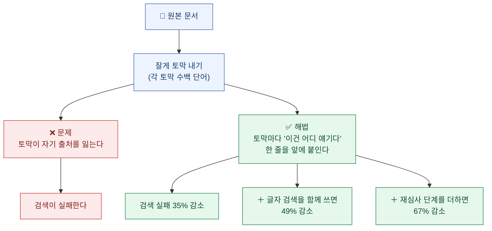
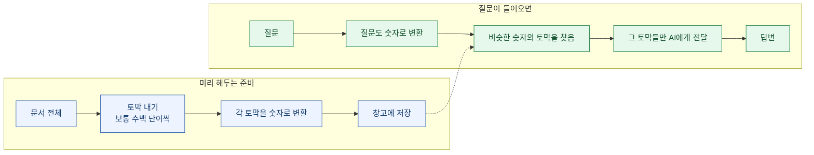
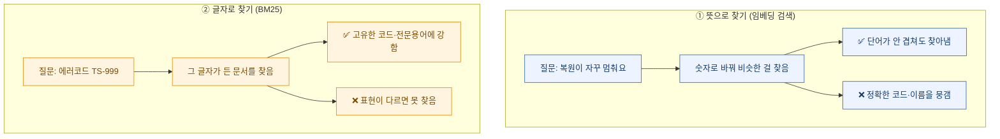
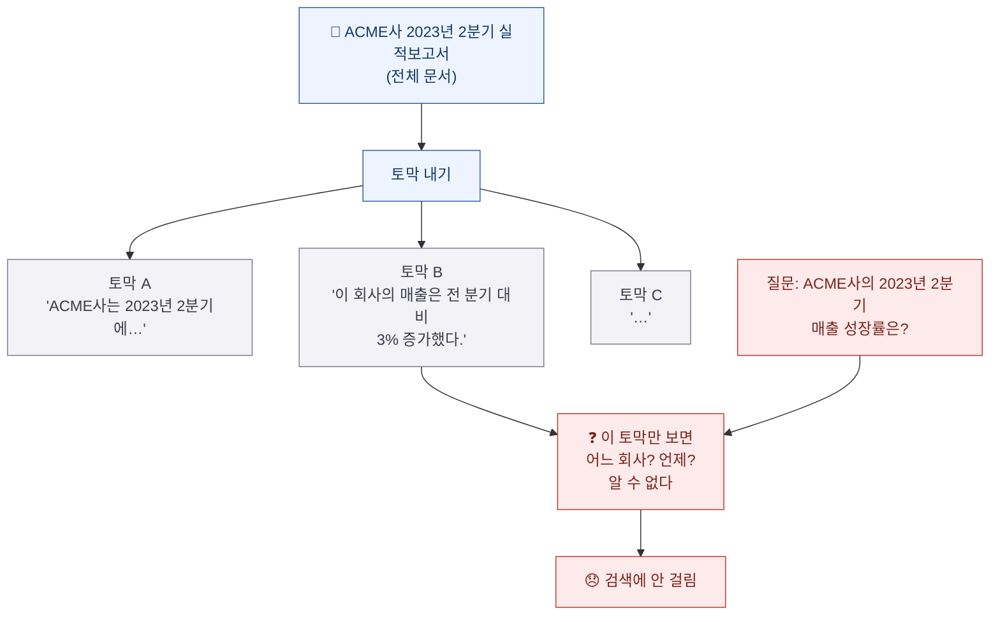
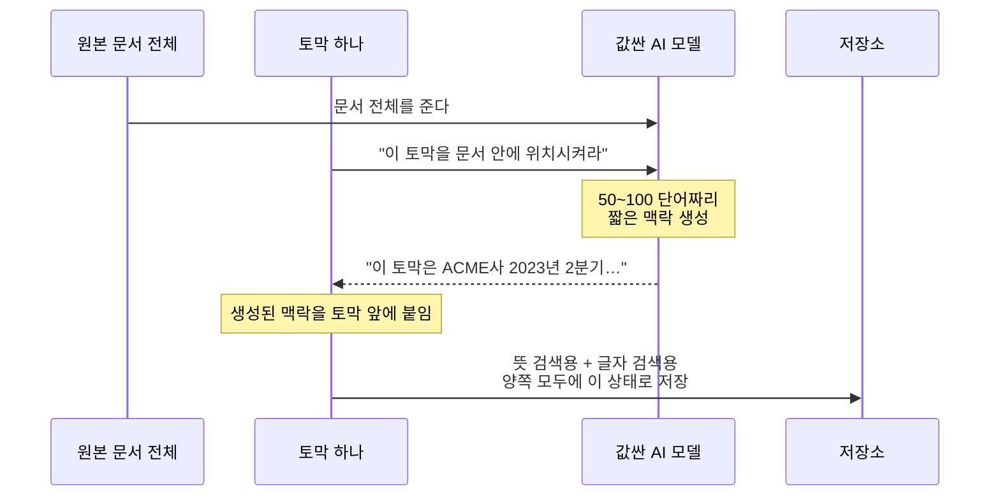
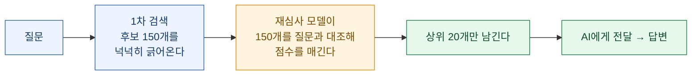
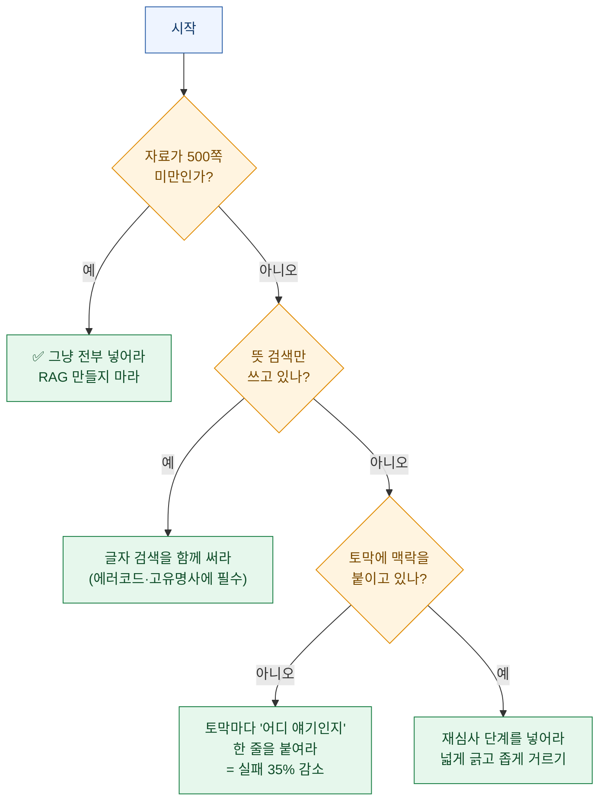

회사 자료를 AI에게 물어보는 시스템을 써본 적 있다면, 이런 경험이 있을 것이다. **분명히 그 내용이 문서에 있는데 AI가 못 찾는다.**

왜 그럴까. 원인이 생각보다 단순하고, 알고 나면 좀 허탈하다.

문장 하나를 보자.

> **"이 회사의 매출은 전 분기 대비 3% 증가했다."**

이 문장만 놓고 보면 **어느 회사인지, 언제인지 알 수 없다.** 원래 문서에는 당연히 적혀 있었을 것이다. 그런데 문서를 잘게 자르는 과정에서 그 정보가 **다른 토막으로 떨어져 나갔다.**

그래서 누군가 "ACME사의 2023년 2분기 매출 성장률은?"이라고 물어도, 이 토막은 검색에 안 걸린다. **회사 이름도 연도도 이 토막 안에 없기 때문이다.**

이 문제를 정면으로 다룬 기법이 **맥락 보강 검색(Contextual Retrieval)** 이다. 해법이 놀랄 만큼 단순한데 효과는 크다. 오늘 정리해본다.

## 전체 그림을 한 장으로



## 그 전에 — 애초에 왜 문서를 자르나?

여기부터 설명해야 한다.

AI는 한 번에 읽을 수 있는 분량에 한계가 있다. 그래서 자료가 많으면 **전부 다 읽히는 대신, 관련 있는 부분만 찾아서 읽힌다.** 이 방식을 **RAG**(검색 증강 생성)라고 부른다. 시험을 오픈북으로 바꾸되, 책 전체가 아니라 **필요한 페이지만 펴주는 것**에 가깝다.

그 "필요한 페이지"를 찾으려면 문서를 미리 토막 내서 정리해둬야 한다.



**"숫자로 변환"** 이 낯설 텐데, 문장을 숫자 목록으로 바꾸는 것이다. 신기한 건 **뜻이 비슷한 문장은 숫자도 비슷해진다**는 점이다. 그래서 단어가 안 겹쳐도 뜻이 통하면 찾아낼 수 있다.

## 잠깐 — 자료가 적으면 이럴 필요가 없다

이 기법을 설명한 원문이 **맨 앞에** 적어둔 조언이 있다. 개인적으로 이게 제일 실용적이었다.

> **자료가 20만 토큰(약 500쪽) 미만이라면, 그냥 전부 다 프롬프트에 넣어라.** RAG 같은 방법이 필요 없다.

토막 내기, 검색, 창고... 이 모든 복잡한 장치는 **자료가 한 번에 안 들어갈 때만** 필요하다. 500쪽 미만이면 통째로 넣는 게 더 정확하고 더 간단하다.

게다가 같은 자료를 반복해서 넣을 때 **캐싱**(한 번 읽힌 걸 기억해두고 재사용)을 쓰면 훨씬 싸고 빨라진다.

**"우리도 RAG 만들어야 하나?"의 첫 질문은 "자료가 500쪽을 넘나?"여야 한다.** 이 순서를 건너뛰고 시스템부터 만드는 경우를 꽤 봤다.

## 검색에는 두 종류가 있다

본론으로 가기 전에 하나만 더. 검색 방식이 두 가지이고, **서로 못하는 걸 상대가 해준다.**



**BM25**라는 이름이 나오는데, 겁먹을 필요 없다. 오래전부터 쓰이던 **글자 그대로 찾기** 방식의 이름이다. 핵심 아이디어 두 개만 알면 된다.

**① 흔한 단어는 값을 깎는다.** "그리고", "합니다" 같은 단어는 어디에나 나오니 검색에 도움이 안 된다. 반대로 `TS-999` 같은 희귀한 문자열은 그것 하나만 걸려도 결정적이다.

**② 문서 길이를 감안한다.** 긴 문서는 그냥 길다는 이유로 단어가 많이 들어 있으니, 그걸 보정한다.

원문이 든 예가 명쾌하다. 사용자가 **"에러 코드 TS-999"** 를 검색하면, 뜻으로 찾는 방식은 "에러 코드 일반"에 관한 문서를 가져올 수 있지만 **정확히 TS-999를 놓칠 수 있다.** 글자로 찾는 방식은 그 문자열을 정확히 짚는다.

**그래서 둘을 같이 쓴다.** 이건 이 글의 주제인 맥락 보강 이전에 이미 표준이 된 조합이다.

## 그런데도 왜 못 찾나 — 진짜 문제

여기가 핵심이다. 두 검색을 다 써도 남는 문제가 있다.

**토막이 자기가 누구인지 모른다.**



사람이 읽으면 "아 이 보고서니까 ACME사겠지" 하고 알아챈다. 하지만 **검색 시스템은 토막 하나만 본다.** 그 토막 안에 없는 정보는 없는 것이다.

**이게 RAG가 헛다리를 짚는 가장 흔한 원인이다.**

## 해법: 토막마다 신분증을 붙인다

해법은 허탈할 만큼 단순하다. **토막을 저장하기 전에, 그 토막이 어디서 왔는지 설명하는 짧은 문장을 앞에 붙인다.**

원문의 예를 그대로 옮긴다.

**변환 전**

```
The company's revenue grew by 3% over the previous quarter.
(이 회사의 매출은 전 분기 대비 3% 증가했다.)
```

**변환 후**

```
This chunk is from an SEC filing on ACME corp's performance in Q2 2023;
the previous quarter's revenue was USD 314 million.
The company's revenue grew by 3% over the previous quarter.

(이 토막은 ACME사의 2023년 2분기 실적에 관한 공시 자료에서 나왔다.
전 분기 매출은 3억 1,400만 달러였다.
이 회사의 매출은 전 분기 대비 3% 증가했다.)
```

**앞에 두 줄이 붙었을 뿐이다.** 그런데 이제 이 토막은 "ACME", "2023년 2분기", "공시"라는 단어를 자기 안에 갖게 됐다. 뜻으로 찾든 글자로 찾든 걸린다.

## 그 설명은 누가 붙이나?

수천, 수만 개 토막에 사람이 일일이 붙일 수는 없다. **AI에게 시킨다.**



여기서 두 가지가 실용적으로 중요하다.

**① 값싼 모델을 쓴다.** 어려운 작업이 아니라 "이게 어디 얘기인지 한 줄로 요약"이면 되므로, 가장 저렴한 급의 모델이면 충분하다.

**② 캐싱으로 비용을 눌렀다.** 토막마다 문서 전체를 다시 읽히면 엄청나게 비싸진다. 그래서 **문서를 한 번만 올려두고 재사용**한다.

이렇게 하면 비용이 얼마나 드는가. 원문의 계산으로 **문서 100만 토큰당 약 1.02달러**다. 800토큰짜리 토막, 8,000토큰짜리 문서를 가정한 값이다. **한 번만 내면 되는 비용**이라는 점이 중요하다 — 매 검색마다가 아니라 저장할 때 한 번이다.

## 효과는 얼마나 되나?

여기서 숫자를 읽을 때 주의할 점이 있어서 먼저 짚는다.

**측정 지표는 "실패율"이다.** 정확히는 *상위 20개를 가져왔을 때, 정작 필요한 문서가 그 안에 없었던 비율*이다. **낮을수록 좋다.**

| 방법 | 실패율 | 감소폭 |
|---|---|---|
| 기본(뜻 검색만) | **5.7%** | — |
| + 맥락 보강 | **3.7%** | **35% 감소** |
| + 맥락 보강 & 글자 검색 | **2.9%** | **49% 감소** |
| + 재심사 단계 | **1.9%** | **67% 감소** |

**여기서 흔한 오해가 생긴다.** "67% 개선"이 정확도가 67%포인트 올랐다는 뜻이 아니다. **실패율이 5.7%에서 1.9%로 줄어든 것**이고, 그 줄어든 폭을 원래 실패율로 나눈 게 67%다.

절대 수치로 보면 **3.8퍼센트포인트** 개선이다. 작아 보이지만, **실패의 3분의 2가 사라진 것**이니 체감은 크다. 이런 상대·절대 구분은 어느 쪽이 옳고 그른 게 아니라 **둘 다 적어야 오해가 없다.**

## 마지막 단계 — 재심사(리랭킹)

앞의 표에서 마지막 줄(67%)에만 붙은 단계다. 개념이 단순하다.



**왜 두 단계로 나눌까?** 1차 검색은 빠르지만 거칠다. 그래서 **일단 넉넉히 긁어온 다음(150개), 더 꼼꼼한 모델로 다시 줄 세워(20개)** 전달한다. 처음부터 꼼꼼하게 하면 느리고 비싸다.

**넓게 긁고 좁게 거른다** — 이건 검색뿐 아니라 여러 곳에 쓰이는 패턴이다.

원문은 몇 개를 넘길지도 실험했다. **5개보다 10개, 10개보다 20개가 좋았다.** 다만 무한정 늘리는 건 아니다 — 정보가 많아지면 오히려 산만해질 수 있어서 한계가 있다고 적었다.

## 시도했지만 효과가 없었던 것들

이 부분이 개인적으로 제일 유익했다. 원문이 **"해봤는데 별로였다"** 를 적어뒀다.

| 시도한 방법 | 결과 |
|---|---|
| 문서 전체의 **일반적인 요약**을 각 토막에 붙이기 | 효과가 매우 제한적 |
| 가상의 답변을 만들어 그걸로 검색하기 | — |
| 요약본으로 색인 만들기 | 성능이 낮았음 |

첫 줄이 특히 시사적이다. **"문서 요약을 붙이는 것"과 "그 토막에 맞춘 설명을 붙이는 것"은 다르다.**

문서 요약은 모든 토막에 **똑같은 문장**이 붙는다. 그러면 토막끼리 구별이 안 된다. 반면 맥락 보강은 **토막마다 다른 설명**이 붙는다 — "이 토막은 매출 부분", "이 토막은 리스크 부분" 하는 식이다.

**차별화되지 않는 정보를 붙이는 건 아무것도 안 붙이는 것과 비슷하다.** 이건 검색 밖에서도 쓸 수 있는 감각이다.

## 정리 — 순서대로 적용하면



## 내가 가져갈 것

이 기법 자체보다, 문제를 진단한 방식이 배울 만했다.

**"AI가 못 찾는다"를 "AI가 부족하다"로 결론 내리지 않았다.** 대신 **못 찾는 자료가 어떤 상태로 저장돼 있는지**를 들여다봤고, 거기서 "토막이 자기 출처를 잃었다"는 원인을 찾았다.

그리고 해법이 화려하지 않다. **더 좋은 모델을 쓰자**도 아니고 **더 큰 창고를 만들자**도 아니다. **저장하기 전에 한 줄 붙이자**다.

내 자료 창고에도 같은 문제가 있다. 노트를 잘라서 저장할 때, 그 조각이 **어떤 맥락에서 나온 얘기인지**가 자주 빠진다. 나중에 검색하면 "이게 무슨 소리지" 싶은 조각이 나온다.

앞으로는 조각을 저장할 때 **"이건 어디서 나온 얘기인가" 한 줄**을 같이 넣기로 했다. 30초짜리 습관인데, 몇 달 뒤의 나에게는 그게 전부일 수 있다.

---

## 참고

- Anthropic, *"Introducing Contextual Retrieval"* (2024-09-19)
- 측정 지표는 **상위 20개 안에 정답 문서가 없었던 비율**(1 − recall@20)이며, 본문의 35% / 49% / 67%는 전부 **상대 감소율**이다(절대 수치는 5.7% → 3.7% → 2.9% → 1.9%)
- 맥락 생성에는 저비용 모델을 사용했고, 생성되는 맥락 길이는 50\~100 토큰
- 비용은 프롬프트 캐싱 적용 시 문서 100만 토큰당 약 1.02달러(800토큰 청크·8,000토큰 문서 가정)
- 재심사 단계는 1차 검색 상위 150개 → 재심사 → 상위 20개

*수치는 전부 원문에 명시된 값만 옮겼다. 실험 도메인(코드베이스·소설·논문 등)과 임베딩 모델 조합에 따라 결과가 달라질 수 있다는 점은 원문도 밝히고 있다.*
