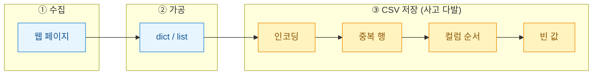
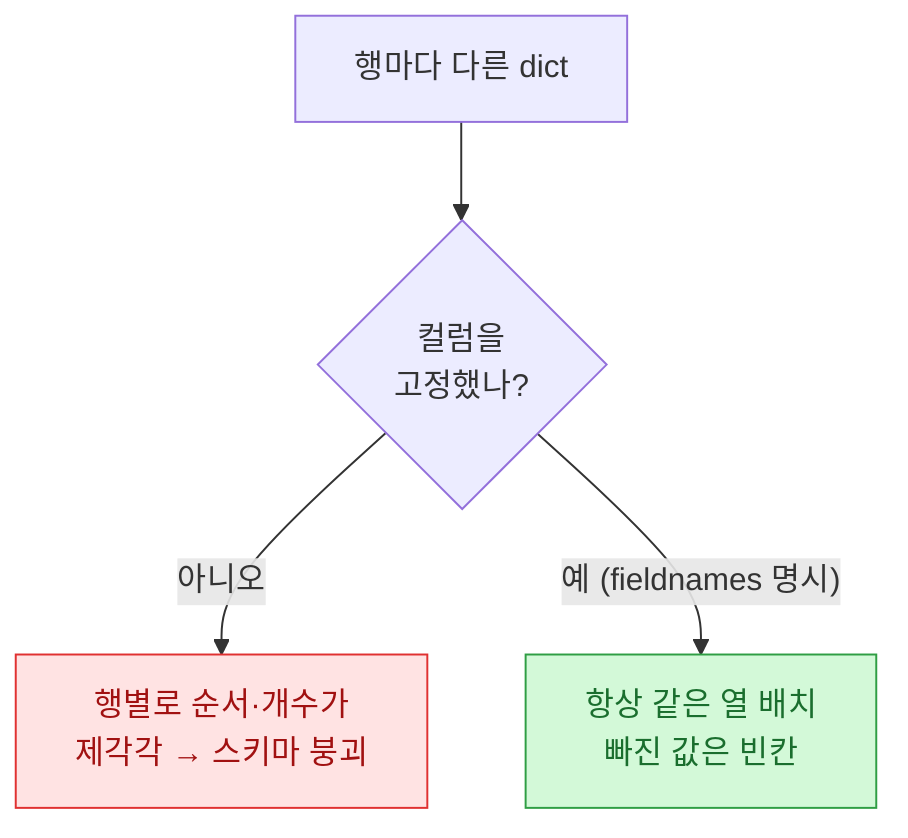
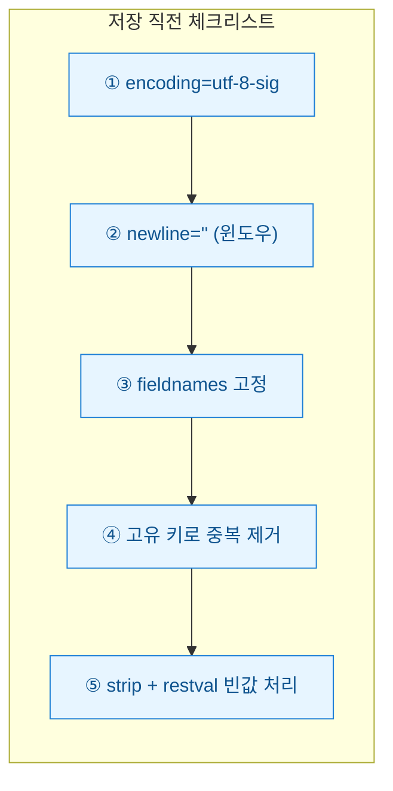

크롤러를 처음 돌려 데이터를 긁는 데는 반나절이면 충분했다. 그런데 그 결과를 CSV로 떨구고 나서, 엑셀로 열었더니 한글이 전부 깨져 있었다. "다 됐다" 싶던 순간에 시작된 뒷수습이 더 길었다. 오늘은 크롤링 산출 단계에서 나를 세 번 이상 울린 함정들을 도식으로 정리해 둔다.

## 산출 단계의 함정은 어디에 숨어 있나?

크롤링은 보통 "긁기 → 다듬기 → 저장" 세 칸으로 그려진다. 사고는 대부분 마지막 **저장(save)**칸에서 터진다. 수집 로직은 멀쩡한데 파일로 나가는 순간 깨지는 것이다.



세 함정을 하나씩 뜯어보자.

## 왜 엑셀에서 한글이 깨질까? (UTF-8 vs CP949)

원인은 단순하다. 파이썬은 기본으로 **UTF-8**로 저장하는데, 한국어 윈도우의 엑셀은 파일을 열 때 **CP949(euc-kr 계열)**로 해석하려 든다. 서로 다른 지도를 보고 있으니 글자가 어긋난다.

| 저장 인코딩 | 파이썬에서 | 엑셀 더블클릭 | 메모장 |
|---|---|---|---|
| `utf-8` | 정상 | **깨짐** | 정상 |
| `utf-8-sig` (BOM 포함) | 정상 | **정상** | 정상 |
| `cp949` | 정상 | 정상 | 정상(일부 글자 손실 위험) |

내 결론은 `utf-8-sig`다. BOM(파일 맨 앞의 인코딩 표식 3바이트)이 붙으면 엑셀이 "아 이거 UTF-8이구나" 하고 알아본다. cp949는 이모지나 특수문자에서 저장 자체가 실패(`UnicodeEncodeError`)하므로 피한다.

```python
import csv

rows = [
    {"제목": "샘플 상품 A", "가격": "12,900원", "평점": "4.5"},
    {"제목": "샘플 상품 B", "가격": "8,000원",  "평점": ""},
]

with open("out.csv", "w", encoding="utf-8-sig", newline="") as f:
    writer = csv.DictWriter(f, fieldnames=["제목", "가격", "평점"])
    writer.writeheader()
    writer.writerows(rows)
```

`newline=""`도 빼먹지 말자. 윈도우에서 이걸 안 넣으면 행 사이에 빈 줄이 하나씩 끼는 고전적 버그가 난다.

## 컬럼 순서는 왜 제멋대로 바뀔까?

두 번째 함정은 조용해서 더 위험하다. 페이지마다 긁히는 필드가 조금씩 다를 때, dict 키 순서에 저장을 맡기면 스키마가 흔들린다.



핵심 원칙은 **"컬럼 스키마(schema)를 코드 맨 위에 한 번 못박아라"**다. `DictWriter`의 `fieldnames`가 그 역할을 한다. 어떤 행에 특정 키가 없어도 그 자리는 빈칸으로 채워지고, 반대로 예상 못 한 키가 튀어나오면 `extrasaction="ignore"`로 흘려보내거나 에러로 잡을 수 있다.

```python
FIELDS = ["제목", "가격", "평점", "링크"]  # 진실의 원천(single source of truth)

writer = csv.DictWriter(
    f, fieldnames=FIELDS,
    extrasaction="ignore",   # 스키마 밖 키는 무시
    restval="",              # 누락 필드는 빈 문자열로
)
```

## 중복 행과 빈 값은 어떻게 걸러낼까?

크롤러는 재시도·페이지 겹침 때문에 같은 데이터를 두 번 긁기 십상이다. 저장 직전에 **고유 키(unique key)**로 한 번 걸러주면 깔끔하다.

| 문제 | 증상 | 방어 |
|---|---|---|
| 중복 행 | 같은 상품이 여러 번 | `seen` 집합으로 키 중복 제거 |
| 빈 값 | 셀이 `None`/공백 | `restval=""`로 통일, 필수 필드는 스킵 |
| 공백 낀 값 | 앞뒤 띄어쓰기·줄바꿈 | `.strip()`으로 정규화 |

```python
seen = set()
clean = []
for r in rows:
    key = (r.get("링크") or "").strip()   # 링크를 고유 키로
    if not key or key in seen:
        continue                           # 빈 키·중복은 버림
    seen.add(key)
    clean.append({k: (v or "").strip() for k, v in r.items()})
```

링크나 상품 ID처럼 "행을 유일하게 식별하는 값"을 키로 삼는 게 요령이다. 제목은 같아도 다른 상품일 수 있으니 키로는 부적합하다.

## 다시 안 깨지려면 뭘 기억해야 하나?

세 함정을 한 장으로 압축하면 이렇다.



크롤링 자체보다 "긁은 걸 어떻게 내보내느냐"가 데이터 품질을 가른다. 나는 이제 새 크롤러를 짤 때 저장 함수부터 이 다섯 줄로 못박아 두고 시작한다. 수집이 화려해도 CSV 한 칸이 깨지면 그 뒤 분석은 전부 모래성이니까.
