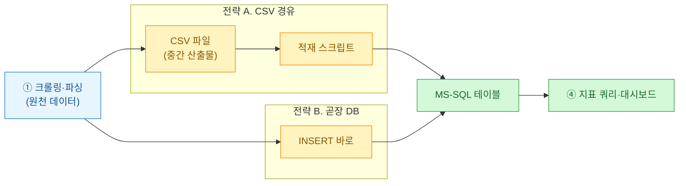
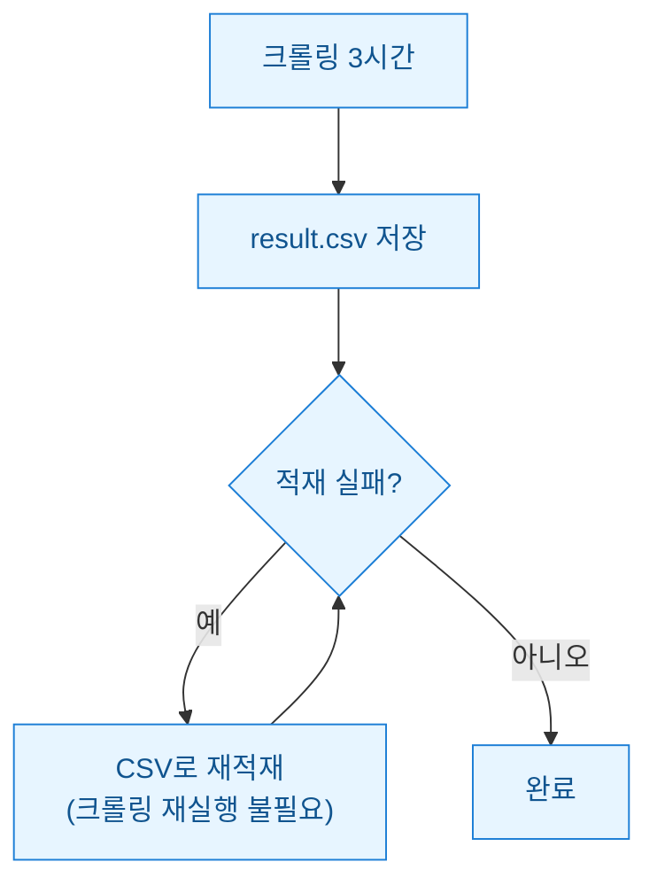
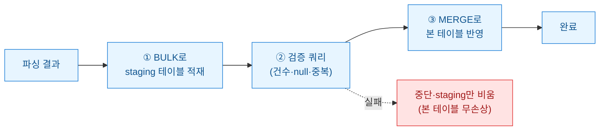

크롤링 스크립트를 처음 짤 때 나는 늘 결과를 CSV로 먼저 떨궜다. 눈으로 열어볼 수 있고 엑셀로 확인도 되니까. 그런데 게임 로그처럼 매일 수십만 행이 쌓이고 그걸 MS-SQL에 넣어 지표를 뽑는 일이 반복되자 질문이 하나 생겼다. **크롤링(또는 파싱) 결과를 CSV라는 중간 파일로 한 번 떨궜다가 적재할까, 아니면 곧장 DB에 밀어넣을까?** 둘 다 해보고 데인 뒤에야 나는 답이 "상황에 따라"가 아니라 "둘을 합치는 것"이라는 걸 알았다. 오늘은 그 과정을 정리한다.

> 이 글의 모든 코드·로그는 공개·더미 데이터 기준이며 특정 서비스나 회사의 실적과 무관하다. 크롤링을 다룬다면 대상 사이트의 robots·약관·레이트리밋을 먼저 확인하자.

전체 그림부터 한 장으로 깔고 시작한다.



## 그래서 두 전략은 정확히 뭐가 다른가?

말로 하면 헷갈리니 축을 정해 표로 고정한다. 내가 실제로 겪은 기준들이다.

| 관점 | CSV 경유(전략 A) | 곧장 DB 적재(전략 B) |
|---|---|---|
| 재현성 | 좋음 — 같은 CSV로 몇 번이든 다시 적재 | 나쁨 — 실패하면 크롤링부터 다시 |
| 디버깅 | 쉬움 — 파일 열어 눈으로 확인 | 어려움 — 중간값이 메모리에 있다 사라짐 |
| 원자성(무결성) | 약함 — 파일 절반만 쓰이면 오염 | 강함 — 트랜잭션으로 전부 또는 전무 |
| 저장 비용 | 파일 중복 보관 | 없음 |
| 파이프라인 지연 | 파일 I/O 한 단계 추가 | 짧음 |
| 스키마 변화 대응 | 유연 — 나중에 매핑 | 즉시 컬럼 맞춰야 함 |

**재현성(같은 입력으로 같은 결과를 다시 만드는 성질)**과 **디버깅**은 CSV가 이긴다. 대신 **원자성(중간에 끊겨도 데이터가 반쪽으로 남지 않는 성질)**은 DB 직접 적재가 이긴다. 이 두 축이 서로 반대라는 게 이 글의 핵심이다.

## 왜 CSV로 떨구면 편할 줄 알았나?

처음엔 CSV가 만능처럼 보였다. 이유는 명확했다.

크롤링과 적재를 **떼어놓을 수 있다.** 크롤러가 3시간 돌아 CSV를 만들면, 적재는 그 파일만 있으면 언제든 다시 돌린다. DB 커넥션이 끊겨도 크롤링을 다시 할 필요가 없다. 파일을 열어 "아 이 컬럼에 null이 왜 이렇게 많지" 하고 눈으로 잡아낼 수도 있다. 재현성과 디버깅, 둘 다 공짜로 얻는 느낌이었다.



그런데 함정이 있었다. **CSV 자체가 깨질 수 있다는 것.** 적재 스크립트가 파일을 절반 쓰다 죽으면, 다음 실행이 그 반쪽 파일을 멀쩡한 것으로 알고 읽는다. 로그에 쉼표·줄바꿈·따옴표가 섞이면 컬럼이 밀린다. 인코딩이 어긋나 한글이 깨진 채 그대로 DB로 흘러 들어간 적도 있다. CSV는 "사람이 보기 좋은 파일"이지 "무결성이 보장된 저장소"가 아니었다.

## 곧장 DB에 넣으면 뭘 얻고 뭘 잃나?

반대로 파싱 결과를 바로 INSERT하면 얻는 건 **트랜잭션**이다. MS-SQL에서 `BEGIN TRAN`으로 묶으면 중간에 죽어도 전부 롤백된다. 반쪽 데이터가 남지 않는다. 아래는 pymssql로 게임 로그를 배치 적재하는 합성 예시다.

```python
import pymssql

def load_direct(rows):
    conn = pymssql.connect(server="YOUR_HOST", database="gamelog",
                           user="YOUR_USER", password="YOUR_PW")
    cur = conn.cursor()
    try:
        # executemany는 내부적으로 배치 처리 — 한 건씩 커밋보다 훨씬 빠르다
        cur.executemany(
            "INSERT INTO play_log(user_id, event, ts) VALUES (%s, %s, %s)",
            rows,
        )
        conn.commit()          # 전부 성공해야 반영
    except Exception:
        conn.rollback()        # 하나라도 실패하면 전무 — 반쪽 없음
        raise
    finally:
        conn.close()
```

대신 잃는 게 있다. **재현성과 관찰 가능성이다.** 크롤링→변환→적재가 한 프로세스에 묶여 있으면, 적재 단계에서 터졌을 때 앞 단계 산출물이 메모리와 함께 증발한다. 무엇이 들어가려다 실패했는지 확인할 파일이 없다. 그리고 한 건씩 커밋하는 순진한 코드를 쓰면 수십만 행에서 왕복 지연이 쌓여 느려진다.

## 그래서 내 절충안은 무엇인가?

결론부터. **CSV의 재현성 + DB의 무결성**을 둘 다 가지려면 스테이징(staging) 테이블을 낀다. 파일이 아니라 DB 안의 임시 테이블을 "중간 산출물"로 쓰는 방식이다.



흐름은 세 단계다. 먼저 파싱 결과를 **스테이징 테이블에 대량 적재(bulk insert)**한다. 그다음 **검증 쿼리로 건수·null·중복을 눈으로 확인**한다 — 여기가 CSV를 열어보던 그 디버깅을 대체한다. 마지막에 `MERGE`로 본 테이블에 반영한다. 검증에서 걸리면 스테이징만 비우면 되고 본 테이블은 손도 안 탄다.

```sql
-- ① staging는 매 적재마다 비우고 채우는 임시 테이블
TRUNCATE TABLE play_log_staging;
-- (파이썬에서 executemany 또는 bcp로 play_log_staging에 대량 삽입)

-- ② 반영 전 검증 — 여기서 눈으로 확인
SELECT COUNT(*) AS total,
       SUM(CASE WHEN user_id IS NULL THEN 1 ELSE 0 END) AS null_user
FROM play_log_staging;

-- ③ 검증 통과하면 본 테이블에 병합(있으면 갱신, 없으면 삽입)
MERGE play_log AS tgt
USING play_log_staging AS src
   ON tgt.user_id = src.user_id AND tgt.ts = src.ts
WHEN NOT MATCHED THEN
   INSERT (user_id, event, ts) VALUES (src.user_id, src.event, src.ts);
```

이렇게 하면 재적재는 스테이징을 다시 채우는 것으로 끝나고(재현성), 본 테이블은 MERGE 트랜잭션으로 원자적으로 갱신된다(무결성). 중간 산출물을 **파일이 아니라 DB 테이블로** 두는 게 핵심이다. 파일 인코딩·쉼표 파싱 사고가 통째로 사라진다.

## 그럼 CSV는 언제 남기나?

스테이징으로 다 해결됐다고 CSV를 완전히 버리진 않는다. 나는 **일회성 탐색·수동 검수·외부 공유**일 때만 CSV로 떨군다. 매일 도는 파이프라인은 스테이징, 한 번 보고 버릴 데이터는 CSV. 이 경계만 지키면 "파일이 반쪽 나서 지표가 틀어지는" 사고를 안 겪는다.

정리하면 이렇다. CSV는 **눈으로 보기 좋은 중간 파일**이고, DB 직접 적재는 **무결한 최종 반영**이다. 둘의 장점만 챙기려면 파일 대신 스테이징 테이블을 중간에 끼운다. 크롤링 결과를 어디에 떨굴지 고민된다면, 나는 이제 "일단 CSV"도 "곧장 INSERT"도 아니라 "스테이징 경유"라고 답한다. 밤에 발 뻗고 자려면 그게 맞았다.
