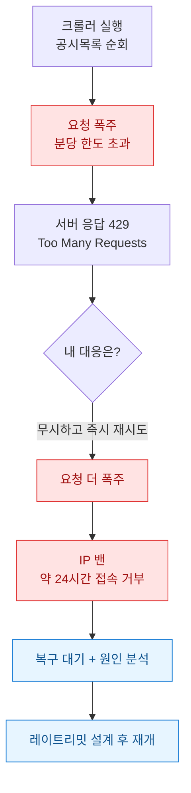
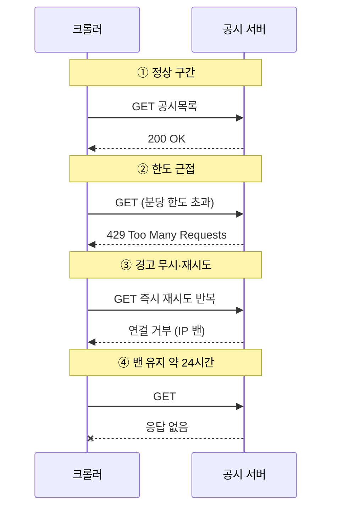

DART 공시 데이터를 자동으로 긁어오는 크롤러를 돌리던 어느 날, 갑자기 모든 요청이 실패하기 시작했다. 처음엔 코드 버그인 줄 알았다. 로그를 뒤져보니 응답 코드가 전부 `429`였고 조금 뒤엔 아예 연결조차 안 됐다. 내 서버 IP가 약 하루 동안 밴(ban, 접속 차단) 목록에 올라간 것이다. 원인은 단순했다. **분당 허용 요청 수를 넘겨버린 것.** 이 글은 그날의 사고를 처음부터 복기하고, 무엇이 밴을 불렀고 어떻게 복구했으며 다시는 안 당하려면 뭘 바꿔야 하는지 정리한 기록이다.

> 면책: 공개 DART/더미 데이터 기준이며 회계판단·투자권유가 아니다. 아래 코드는 방법론 예시(합성 입력)다.

## 그날 무슨 일이 있었나?

먼저 사고 전체를 한 장으로 보면 이렇다.



핵심은 **밴 자체가 아니라 밴 직전의 내 대응**이었다. 서버가 "너무 많다"고 `429`(Too Many Requests, 요청 과다)로 분명히 경고했는데 나는 그걸 일반 에러로 착각하고 곧바로 재시도를 때렸다. 경고를 무시한 재시도가 밴을 확정지었다.

## 왜 하필 24시간이나 막혔나?

밴에는 종류가 있다. 내가 겪은 건 짧게 풀리는 소프트 스로틀(soft throttle, 일시적 속도 제한)이 아니라 IP 단위 하드 밴에 가까웠다. 정상일 때와 밴일 때 서버가 어떻게 반응하는지 시간순으로 보면 차이가 뚜렷하다.



`429` 응답에는 보통 `Retry-After`라는 헤더가 붙는다. **"몇 초 뒤에 다시 오라"는 서버의 안내**다. 나는 이 헤더를 읽지도 않고 재시도했다. 서버 입장에선 "기다리라 했는데 계속 두드리는 클라이언트"로 보였을 것이고, 그래서 짧은 제한이 긴 차단으로 승격된 것이다. 경고는 응답 안에 다 적혀 있었는데 내 코드가 그걸 안 봤다.

## 밴을 부른 세 가지 함정은?

복기해보니 나는 초보가 흔히 밟는 지뢰를 세 개나 밟았다.

| 함정 | 내가 한 일 | 올바른 방향 |
|---|---|---|
| 무제한 동시 요청 | 반복문에서 쉼 없이 GET | 요청 사이 간격(딜레이) 삽입 |
| 429를 일반 에러 취급 | 즉시 무한 재시도 | Retry-After 읽고 대기 |
| 실패 시 즉시 재시도 | 간격 없이 반복 | 지수 백오프(재시도 간격을 점점 늘림) |

특히 세 번째, **지수 백오프(exponential backoff)**를 몰랐던 게 컸다. 실패할 때마다 대기 시간을 1초, 2초, 4초처럼 두 배씩 늘리면 서버가 회복할 틈을 준다. 나는 반대로 실패하자마자 더 세게 두드렸으니 불난 집에 부채질을 한 셈이다.

## 다음엔 어떻게 막나?

재발 방지의 뼈대는 "요청 속도를 내가 먼저 통제한다"는 것이다. 서버가 막기 전에 스스로 느려지는 구조를 짰다.

```python
import time
import random
import requests

# 공개 DART/더미 엔드포인트 기준 예시 (실제 키·URL 아님)
BASE = "https://example-dart.local/api/list"

def polite_get(url, params, max_retry=5):
    delay = 1.0
    for attempt in range(max_retry):
        resp = requests.get(url, params=params, timeout=10)
        if resp.status_code == 200:
            return resp.json()
        if resp.status_code == 429:
            # 서버가 알려준 대기 시간을 우선 존중
            wait = int(resp.headers.get("Retry-After", delay))
            time.sleep(wait + random.uniform(0, 0.5))  # 지터로 동시성 분산
            delay *= 2  # 지수 백오프
            continue
        resp.raise_for_status()
    raise RuntimeError("재시도 한도 초과 - 크롤러 정지")

# 요청 사이 기본 간격: 분당 한도 아래로 스스로 제한
for page in range(1, 50):
    data = polite_get(BASE, {"page": page})
    time.sleep(1.2)  # 최소 간격 확보
```

포인트는 세 가지다. **①** `429`가 오면 `Retry-After`를 먼저 읽어 그만큼 쉰다. **②** 재시도 간격을 두 배씩 늘리고 거기에 지터(jitter, 약간의 랜덤 흔들림)를 더해 요청이 한꺼번에 몰리지 않게 한다. **③** 무한 재시도 대신 한도를 정해두고 넘으면 크롤러를 아예 멈춘다. 멈추는 게 밴당하는 것보다 훨씬 싸다.

여기에 더해 운영 습관도 바꿨다.


특히 `robots.txt`(사이트가 크롤러에게 허용·금지 경로를 알려주는 파일)와 이용약관, 레이트리밋 정책을 **시작 전에** 확인하는 습관이 생겼다. 데이터를 얻는 것보다 접근 권한을 잃지 않는 게 먼저다.

## 그래서 남은 교훈은?

밴에서 배운 건 기술보다 태도였다. 서버가 `429`로 "천천히"라고 말할 때 그건 에러가 아니라 **협조 요청**이다. 그걸 무시하면 협조가 차단으로 바뀐다. 크롤러를 짤 때 나는 이제 "얼마나 빨리 긁을까"보다 "얼마나 예의 바르게 긁을까"를 먼저 설계한다. 속도를 조금 양보하면 24시간을 통째로 날리는 일은 없다.

다음엔 이 백오프 로직을 공통 모듈로 빼서 여러 크롤러가 같은 레이트리밋을 공유하도록 만들 계획이다. 한 IP에서 도는 크롤러가 여럿이면 각자 조심해도 합쳐서 한도를 넘길 수 있으니 말이다.
