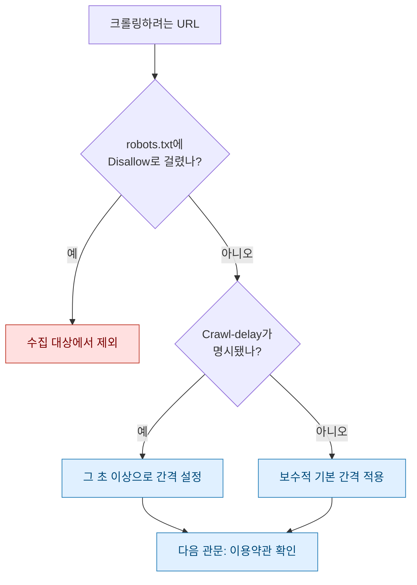
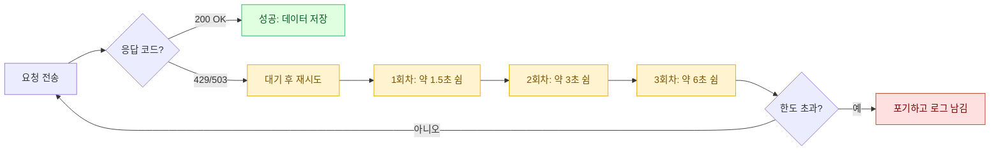

> "코드를 짜는 데 30분, 그 코드가 남의 서버를 두드려도 되는지 확인하는 데 3분." 나는 후자를 빼먹었다가 IP가 막혀본 뒤로 순서를 바꿨다.

데이터 분석가로 일하다 보면 "이 사이트에서 저 표 좀 긁어올 수 있어?"라는 부탁을 자주 받는다. 예전의 나는 곧장 `requests`부터 켰다. 지금의 나는 브라우저 주소창에 `/robots.txt`를 먼저 친다. 오늘은 크롤러의 첫 줄을 쓰기 전에 내가 매번 되짚는 세 가지 관문(robots.txt, 이용약관, 레이트리밋)을 일기처럼 풀어보려 한다.

## robots.txt는 대체 무슨 파일일까?

`robots.txt`는 사이트가 봇에게 남기는 쪽지다. "여기는 들어와도 돼, 저기는 오지 마"를 적어둔 표지판 같은 것. 사이트 최상단 경로(`example.com/robots.txt`)에 텍스트로 놓여 있어서, 크롤러를 짜기 전에 브라우저로 그냥 열어보면 된다.

문법은 의외로 단출하다. `User-agent`는 대상 봇, `Disallow`는 금지 경로, `Allow`는 예외 허용, `Crawl-delay`는 요청 사이에 쉬라는 초 단위 권고다.

```text
User-agent: *
Disallow: /admin/
Disallow: /search
Allow: /public/
Crawl-delay: 5
Sitemap: https://example.com/sitemap.xml
```

주의할 점 하나. `robots.txt`는 법적 잠금장치가 아니라 신사협정에 가깝다. 기술적으로는 무시하고 긁을 수 있다. 하지만 "무시할 수 있다"와 "무시해도 된다"는 완전히 다른 말이고, 뒤에 나올 이용약관과 엮이면 이야기가 무거워진다. 나는 `Disallow`에 걸린 경로는 그냥 안 건드린다. 굳이 분쟁의 씨앗을 내 손으로 심을 이유가 없다.



## 이용약관, 어디까지 읽어야 할까?

`robots.txt`가 표지판이라면 이용약관(ToS)은 계약서다. 표지판은 무시해도 계약서 위반은 실제 책임으로 돌아온다. 나는 약관 전문을 정독하진 못하더라도, 아래 키워드로 페이지 내 검색(Ctrl+F)은 반드시 한다.

| 검색 키워드 | 확인하려는 것 | 걸리면 하는 행동 |
| --- | --- | --- |
| 크롤링 / 스크래핑 / 자동화 | 자동 수집 자체를 금지하는가 | 금지면 공식 API를 찾거나 포기 |
| API | 정식 데이터 창구가 따로 있는가 | 있으면 크롤러 대신 그쪽 사용 |
| 상업적 이용 / 재배포 | 긁은 데이터를 어디까지 쓸 수 있나 | 분석 내부용으로만 범위 제한 |
| 개인정보 / 저작권 | 수집물에 보호 대상이 섞였나 | 개인정보·저작물은 수집 제외 |

특히 공식 API가 있으면 나는 거의 항상 크롤러를 접는다. API는 상대가 "이렇게 가져가라"고 열어둔 문이라 안정적이고, 구조가 바뀌어도 버전으로 관리되며, 무엇보다 약관 안쪽이다. 화면을 파싱하는 크롤러는 사이트 개편 한 번에 무너지지만, API 계약은 웬만해선 그대로다. 실무에서 화면 긁기와 정식 데이터 창구를 저울질해보면, 열에 아홉은 창구 쪽이 유지보수 비용이 싸다.

## 레이트리밋은 왜 걸어야 할까?

여기가 오늘의 핵심이다. 초당 수십 번씩 쉼 없이 두드리는 크롤러는 상대 서버 입장에서 소규모 공격과 구분되지 않는다. 그러면 방화벽이 내 IP를 차단하고, 운이 나쁘면 회사 전체 IP 대역이 막힌다. 레이트리밋(호출 빈도 제한)은 상대를 위한 배려이자 나를 위한 보험이다.

원칙은 세 가지다. 첫째, 요청 사이에 간격을 둔다. `robots.txt`의 `Crawl-delay`가 있으면 그 값 이상으로, 없으면 보수적으로 잡는다. 둘째, 세션을 재사용해 연결을 아낀다. 매 요청마다 새 연결을 여는 건 나에게도 상대에게도 낭비다. 셋째, 실패하면 곧장 재시도하지 말고 점점 더 오래 쉬면서 재시도한다. 이게 백오프다.

```python
import time
import requests
from requests.adapters import HTTPAdapter
from urllib3.util.retry import Retry

# 세션 하나를 재사용한다 (연결 낭비 방지)
session = requests.Session()

# 지수 백오프 + 재시도 대상 상태코드 지정
retry = Retry(
    total=5,               # 최대 5회 재시도
    backoff_factor=1.5,    # 대기 = backoff_factor * (2 ** (재시도-1))
    status_forcelist=[429, 500, 502, 503, 504],
    respect_retry_after_header=True,  # 서버가 준 Retry-After를 존중
)
session.mount("https://", HTTPAdapter(max_retries=retry))

def polite_get(url, min_interval=2.0):
    resp = session.get(url, timeout=10,
                       headers={"User-Agent": "my-research-bot/1.0"})
    time.sleep(min_interval)   # 요청마다 최소 간격 확보
    return resp
```

`backoff_factor`가 하는 일을 그림으로 보면 이해가 빠르다. 실패가 쌓일수록 대기 시간이 계단처럼 벌어져서, 잠깐 힘들어하는 서버에 회복할 틈을 준다.



특히 `429 Too Many Requests`와 함께 오는 `Retry-After` 헤더는 서버가 직접 "이만큼 뒤에 다시 오라"고 알려주는 값이다. 이건 내 추측보다 정확하니 무조건 존중한다. 예전에 대량으로 파일을 받아오다 자꾸 중간에 끊긴 적이 있는데, 재시도 로직을 넣기 전엔 실패한 것들을 손으로 다시 돌렸다. 세션 재사용과 백오프를 붙인 뒤로는 밤새 돌려도 아침에 멀쩡히 끝나 있었다. 상대 서버를 덜 괴롭혔더니 오히려 내 수집 성공률이 올라간 셈이다.

## 실제로 돌리기 전 최종 점검표

머릿속으로만 기억하면 꼭 하나를 빼먹는다. 그래서 나는 크롤러 파일 맨 위에 주석으로 이 체크리스트를 붙여둔다.

| 단계 | 점검 항목 | 통과 기준 |
| --- | --- | --- |
| 1 | robots.txt 확인 | 대상 경로가 Disallow에 없음 |
| 2 | Crawl-delay 반영 | 명시값 이상으로 간격 설정 |
| 3 | 이용약관 검색 | 크롤링 금지·API 존재 여부 확인 |
| 4 | 공식 API 우선 | API 있으면 크롤러 대신 사용 |
| 5 | 요청 간격 | 최소 간격 + 지수 백오프 적용 |
| 6 | User-Agent 명시 | 정체와 연락 수단을 밝힘 |
| 7 | 수집 시간대 | 트래픽 한산한 시각에 실행 |
| 8 | 개인정보·저작물 | 보호 대상은 수집에서 제외 |

여기서 6번, User-Agent를 솔직하게 밝히는 걸 나는 꽤 중요하게 본다. 브라우저인 척 위장하기보다 "나는 이런 목적의 봇이고 문제 있으면 여기로 연락 달라"고 적어두면, 상대 운영자가 무작정 차단하기 전에 한 번 더 생각해준다. 결국 크롤링은 남의 마당에서 물을 길어오는 일이라, 예의를 갖추면 대체로 마당 주인도 관대해진다.

## 마무리

크롤러를 짜는 기술 자체는 어렵지 않다. 어려운 건 "긁어도 되는가"와 "다치지 않게 긁는가"라는 두 질문을 습관으로 만드는 일이다. robots.txt로 표지판을 읽고, 이용약관으로 계약을 확인하고, 레이트리밋과 백오프로 상대와 나를 함께 지키는 것. 이 세 관문을 통과한 크롤러는 느려 보여도 결국 더 오래, 더 멀리 간다. 오늘 소개한 코드와 수치는 전부 예시용 더미이니, 각자의 대상과 약관에 맞춰 간격과 재시도 한도를 조정해 쓰면 된다.

## 참고자료

- [[game-data-sql-recipes-retention-ltv]] — 수집한 데이터를 지표로 엮는 다음 단계
- [[game-metrics-7-definitions]] — 분석에 앞서 지표 정의부터 맞추기
- 레시피 저장소: https://github.com/DBhyeong/game-data-recipes

<!-- 안전: 합성/더미 데이터, 회사·실데이터·PII 없음. -->
