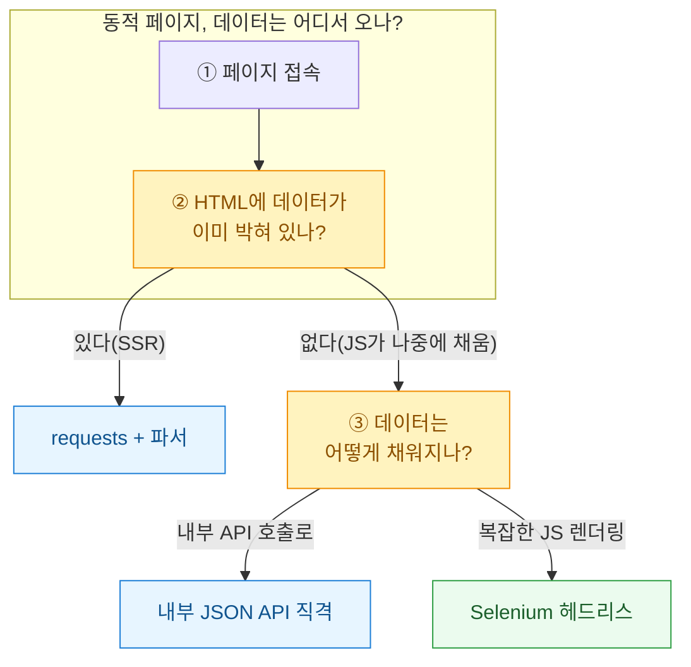
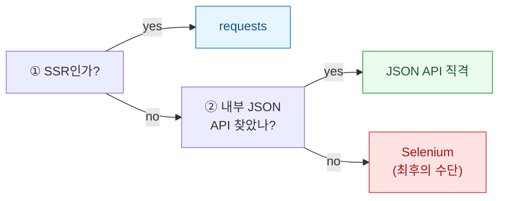

크롤러를 새로 짤 때마다 나는 같은 갈림길 앞에 선다. requests로 HTML을 바로 긁을까, 브라우저 개발자도구에서 내부 API를 찾아 때릴까, 아니면 그냥 Selenium으로 사람처럼 클릭하게 둘까. 셋 다 "데이터를 가져온다"는 목적은 같지만, 6개월 뒤 유지보수 비용은 하늘과 땅 차이다. 오늘은 가상의 부동산 매물 목록 페이지 하나를 놓고 세 방법을 모두 적용해본 기록을 남긴다.



## 그 데이터는 정말 HTML 안에 있을까?

가장 먼저 확인할 것은 "화면에 보이는 값이 실제 HTML 소스에 들어있는가"다. 브라우저에서 우클릭 후 페이지 소스 보기를 눌러 매물 가격을 검색해본다. 여기서 갈린다.

| 확인 결과 | 의미 | 1순위 후보 |
|---|---|---|
| 소스에 가격이 그대로 보임 | 서버가 완성된 HTML을 준다(**SSR**) | requests |
| 소스엔 없고 화면엔 있음 | JS가 나중에 그려 넣는다(**CSR**) | 내부 API 또는 Selenium |
| Network 탭에 깔끔한 JSON 응답이 있음 | 프런트가 API를 호출해 채운다 | 내부 JSON API |

대부분의 "동적처럼 보이는" 페이지는 사실 세 번째다. 화면은 자바스크립트가 그리지만, 그 재료인 데이터는 결국 어딘가의 JSON API에서 온다. 이 API를 찾아내면 Selenium 같은 무거운 도구가 아예 필요 없어진다.

## 정적 HTML을 requests로 긁으면 어떻게 되나?

데이터가 HTML에 박혀 있다면 이게 가장 빠르고 가볍다. 브라우저를 띄우지 않으니 메모리도 거의 안 쓴다.

```python
import requests
from bs4 import BeautifulSoup

# 합성 예시 URL — 실제 서비스 아님
res = requests.get("https://example.com/listings?page=1",
                   headers={"User-Agent": "Mozilla/5.0"})
soup = BeautifulSoup(res.text, "html.parser")

for card in soup.select(".listing-card"):
    print(card.select_one(".price").get_text(strip=True),
          card.select_one(".addr").get_text(strip=True))
```

문제는 이 방식이 **HTML 구조(DOM)에 강하게 묶인다**는 점이다. 디자이너가 `.listing-card` 클래스명 하나만 바꿔도 크롤러가 조용히 빈 리스트를 뱉는다. 그래서 나는 requests 방식을 쓸 때 "결과가 0건이면 알림" 같은 방어 로직을 반드시 같이 넣는다.

## 내부 JSON API를 직접 때리는 게 왜 최선일 때가 많나?

개발자도구 Network 탭을 열고 XHR/Fetch 필터를 켠 뒤 페이지를 스크롤하면, 매물 데이터를 실어 나르는 요청이 보인다. 응답이 JSON이라면 로또다. HTML 파싱을 건너뛰고 구조화된 데이터를 바로 받는다.

```python
import requests

# 브라우저 Network 탭에서 확인한 내부 API를 모방한 합성 예시
res = requests.get(
    "https://example.com/api/v2/listings",
    params={"region": "1168", "page": 1, "size": 50},
    headers={"User-Agent": "Mozilla/5.0", "Referer": "https://example.com/"},
)
data = res.json()
for item in data["result"]["items"]:
    print(item["price"], item["address"], item["area"])
```

이 방식의 강점은 **디자인 변경에 안 흔들린다**는 것이다. 화면 클래스명이 바뀌어도 API 스펙은 그대로인 경우가 많다. 다만 함정도 있다. 인증 토큰이나 서명값이 헤더에 필요하거나, 짧은 시간에 여러 번 부르면 차단되는 레이트리밋이 걸린다. 요청 간격을 두고, 필요한 헤더를 브라우저 요청 그대로 복사해 넣는 게 핵심이다.

## Selenium은 언제 꺼내야 하나?

로그인 후 복잡한 JS 흐름을 거쳐야만 데이터가 나오거나, 무한 스크롤·버튼 클릭이 얽혀 API를 도저히 못 찾을 때가 있다. 이럴 때만 마지막 카드로 Selenium을 꺼낸다. 진짜 브라우저를 띄우니 사람이 보는 화면 그대로 다룰 수 있지만, 그만큼 무겁고 느리고 잘 깨진다.

```python
from selenium import webdriver
from selenium.webdriver.common.by import By

opts = webdriver.ChromeOptions()
opts.add_argument("--headless=new")
driver = webdriver.Chrome(options=opts)
driver.get("https://example.com/listings")

for card in driver.find_elements(By.CSS_SELECTOR, ".listing-card"):
    print(card.find_element(By.CSS_SELECTOR, ".price").text)
driver.quit()
```

Selenium은 브라우저·드라이버 버전이 어긋나면 실행 자체가 안 되고, CI 서버에 올릴 때 의존성 지옥을 만든다. "이것 말고 방법이 없을 때"의 도구라는 마음가짐이 유지보수 비용을 아껴준다.

## 그래서 무엇을 언제 고를까?

세 방법을 같은 페이지에 적용해보고 체감한 차이를 정리하면 이렇다.

| 기준 | requests + 파서 | 내부 JSON API | Selenium |
|---|---|---|---|
| 상대 속도 | 빠름 | 가장 빠름 | 느림(브라우저 부팅) |
| 안정성 | DOM 변경에 취약 | API 스펙에 의존, 대체로 안정 | 드라이버·버전 이슈 잦음 |
| 유지보수성 | 중간 | 높음(데이터 구조가 깔끔) | 낮음(무겁고 잘 깨짐) |
| 데이터 형태 | HTML 파싱 필요 | 구조화된 JSON | HTML 파싱 필요 |
| 추천 상황 | SSR 정적 페이지 | 내부 API가 열려 있을 때 | 그 외 방법이 다 막혔을 때 |



내 결론은 단순하다. **JSON API를 먼저 찾아라.** 대부분의 동적 페이지는 5분만 Network 탭을 뒤지면 깔끔한 API가 나온다. 그걸 못 찾았을 때 SSR이면 requests, 그마저 안 되면 그때 Selenium이다. 도구를 고르는 순서만 바꿔도 6개월 뒤 나 자신이 훨씬 편해진다.

> 크롤링 시에는 대상 사이트의 이용약관과 robots.txt, 관련 법령을 반드시 확인하고 서버에 부담을 주지 않는 선에서 요청하자. 위 코드와 URL은 모두 설명용 합성 예시다.
