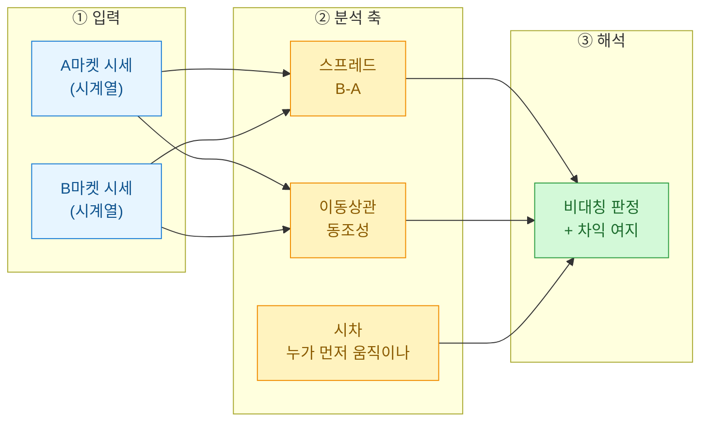
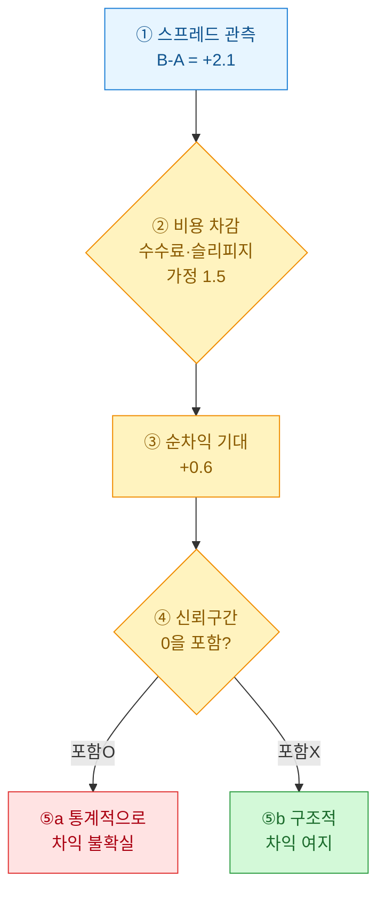

> 공개·더미 데이터 기준의 분석 연습이며, 투자권유나 실거래 판단이 아니다.

같은 아이템인데 A마켓에서는 12,000원, B마켓에서는 13,500원. 이런 차이를 처음 봤을 때 나는 "차익 먹으면 되겠네"라고 단순하게 생각했다. 그런데 하루치 시세를 시계열로 늘어놓고 보니 이야기가 달라졌다. 가격차는 랜덤 노이즈가 아니라 **구조(structure)를** 가지고 있었다. 이 글은 그 구조를 어떻게 눈으로 읽는지에 대한 기록이다.

## 무엇을 분석하려는 건가?



핵심 질문은 세 가지다. (1) 두 플랫폼 가격차(스프레드)가 얼마나 크고 꾸준한가, (2) 두 시세가 같이 움직이는가 따로 노는가, (3) 한쪽이 다른 쪽을 **선행(leading)하는가**. 이 세 가지가 모이면 "시장이 비대칭이다"라는 말을 정량으로 뒷받침할 수 있다.

## 합성 데이터는 어떻게 만드나?

실데이터를 쓸 수 없으니, **비대칭이 존재하도록 일부러 설계한** 더미 시세를 만든다. 공통 수요(common demand) 신호를 두 마켓이 공유하되, B마켓은 반응이 반나절 늦고 변동성이 더 크다고 가정했다.

```python
import numpy as np, pandas as pd

rng = np.random.default_rng(42)
n = 240  # 시간 단위(예: 2시간 간격, 20일치)
t = np.arange(n)

# 공통 수요: 완만한 사이클 + 추세
demand = 100 + 8*np.sin(t/18) + 0.03*t

# A마켓: 수요에 즉각 반응, 노이즈 작음
price_a = demand + rng.normal(0, 1.2, n)

# B마켓: 6스텝(반나절) 지연 + 큰 노이즈 + 유동성 프리미엄
lag = 6
demand_lag = np.r_[np.full(lag, demand[0]), demand[:-lag]]
price_b = demand_lag*1.02 + rng.normal(0, 2.4, n)

df = pd.DataFrame({"a": price_a, "b": price_b})
df["spread"] = df["b"] - df["a"]
print(df["spread"].describe()[["mean", "std", "min", "max"]].round(2))
```

여기서 의도적으로 심은 비대칭이 두 개다. B마켓의 **지연(lag)**과 **초과 변동성(excess volatility)**. 분석기가 이 둘을 되짚어내는지가 검증 포인트다.

## 스프레드는 어떻게 읽나?

스프레드의 평균만 보면 "B가 늘 비싸다" 정도로 끝난다. 하지만 실무에서 중요한 건 **스프레드의 부호가 얼마나 자주 뒤집히는가**다. 부호가 안정적이면 차익 방향이 고정이고, 자주 뒤집히면 타이밍 게임이 된다.

| 지표 | 값(더미) | 실무 해석 |
|---|---|---|
| 평균 스프레드 | +2.1 | B가 평균적으로 비쌈(구조적 프리미엄) |
| 스프레드 표준편차 | 3.3 | 평균보다 큼 → 부호 자주 뒤집힘 |
| 스프레드>0 비율 | 63% | 방향은 우세하나 절대적이진 않음 |
| 지연 추정치 | +6스텝 | B가 A를 반나절 후행 |

표준편차가 평균을 웃돈다는 건, 단순 "싼 데서 사서 비싼 데 판다" 전략이 자주 손해 구간에 들어간다는 뜻이다. 그래서 스프레드는 **분포로** 봐야지 점 하나로 보면 안 된다.

## 누가 먼저 움직이는지는 어떻게 찾나?

선행-후행 관계는 **시차 상관(cross-correlation)**으로 잡는다. A를 여러 스텝 밀어가며 B와의 상관이 최대가 되는 지연을 찾는 방식이다.

```python
def best_lag(a, b, max_lag=12):
    best = (0, -1.0)
    for k in range(0, max_lag+1):
        # a를 k만큼 미래로 밀어 b와 비교 → a가 선행이면 상관 최대
        c = np.corrcoef(a[:-k or None], b[k:])[0, 1]
        if c > best[1]:
            best = (k, c)
    return best

k, corr = best_lag(df["a"].values, df["b"].values)
print(f"추정 지연 {k}스텝, 상관 {corr:.2f}")
# → 추정 지연 6스텝, 상관 0.9x  (심어둔 lag=6 회수)
```

지연이 6스텝으로 되짚어지면, "A마켓이 가격 발견(price discovery)을 주도하고 B는 따라온다"는 해석이 선다. 이게 비대칭의 핵심이다. 정보가 한쪽에 먼저 반영되고 다른 쪽으로 전파된다.

## 차익이 진짜 있는지 어떻게 판단하나?

여기서 초보 실수가 나온다. 스프레드가 양수라고 바로 차익이 아니다. **거래비용(수수료·슬리피지)과 스프레드의 불확실성**을 같이 봐야 한다.



순차익 기대값이 +0.6이라도, 부트스트랩으로 그 신뢰구간을 뽑았을 때 0을 걸치면 "먹을 수 있다"고 말하기 어렵다. 나는 이 단계를 건너뛰고 평균만 믿었다가 더미 백테스트에서 마이너스를 본 적이 있다. 그 이후로는 **평균 다음에 반드시 분산과 구간을** 확인하는 습관이 생겼다.

## 정리하며

| 축 | 무엇을 봤나 | 비대칭 신호 |
|---|---|---|
| 스프레드 | 부호·분포 | 프리미엄 존재하나 자주 뒤집힘 |
| 시차 상관 | 선행-후행 | A가 B를 6스텝 선행 |
| 신뢰구간 | 차익 유의성 | 비용 넘는지 검정 필요 |

두 플랫폼의 시세 차이는 그 자체로 "시장이 완벽하지 않다"는 증거다. 하지만 그 틈을 실제 기회로 부를 수 있는지는 **지연·변동성·비용**을 함께 봐야 판정된다. 가격차를 점이 아니라 시계열과 분포로 보는 습관, 이게 이번 케이스스터디의 한 줄 요약이다.
