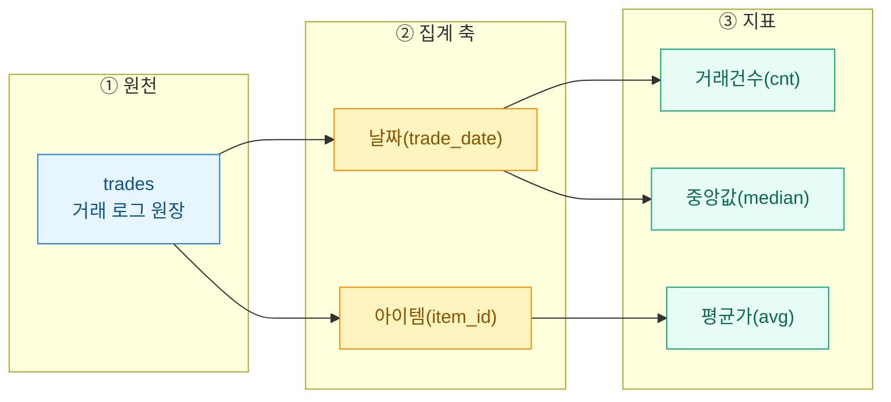
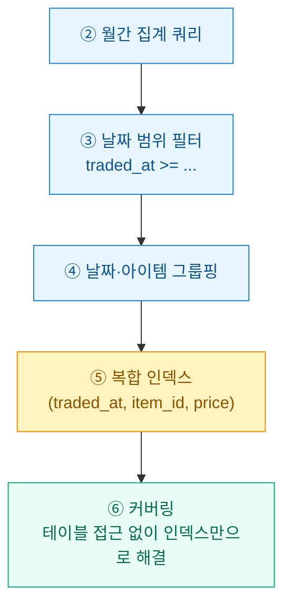

거래 로그를 들여다볼 때마다 매번 "오늘 이 아이템 얼마에 팔렸지?"를 손으로 세고 있었다. 그럴 시간에 집계 쿼리 하나를 제대로 짜두면 대시보드가 알아서 채워진다. 오늘은 그 한 방 쿼리를 설계한 기록이다. (모든 수치는 합성/더미 데이터 기준이며, 투자권유나 시세판단이 아니다.)

## 무엇을 한 눈에 봐야 하나?

모니터링 대시보드가 요구하는 지표는 결국 세 덩어리다. 이걸 먼저 도식으로 굳혀두면 쿼리 구조가 그대로 따라온다.



핵심은 **집계 축(날짜·아이템)**과 **지표(건수·평균·중앙값)**를 분리해서 생각하는 것. 축은 `GROUP BY`, 지표는 집계 함수로 간다.

## 왜 평균만으로는 부족한가?

게임 경매장이든 중고거래든 시세는 극단값에 잘 흔들린다. 실수로 0 하나 더 붙여 등록한 매물 하나가 평균을 통째로 끌어올린다. 그래서 **중앙값(median)**을 같이 봐야 "체감 시세"가 잡힌다.

| 지표 | 강점 | 약점 | 언제 보나 |
|------|------|------|-----------|
| **평균(mean)** | 계산 단순, 총액과 연동 | 극단값에 취약 | 총 거래대금 추세 |
| **중앙값(median)** | 극단값에 강건 | 함수 지원이 DB마다 다름 | 실제 체감 시세 |
| **거래건수(count)** | 유동성·신뢰도 판단 | 가격 정보 없음 | 표본이 믿을 만한지 |

건수가 3건인데 평균이 튀었다면 그날 시세는 믿지 않는 게 맞다. 그래서 세 지표는 항상 세트로 뽑는다.

## 한 번의 쿼리로 어떻게 다 뽑나?

합성 테이블을 이렇게 가정한다.

```sql
-- 합성 거래 로그 (더미)
CREATE TABLE trades (
  trade_id   BIGINT PRIMARY KEY,
  item_id    INT        NOT NULL,
  price      INT        NOT NULL,   -- 단가(원)
  qty        INT        NOT NULL,   -- 수량
  traded_at  TIMESTAMP  NOT NULL    -- 거래 시각
);
```

PostgreSQL 기준으로는 `PERCENTILE_CONT`가 있어 중앙값까지 한 쿼리에 끝난다.

```sql
SELECT
    CAST(traded_at AS DATE)                         AS trade_date,
    item_id,
    COUNT(*)                                        AS trade_cnt,
    ROUND(AVG(price), 0)                            AS avg_price,
    PERCENTILE_CONT(0.5) WITHIN GROUP
        (ORDER BY price)                            AS median_price,
    MIN(price)                                      AS min_price,
    MAX(price)                                      AS max_price,
    SUM(price * qty)                                AS gross_amount
FROM trades
WHERE traded_at >= NOW() - INTERVAL '30 days'
GROUP BY CAST(traded_at AS DATE), item_id
HAVING COUNT(*) >= 3          -- 표본 3건 미만은 노이즈로 제외
ORDER BY trade_date DESC, trade_cnt DESC;
```

`HAVING COUNT(*) >= 3`이 은근한 핵심이다. 표본이 빈약한 날은 아예 빼서 대시보드가 헛된 시세로 오염되지 않게 막는다.

MySQL 8 이하처럼 `PERCENTILE_CONT`가 없으면 중앙값은 윈도우 함수로 우회한다.

```sql
-- MySQL: 중앙값 우회 (그룹별 순번 매겨 가운데 값 평균)
WITH ranked AS (
  SELECT
    DATE(traded_at) AS d, item_id, price,
    ROW_NUMBER() OVER (PARTITION BY DATE(traded_at), item_id
                       ORDER BY price)        AS rn,
    COUNT(*)     OVER (PARTITION BY DATE(traded_at), item_id) AS n
  FROM trades
  WHERE traded_at >= NOW() - INTERVAL 30 DAY
)
SELECT d, item_id, AVG(price) AS median_price
FROM ranked
WHERE rn IN (FLOOR((n+1)/2), CEIL((n+1)/2))
GROUP BY d, item_id;
```

## 인덱스는 어떻게 태워야 하나?

이 쿼리의 병목은 뻔하다. `WHERE`로 날짜 범위를 자르고 `GROUP BY`로 날짜·아이템을 묶는다. 그러니 인덱스도 그 흐름을 그대로 따라가야 한다.



```sql
-- 범위필터 + 그룹핑 + 지표컬럼까지 담은 커버링 인덱스
CREATE INDEX idx_trades_date_item_price
  ON trades (traded_at, item_id, price);
```

선두 컬럼 `traded_at`이 범위 조건을 흡수하고, 뒤따르는 `item_id`가 그룹 키, 마지막 `price`까지 인덱스에 있어 **커버링 인덱스(covering index)**로 동작한다. 원장 테이블을 다시 안 읽으니 대시보드 새로고침이 눈에 띄게 가벼워진다.

| 인덱스 구성 | 범위 필터 | 그룹핑 | 커버링 | 판정 |
|-------------|:---:|:---:|:---:|:---:|
| 없음 | 풀스캔 | 정렬 필요 | X | 최악 |
| `(item_id)` | X | 부분 | X | 미흡 |
| `(traded_at, item_id)` | O | O | X(price 조회) | 무난 |
| `(traded_at, item_id, price)` | O | O | O | 권장 |

한 가지 트러블슈팅 메모: `WHERE`에 `DATE(traded_at) = ...`처럼 컬럼을 함수로 감싸면 인덱스를 못 탄다. 반드시 `traded_at >= 시작 AND traded_at < 끝` 형태의 **범위 조건(SARGable)**으로 써야 선두 컬럼 인덱스가 살아난다. 나는 이걸 몰라서 한동안 풀스캔을 돌리고 있었다.

## 정리하면

축(날짜·아이템)은 `GROUP BY`, 지표(건수·평균·중앙값)는 집계 함수, 잡음은 `HAVING`으로 거르고, 속도는 `(범위컬럼, 그룹키, 지표컬럼)` 순서의 커버링 인덱스로 잡는다. 이 네 줄이 모니터링 집계 쿼리 설계의 뼈대다. 대시보드가 스스로 채워지는 순간부터, 나는 시세를 손으로 세는 일에서 해방됐다.
