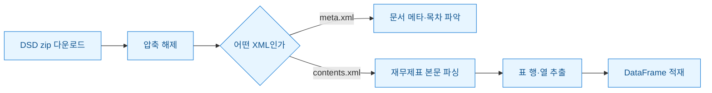
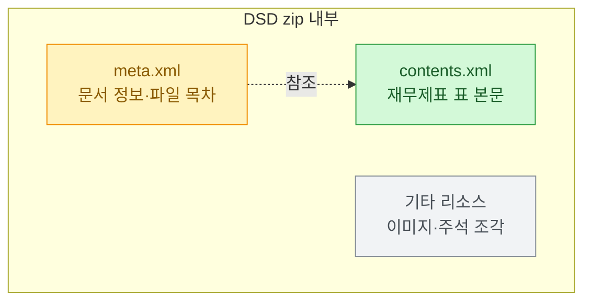

DART에서 재무제표를 긁어야 할 일이 생겼다. 처음엔 그냥 API로 숫자를 받아오면 끝인 줄 알았다. 그런데 정작 필요한 건 공시 원문에 붙어 있는 DSD 파일 안의 표였고, 그걸 열어보니 zip 안에 XML 여러 개가 뒤엉켜 있었다. `contents.xml`, `meta.xml`... 처음 보면 어디부터 손대야 할지 막막하다. 며칠 삽질하며 구조를 뜯어본 기록을 남긴다.

> ⚠️ 공개 DART/더미 데이터 기준의 구조·방법론 예시다. 실제 종목의 재무판단·투자권유·감사의견이 아니다. 아래 코드의 값은 전부 합성한 것이다.

먼저 전체 그림부터 도식으로 깔아둔다. DSD zip 하나를 받아서 표 데이터로 뽑기까지의 흐름이다.



## DSD가 대체 뭐고 왜 zip을 열어야 했나?

DSD는 DART 공시서류 제출 시스템(전자문서 제출 포맷)의 산출물이다. 공시 하나를 받으면 단일 HTML이 아니라 **여러 파일을 묶은 zip**으로 떨어진다. 그 안에 재무제표 표, 주석, 그리고 이걸 어떻게 조립하는지 알려주는 메타 파일이 함께 들어 있다.

내가 처음 헷갈린 지점이 여기다. XBRL(재무정보를 기계가 읽도록 태그로 표준화한 포맷)이라고 하면 `.xbrl` 확장자에 택소노미(계정과목 사전)까지 갖춘 순수 XBRL을 떠올린다. 그런데 DSD 본문의 표는 **XBRL 계열이긴 하지만 표 레이아웃이 살아 있는 XML**에 가깝다. 즉 계정과목 태그와 화면상 표 구조가 섞여 있어서, 순수 XBRL 파서를 들이대면 오히려 헛돈다.

zip 안 구성은 대략 이렇게 나뉘었다.



## meta.xml은 뭘 알려주고 contents.xml은 뭘 담나?

둘의 역할을 헷갈리면 파싱 순서가 꼬인다. 나는 이렇게 정리했다.

| 파일 | 역할 | 파싱해서 얻는 것 |
|---|---|---|
| meta.xml | 문서의 신원과 목차 | 회사·보고서 유형·기준일, 본문 파일 목록 |
| contents.xml | 실제 재무제표 표 | 계정과목명·당기/전기 금액·단위 |

그래서 순서가 중요하다. **meta를 먼저 읽어 "이 zip이 뭔지"와 "본문이 어디 있는지"를 확정한 뒤** contents로 넘어간다. meta를 건너뛰고 바로 본문을 열면 연결/별도 재무제표가 여러 개일 때 어느 표를 집었는지 모른 채 숫자만 긁게 된다.

```python
import zipfile
from lxml import etree

def read_dsd(zip_path):
    with zipfile.ZipFile(zip_path) as z:
        names = z.namelist()
        meta = z.read([n for n in names if n.endswith("meta.xml")][0])
        body = z.read([n for n in names if n.endswith("contents.xml")][0])
    return meta, body

meta_bytes, body_bytes = read_dsd("sample_dummy.zip")
meta = etree.fromstring(meta_bytes)

# 더미 meta 구조 가정: 문서 기준일·회사명 뽑기
company = meta.findtext(".//company", default="(더미회사)")
base_date = meta.findtext(".//baseDate", default="2024-12-31")
print(company, base_date)
```

## 표 안의 금액은 왜 정규식 없이 안 뽑혔나?

여기서 제일 애를 먹었다. contents.xml의 표는 셀 안에 금액이 그냥 숫자로 있지 않았다. 쉼표, 괄호(음수), 단위 표기, 그리고 태그 사이 공백이 뒤섞여 있었다. `int()`로 바로 캐스팅하면 죄다 터진다.

파싱 흐름을 이렇게 잡았다. 먼저 표 행을 순회하고, 셀 텍스트를 정규화한 다음, 숫자만 남긴다.


핵심은 금액 정규화 함수다. 괄호를 음수로 바꾸고 쉼표·공백·통화표기를 걷어낸다.

```python
import re

def to_amount(text):
    if text is None:
        return None
    s = text.strip().replace(",", "").replace(" ", "")
    if s in ("", "-"):
        return None
    neg = s.startswith("(") and s.endswith(")")  # 회계에서 괄호 = 음수
    s = re.sub(r"[()원]", "", s)
    if not re.fullmatch(r"-?\d+", s):
        return None
    val = int(s)
    return -val if neg else val

# 합성 예시
for raw in ["1,234,000", "(56,700)", "-", "  8 900 "]:
    print(raw, "->", to_amount(raw))
# 1,234,000 -> 1234000
# (56,700) -> -56700
# - -> None
# 8 900 -> 8900
```

셀에서 계정과목명과 금액을 짝지어 행 단위로 모으면 표가 복원된다.

```python
rows = []
body = etree.fromstring(body_bytes)
for tr in body.iter("tr"):
    cells = ["".join(td.itertext()) for td in tr.iter("td")]
    if not cells:
        continue
    account = cells[0].strip()
    amounts = [to_amount(c) for c in cells[1:]]
    if account and any(a is not None for a in amounts):
        rows.append({"계정": account, "당기": amounts[0] if amounts else None})

import pandas as pd
df = pd.DataFrame(rows)
```

## 그래서 뭘 배웠나?

가장 크게 남은 교훈은 **"파싱이 0건이면 사이트를 의심하기 전에 내 파서를 의심하라"** 였다. 표가 안 잡히면 십중팔구 셀 텍스트에 예상 못 한 공백·태그가 끼어 있었지 원문이 비어 있던 게 아니었다.

정리하면 이렇다. ① meta.xml로 문서 신원과 본문 위치를 먼저 확정한다. ② contents.xml은 순수 XBRL이 아니라 표 레이아웃이 살아 있으니 행·셀 순회로 접근한다. ③ 금액은 반드시 괄호(음수)·쉼표·단위를 정규화한 뒤 캐스팅한다.

다음엔 연결/별도 재무제표를 자동으로 구분해 라벨링하는 부분을 정리해볼 생각이다. 같은 zip에 표가 여러 개일 때 이걸 잘못 집으면 숫자는 맞는데 맥락이 틀리는, 데이터에서 제일 무서운 종류의 오류가 나기 때문이다.
