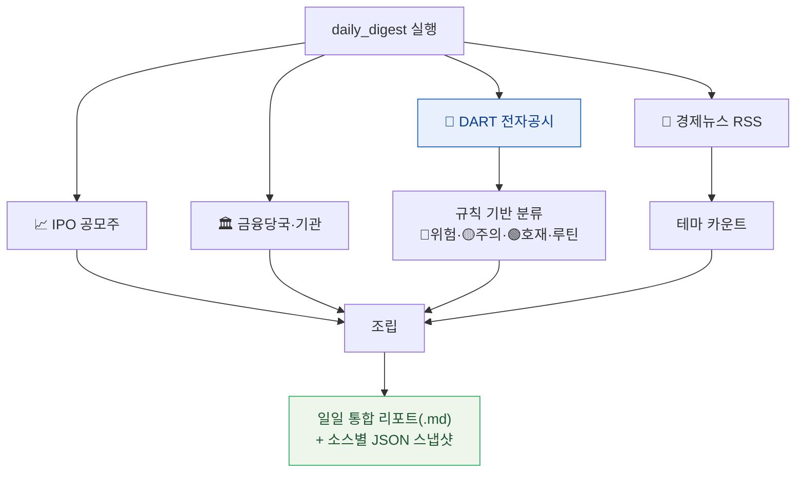
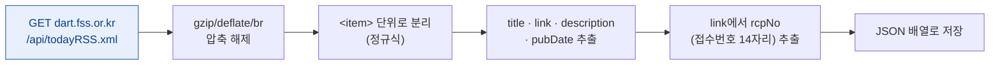
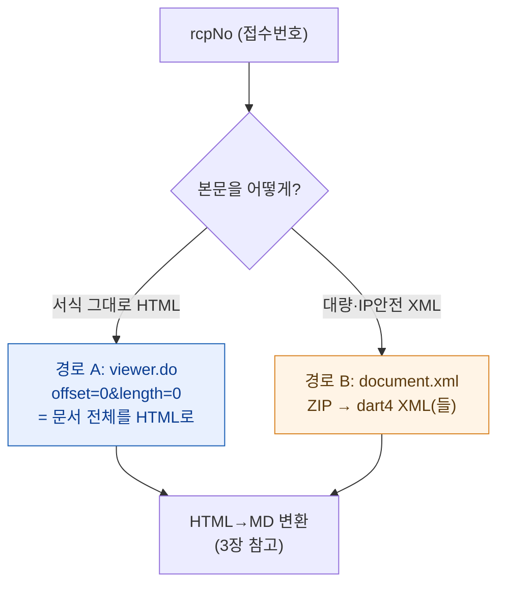
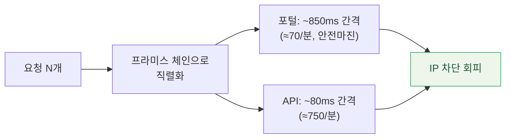
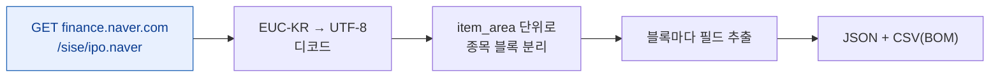
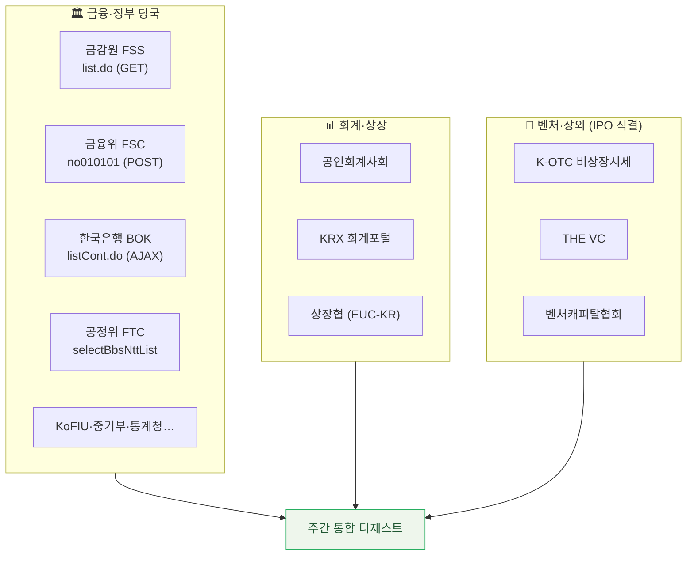
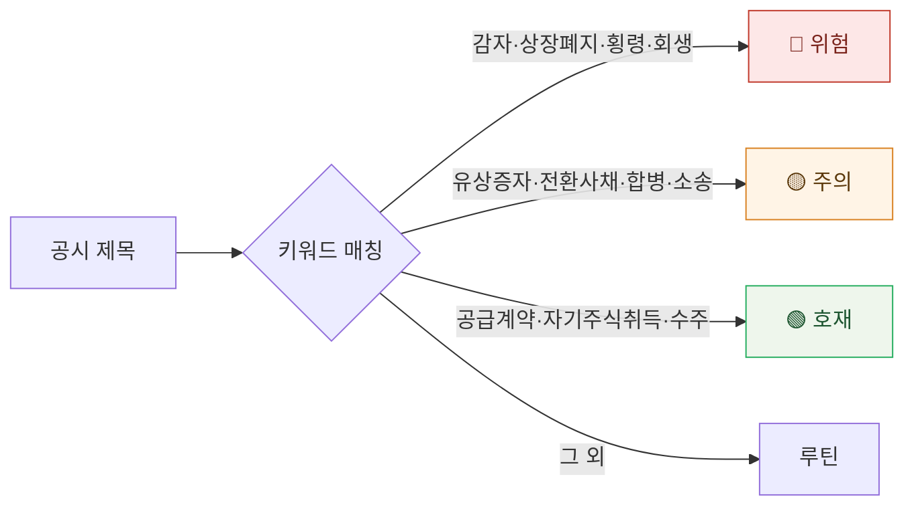
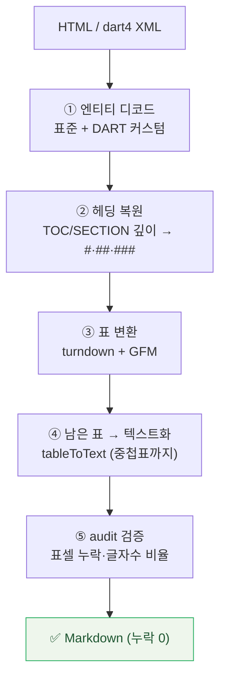
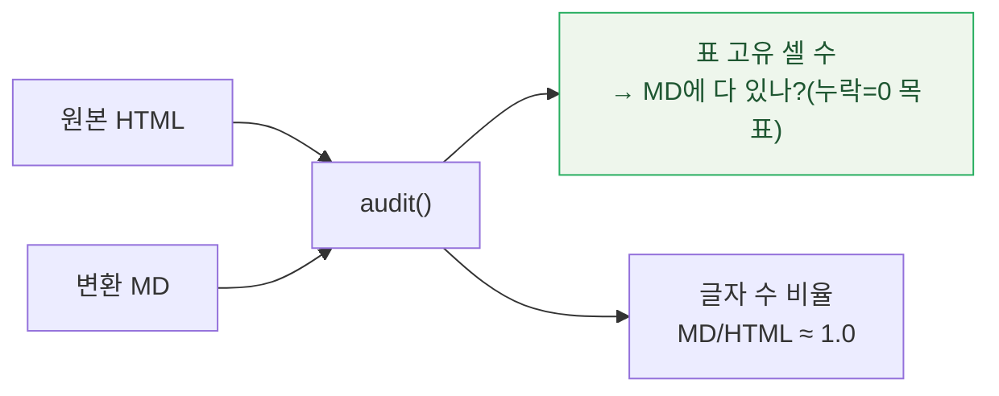
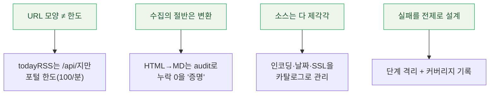

공개된 금융 데이터는 사방에 흩어져 있다. 전자공시는 DART에, 공모주 일정은 네이버 증권에, 금융당국 보도자료는 기관마다 다른 게시판에. 이걸 **매일 한 번에 긁어와 분류·정리하는 파이프라인**을 만들었고, 그 구조를 통째로 도식으로 정리한다. 핵심 질문 네 가지에 답하는 글이다 — (1) 전자공시를 어떻게 파싱하나, (2) IPO 공모주는 어디서 어떻게 가져오나, (3) 금융당국 주간 이슈는 어디서 긁나, (4) 받아온 HTML을 어떻게 Markdown으로 바꾸나.

> ⚠️ 먼저 밝혀둘 것: 아래 모든 대상은 **공개 데이터**(전자공시·증권 포털·정부 보도자료)이고, 코드의 API 키·쿠키·인증값은 전부 플레이스홀더로 가렸다. 공개 데이터라도 각 사이트의 **이용약관·수집 규모·요청 빈도**는 지켜야 한다(레이트 한도 이야기는 뒤에서 자세히).

## 전체 그림 — 하루치 데이터가 도는 길

먼저 큰 그림. 한 번 실행하면 네 갈래(전자공시·IPO·당국·뉴스)를 병렬로 긁어와, 규칙으로 1차 분류하고, 하나의 일일 리포트로 조립한다.



> 설계 원칙 하나: **각 수집 단계는 독립적으로 실패해도 된다.** 한 기관 사이트가 죽어도 나머지는 계속 돈다(`try/catch`로 단계별 격리). 23개 소스를 묶다 보면 한두 개는 늘 말썽이라, "전부 성공"이 아니라 "되는 만큼 모으고 커버리지를 기록"하는 쪽이 현실적이다.

## 1. 전자공시(DART)는 어떻게 파싱하나?

전자공시는 **"무엇이 올라왔나(목록)"** 와 **"그 내용이 뭔가(본문)"** 를 따로 가져온다.

### 1-1. 최신 공시 흐름 잡기 — todayRSS

가장 가볍게 "지금 막 올라온 공시"를 잡는 길은 **오늘의 공시 RSS**다. `dart.fss.or.kr/api/todayRSS.xml`를 GET 한 번 하면 최신 공시가 RSS로 떨어진다.



코드의 뼈대는 이렇게 단순하다. 외부 RSS 파서 없이 **Node 내장 `https`+`zlib`** 로 끝낸다.

```javascript
// 오늘의 공시 RSS 한 건 받아서 item 단위로 파싱
const r = await get('/api/todayRSS.xml');           // dart.fss.or.kr
fs.writeFileSync('dart_todayRSS.xml', r.body, 'utf8');

const rows = [];
for (const it of r.body.matchAll(/<item>([\s\S]*?)<\/item>/gi)) {
  const b = it[1];
  const g = re => (b.match(re) || [, ''])[1];
  const title = txt(g(/<title>([\s\S]*?)<\/title>/));        // "회사명 / 보고서명"
  const link  = txt(g(/<link>([\s\S]*?)<\/link>/));
  const pub   = txt(g(/<pubDate>([\s\S]*?)<\/pubDate>/));
  const rcp   = (link.match(/rcpNo=(\d{14})/) || [])[1] || ''; // 본문 키
  rows.push({ pub, title, rcp, link });
}
```

> ⚠️ 함정: `todayRSS.xml`은 URL에 `/api/`가 들어가지만 **도메인이 `dart.fss.or.kr`(포털)** 이라, 분당 1,000회짜리 OpenDART API가 아니라 **포털 한도(분당 100회 미만)** 가 적용된다. URL 모양만 보고 한도를 착각하면 IP가 막힌다. 그리고 **User-Agent 헤더가 없으면 봇 차단 페이지**가 돌아와 레이트리밋처럼 보인다 — UA는 필수.

날짜를 지정해 그날 **전체 공시**를 받고 싶으면 포털의 `dsac001/search.ax`(POST)를 쓴다. 여기서 산출되는 핵심 값이 **`rcpNo`(접수번호 14자리)** — 이게 본문을 여는 열쇠다.

### 1-2. 본문 가져오기 — 두 개의 경로

`rcpNo`만 있으면 본문을 받는 길이 둘이다. **무엇을 받느냐**(렌더된 HTML vs 원본 XML)가 다르다.

| | 경로 A · 포털 HTML | 경로 B · OpenDART API |
|---|---|---|
| 엔드포인트 | `report/viewer.do` | `api/document.xml` |
| 받는 것 | **이미 렌더된 HTML**(표=`<table>`) | 원본 **XML**(ZIP 압축) |
| 한도 | 포털 **<100/분** | API **<1,000/분** |
| 장점 | 서식·표 원형 그대로 | IP 안전, 대량에 적합 |
| 단점 | 분당 한도 빡빡 | XML→MD 변환 필요 |



> 경로 A의 핵심 한 줄: `viewer.do`를 **`offset=0&length=0`** 로 호출하면 보고서를 **잘라서**가 아니라 **통째로 한 번에** HTML로 준다. 표·서식이 원형 그대로라, "감사보고서를 HTML로 받기"는 이 경로가 정석이다. 경로 B는 `document.xml`이 ZIP을 주므로, ZIP 중앙디렉터리를 역방향 스캔해 풀고(`zlib.inflateRawSync`) 안의 XML들을 꺼낸다.

### 1-3. 한도와 IP 차단 — 가장 많이 데인 곳

DART는 한도를 넘기면 **해당 IP를 약 24시간 차단**한다(당일 복구 불가). 그래서 모든 요청을 한 줄로 줄 세우는 **직렬 스로틀**을 건다.



연결이 끊기면(`ECONNRESET`) **지수 백오프**(5초→…→60초, 최대 6회)로 재시도한다. "빠르게 많이"가 아니라 "꾸준히 안 막히게"가 수집기의 미덕이다.

## 2. IPO 공모주는 어디서 어떻게 가져오나?

공모주 일정·경쟁률은 **네이버 증권 IPO 트래커**(`finance.naver.com/sise/ipo.naver`)가 한 페이지에 잘 모아둔다. 여기서 종목별 블록을 잘라 필드를 뽑는다.



> ⚠️ 네이버 금융은 **EUC-KR 인코딩**이다. 그냥 UTF-8로 읽으면 한글이 깨진다. `TextDecoder('euc-kr')`로 디코드해야 한다. (이건 뒤의 KLCA·시세 페이지도 마찬가지다.)

종목 한 블록에서 뽑는 필드는 이렇다. 라벨(`<em>`) 뒤의 값만 잘라 정리한다.

```javascript
// 페이지를 종목 블록으로 나눈 뒤, 각 블록에서 라벨 뒤 값만 추출
const parts = html.split('<div class="item_area"');
for (let k = 1; k < parts.length; k++) {
  const block = parts[k];
  rows.push({
    name:         /* 종목명 */,
    market:       /* 코스피/코스닥 */,
    offerPrice:   field(block, 'area_price'),       // 공모가
    sector:       field(block, 'area_type'),        // 업종
    underwriter:  field(block, 'area_sup'),         // 주관사
    competition:  field(block, 'area_competition'), // 경쟁률
    status:       field(block, 'area_state'),       // 진행상태
    subscription: field(block, 'area_private'),     // 청약일
    listingDate:  field(block, 'area_list'),        // 상장일
  });
}
```

| 뽑는 필드 | 의미 |
|---|---|
| `offerPrice` | 공모가(밴드/확정가) |
| `subscription` | 청약일 |
| `listingDate` | 상장 예정일 |
| `competition` | 청약 경쟁률 |
| `underwriter` | 주관 증권사 |

여기에 더해, 특정 공모주의 **증권신고서·투자설명서 원문**이 필요하면 1장의 DART 경로로 넘어간다 — 회사명 → `corp_code`(고유번호) → `list.json`에서 `report_nm`이 "증권신고서/투자설명서"인 `rcpNo` → 본문. **IPO 목록(네이버)과 공시 원문(DART)이 `rcpNo`로 이어지는** 구조다.

## 3. 금융당국 주간 이슈는 어디서 긁나?

이게 가장 손이 많이 갔다. 기관마다 게시판 구조·인코딩·날짜 필터가 제각각이라, **"소스 카탈로그"** 를 만들어 엔드포인트·방식·인코딩·날짜 함정을 표로 관리한다.



소스마다 다른 점을 표로 관리한 게 핵심이었다(일부만 발췌).

| 기관 | 방식 | 까다로운 점 |
|---|---|---|
| 금감원/금융위 | GET / POST | `sdate~edate` / `srchBeginDt~srchEndDt` 날짜 파라미터 |
| 한국은행 | AJAX(pageUnit=100) | 목록의 카테고리 ≠ 제목 → `a.title`이 진짜 제목 |
| K-OTC(비상장) | POST **XML**(proframe) | `pageRows≤3000` 상한, 초과 시 페이징 |
| 상장협·네이버 | GET **EUC-KR** | UTF-8로 읽으면 한글 깨짐 |
| 일부 협회/정부 | GET(SSL) | 인증서 체인 불완전 → `rejectUnauthorized:false` |

> 현실적인 운영 규칙 두 개. ① **저빈도 0건이 흔하다** — 회계기준원·일부 협회는 한 주에 새 글이 0건일 때가 많아서, 그땐 "직전 최신글"만 표기한다. ② **DART만 한도가 빡빡한 게 아니다** — 정부·협회 사이트도 빠르게 두드리면 빈 응답으로 일시 차단된다. **요청 간 최소 1초**를 지킨다.

수집한 공시는 **키워드 규칙으로 신호등 분류**한다. 사람이 매번 읽지 않아도 "오늘 위험한 공시가 있나"가 한눈에 들어오게.



## 4. 받아온 HTML을 어떻게 Markdown으로 바꾸나?

수집의 절반은 **변환**이다. 공시 HTML(또는 dart4 XML)을 LLM·사람이 읽기 좋은 Markdown으로 바꾸되, **표 한 칸도 잃지 않는 것**이 목표다.



핵심 라이브러리는 **`turndown` + `turndown-plugin-gfm`**(HTML→MD, GFM 표 지원) 둘뿐이다. 나머지는 직접 짠 규칙으로 메운다.

**표를 두 가지로 표현한다.** GFM 파이프 표가 항상 답은 아니다. 라벨-값 2열 소표는 파이프보다 "키-값"이 읽기 좋다.

```javascript
// tableToText: 표를 가독성 있게 텍스트로
// 셀 2개 & 첫 셀이 짧으면(≤6자) → "**키** 값"  (라벨-값 소표)
// 그 외                        → "셀1 | 셀2 | 셀3"  (GFM 파이프 행)
if (cells.length === 2 && cells[0].length <= 6) {
  out = `**${cells[0]}** ${cells[1]}`;
} else {
  out = cells.join(' | ');
}
```

```text
| 항목 | 당기 | 전기 |        ← 일반 표 = GFM 파이프
|---|---|---|
| 매출 | 1,427 | 1,116 |

**자본금** 5,000            ← 2열 소표(첫 셀 ≤6자) = "키 값"
```

**그리고 변환을 믿지 않고 검증한다.** 이게 이 파이프라인에서 제일 마음에 드는 부분이다 — 변환 후 `audit()`로 **원본 HTML의 표 셀이 MD에 다 살아있는지(누락 개수), 글자 수 비율이 1.0에 가까운지** 를 잰다.



> 실측으로, 한 대형 투자설명서(표 셀 약 1만 개)를 변환했을 때 **표 셀 누락 0, 글자 수 비율 ≈ 1.0** 이 나왔다. "대충 변환됐겠지"가 아니라 **숫자로 누락 0을 증명**하는 것 — 재무 데이터는 한 칸이 곧 한 숫자라, 이 검증이 없으면 못 믿는다. (DART에는 표준 엔티티 외에 **커스텀 엔티티**도 섞여 있어서, 사전을 만들어 디코드한다.)

## 5. 묶기 — 하루 한 번, 한 파일로

네 갈래 수집 + 분류 + 변환을 **하나의 오케스트레이터**가 순서대로 돌리고, 결과를 일일 통합 리포트(.md) 한 장으로 조립한다.

```javascript
// 각 단계는 독립 실패 허용 — 하나 죽어도 나머지는 계속
const steps = [
  ['DART 전체공시',   `node fetch_dsac.js ${date} 0 100`],
  ['DART todayRSS',   `node fetch_today_dart.js`],
  ['금감원 FSS',      `node fetch_fss.js ${d} ${d}`],
  ['금융위 FSC',      `node fetch_fsc.js ${d} ${d}`],
  ['경제뉴스 헤드라인', `node fetch_news_headlines.js 24`],
  ['네이버 IPO',      `node fetch_naver_ipo.js && node parse_naver_ipo.js`],
];
for (const [name, cmd] of steps) {
  try { execSync(cmd, { timeout: 180000 }); log.push([name, 'OK']); }
  catch (e) { log.push([name, 'FAIL']); }   // 격리
}
```

조립된 리포트는 **소스 커버리지표 → DART 이슈(신호등) → 뉴스 테마 → 당국·리서치 헤드라인** 순서로, "오늘 뭐가 중요한가"를 위에서부터 읽게 했다. 규칙 기반 1차 분류까지가 스크립트의 몫이고, **심층 해석은 그 .md를 LLM에게 읽혀** 보강한다.

## 배운 것



- **데이터 엔지니어링은 "긁기"보다 "안 깨지게 + 안 막히게 + 안 잃게"가 본질이다.** 직렬 스로틀(안 막히게), 단계 격리(안 깨지게), audit 검증(안 잃게) — 코드의 대부분이 여기에 들어갔다.
- **소스가 늘수록 메타데이터가 자산이다.** 23개 소스를 엔드포인트·인코딩·날짜 함정까지 카탈로그로 적어두니, 새 소스를 붙이거나 깨진 걸 고칠 때 그 표가 곧 지도가 됐다.
- **변환은 검증과 한 쌍이다.** "변환했다"와 "정확히 변환됐다"는 다른 말이고, 재무 데이터에선 그 차이가 곧 신뢰다. 그래서 audit이 없는 변환은 끝난 게 아니다.

전부 **Node 내장 모듈 + 라이브러리 두세 개**로 됐다(이 PC는 파이썬 스텁 문제로 수집·변환을 전부 Node로 짰다). 화려한 프레임워크 없이도, 공개 데이터는 "정중하게, 꾸준히, 검증하며" 모으면 충분히 쓸 만한 자산이 된다.

---

> 같이 보면 좋은 글: [[plaintext-md-llm-knowledge-vault|벡터DB 없이 만든 평문 MD 지식볼트]] · [[ai-news-digest-multi-agent-factcheck|다중 에이전트 뉴스 팩트체크]] · [[srt-to-seo-blog-with-llm|자막(SRT)→SEO 블로그 변환]] · 내 소개는 [[about]].

*위 구조·엔드포인트는 실제 수집 파이프라인을 일반화해 정리한 것이며, 대상은 전부 공개 데이터입니다. API 키·세션 쿠키·인증값은 모두 플레이스홀더로 가렸고, 특정 종목의 분석·평가 결과는 포함하지 않았습니다. 공개 데이터라도 각 사이트의 이용약관·수집 규모·요청 빈도를 준수해야 하며, 본 글은 투자 권유가 아닙니다.*
