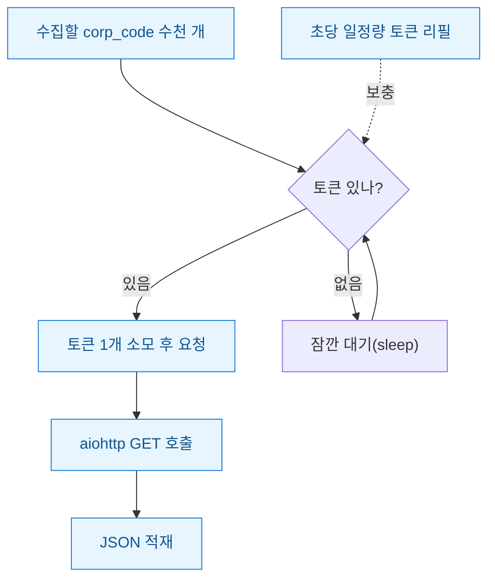
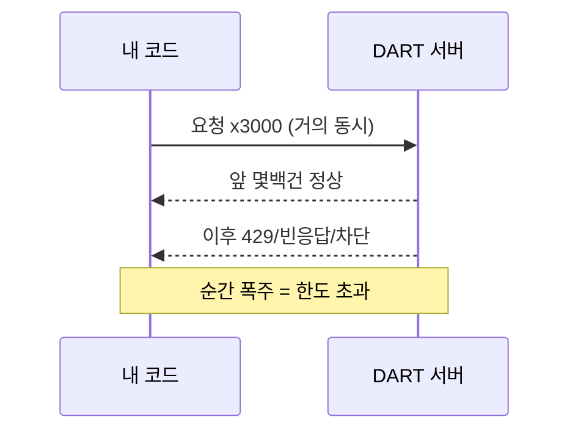
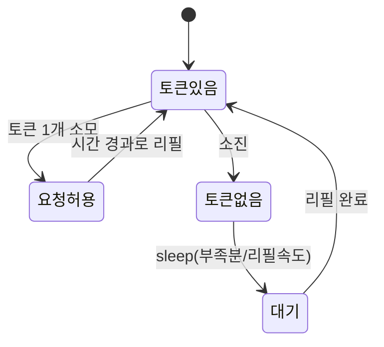

DART OpenAPI(금융감독원 전자공시 시스템이 공개하는 API)로 상장사 공시 목록을 몇천 건씩 긁어야 할 일이 있었다. 처음엔 단순하게 생각했다. asyncio(파이썬 비동기 라이브러리)로 수천 개 요청을 한 번에 던지면 순식간에 끝날 줄 알았다. 그런데 몇 분 못 가서 응답이 이상해졌다. 빈 JSON, 타임아웃, 그리고 한도 초과 메시지. 속도를 욕심냈다가 오히려 전체 수집이 멈춘 셈이다.

문제는 명확했다. **"빠르게 긁고 싶다"와 "분당 호출 한도를 넘으면 안 된다"가 정면 충돌**한다는 것. 이 둘을 동시에 만족시키려면 요청을 무작정 쏟아내는 게 아니라, 흐르는 물처럼 일정 속도로 흘려보내는 장치가 필요했다. 그래서 직접 `APIRateLimiter` 클래스를 만들었다.

> 공개 DART/더미 데이터 기준의 구조 예시다. 회계판단·투자권유가 아니며 특정 기업 수치를 단정하지 않는다.



## 왜 그냥 gather로 다 던지면 안 됐나?

`asyncio.gather`에 태스크 수천 개를 넣으면, 비동기라서 거의 동시에 출발한다. 문제는 이게 **버스트(burst, 순간적으로 몰리는 요청 폭주)**를 만든다는 것이다. 서버 입장에선 1초 안에 수천 발이 날아온 셈이라 방어적으로 끊어버린다.



핵심은 **"총량"이 아니라 "속도"가 문제**라는 점이다. 하루에 만 건을 나눠 쓰는 건 괜찮아도, 그 만 건을 1분에 몰아 쓰면 막힌다. 그러니 필요한 건 동시 연결 수 제한(세마포어)만이 아니라 **단위 시간당 호출 속도를 강제하는 장치**였다.

## 토큰버킷이 뭐고 왜 딱 맞나?

토큰버킷(token bucket)은 이름 그대로다. **양동이에 토큰을 일정 속도로 채워 넣고, 요청 한 번에 토큰 하나를 꺼내 쓰는** 방식이다. 토큰이 없으면 채워질 때까지 기다린다. 분당 한도가 900이면 초당 15개씩 채우는 식으로 환산한다.

이 방식이 좋은 이유는 **평소엔 쌓인 토큰만큼 빠르게 나가고(버스트 허용), 길게 보면 평균 속도가 한도 안에 갇힌다**는 점이다. 딱딱하게 "1초에 1개"로 고정하는 것보다 유연하면서 안전하다.



## can_make_request를 어떻게 짰나?

경과 시간에 리필 속도를 곱해 토큰을 채우고, 1개 이상이면 소모하고 참을 돌려준다. 여러 코루틴이 동시에 건드리므로 `asyncio.Lock`으로 감싼다. 시계는 `time.monotonic`(뒤로 안 가는 단조 시계)을 써서 시스템 시간 변경에 흔들리지 않게 했다.

```python
import asyncio, time

class APIRateLimiter:
    def __init__(self, max_per_minute: int = 900):
        self.capacity = max_per_minute
        self.tokens = float(max_per_minute)
        self.refill_rate = max_per_minute / 60.0  # 초당 채워지는 토큰
        self.updated = time.monotonic()
        self._lock = asyncio.Lock()

    def _refill(self):
        now = time.monotonic()
        self.tokens = min(self.capacity,
                          self.tokens + (now - self.updated) * self.refill_rate)
        self.updated = now

    async def can_make_request(self) -> bool:
        async with self._lock:
            self._refill()
            if self.tokens >= 1:
                self.tokens -= 1
                return True
            return False

    async def acquire(self):
        while True:
            async with self._lock:
                self._refill()
                if self.tokens >= 1:
                    self.tokens -= 1
                    return
                wait = (1 - self.tokens) / self.refill_rate  # 부족분 채울 시간
            await asyncio.sleep(wait)  # 락 밖에서 대기해야 다른 코루틴이 안 막힘
```

한 가지 놓치기 쉬운 함정이 있었다. `sleep`을 **락 안에서** 하면 대기하는 동안 다른 코루틴까지 전부 멈춘다. 그래서 대기 시간만 계산하고 락을 푼 뒤에 `sleep`을 걸었다. 이걸 안 지키면 비동기인데도 사실상 한 줄로 줄 서는 꼴이 된다.

## aiohttp 세션엔 어떻게 물렸나?

수집 함수에서 세마포어(동시 연결 수 상한)와 리미터(분당 속도)를 함께 건다. 세마포어는 "동시에 몇 개까지 연결하냐", 리미터는 "얼마나 빠르게 새 요청을 내보내냐"를 맡는다. 역할이 다르니 둘 다 필요하다.

```python
import aiohttp

BASE = "https://opendart.fss.or.kr/api/list.json"

async def fetch(session, limiter, sem, corp_code, key):
    async with sem:               # 동시 연결 수 제한
        await limiter.acquire()   # 분당 호출 속도 제한
        params = {"crtfc_key": key, "corp_code": corp_code}
        async with session.get(BASE, params=params) as resp:
            return corp_code, await resp.json()

async def collect(corp_codes, key):
    limiter = APIRateLimiter(max_per_minute=900)
    sem = asyncio.Semaphore(20)
    async with aiohttp.ClientSession() as session:
        tasks = [fetch(session, limiter, sem, c, key) for c in corp_codes]
        return await asyncio.gather(*tasks)
```


## 실제로 돌려보니 뭘 배웠나?

한도 값은 **실제 문서 기준보다 넉넉히 낮춰 잡는 게** 마음 편했다. 재시도나 네트워크 흔들림까지 감안하면 이론상 최대치에 딱 붙이는 순간 경계에서 터진다.

| 구분 | 넣기 전 | 리미터 적용 후 |
|---|---|---|
| 초반 응답 | 빠르지만 곧 차단 | 꾸준히 성공 |
| 한도 초과 | 자주 발생 | 사실상 없음 |
| 전체 완주 | 중간에 멈춤 | 끝까지 수집 |
| 속도 | 겉보기만 빠름 | 안정적으로 더 빠름 |

역설적이지만 **속도를 줄였더니 전체는 더 빨라졌다.** 막혀서 처음부터 다시 긁는 것보다, 한 번에 안전하게 완주하는 게 결국 이득이었다.

정리하면 비동기 수집의 핵심은 "얼마나 많이 던지냐"가 아니라 "얼마나 고르게 흘려보내냐"다. 토큰버킷 리미터 하나로 그 흐름을 손에 쥘 수 있었다. 다음엔 여기에 429 응답을 만났을 때 리필 속도를 자동으로 낮추는 **적응형(adaptive) 백오프**를 붙여볼 생각이다.
