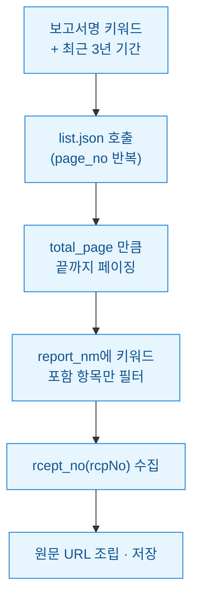

회계 실무를 돕다 보면 "특정 유형 공시만 여러 회사에서 한꺼번에 모아줘"라는 부탁을 자주 받는다. 예를 들어 "유상증자 결정"이나 "주식매수선택권 부여" 같은 보고서를 최근 3년치로 긁어와 목록으로 달라는 식이다. 처음엔 DART 전자공시 사이트(dart.fss.or.kr)에서 검색어 넣고 한 페이지씩 눌러 복사했다. 스무 건쯤 하다 손목이 아파서 "이거 API로 자동화하자" 하고 마음먹었다.

그런데 막상 DART OpenAPI(금융감독원이 공개한 공시 조회용 오픈API) 문서를 열어보니 내가 기대한 "보고서명 키워드" 검색 파라미터가 없었다. 이 글은 그 함정을 어떻게 우회했는지, 기간과 유형으로 목록을 받아 보고서명으로 직접 필터링하는 파이프라인을 만든 기록이다.

> 공개 DART/더미 데이터 기준이며, 특정 기업의 회계판단·투자권유가 아니다.



## 왜 키워드 파라미터를 찾다 포기했나?

DART 공시검색 엔드포인트(`https://opendart.fss.or.kr/api/list.json`)가 받는 파라미터를 보면 기간(`bgn_de`, `end_de`), 회사코드(`corp_code`), 공시유형(`pblntf_ty`), 페이지(`page_no`, `page_count`) 정도다. **보고서명 자체를 문자열로 검색하는 인자는 없다.** 웹사이트 검색창이 되니 API도 되겠거니 했는데 착각이었다.

대신 응답의 각 항목에 `report_nm`(보고서명)이 들어온다. 그래서 전략을 바꿨다. **기간으로 목록을 통째로 받아온 뒤, 보고서명에 내 키워드가 들어있는 것만 파이썬에서 걸러내는** 방식이다. 서버가 안 해주면 내가 하면 된다.

```python
import requests

BASE = "https://opendart.fss.or.kr/api/list.json"

def fetch_page(key, bgn, end, page_no, page_count=100):
    params = {
        "crtfc_key": key,      # 발급받은 인증키(YOUR_API_KEY)
        "bgn_de": bgn,         # 시작일 YYYYMMDD
        "end_de": end,         # 종료일 YYYYMMDD
        "page_no": page_no,
        "page_count": page_count,  # 최대 100
    }
    r = requests.get(BASE, params=params, timeout=10)
    return r.json()
```

`page_count`는 한 번에 최대 100건까지다. 100건 넘게 달라고 해도 100만 온다. 그래서 페이징이 필수다.

## 페이지를 어떻게 끝까지 넘길까?

첫 호출의 응답에 `total_page`(전체 페이지 수)와 `total_count`(전체 건수)가 같이 온다. 이걸 먼저 읽고 `page_no`를 1부터 `total_page`까지 돌리면 된다. 최근 3년처럼 기간이 길면 수천 건이라 열 몇 페이지가 넘어가기도 한다.

```mermaid
sequenceDiagram
  participant P as 파이프라인
  participant D as DART API
  P->>D: page_no=1 요청
  D-->>P: list + total_page(예 12)
  loop page_no 2..total_page
    P->>D: 다음 page 요청
    D-->>P: list 100건
    Note over P: report_nm 키워드 필터
  end
  P->>P: 필터링된 rcept_no 누적
```



여기서 실수한 게 하나 있다. 처음엔 `total_page`를 안 읽고 "데이터 없음"이 나올 때까지 무작정 돌렸다. 그런데 조회 결과가 비면 DART는 빈 리스트가 아니라 **상태코드 `013`("조회된 데이터가 없습니다")** 을 준다. 이걸 오류로 처리하면 멀쩡한 종료 조건을 예외로 착각한다. `status` 필드를 먼저 보고 흐름을 갈라야 했다.

```python
def crawl(key, bgn, end, keyword):
    hits = []
    first = fetch_page(key, bgn, end, 1)
    if first.get("status") != "000":
        return hits  # 013(무자료) 포함 — 그냥 빈 결과로 종료
    total_page = int(first["total_page"])
    for pno in range(1, total_page + 1):
        data = first if pno == 1 else fetch_page(key, bgn, end, pno)
        for item in data.get("list", []):
            if keyword in item["report_nm"]:      # 보고서명 필터
                hits.append({
                    "corp": item["corp_name"],
                    "report": item["report_nm"],
                    "rcpNo": item["rcept_no"],     # 접수번호
                    "date": item["rcept_dt"],
                })
    return hits
```

## rcpNo로 원문까지 어떻게 잇나?

필터를 통과한 항목마다 `rcept_no`(접수번호, 흔히 rcpNo라 부르는 14자리 식별자)가 붙어온다. 이게 공시 한 건을 가리키는 열쇠다. 이 번호를 원문 뷰어 주소에 끼우면 사람이 눈으로 볼 수 있는 링크가 완성된다.

```python
def viewer_url(rcp_no):
    return f"https://dart.fss.or.kr/dsaf001/main.do?rcpNo={rcp_no}"
```

목록만 있으면 "그래서 어느 공시야?"에 답을 못 한다. rcpNo까지 챙겨야 나중에 원문 XBRL(재무제표를 태그로 구조화한 표준 포맷)이나 첨부문서로 한 단계 더 파고들 수 있다. 나는 여기서 멈추지 않고 rcpNo를 키로 CSV에 적재해, 다음 단계 재무 추출 파이프라인이 그대로 이어받게 했다.

## 레이트리밋에 안 걸리려면?

DART OpenAPI는 인증키당 하루 호출 한도가 있다. 페이징으로 수백 번 때리다 보면 생각보다 빨리 소진된다. 그래서 두 가지를 넣었다. 하나는 **호출 사이에 짧은 지연**을 둬서 서버를 몰아붙이지 않는 것, 다른 하나는 **상태코드로 상황을 분기**하는 것이다.

| status | 뜻 | 내 처리 |
|---|---|---|
| 000 | 정상 | 계속 진행 |
| 013 | 조회 데이터 없음 | 정상 종료(예외 아님) |
| 020 | 요청 제한 초과 | 대기 후 재시도 또는 중단 |
| 100 | 필드 부적절 | 파라미터 점검 |
| 800 | 시스템 점검 | 나중에 재실행 |

```python
import time

def polite_fetch(key, bgn, end, page_no, retry=3):
    for _ in range(retry):
        data = fetch_page(key, bgn, end, page_no)
        st = data.get("status")
        if st == "020":          # 요청 제한 — 잠시 쉬고 재시도
            time.sleep(60)
            continue
        return data
    return {"status": "020", "list": []}
```

`020`을 만나면 무한 재시도로 몰아붙이지 말고 한 번 쉬었다 다시 붙는 게 예의다. 공개 API라고 해도 남의 서버다. robots·이용약관·호출 한도를 지키는 선에서만 자동화한다.

## 마무리

정리하면 이 파이프라인의 핵심은 **"서버가 키워드 검색을 안 해주니 기간으로 넓게 받아 내가 보고서명으로 좁힌다"** 한 줄이다. 페이징은 `total_page`로 끝을 잡고, 종료 조건인 `013`을 오류와 헷갈리지 않고, rcpNo를 반드시 챙겨 원문까지 이을 여지를 남긴다.

다음엔 여기서 모은 rcpNo를 재무제표 XBRL 조회 API로 넘겨, 공시 목록에서 곧장 숫자(자본금·매출·부채)까지 자동으로 뽑는 두 번째 단계를 붙일 생각이다. 목록 수집은 그 재료를 캐는 삽질일 뿐이고, 진짜 재미는 그다음에 있다.
