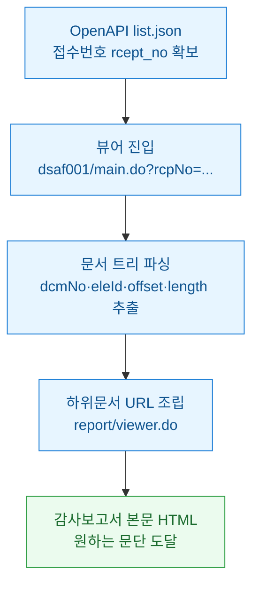
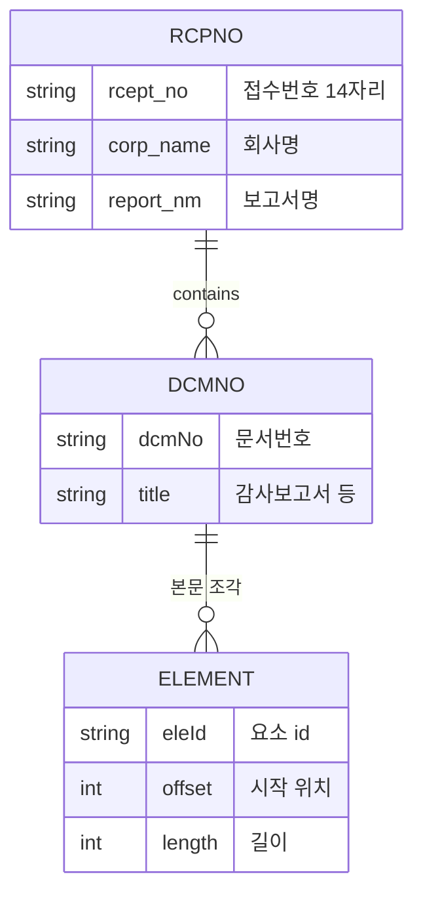
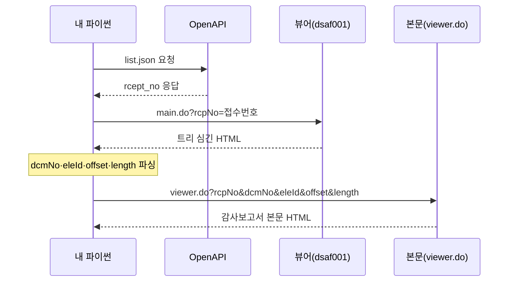
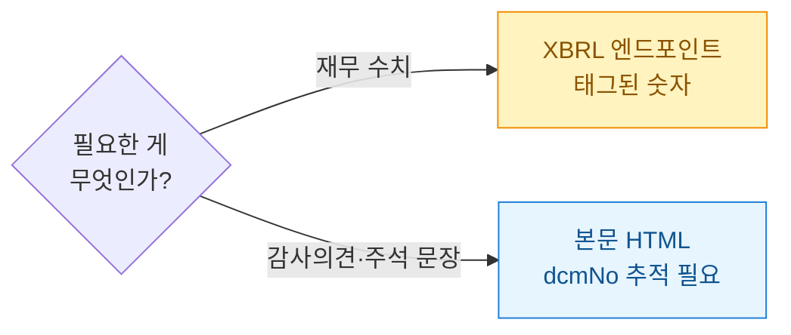

회계 자동화를 만지다 보면 꼭 한 번은 벽을 만난다. DART(전자공시시스템) OpenAPI로 "이 회사 최근 사업보고서 접수번호"까지는 잘 뽑았다. 그런데 정작 필요한 건 그 안에 파묻힌 **감사보고서 본문 한 조각**이었다. 접수번호(rcept_no)를 아무리 들고 있어도 감사의견 문단으로 바로 못 간다. 처음엔 내가 URL을 잘못 만든 줄 알았다. 삽질하다 깨달은 건, DART에는 번호가 **두 층위**로 존재한다는 사실이었다. 접수번호(rcpNo)와 문서번호(dcmNo). 이 둘을 구분 못 하면 영원히 뷰어 첫 화면만 긁게 된다.

> 공개 DART / 더미 데이터 기준의 방법론 정리다. 특정 기업의 회계판단·감사의견·투자권유가 아니다.

## 접수번호에서 본문까지, 전체 경로가 어떻게 되나?

먼저 목적지까지의 지도를 그려놓고 시작한다. 접수번호 하나가 본문 조각 하나로 좁혀지는 깔때기 구조다.



핵심은 가운데 두 단계다. **뷰어에 들어가야만 문서 트리가 나오고**, 그 트리에서 dcmNo를 캐야 본문 URL을 만들 수 있다. OpenAPI만으로는 이 두 칸을 건너뛸 수 없다.

## rcpNo와 dcmNo, 도대체 뭐가 다른가?

비유하자면 접수번호(rcpNo)는 **택배 송장번호**고, 문서번호(dcmNo)는 그 박스 안에 든 **개별 물건의 품번**이다. 사업보고서 하나를 접수하면 rcpNo는 딱 하나 붙는다. 그런데 그 안에는 재무제표, 주석, 감사보고서, 내부회계관리제도 검토의견 같은 하위 문서가 여러 개 들어 있다. 각각에 dcmNo가 따로 매겨진다.

| 구분 | rcpNo (접수번호) | dcmNo (문서번호) |
|---|---|---|
| 정체 | 공시 접수 1건의 식별자 | 그 안 하위 문서 1개의 식별자 |
| OpenAPI 필드명 | rcept_no | (제공 안 됨) |
| 개수 | 공시당 1개 | 공시당 여러 개 |
| 얻는 곳 | list.json 응답 | 뷰어 페이지 트리 |
| 자릿수 | 14자리 (날짜+일련) | 보통 8자리 안팎 |

내가 헤맨 지점이 바로 여기였다. **dcmNo는 OpenAPI 응답 어디에도 없다.** 뷰어 HTML을 열어봐야 등장한다. 그래서 "API만으로 본문까지"는 애초에 불가능한 설계였던 거다.

데이터 모델로 보면 관계가 선명하다.



한 접수건(RCPNO)이 여러 문서(DCMNO)를 품고, 한 문서가 다시 여러 본문 조각(ELEMENT)으로 쪼개진다. **eleId·offset·length**(요소 id와 원문 내 시작 위치·길이)까지 있어야 감사의견 문단만 콕 집어 부를 수 있다.

## 뷰어 페이지에서 dcmNo를 어떻게 캐내나?

DART 뷰어는 첫 화면 HTML 안에 자바스크립트로 문서 트리를 심어둔다. 왼쪽 목차를 클릭하면 그 조각을 불러오는 방식이다. 그래서 나는 뷰어 HTML을 받아서 트리 설정값을 정규식으로 긁어냈다. 시간순으로 보면 이런 왕복이다.



파싱은 이런 식이었다. 뷰어 HTML에는 `viewDoc(...)` 같은 함수 호출이나 트리 배열이 들어 있어서 인자를 순서대로 뽑아낸다.

```python
import re
import requests

# 1) 뷰어 페이지 진입 (rcpNo = OpenAPI에서 받은 접수번호)
rcp_no = "20250101000001"  # 더미 접수번호
base = "https://opendart.fss.or.kr"  # 예시용, 실제 호스트는 문서 참고
html = requests.get(
    "https://dart.fss.or.kr/dsaf001/main.do",
    params={"rcpNo": rcp_no}, timeout=10
).text

# 2) 트리에 심긴 하위문서 인자 추출 (dcmNo·eleId·offset·length·dtd)
#    viewDoc('20250101000001','12345678','...','0','54321','dart4.xsd') 형태
pat = re.compile(
    r"viewDoc\('(?P<rcp>\d+)','(?P<dcm>\d+)','(?P<ele>[^']*)',"
    r"'(?P<off>\d+)','(?P<len>\d+)','(?P<dtd>[^']*)'\)"
)
docs = [m.groupdict() for m in pat.finditer(html)]

# 3) 원하는 문서(예: 감사보고서)만 골라 본문 URL 조립
for d in docs:
    url = (
        "https://dart.fss.or.kr/report/viewer.do"
        f"?rcpNo={d['rcp']}&dcmNo={d['dcm']}"
        f"&eleId={d['ele']}&offset={d['off']}&length={d['len']}&dtd={d['dtd']}"
    )
    print(url)
```

여기서 배운 것 하나. **문서 제목은 트리에서 dcmNo와 짝지어 따로 잡아야** "감사보고서"인지 "재무제표"인지 구분이 된다. 처음엔 첫 번째 dcmNo를 무작정 감사보고서로 가정했다가, 회사마다 목차 순서가 달라서 엉뚱한 문서를 긁었다. 제목 텍스트로 매칭하는 게 안전하다.

## 왜 한 번에 안 긁히고 계속 막혔나?

세 가지에서 넘어졌고, 각각이 교훈이었다.

첫째, **OpenAPI와 뷰어는 호스트·성격이 다르다.** OpenAPI(opendart.fss.or.kr)는 인증키로 JSON을 주는 데이터 창구고, 뷰어(dart.fss.or.kr)는 사람이 보는 HTML 화면이다. 나는 둘을 같은 파이프라인의 연속으로 봤지만, 실제론 "구조화 데이터 → 화면 스크래핑"으로 성격이 바뀌는 이음매였다.

둘째, **레이트리밋.** OpenAPI는 키당 분당 호출 한도가 있다. 뷰어·본문 요청은 API가 아니라 웹페이지라 무차별로 때리면 차단당한다. 나는 접수번호 목록을 돌릴 때 요청 사이에 간격을 두고, 이미 받은 뷰어 HTML은 로컬에 캐시해서 재파싱했다. 같은 rcpNo를 두 번 부를 이유가 없다.

셋째, **XBRL과 본문 HTML을 헷갈렸다.** OpenAPI에는 재무제표를 XBRL(재무데이터를 태그로 구조화한 표준 포맷)로 주는 별도 엔드포인트가 있다. 숫자만 필요하면 그쪽이 훨씬 깔끔하다. 하지만 나처럼 **감사의견 문장이나 주석 서술**이 필요하면 XBRL로는 안 되고 본문 HTML까지 내려가야 한다. 목적이 "숫자"냐 "문장"이냐로 경로가 완전히 갈린다.



## 정리하면

접수번호(rcpNo)는 봉투, 문서번호(dcmNo)는 봉투 속 낱장이다. OpenAPI는 봉투까지만 알려주고, 낱장 번호는 뷰어 화면을 열어야 나온다. 그래서 감사보고서 본문에 도달하려면 **뷰어 HTML을 한 번 거쳐 트리를 파싱하는 우회**가 반드시 필요했다. 이 이음매를 인정하고 나니 그 뒤론 막힘이 없었다.

다음엔 이렇게 뽑은 감사보고서 본문에서 감사의견 유형(적정·한정·부적정·의견거절)을 규칙 기반으로 분류하는 파이프라인을 정리해볼 생각이다. 크롤링 성격의 요청 구간이 섞이니 robots·이용약관·레이트리밋은 늘 지키는 선에서.
