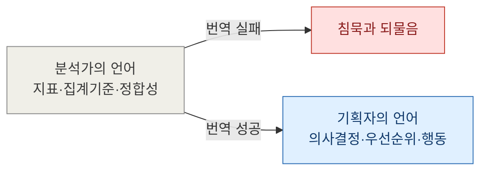
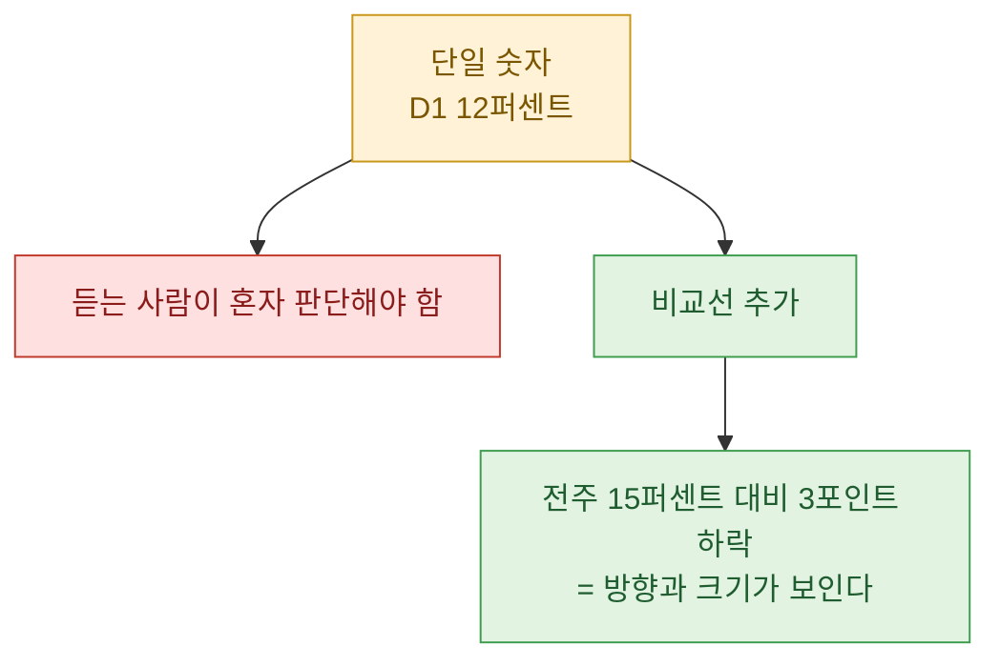
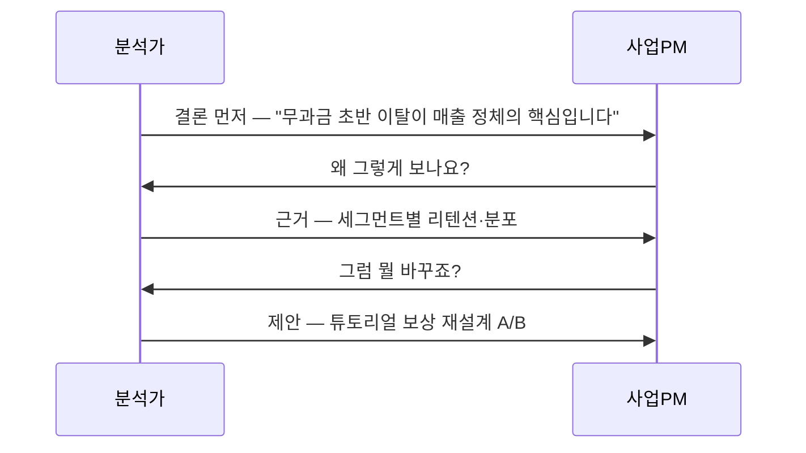
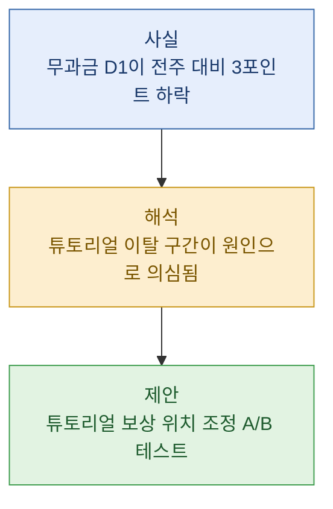

> 리텐션이 12퍼센트라고 말했더니 회의실이 조용해졌다. 숫자는 맞았다. 그런데 아무도 뭘 해야 할지 몰랐다.

나는 데이터 분석가다. 하루의 대부분을 SQL과 대시보드 앞에서 보내지만, 실제로 내 성과가 결정되는 순간은 따로 있다. 뽑아낸 숫자를 사업PM이나 기획자 앞에 내려놓는 5분. 그 5분에서 상대가 "그래서 뭘 하면 되죠?"라고 되물으면 나는 그날의 분석을 절반쯤 망친 거다. 오늘은 내가 지난 몇 년간 반복해서 저질렀고, 지금도 종종 미끄러지는 다섯 가지 전달 안티패턴을 기록해 둔다. 다 겪어본 실수라 부끄럽지만, 부끄러운 만큼 잘 안 잊힌다.

## 왜 정확한 숫자가 오히려 대화를 망칠까?

먼저 짚고 싶은 건, 문제가 "숫자가 틀려서"가 아니라 "숫자가 맞아서 안심했기 때문"이라는 점이다. 나는 오랫동안 정확도만 신경 썼다. 코호트를 제대로 잘랐는지, 집계 기준일이 어긋나지 않았는지. 그런데 상대는 내 쿼리의 정합성에 관심이 없다. 그들은 다음 스프린트에 무엇을 바꿔야 하는지가 궁금하다.

분석가의 머릿속과 기획자의 머릿속은 사실 다른 언어를 쓴다.

이 "번역"에서 미끄러지는 지점이 대개 정해져 있다. 하나씩 풀어 본다. 참고로 이 글에 등장하는 모든 수치와 상황은 설명을 위한 더미 예시다.

## 패턴 1 — 지표 이름을 정의 없이 던진다

가장 흔한 실수다. 나는 "재구매율이 낮다"고 말하고, 상대는 고개를 끄덕인다. 그런데 그 순간 우리 둘의 머릿속 정의가 다를 확률이 아주 높다.

- 나는 "구매 경험자 중 30일 내 다시 산 사람 비율"을 생각했는데,
- PM은 "전체 유저 중 두 번 이상 산 사람 비율"을 떠올린다.

같은 단어, 다른 분모. 이렇게 되면 이후 대화 전체가 어긋난 채로 진행된다. 특히 ARPU와 ARPPU처럼 분모가 다른 형제 지표는 이 사고가 자주 난다. ARPU는 전체 유저로 나눈 값이고 ARPPU는 과금 유저로만 나눈 값인데, 이름이 한 글자 차이라 말로 하면 섞인다.

교정법은 단순하다. 지표를 부를 때 한 호흡에 정의를 붙인다. "재구매율, 그러니까 한 번이라도 산 사람 중에 30일 안에 또 산 비율은 지금 8퍼센트예요." 정의를 붙이는 데 드는 건 5초, 안 붙여서 생기는 오해는 반나절이다.

| 이렇게 말하면(안티패턴) | 이렇게 말한다(교정) |
|---|---|
| "재구매율이 낮아요" | "구매자 중 30일 내 재구매가 8퍼센트예요" |
| "ARPPU가 떨어졌어요" | "과금 유저 1인당 결제액이 지난달보다 줄었어요" |
| "리텐션이 안 좋아요" | "가입 다음날 다시 접속한 비율이 어제 코호트에서 12퍼센트예요" |

## 패턴 2 — 맥락 없는 단일 숫자를 툭 놓는다

"D1 리텐션 12퍼센트입니다." 이 문장은 정보가 아니라 퀴즈다. 듣는 사람은 곧바로 세 가지를 스스로 계산해야 한다. 이게 높은 건가 낮은 건가, 지난주 대비 어떤가, 이게 문제이긴 한가.

숫자 하나는 좌표가 없으면 의미가 없다. 나는 이걸 "비교 대상을 함께 얹는다"는 원칙으로 정리했다. 단일 값 대신 최소한 하나의 기준선을 붙인다. 전주 대비든, 다른 세그먼트 대비든, 목표 대비든.

과금/무과금 플래그 하나만 얹어도 맥락이 확 살아난다. "전체 리텐션은 12퍼센트인데, 과금 유저만 보면 40퍼센트, 무과금은 9퍼센트예요." 이렇게 쪼개는 순간 대화는 "리텐션이 낮다"에서 "무과금 초반 이탈을 어떻게 잡을까"로 넘어간다. 세그먼트는 그 자체로 훌륭한 비교선이다.

## 패턴 3 — 분포를 평균 하나로 뭉갠다

평균은 편하지만 위험하다. 특히 과금 데이터처럼 한쪽으로 심하게 쏠린 분포에서는 평균이 거짓말을 한다. 예를 들어 과금 유저 1인당 평균 결제액이 3만 원이라고 하자. 듣는 사람은 "다들 3만 원쯤 쓰는구나" 상상한다. 실제로는 대부분 5천 원 이하이고, 소수의 고액 결제자가 평균을 끌어올린 것일 수 있다.

이럴 때 나는 도수분포, 즉 "구간별로 몇 명이 몰려 있는지"를 함께 보여준다. 결제액을 몇 개 구간으로 잘라 인원을 세는 것만으로 그림이 완전히 달라진다.

| 결제 구간(더미) | 유저 수 | 비중 |
|---|---|---|
| 5천 원 이하 | 620명 | 62% |
| 5천~3만 원 | 250명 | 25% |
| 3만~10만 원 | 100명 | 10% |
| 10만 원 초과 | 30명 | 3% |

이 표를 보면 "평균 3만 원"이 얼마나 오해를 부르는지 즉시 보인다. 상위 3퍼센트가 매출의 큰 몫을 지고 있고, 정책의 초점은 그 소수를 지키는 쪽과 하위 62퍼센트를 끌어올리는 쪽으로 갈린다. 평균 하나였다면 나오지 않았을 논의다. 나는 이제 쏠린 지표를 보고할 땐 습관적으로 중앙값과 분포를 같이 챙긴다.

## 패턴 4 — 결론 대신 과정을 먼저 말한다

이건 순전히 분석가의 직업병이다. 나는 내가 얼마나 고생했는지 알아주길 바라는 마음에, 조인을 어떻게 걸었고 이상치를 어떻게 걸렀는지부터 설명한다. 그러는 동안 PM의 눈은 이미 풀려 있다.

바쁜 의사결정자에게는 결론을 먼저, 근거를 나중에 주는 순서가 맞다. 신문 헤드라인처럼 첫 문장에 핵심을 박고, 궁금해하면 그때 방법론을 편다.

순서만 뒤집었을 뿐인데 대화의 주도권이 생긴다. 상대가 "왜?"라고 물어봐 줄 때 근거를 꺼내면, 같은 내용도 훨씬 설득력 있게 꽂힌다. 묻지도 않았는데 쏟아낸 방법론은 소음이지만, 물어본 뒤 나온 방법론은 신뢰다.

## 패턴 5 — 숫자만 주고 행동을 비워둔다

마지막이자 가장 뼈아픈 패턴이다. 나는 오랫동안 "판단은 기획의 몫이고 나는 사실만 전한다"고 스스로를 방어했다. 그런데 데이터를 가장 오래 들여다본 사람은 나다. 그런 내가 해석을 비워두면, 정작 데이터를 덜 본 사람이 감으로 결론을 채운다. 그게 더 위험하다.

숫자는 반드시 "그래서 무엇을 하자"는 문장까지 끌고 가야 대화가 완성된다. 나는 보고를 이 세 층 구조로 정리하는 습관을 들였다.

물론 제안은 어디까지나 제안이다. 최종 결정은 PM이 한다. 하지만 "제 해석은 이렇고, 이런 실험을 제안한다"까지 말해두면, 상대는 그걸 받아들이든 반박하든 곧바로 다음 행동으로 움직인다. 반대할 근거가 생기는 것조차 진전이다. 숫자만 던지고 침묵하는 것보다 백 배 낫다.

## 마무리

다섯 패턴을 다시 줄이면 한 문장이다. "정확한 숫자를 넘어, 상대가 곧바로 움직일 수 있는 형태로 번역하라." 정의를 붙이고, 비교선을 얹고, 분포를 보여주고, 결론을 먼저 말하고, 행동까지 끌고 간다. 어느 것도 어려운 SQL이 아니다. 전부 말하는 순서와 태도의 문제다.

솔직히 나는 지금도 회의 중에 신나서 조인 얘기부터 꺼내다 상대 표정을 보고 정신 차릴 때가 있다. 그래도 예전보다 나아진 건, 분석이 끝났을 때 "이제 절반 남았다"고 생각하게 된 점이다. 쿼리를 다 짠 순간이 끝이 아니라, 그 결과를 옆자리 기획자가 자기 언어로 다시 말할 수 있게 됐을 때가 진짜 끝이다. 데이터는 전달되는 순간에만 일을 한다.

## 참고자료

- [[game-metrics-7-definitions]] — 헷갈리는 핵심 지표 정의부터 맞추기
- [[arpu-vs-arppu]] — 분모가 다른 형제 지표, 말로 하면 섞이는 이유
- [[cohort-m1-retention-sql]] — 코호트와 리텐션을 SQL로 자르는 법
- [[retention-curve-beyond-m1]] — 단일 리텐션값을 곡선과 세그먼트로 확장하기
- [[revenue-simulation-dau-pu-arppu]] — 예상매출 = DAU × PU% × ARPPU 분해로 대화하기
- [[game-data-sql-recipes-retention-ltv]] — 리텐션·LTV 레시피 모음
- game-data-recipes 저장소(합성 데이터 SQL 레시피): https://github.com/DBhyeong/game-data-recipes

<!-- 안전: 합성/더미 데이터, 회사·실데이터·PII 없음. -->
