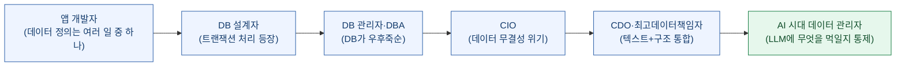
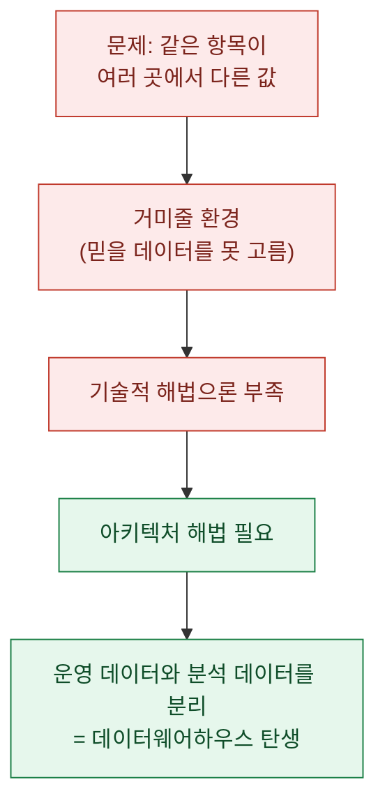
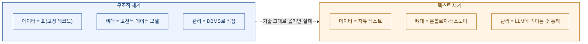
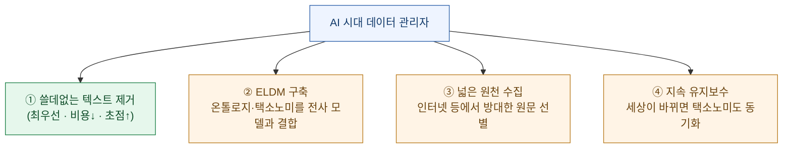
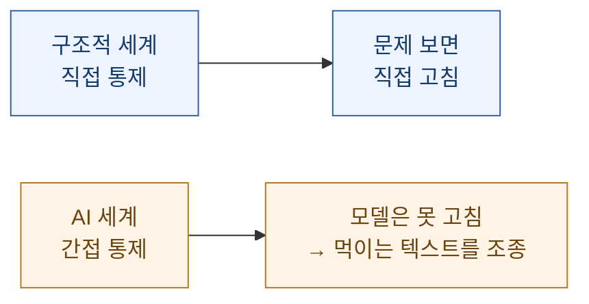

붙여준 글은 **빌 인먼(Bill Inmon)**이 2026년 7월 6일 자신의 Substack에 올린 *"Data Management in the Age of AI"*(제이미 놀스 기여)다. 인먼은 1990년대에 **데이터웨어하우스** 개념을 정리한, 이 분야에서 '아버지'로 불리는 사람이다. 그가 컴퓨터 산업 초창기부터 생성 AI 시대까지 **데이터 관리의 역할이 어떻게 변해왔는지**를 한 편으로 훑었다.

데이터 분석·자동화를 업으로 하는 입장에서 이 글은 남 얘기가 아니었다. 그래서 원문을 그대로 옮기는 대신, **요약하고 내 실무에 걸리는 지점까지 되짚어** 정리했다. (아래 요약·해석은 내 것이고, 원문 주장은 인먼의 것이다. 몇몇 수치는 그의 추정이라 끝에 따로 표시했다.)

## 한눈에 — 데이터 관리자의 역할은 어떻게 커졌나

인먼의 이야기는 결국 **"데이터를 돌보는 사람의 자리가 어떻게 올라갔는가"**의 역사다.

처음엔 데이터 정의가 개발자의 **여러 잡무 중 하나**였다. 트랜잭션 처리가 등장하면서 응답시간·가용성·정합성을 감당할 **DB 설계자**가 필요해졌고, DB가 폭증하자 **DBA**가, 데이터 무결성 위기가 오자 **CIO**가, 텍스트와 구조를 함께 봐야 하면서 **CDO**가 생겼다. 그리고 생성 AI 시대엔 성격이 또 달라진다. 이 글의 핵심 문장은 맨 앞에 있다 — **"AI가 믿을 만한 데이터로 돌지 않으면, AI가 내놓는 분석은 죄다 의심스럽다."**

## 데이터 관리는 왜 '기술직'에서 '전략'이 됐나?

인먼은 결정적 전환점으로 **데이터 무결성 위기**를 짚는다. 트랜잭션 시스템이 홍수처럼 늘자, 같은 데이터 항목이 여기저기 흩어져 **저마다 다른 값**을 갖게 됐다. 문제는 '데이터가 없는 것'이 아니라 **'어느 데이터를 믿어야 하는지 모르는 것'**으로 바뀌었다. 그는 이 얽힌 상태를 **거미줄(spider's web)**이라 부른다.

여기서 인먼의 시그니처 주장이 나온다. **"필요한 건 기술적 해법이 아니라 아키텍처 해법이었다."** 그 해법이 **운영 데이터와 분석 데이터의 분리**, 즉 데이터웨어하우스였다. 그리고 이 분리를 이루려면 **데이터 모델**(현재와 미래에 존재할 데이터 유형의 추상화)이 필요했고, 그 흐름에서 **CIO**라는 자리가 태어났다.

## 구조적 데이터 세계에서 데이터 관리자는 무슨 일을 했나?

인먼이 정리한 '구조적 환경(structured)'의 데이터 관리 업무는 이렇다. 여기서 **구조적 데이터**란, DB 안에서 **모든 레코드의 형식이 똑같고 내용만 다른** 데이터를 말한다(표의 세계).

| 업무 | 내용 |
|---|---|
| 데이터 모델 관리 | 비즈니스가 바뀔 때마다(경쟁·법·시장) 모델을 계속 개정 |
| DB 설계 | 정규화 규칙 + 성능을 위한 **비정규화**의 균형 잡기 |
| DDL 작성 | 데이터 모델을 본떠 DB를 정의하는 코드 작성 |
| 용량 계획 | 기계 한계에 언제 도달할지 예측(특히 트랜잭션) |
| 모니터링 | DB 활동량·증가량을 상시 관찰 |

이 세계의 성격을 인먼은 **"매우 직접적(hands-on)"**이라고 표현한다. 관리자가 **고칠 게 보이면 직접 가서 고친다.** 이 '직접 통제'가 뒤에 나올 AI 시대의 '간접 통제'와 대비되는 핵심이다.

## 텍스트가 들어오면 무엇이 달라지나?

인먼은 여기서 판을 키운다. 기업 데이터의 상당수는 표가 아니라 **비정형·텍스트**라는 것이다. 그는 **"기업 데이터의 90%가 텍스트일 수 있다"**고 말한다. (이 90%는 인먼이 오래 인용해 온 **추정치**다. 뒤에서 다시 짚는다.)

문제는, 텍스트에는 **고전적 데이터 모델이 잘 안 맞는다**는 점이다. 그 자리를 대신하는 게 **온톨로지/택소노미(ontology/taxonomy)**다.

인먼이 특히 경고하는 대목 — **구조적 세계의 데이터 모델링 기술을 그대로 텍스트에 갖다 쓰는 것은 심각한 미스핏**이고 성과가 거의 없다. 온톨로지/택소노미는 고전적 데이터 모델과 **역할은 비슷해도 성질이 완전히 다르다**는 것이다.

## 생성 AI 시대, 데이터 관리자의 진짜 일은?

그럼 텍스트·LLM 환경에서 데이터 관리자는 무엇을 하나? 인먼의 답은 놀랍도록 단순하다.

> **"다른 걸 아무것도 못 해도, LLM에 쓸데없는(extraneous) 텍스트가 절대 들어가지 않도록 보장하는 것 하나면 충분하다."**

즉 **원천 텍스트를 LLM에 넣기 전에 검수해, 업무와 무관한 텍스트를 걸러내는 것**이 최우선 업무다. 이유는 두 가지.

1. 쓸데없는 텍스트를 빼면 **처리 비용이 실제로 줄어든다** — 질의를 던질 때마다 달러가 절약된다.
2. 무관한 텍스트를 빼면 **LLM에 초점이 생긴다** — 이 LLM이 무엇을 대표하는지가 분명해진다.

그 위에 데이터 관리자의 나머지 일이 얹힌다.

여기서 인먼의 가장 좋은 비유가 나온다. **꼭두각시(puppet).** 구조적 세계의 관리자는 문제를 **직접** 고쳤지만, AI 세계의 관리자는 **모델을 직접 만질 수 없다.** 대신 **무엇을 먹일지**를 조종한다. 직접 통제가 아니라 **간접 통제**다.

## '중앙화'의 의미가 바뀌었다

마지막으로 인먼이 짚는 변화 하나 — **중앙화(centralization)**. 초창기 중앙화는 **물리적**이었다. 데이터를 큰 메인프레임 한 곳에 모았다. 그런데 데이터가 PC로, 인터넷으로, 사내 시스템으로 **사방에 흩어지자(diaspora)** 물리적 중앙화는 불가능해졌다.

그럴수록 중앙화의 필요는 오히려 커졌는데, **그 무게중심이 물리에서 의미(semantic)로 옮겨갔다.** 인터넷에서 누군가 말한 것과 사내에서 말하는 것이 **같은 뜻인지**를 맞춰야 한다는 것이다. 그 의미적 중앙화를 짊어지는 그릇이 **ELDM(전사 논리 데이터 모델)**이다. 데이터는 여러 물리적 장소에 흩어져 있어도, ELDM이 **'전사적 데이터 이해'를 한 곳에** 담는다.

## 데이터 분석가인 나에겐 어떻게 걸리나?

여기부턴 내 얘기다. 이 글을 읽으며 **내가 최근에 만든 것들과 정확히 겹치는 대목**이 있었다.

- **'쓸데없는 텍스트 제거가 최우선'** — 나는 로컬 파일 수만 개를 검색엔진에 색인하면서, 노이즈·중복·미디어를 **의도적으로 색인에서 뺐다.** 인먼 말대로, 뭘 넣느냐보다 **뭘 안 넣느냐**가 결과 품질을 갈랐다. 셀 내용을 색인에 넣되 전체는 얕게·소수만 깊게 읽는 2계층으로 짠 것도, 결국 **LLM에 먹일 것을 고르는 간접 통제**였다.
- **'직접 통제 → 간접 통제'** — 예전엔 쿼리를 직접 짜서 답을 뽑았다면, 지금은 **LLM이 도구(MCP)로 직접 뒤지게** 해두고 나는 **색인 범위와 검색 규칙**을 조정한다. 딱 인먼의 꼭두각시다. 모델을 못 고치니, 먹이는 것과 뒤지는 방식을 고친다.
- **'의미적 중앙화'** — 파일이 드라이브 여기저기 흩어져 있어도, 같은 개념을 같은 이름으로 묶는 **라우팅 인덱스**를 두면 물리 위치와 무관하게 한 곳에서 찾힌다. ELDM의 축소판인 셈이다.

그러니 이 에세이는 나에게 **"내가 감으로 하던 걸 인먼이 40년 데이터 관리사(史)의 언어로 정리해 준 글"**이었다. 결론 문장 하나만 챙기면 된다 — **AI의 품질은 모델이 아니라 '먹인 데이터'에서 갈린다.**

## 읽을 때 함께 챙길 유보

좋은 글이지만, 사실로 단정하기 전에 붙일 단서도 있다.

- **"기업 데이터의 90%가 텍스트"**는 인먼이 오래 인용해 온 **업계 추정치**다. 방향(비정형이 정형보다 많다)은 널리 받아들여지지만, 90%라는 정확한 값은 출처·정의에 따라 흔들린다. **"대부분이 텍스트"** 정도로 읽는 게 안전하다.
- 글 말미의 **LLM MGMT, LLC**는 '원천 텍스트를 LLM에 넣기 전 정제'를 파는 **인먼 본인의 회사**다. 즉 '쓸데없는 텍스트 제거가 최우선'이라는 주장은 **그의 사업 방향과 맞닿아** 있다. 통찰로 읽되, 이 맥락은 함께 적어두는 게 공정하다.
- 이 글은 **한 전문가의 관점 정리(오피니언)**다. 데이터웨어하우스 진영(인먼) 특유의 프레이밍이 있고, 반대 진영(예: 킴벌 방식)이나 실무 현실에선 다르게 볼 여지도 있다.

그럼에도 큰 그림은 유효하다. 데이터 관리자의 자리는 **기술직에서 전략으로** 올라왔고, 통제는 **직접에서 간접으로** 옮겨갔다. 그리고 AI가 흔해질수록 가치는 **'무엇을 먹일지 고르는 책임'**으로 이동한다 — 이건 어제 다이제스트에서 본 "생성이 흔해질수록 무엇을 존재시킬지 고르는 판단이 귀해진다"와 정확히 같은 결의 이야기다.
