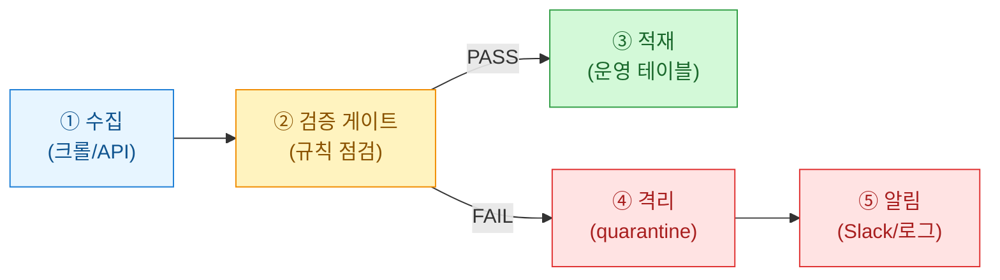
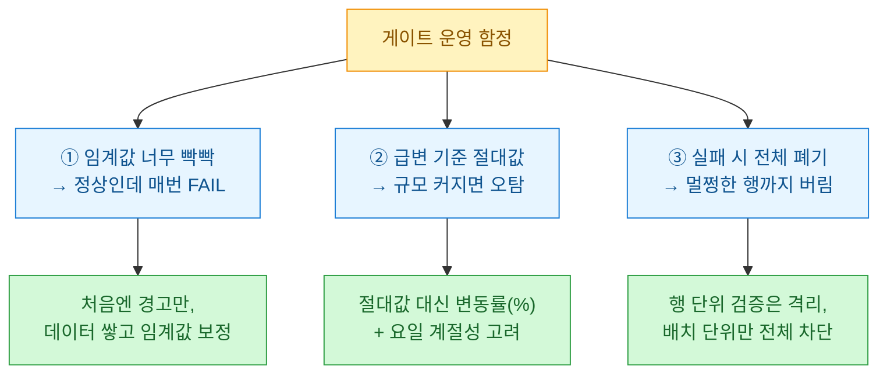

수집 파이프라인을 오래 돌리다 보면 결국 같은 자리에서 데뭉친다. 데이터는 매일 잘 들어오는데, 어느 날 조용히 **망가진 채로(silently broken)** 적재된다. 크롤러가 빈 페이지를 긁어 행 수가 반 토막 나거나, 소스가 컬럼명을 바꿔 필수값이 통째로 `NULL`이 되거나, 어제 100이던 매출이 오늘 3으로 찍혀도 파이프라인은 아무 불평 없이 초록불을 켠다. 그래서 나는 언젠가부터 수집과 적재 사이에 **검증 게이트(validation gate)**를 하나 세워두기로 했다. 오늘은 그 얘기다.

## 왜 "적재 직전"이 검증의 골든존인가?

깨진 데이터를 발견하는 시점은 빠를수록 싸다. 대시보드에서 이상한 숫자를 보고 거슬러 올라가는 건 이미 늦은 데다, 그 사이 잘못된 수치로 의사결정이 나갈 수도 있다. 그래서 검증은 데이터가 DB 문턱을 넘기 **직전**, 아직 되돌리기 쉬운 그 지점에서 하는 게 가장 이득이다.



핵심은 게이트가 **문지기(gatekeeper)**라는 점이다. 통과하지 못한 데이터는 운영 테이블에 절대 못 들어가고, 대신 격리 구역으로 빠져 알림이 뜬다. 파이프라인이 멈추는 게 아니라, "오늘 배치는 의심스러우니 사람이 봐라"라고 손을 드는 구조다.

## 어떤 규칙을 봐야 하나? — 5대 검증 축

검증 규칙은 무한정 늘릴 수 있지만, 실무에서 90%를 잡아주는 다섯 축이 있다. 나는 이걸 표로 정리해두고 새 파이프라인마다 체크리스트처럼 쓴다.

| 검증 축 | 무엇을 잡나 | 대표 증상 | 심각도 |
|---|---|---|---|
| **행 수(row count)** | 수집량 급감/급증 | 크롤러가 빈 페이지 긁음 | 높음 |
| **필수값(not null)** | 핵심 컬럼 누락 | 소스 스키마 변경 | 높음 |
| **범위(range)** | 값이 물리적으로 불가능 | 나이 -5, 확률 1.3 | 중간 |
| **중복(unique)** | 키 중복 적재 | 재실행으로 이중 삽입 | 중간 |
| **전일대비 급변(delta spike)** | 지표가 비정상 등락 | 매출 100→3 | 높음 |

행 수와 필수값은 **"데이터가 있긴 한가"**를 보고, 범위와 중복은 **"각 값이 말이 되나"**를 본다. 마지막 급변 탐지는 앞의 넷을 다 통과해도 남는 미묘한 왜곡, 즉 "형태는 멀쩡한데 어제와 너무 다른" 데이터를 잡아내는 마지막 그물이다.

## 게이트를 어떻게 코드로 세우나?

규칙 하나하나를 `if`로 흩뿌리면 금방 스파게티가 된다. 나는 각 규칙을 **(통과여부, 메시지)를 돌려주는 함수**로 통일하고, 리스트에 담아 순회하는 방식을 쓴다. 규칙을 추가하는 게 리스트에 함수 한 줄 더하는 일이 되도록.

```python
import pandas as pd

# --- 더미 데이터: 오늘 수집분 ---
today = pd.DataFrame({
    "user_id": [1, 2, 3, 3, 5],        # 3이 중복
    "age":     [24, 31, -5, 40, 29],   # -5는 범위 위반
    "revenue": [1200, 950, 3, 1100, 870],
})
yesterday_revenue_sum = 5300   # 어제 매출 합(비교 기준)

def check_rowcount(df, lo=3, hi=100):
    n = len(df)
    ok = lo <= n <= hi
    return ok, f"행 수 {n} (허용 {lo}~{hi})"

def check_notnull(df, cols):
    bad = [c for c in cols if df[c].isna().any()]
    return len(bad) == 0, f"필수값 누락 컬럼: {bad or '없음'}"

def check_range(df, col, lo, hi):
    bad = df[(df[col] < lo) | (df[col] > hi)]
    return bad.empty, f"{col} 범위 위반 {len(bad)}건"

def check_unique(df, key):
    dup = df[key].duplicated().sum()
    return dup == 0, f"{key} 중복 {dup}건"

def check_delta(df, col, base, tol=0.5):
    cur = df[col].sum()
    # 어제 대비 변동률이 tol(50%)을 넘으면 급변으로 간주
    change = abs(cur - base) / base
    return change <= tol, f"{col} 변동률 {change:.0%} (허용 {tol:.0%})"

RULES = [
    lambda d: check_rowcount(d),
    lambda d: check_notnull(d, ["user_id", "age", "revenue"]),
    lambda d: check_range(d, "age", 0, 120),
    lambda d: check_unique(d, "user_id"),
    lambda d: check_delta(d, "revenue", yesterday_revenue_sum),
]

def run_gate(df):
    results = [rule(df) for rule in RULES]
    failed = [msg for ok, msg in results if not ok]
    return len(failed) == 0, results, failed
```

`RULES` 리스트가 곧 이 파이프라인의 **계약서(contract)**다. 새 규칙이 필요하면 함수를 하나 만들어 리스트에 얹기만 하면 되고, 규칙 함수는 서로를 모른 채 독립적으로 산다.

## 통과·실패를 어떻게 갈라 흘려보내나?

게이트의 진짜 값어치는 판정 이후의 **분기(branching)**에 있다. 통과분은 적재로, 실패분은 격리로 보낸다. 위 더미 데이터는 중복·범위·급변 세 규칙을 동시에 어기게 만들어 뒀으니, 게이트는 당연히 막아야 한다.

```python
def ingest(df, load_fn, quarantine_fn, notify_fn):
    passed, results, failed = run_gate(df)
    if passed:
        load_fn(df)                      # 운영 테이블 적재
        return "LOADED"
    quarantine_fn(df)                    # 격리 테이블/파일로
    notify_fn("검증 실패:\n- " + "\n- ".join(failed))
    return "QUARANTINED"

# 실행 예시 (load/quarantine/notify는 실제 저장·알림으로 교체)
status = ingest(
    today,
    load_fn=lambda d: print("적재 완료"),
    quarantine_fn=lambda d: print("격리 완료"),
    notify_fn=lambda m: print("[ALERT]\n" + m),
)
print("결과:", status)
```

실행하면 결과는 `QUARANTINED`이고, 알림에는 어긴 규칙이 조목조목 찍힌다. `user_id 중복 1건`, `age 범위 위반 1건`, `revenue 변동률 78% (허용 50%)`. 사람이 로그만 보고도 "아, 크롤러가 매출 컬럼을 잘못 긁었구나"를 3초 만에 판단할 수 있는 게 이 패턴의 목적이다.

## 실무에서 데인 트러블슈팅 몇 가지

도식대로 깔끔하게만 가면 좋겠지만, 게이트를 운영하며 배운 함정도 있다.



가장 자주 데는 건 **임계값(threshold)**이다. 처음부터 엄격하게 잡으면 정상 배치도 걸핏하면 막혀서, 나중엔 다들 알림을 무시하게 된다. 이른바 경보 피로(alert fatigue)다. 그래서 새 규칙은 며칠 **경고만(warn-only)** 띄우며 실제 분포를 관찰한 뒤 임계값을 굳힌다. 급변 탐지도 마찬가지라, 절대값이 아니라 변동률로 보고 주말·월초 같은 계절성을 감안해야 오탐이 준다.

정리하면, 검증 게이트는 거창한 프레임워크가 아니라 **"규칙 함수 리스트 + PASS/FAIL 분기 + 격리·알림"**이라는 작은 조립이다. 하지만 이 문지기 하나가 조용히 망가진 데이터가 대시보드까지 흘러가는 사고의 대부분을 문 앞에서 되돌려준다. 나는 새 파이프라인을 만들 때 이제 수집 코드보다 이 게이트를 먼저 세운다.

> 본문의 수치·데이터는 모두 합성 더미이며, 특정 회사·실데이터와 무관합니다. 검증 임계값은 예시일 뿐 각자 데이터 분포에 맞춰 보정해야 합니다.
