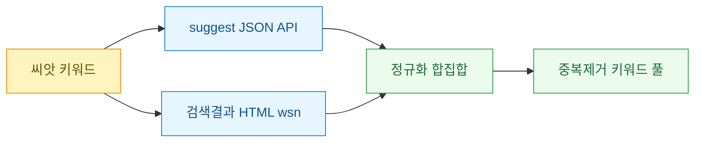
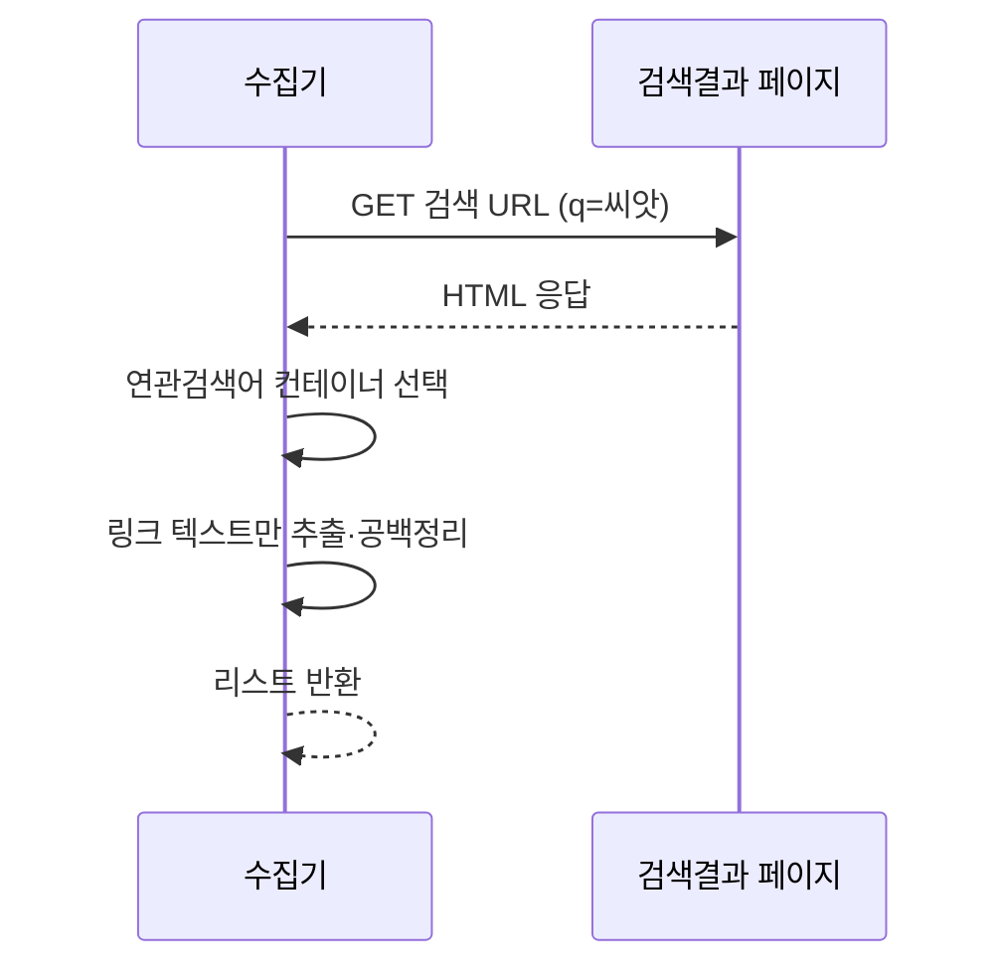

키워드 리서치를 하다 보면 한 가지 소스만 파는 습관이 생긴다. 나는 오랫동안 다음(카카오) 자동완성 API 하나만 긁었다. 씨앗 키워드를 넣고 딸려 나오는 자동완성 목록을 받아 풀을 만드는 방식이다. 그런데 어느 날 같은 키워드를 사람 손으로 다음에 검색해 보니 결과 페이지 아래쪽 "연관 검색어" 블록에 내 자동완성에는 없던 단어가 대여섯 개나 있었다. 같은 포털인데 소스가 다르면 나오는 키워드가 다르다는 걸 그때 처음 실감했다.

그래서 한 포털 안에서 두 군데를 동시에 긁기로 했다. 하나는 자동완성 suggest JSON(입력 중 실시간으로 뜨는 추천어 API), 다른 하나는 검색결과 HTML 안의 wsn 영역(검색 결과 페이지에 박혀 있는 연관 검색어 섹션)이다. 이 둘을 합치니 씨앗 하나당 커버리지가 눈에 띄게 넓어졌다.



## 왜 자동완성 하나로는 부족했나?

자동완성 API는 "지금 입력 중인 글자"에 반응한다. 그래서 씨앗 키워드의 **앞부분을 공유하는** 확장어가 잘 나온다. "캠핑"을 넣으면 "캠핑용품", "캠핑의자", "캠핑장추천"처럼 접두가 같은 것들이 주로 걸린다.

반대로 검색결과 페이지의 연관 검색어(wsn)는 **의미가 붙어 있으면** 접두가 달라도 나온다. "캠핑"을 검색하면 "차박", "글램핑", "백패킹" 같은 인접 주제어가 뜬다. 접두를 공유하지 않으니 자동완성으로는 절대 안 걸리는 부류다.

두 소스는 성격이 이렇게 갈린다. 그래서 둘 다 긁어야 접두 확장과 의미 확장을 모두 담는다.

| 구분 | suggest JSON | 검색결과 wsn |
|---|---|---|
| 형식 | JSON 배열 | HTML 파싱 |
| 특성 | 접두 공유 확장어 | 의미 인접 주제어 |
| 개수 | 보통 10개 안팎 | 페이지당 6~8개 |
| 갱신 | 입력 즉시 | 검색 시점 반영 |

## suggest JSON은 어떻게 받아오나?

자동완성 엔드포인트는 콜백을 감싼 JSON(JSONP)으로 오는 경우가 많다. 앞뒤 괄호와 콜백 이름을 벗겨내고 파싱하면 된다. 아래는 구조를 보여주는 합성 예시다. 실제 엔드포인트 주소나 파라미터는 서비스마다 다르니 개발자도구 Network 탭에서 직접 확인하는 게 정석이다.

```python
import requests, json, re

def fetch_suggest(seed: str) -> list[str]:
    # 합성 예시 엔드포인트 — 실제 주소는 Network 탭에서 확인
    url = "https://suggest.example.com/ac"
    r = requests.get(url, params={"q": seed}, timeout=5,
                     headers={"User-Agent": "Mozilla/5.0"})
    # JSONP 껍데기 벗기기: cb({...}) → {...}
    body = re.sub(r"^[^(]*\(|\)\s*;?\s*$", "", r.text.strip())
    data = json.loads(body)
    # 구조는 서비스마다 다름 — 여기선 items 배열 가정
    return [row["keyword"] for row in data.get("items", [])]
```

여기서 한 번 삽질했다. 응답이 JSON인 줄 알고 `r.json()`을 바로 불렀다가 계속 터졌다. 앞에 콜백 이름이 붙은 JSONP라 순수 JSON이 아니었던 것이다. 껍데기를 정규식으로 벗기고 나서야 파싱이 됐다.

## 검색결과 HTML에서 연관 검색어는 어떻게 뽑나?

wsn 쪽은 검색 결과 페이지를 받아 특정 영역을 골라내는 일이다. 연관 검색어 블록은 보통 고유한 클래스나 컨테이너 안에 리스트로 들어 있다. 선택자는 페이지 구조에 따라 바뀌니 실제 마크업을 보고 잡아야 한다.



```python
from bs4 import BeautifulSoup

def fetch_related(seed: str) -> list[str]:
    url = "https://search.example.com/search"
    r = requests.get(url, params={"q": seed}, timeout=5,
                     headers={"User-Agent": "Mozilla/5.0"})
    soup = BeautifulSoup(r.text, "html.parser")
    # 연관검색어 컨테이너 — 실제 클래스는 마크업 확인 후 교체
    box = soup.select_one("div.related_keyword")
    if not box:
        return []
    return [a.get_text(strip=True) for a in box.select("a")]
```

파싱이 0건이면 사이트를 탓하기 전에 내 선택자부터 의심한다. 예전에 다른 프로젝트에서 "결과가 0건이면 사이트가 아니라 내 파서를 의심하라"는 교훈을 크게 데인 적이 있다. 여기서도 처음엔 `related_keyword` 클래스를 잘못 짚어서 계속 빈 리스트가 나왔다.

## 두 소스를 어떻게 하나로 합치나?

합칠 때 핵심은 정규화와 중복 제거다. 소스가 다르면 같은 단어인데 공백이나 대소문자, 조사가 미묘하게 다를 수 있다. 소문자화하고 공백을 정리한 뒤 집합으로 합친다. 어느 소스에서 나왔는지 출처도 같이 남겨 두면 나중에 소스별 기여도를 볼 수 있어 유용하다.

```python
def normalize(kw: str) -> str:
    return " ".join(kw.split()).strip().lower()

def merge_pool(seed: str) -> dict[str, set]:
    pool: dict[str, set] = {}
    for kw in fetch_suggest(seed):
        pool.setdefault(normalize(kw), set()).add("suggest")
    for kw in fetch_related(seed):
        pool.setdefault(normalize(kw), set()).add("wsn")
    return pool  # {키워드: {출처들}}

pool = merge_pool("캠핑")
only_wsn = [k for k, src in pool.items() if src == {"wsn"}]
print(f"전체 {len(pool)}개, wsn 단독 {len(only_wsn)}개")
```

내 경우엔 wsn에서만 나온 키워드가 전체의 3분의 1 안팎이었다. 자동완성만 긁었으면 통째로 놓쳤을 몫이다. 소스 하나를 더 붙였을 뿐인데 풀이 이렇게 벌어졌다.

## 크롤링할 때 조심한 것

두 소스를 긁으니 요청 수가 곱절이 된다. 씨앗 하나당 API 한 번, 페이지 한 번이다. 씨앗이 수백 개면 금방 눈에 띄는 트래픽이 된다. 그래서 씨앗 사이에 간격을 두고 돌렸다. robots.txt와 서비스 약관을 먼저 확인하고, 개인적인 리서치 용도로만, 무리한 레이트로 때리지 않는 선을 지켰다. 상업적 재배포가 아니라 내 키워드 후보를 넓히는 목적이라는 점을 스스로 분명히 해 뒀다.

## 정리하면

같은 포털이라도 자동완성 API와 검색결과 HTML은 서로 다른 키워드를 내놓는다. 접두 확장은 suggest가, 의미 확장은 wsn이 채운다. 이 둘을 정규화해 합집합으로 묶으면 씨앗 하나에서 얻는 커버리지가 확 넓어진다.

다음 할 일은 이 패턴을 다른 포털로도 넓히는 것이다. 포털마다 자동완성과 연관 검색어의 위치·형식이 다르니 어댑터만 갈아 끼우면 같은 합집합 구조를 재활용할 수 있다. 소스를 하나 더 붙이는 습관, 이게 키워드 풀을 키우는 가장 값싼 방법이었다.
