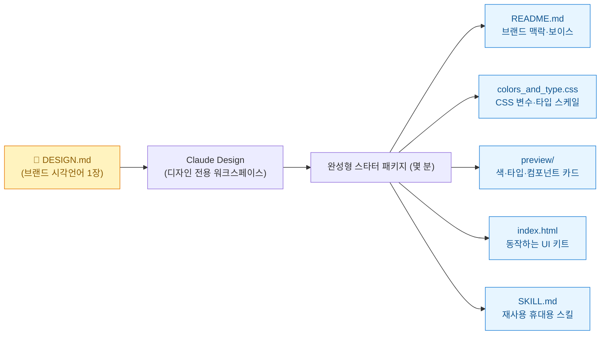
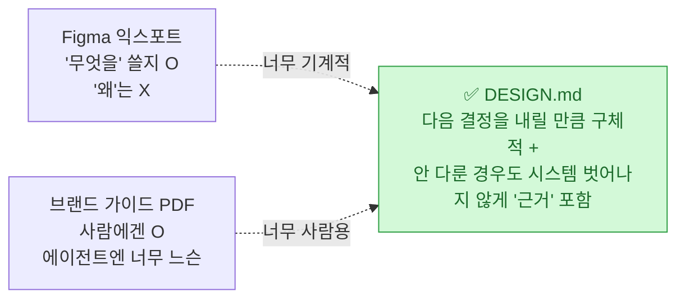
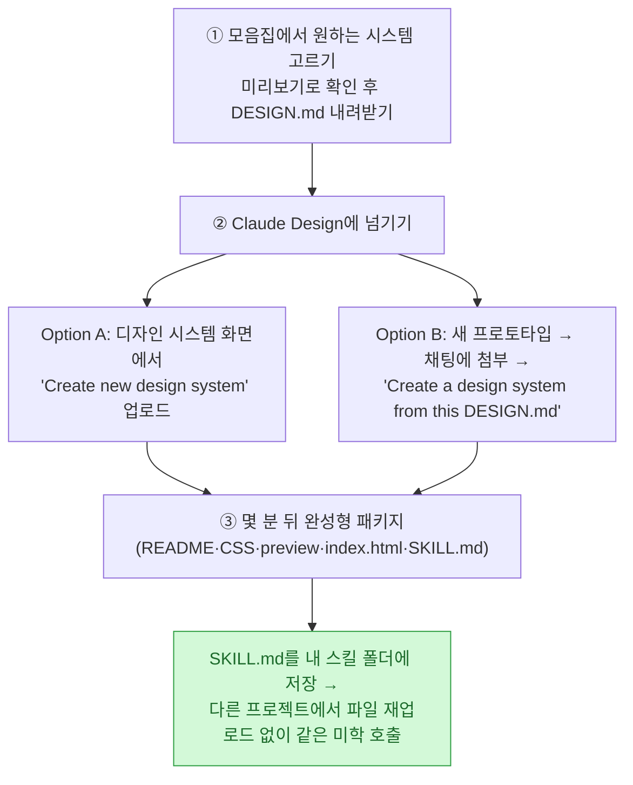

> **하네스 3부작** — ① [[planning-harness-detailed-spec-automation|기획 하네스: 혼자 상세기획 자동화]] · **② 디자인 하네스: DESIGN.md 한 장(이 글)** · ③ [[claude-tag-multiplayer-agents|팀 하네스: Claude Tag]]

[[planning-harness-detailed-spec-automation|1부(기획 하네스)]]는 솔직한 고백으로 끝났다. **"마크다운 구조인 클로드 코드만으로는 예쁜 와이어프레임 같은 비주얼 UX를 직관적으로 처리하기 어렵다."** 시퀀스 다이어그램·유저 플로우 같은 **로직**은 하네스로 자동화됐지만, **화면이 어떻게 보이느냐**는 여전히 손이 갔다.

오늘 그 숙제의 답을 두 개 봤다. **Claude Design**과 **DESIGN.md**, 그리고 이 둘을 실전으로 끌어올리는 큐레이션 **awesome-claude-design**. 요약하면 이렇다 — **`CLAUDE.md`가 "어떻게 빌드할지"를 코딩 에이전트에게 준다면, `DESIGN.md`는 "어떻게 보이고 느껴져야 할지"를 디자인 에이전트에게 준다.** 로직 하네스 옆에 **디자인 하네스**가 생긴 것이다.

## 한 장이 완성형 디자인 시스템이 되는 흐름

AI로 화면을 만들 때 흔한 고통은 **매 화면마다 디자인이 조금씩 달라져 일관성이 무너지는 것**이다. Claude Design은 채팅에서 화면을 일회성으로 뽑는 대신 **프로젝트의 디자인 시스템을 지속적으로 보관**한다. 토큰·컴포넌트·미리보기 자산을 출시 가능한 형태로 유지하므로, 새 화면을 요청할 때마다 **같은 시스템 위에서** 일관성이 유지된다.

## DESIGN.md가 뭔가? — CLAUDE.md의 디자인 판

DESIGN.md는 **브랜드의 시각 언어를 AI 에이전트가 실제로 쓸 수 있는 형식으로 적은 단일 평문 마크다운 파일**이다. 개념은 **구글 Stitch**(Google Labs의 Gemini 기반 UI 툴, 2025-05 I/O)가 처음 제안했고, 이후 구글이 **스펙을 Apache-2.0으로 오픈소스화**해(`github.com/google-labs-code/design.md`) 특정 툴에 종속되지 않게 했다. 파일은 상단 **YAML front matter**(기계가 읽는 디자인 토큰: colors·typography·spacing·components)와 하단 **마크다운 본문**(사람·에이전트가 읽는 근거)의 2단 구조이고, `npm @google/design.md`가 **lint·diff·export** CLI를 제공한다(lint는 WCAG AA 4.5:1 대비까지 검사). 핵심 아이디어는 **토큰·규칙과 그 근거(rationale)를 한 파일에 함께 담는 것** — 스펙 원문 표현으로 "토큰은 정확한 값을, 산문은 그 값이 *왜* 존재하고 *어떻게* 적용하는지를 준다."

정리하면 이렇다:

| 파일 | 누가 읽나 | 무엇을 정의하나 |
|---|---|---|
| **AGENTS.md** | 코딩 에이전트 | 프로젝트를 **어떻게 빌드**할지 |
| **DESIGN.md** | 디자인 에이전트(Claude Design·Stitch 등) | 프로젝트가 **어떻게 보이고 느껴져야** 할지 |

## DESIGN.md 한 파일엔 뭐가 들어가나?

awesome-claude-design의 모든 DESIGN.md는 **동일한 9개 섹션**을 따른다. 단순 색상 모음이 아니라, **에이전트가 일관된 시스템을 만들기에 충분한 구조화된 맥락**을 담는 게 핵심이다.

| # | 섹션 | Claude가 읽어내는 것 |
|---|---|---|
| 1 | Visual Theme & Atmosphere | 톤·밀도·무드 |
| 2 | Color Palette & Roles | 의미 기반 이름+hex → CSS 변수 |
| 3 | Typography Rules | 타입 스케일 + Google Fonts 대체 |
| 4 | Component Stylings | 상태값까지 포함한 버튼·입력·카드·내비 |
| 5 | Layout Principles | 간격 스케일·그리드·여백 리듬 |
| 6 | Depth & Elevation | 그림자 토큰·표면 위계 |
| 7 | **Do's and Don'ts** | 새 화면 생성 시 지키는 **가드레일** |
| 8 | Responsive Behavior | 브레이크포인트·터치 타깃·접힘 |
| 9 | Agent Prompt Guide | SKILL.md에 임베드되는 **재사용 프롬프트** |

7번(가드레일)과 9번(재사용 프롬프트)이 눈에 띈다. 이건 정확히 [[planning-harness-detailed-spec-automation|1부]]에서 말한 하네스의 **가드레일 기둥**과 **스킬**이 디자인으로 옮겨온 것이다. 그래서 한 번 스캐폴딩한 뒤 "이제 가격 페이지 만들어줘", "빈 상태 화면 추가해줘" 같은 후속 요청에도 **같은 브랜드 위에서 일관되게** 확장된다.

## awesome-claude-design — 백지 대신 68개의 출발점

디자인 시스템을 백지에서 시작하는 대신, **원하는 분위기의 예시를 골라 그 DESIGN.md를 Claude Design에 넘기는** 방식이다. AI 에이전트 프레임워크를 만드는 **VoltAgent**가 관리하며, 현재 **68개의 DESIGN.md를 9개 분야**로 나눠 제공한다(AI·LLM 플랫폼, 개발자 도구·IDE, 백엔드·DB·데브옵스, 생산성·SaaS, 디자인·크리에이티브, 핀테크·크립토, 이커머스, 미디어, 자동차).

각 항목이 브랜드 분위기를 한 줄로 설명한다 — **따뜻한 테라코타의 Claude, 보라 톤 미니멀의 Mistral, 터미널 우선 모노크롬 Ollama, 흑백 정밀함의 Vercel, 초미니멀 보라의 Linear.** 원하는 결과물 느낌에 가까운 걸 골라 시작점으로 삼으니 **토큰과 규칙을 처음부터 설계하는 부담**이 사라진다.

쓰는 법은 세 단계다:

**SKILL.md 재사용**이 특히 하네스답다 — 한 번 만든 미학을 스킬 폴더에 넣어 두면, 다음 Claude 프로젝트에서 파일을 다시 올리지 않고도 같은 시스템을 불러온다.

## 그런데 만능은 아니다 — Atlassian의 실전 교훈

같은 날 **Atlassian도 자사 DESIGN.md 실전 후기**를 냈는데, 여기서 균형을 잡아야 한다.

> ⚠️ (1) **DESIGN.md 포맷의 원조는 Atlassian이 아니라 구글**(Stitch 도구용으로 설계·오픈소스화)이다 — Atlassian은 자체 버전을 구현·공개한 것이라, '포맷 창시자'로 오해하면 안 된다. (2) Atlassian의 결론은 **낙관론이 아니라 절충**이다. DESIGN.md는 **단발성(one-shot) 프로토타입엔 잘 맞지만, 실제 프로덕션 코드베이스엔 MCP 서버(자사 ADS MCP)·구조화 콘텐츠 모델 같은 더 정교한 방식이 필요**하다고 못 박았다. 실측으로 **DESIGN.md는 MCP 대비 토큰을 약 92% 더 쓰고, 실행 간 변동성이 약 2.7배**였다(MCP는 컨텍스트를 필요할 때만 로드하는데 DESIGN.md는 매번 전부 로드하기 때문). "이식성은 정교함·효율의 희생을 대가로 한다." (3) 'AI 토큰 비용 절감', '생성 정확도 향상' 같은 효과는 **Atlassian 자체 주장**으로 독립 검증치가 아니다.

여기서 이 포맷이 겨냥하는 문제 이름도 알아둘 만하다 — **slop**. 기능은 하지만 **시각적 정체성·의도된 디자인 결정이 없는** AI 생성 UI를 가리키는 커뮤니티 용어다. 원인은 단순하다: **브랜드·컴포넌트·패턴 컨텍스트가 없으면(generic in) 결과도 밋밋하다(generic out).** DESIGN.md는 그 컨텍스트를 한 파일에 압축해 넣는 시도다.

또 하나, awesome-claude-design은 **MIT 라이선스**지만 저장소가 분명히 밝힌다 — 수록된 DESIGN.md는 각 웹사이트의 **공개적으로 관찰 가능한 패턴에서 영감받은 출발점**일 뿐 해당 기업의 공식 디자인 시스템이 아니고 제휴·보증도 없다. 상표·서체는 각 소유자 것이며, **1:1 복제보다 독자 시스템의 영감으로** 쓰라고 권한다. (마케팅·랜딩 만들 때 남의 브랜드를 그대로 베끼면 안 된다는 뜻.)

## 내 일에 적용한다면

| 내 작업 | 디자인 하네스 적용점 |
|---|---|
| 블로그·랜딩 페이지 | 매번 다르게 나오던 화면을, **내 브랜드 DESIGN.md 한 장**으로 일관되게 스캐폴딩 |
| 마케팅 자산 | 캠페인마다 톤이 튀는 걸 막는 **가드레일(Do's/Don'ts)**을 파일에 고정 |
| 재사용 | 완성된 **SKILL.md**를 스킬 폴더에 넣어 프로젝트 간 미학 이식 |
| 한계 인지 | **one-shot 프로토타입엔 O**, 진짜 프로덕션엔 MCP·구조화 모델 병행(Atlassian 교훈) |
| 저작권 | 남의 브랜드 DESIGN.md는 **영감**으로만, 상표·서체 복제 금지 |

로직은 [[planning-harness-detailed-spec-automation|기획 하네스(1부)]]로, 비주얼은 이 디자인 하네스로 — 이렇게 **"프로덕트의 논리와 시각적 컴포넌트가 분리되어 각각 하네스화"**되는 순간, 1부 뉴스레터가 꿈꾼 그림이 완성된다. 그리고 이 하네스들을 **팀 전체로 확장**하는 이야기가 [[claude-tag-multiplayer-agents|3부 팀 하네스]]다.

## 참고자료

- [GitHub — VoltAgent/awesome-claude-design](https://github.com/VoltAgent/awesome-claude-design)
- [Anthropic — Claude Design](https://www.anthropic.com/)
- [Atlassian — DESIGN.md: what we learned testing portable design context](https://www.atlassian.com/blog)
- [getdesign.md — DESIGN.md 모음](https://getdesign.md/)
- [GeekNews(하다) — awesome-claude-design 정리](https://news.hada.io/)

<!-- 안전: 회사 실데이터·고객/제3자 PII·API키/쿠키/토큰 없음. 공개 자료 기반 정리 + 원조·한계 팩트체크. 타 브랜드 자산은 영감 용도로만 언급. -->
