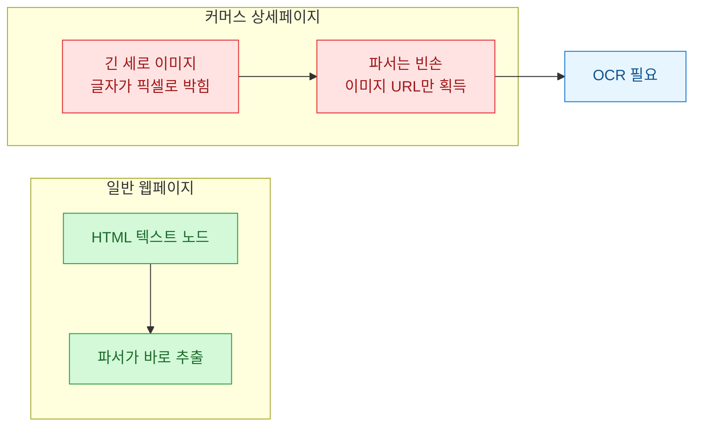
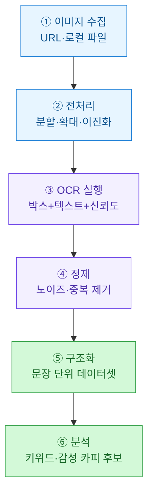
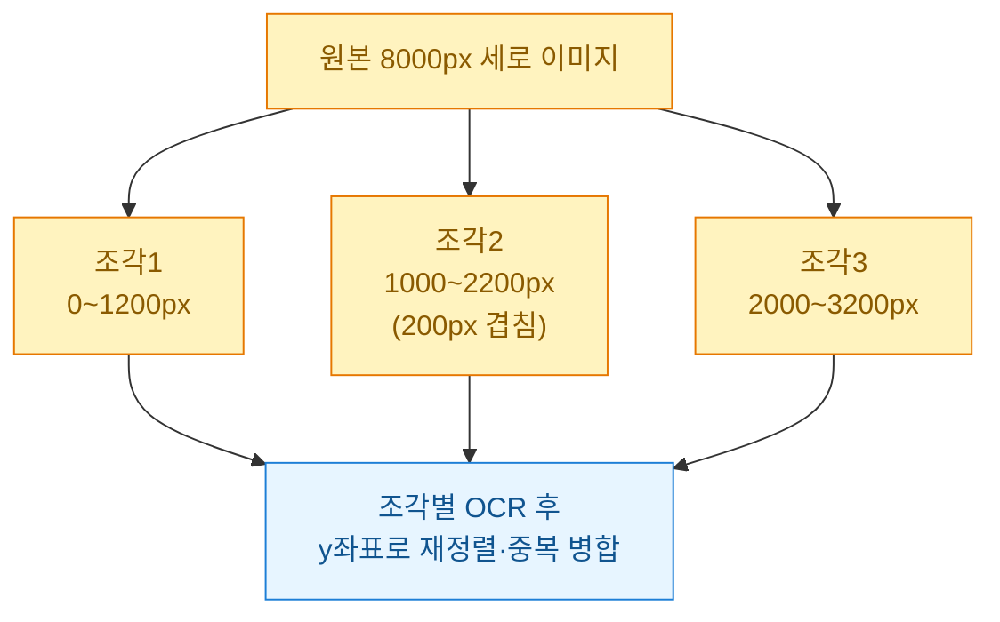
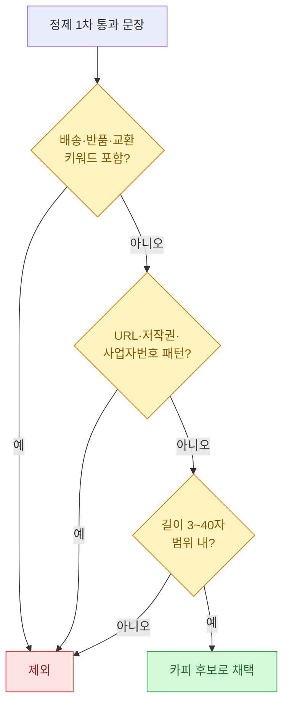
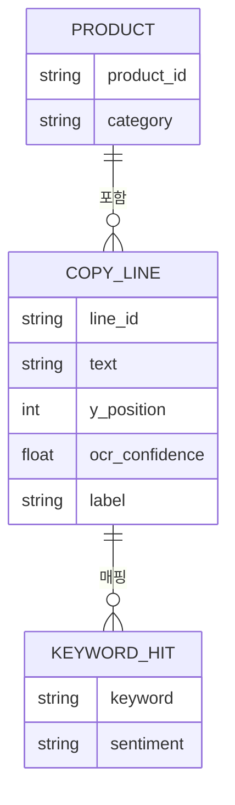
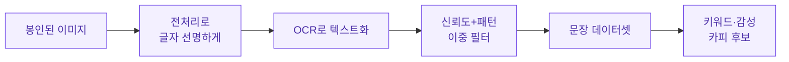

상세페이지를 분석하려고 크롤링을 돌렸는데, 정작 손에 쥔 건 이미지 URL 한 뭉치뿐이었다. 커머스 상품 상세페이지는 열에 아홉이 **긴 세로 이미지(long image)** 한 장에 모든 문구가 그림으로 박혀 있다. `<p>` 태그를 뒤져봐야 텍스트가 안 나온다는 뜻이다. 그래서 방향을 틀었다. HTML을 파싱하는 대신, **이미지에서 글자만 OCR로 뽑아** 카피 후보 데이터셋으로 만드는 파이프라인을 짰다. 이 글은 그 과정을 처음부터 정리한 회고다.

> ⚠️ 이 글의 모든 상품명·문구·수치는 **합성(더미) 데이터**다. 실제 브랜드·거래처·상품은 전혀 등장하지 않는다. 방법론만 공개 지식 수준으로 일반화했다.

## 왜 상세페이지는 그냥 긁으면 안 나오나?

먼저 문제의 구조부터 그려봤다. 일반 웹 텍스트와 상세페이지의 결정적 차이는 "글자가 어디에 있느냐"다.



디자이너가 예쁘게 뽑은 이미지 한 장은 사람 눈엔 좋지만, 데이터 관점에선 "텍스트가 봉인된 상자"다. 이 봉인을 여는 열쇠가 **광학 문자 인식(OCR, Optical Character Recognition)**, 즉 그림 속 글자를 컴퓨터가 읽을 수 있는 문자로 바꿔주는 기술이다.

## 전체 파이프라인은 어떻게 생겼나?

머릿속에서 흩어져 있던 단계를 한 줄로 세워봤다. 이미지 한 장이 카피 후보가 되기까지 여섯 단계를 거친다.



이 중에서 사람들이 "OCR 붙이면 끝 아냐?" 하고 넘겨짚는 ③번이 실은 전체의 30%밖에 안 된다. 진짜 고생은 ②전처리와 ④정제에 있었다.

## 긴 이미지를 왜 잘라야 하나?

상세페이지 이미지는 세로로 아주 길다. 폭 800픽셀에 높이가 8000픽셀을 넘기도 한다. 이걸 통째로 OCR에 넣으면 두 가지가 터진다. 하나는 메모리, 하나는 인식률. 엔진이 이미지를 내부에서 리사이즈하면서 글자가 뭉개지기 때문이다.

그래서 **세로로 겹치게 잘라(overlap slicing)** 조각조각 인식했다. 겹침을 주는 이유는 경계선에 걸친 글자가 반토막 나는 걸 막기 위해서다.



전처리에서 챙긴 것들을 표로 정리하면 이렇다.

| 전처리 | 언제 필요한가 | 효과 |
| --- | --- | --- |
| 세로 분할 | 이미지 높이가 클 때 | 메모리 안정·글자 선명도 유지 |
| 2배 확대 | 글자가 작을 때 | 작은 폰트 인식률 상승 |
| 그레이스케일·이진화 | 배경색·그러데이션 심할 때 | 글자/배경 대비 강화 |
| 여백 크롭 | 상하 빈 공간 많을 때 | 불필요한 연산 감소 |

## OCR은 실제로 어떻게 돌리나?

전처리한 조각을 엔진에 넣는다. 오픈소스 OCR 엔진들은 보통 "박스 좌표 + 인식 텍스트 + 신뢰도(confidence)"를 함께 돌려준다. 이 신뢰도가 나중에 노이즈를 거르는 핵심 잣대가 된다.

아래는 합성 데이터로 만든 실행 예시다. 실제 엔진 대신, 엔진이 돌려줄 법한 출력을 흉내 낸 더미 결과로 정제 로직을 검증했다.

```python
# 합성 데이터: OCR 엔진이 돌려줄 법한 출력을 흉내 낸 더미
# (box=(x, y, w, h), text, confidence 0~1)
ocr_raw = [
    ((40, 120, 300, 48), "여름 필수템 제품X", 0.97),
    ((40, 190, 420, 40), "하루 종일 뽀송하게", 0.94),
    ((40, 250, 120, 20), "www.example-shop.com", 0.71),
    ((40, 250, 118, 20), "www.example-shcp.com", 0.55),  # 중복·오인식
    ((40, 800, 380, 36), "지금 구매시 사은품 증정", 0.92),
    ((41, 801, 379, 36), "지금 구매시 사은품 증정", 0.90),  # 겹침 조각 중복
    ((40, 60,  200, 14), "ⓒ2026 A사", 0.83),  # 저작권·배송 안내 = 노이즈
]

def clean(rows, min_conf=0.80):
    kept = []
    for box, text, conf in rows:
        if conf < min_conf:          # ① 저신뢰 제거
            continue
        t = text.strip()
        if len(t) < 3:               # ② 너무 짧은 조각 제거
            continue
        kept.append((box, t, conf))
    # ③ 겹침 조각 중복 제거: y좌표 근접 + 동일 텍스트
    deduped, seen = [], set()
    for box, t, conf in sorted(kept, key=lambda r: r[0][1]):  # y순 정렬
        key = (round(box[1] / 20), t)   # 20px 버킷으로 근접 판정
        if key in seen:
            continue
        seen.add(key)
        deduped.append((box, t, conf))
    return deduped

for box, t, conf in clean(ocr_raw):
    print(f"y={box[1]:>4}  conf={conf:.2f}  {t}")
```

출력은 이렇게 나온다.

```text
y=  60  conf=0.83  ⓒ2026 A사
y= 120  conf=0.97  여름 필수템 제품X
y= 190  conf=0.94  하루 종일 뽀송하게
y= 250  conf=0.71  ...  (min_conf 미달로 이미 제거됨)
y= 800  conf=0.92  지금 구매시 사은품 증정
```

신뢰도 0.71짜리 URL 오인식과 겹침 중복은 걸러졌다. 다만 `ⓒ2026 A사` 같은 저작권 문구는 신뢰도가 높아서 살아남았다. 이건 다음 단계에서 잡는다.

## 노이즈는 어떻게 걸러내나?

상세페이지에는 카피가 아닌 문구가 잔뜩 섞여 있다. 배송 안내, 반품 규정, 저작권, 워터마크, URL 같은 것들이다. 신뢰도만으로는 안 걸러지니 **패턴 기반 규칙**을 하나 더 얹었다.



```python
import re

STOP_KEYWORDS = ["배송", "반품", "교환", "환불", "사업자", "고객센터", "저작권"]
NOISE_PATTERN = re.compile(r"(https?://|www\.|ⓒ|©|\d{3}-\d{2}-\d{5})")

def is_copy_candidate(text: str) -> bool:
    if any(k in text for k in STOP_KEYWORDS):
        return False
    if NOISE_PATTERN.search(text):
        return False
    return 3 <= len(text) <= 40

samples = ["여름 필수템 제품X", "하루 종일 뽀송하게",
           "지금 구매시 사은품 증정", "ⓒ2026 A사", "배송은 2~3일 소요됩니다"]
for s in samples:
    print("O" if is_copy_candidate(s) else "X", s)
```

```text
O 여름 필수템 제품X
O 하루 종일 뽀송하게
O 지금 구매시 사은품 증정
X ⓒ2026 A사
X 배송은 2~3일 소요됩니다
```

저작권 문구와 배송 안내가 여기서 떨어져 나갔다. 이렇게 두 단계(신뢰도 → 패턴)를 거치면 손에 남는 건 순수한 카피 후보뿐이다.

## 뽑은 문구를 어떻게 카피 데이터셋으로 만드나?

문장이 정리됐으면 이제 분석이 가능한 표 형태로 눕힌다. 문장 하나를 한 행으로, 거기에 키워드와 감성 라벨을 붙였다. 감성은 사전 기반으로 아주 단순하게 처리했다. 무거운 형태소 분석 없이 긍정어/후킹어 사전에 걸리는지만 봤다.

```python
POSITIVE = ["뽀송", "필수템", "인기", "사은품", "증정", "가벼운", "촉촉"]
HOOK = ["지금", "한정", "오늘", "마감", "단독"]

def tag_sentence(text):
    pos = sum(w in text for w in POSITIVE)
    hook = sum(w in text for w in HOOK)
    return {
        "text": text,
        "len": len(text),
        "positive_hits": pos,
        "hook_hits": hook,
        "label": "후킹형" if hook else ("감성형" if pos else "정보형"),
    }

candidates = ["여름 필수템 제품X", "하루 종일 뽀송하게", "지금 구매시 사은품 증정"]
for c in candidates:
    print(tag_sentence(c))
```

```text
{'text': '여름 필수템 제품X', 'len': 9, 'positive_hits': 1, 'hook_hits': 0, 'label': '감성형'}
{'text': '하루 종일 뽀송하게', 'len': 9, 'positive_hits': 1, 'hook_hits': 0, 'label': '감성형'}
{'text': '지금 구매시 사은품 증정', 'len': 12, 'positive_hits': 1, 'hook_hits': 1, 'label': '후킹형'}
```

최종 데이터셋의 모양을 표로 두면 이렇다. 이제 여러 상품에서 이 표를 쌓으면 "우리 카테고리에서 잘 쓰이는 후킹 표현" 같은 빈도 분석이 가능해진다.

| text | len | 감성 hits | 후킹 hits | label |
| --- | --- | --- | --- | --- |
| 여름 필수템 제품X | 9 | 1 | 0 | 감성형 |
| 하루 종일 뽀송하게 | 9 | 1 | 0 | 감성형 |
| 지금 구매시 사은품 증정 | 12 | 1 | 1 | 후킹형 |

데이터 모델로 보면 상품과 문구, 키워드가 이렇게 연결된다.



## 이 방법의 한계는 어디까지인가?

솔직하게 짚자면, OCR 파이프라인은 만능이 아니다. 실제로 부딪힌 한계를 남겨둔다.

| 한계 | 무슨 일이 벌어지나 | 대응 |
| --- | --- | --- |
| 장식 폰트·곡선 배치 | 인식률이 뚝 떨어짐 | 신뢰도 컷으로 버리고 물량으로 커버 |
| 배경과 글자색 유사 | 글자를 아예 못 읽음 | 이진화·대비 강화 전처리 |
| 문맥 없는 단어 나열 | 문장 경계가 흐트러짐 | y좌표·간격으로 문장 재조립 |
| 약관·저작권 자동 수집 | 원치 않는 텍스트 유입 | 패턴 필터 상시 유지 |
| 저작권·이용 약관 | 남의 이미지 무단 활용 위험 | 수집 대상·용도 사전 확인 |

특히 마지막 줄이 중요하다. 남이 만든 상세페이지 이미지를 긁는 행위 자체가 사이트 약관이나 저작권에 걸릴 수 있다. 나는 이 파이프라인을 **내가 권한을 가진 데이터**나 합성 데이터에만 돌렸다. 도구가 되는 만큼 선은 스스로 그어야 한다.

## 한 장으로 요약하면?



세 줄로 남긴다.

- 상세페이지는 텍스트가 아니라 이미지다. 그냥 크롤링하면 빈손이니 OCR이 관문이다.
- 진짜 일은 OCR 자체가 아니라 **전처리(긴 이미지 분할)**와 **정제(신뢰도+패턴 이중 필터)**에 있다.
- 뽑은 문구는 문장 단위로 구조화해 키워드·감성을 붙여야 비로소 "분석 가능한 카피 데이터셋"이 된다.

이미지 속에 잠들어 있던 문구들이 표가 되는 순간, 상세페이지는 감상 대상에서 분석 대상으로 바뀐다. 그게 이 작은 파이프라인의 전부였다.
