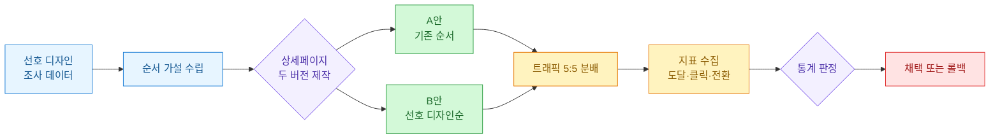
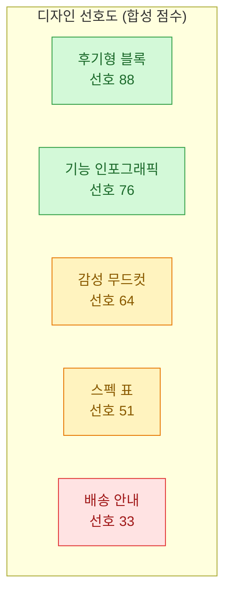
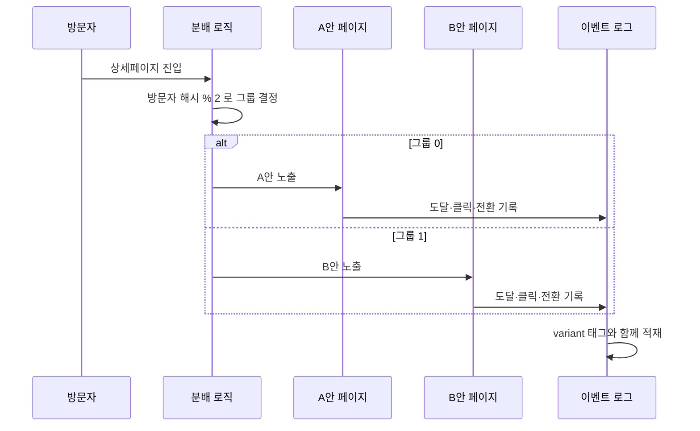
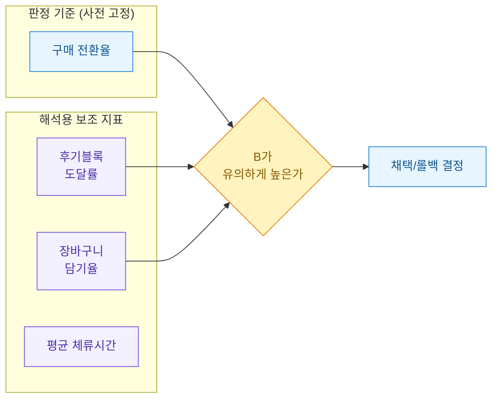
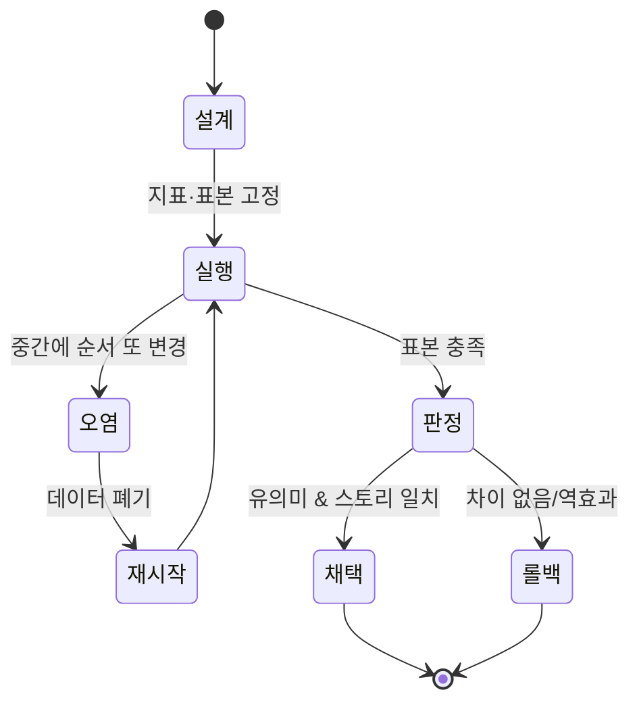
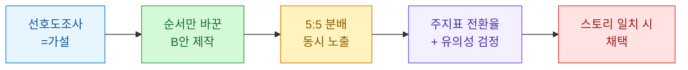

상세페이지를 만들다 보면 늘 같은 고민에 부딪힌다. "어떤 이미지를 맨 위에 둘까?" 예쁜 감성컷 먼저? 기능 설명 먼저? 후기 먼저? 나는 오랫동안 이걸 감으로 정했다. 그러다 문득, 순서만 바꿔도 스크롤 도달률과 전환이 달라지는 걸 로그에서 보고 나서 생각을 바꿨다. 순서는 취향이 아니라 실험 대상이라는 것.

이 글은 상세페이지 이미지 순서를 "선호 디자인순"으로 재배치하고, 그게 진짜 효과가 있는지 A/B로 확인한 과정을 정리한 회고다. 등장하는 브랜드·상품·수치는 전부 **합성 데이터**이고, 방법론만 일반화해서 적는다.

## 전체 그림은 어떻게 되나?

먼저 이번 실험의 큰 줄기를 도식으로 깔아둔다. 선호도 조사에서 "순서 가설"을 얻고 → 그 순서로 B안을 만들고 → 트래픽을 반씩 나눠 → 지표로 판정하는 흐름이다.



핵심은 "감으로 순서를 바꾸지 않는다"는 것. 바꾸는 이유(가설)와 바꾼 뒤의 판정 기준(지표)을 먼저 정해두는 게 절반이다.

## 왜 이미지 순서를 실험 대상으로 봤나?

상세페이지는 세로로 긴 이미지 묶음이다. 방문자는 위에서부터 스크롤하며 읽는데, 아래로 갈수록 이탈한다. 그래서 **어떤 블록을 위에 두느냐**가 곧 "몇 %의 사람이 그 정보를 보느냐"를 결정한다.

합성 로그로 스크롤 도달률을 그려보면 감이 온다. 아래는 상세페이지 블록별 도달률 예시(합성 데이터).

| 순서 | 블록 | 도달률(합성) |
|------|------|-------------|
| 1 | 메인 감성컷 | 100% |
| 2 | 핵심 기능 설명 | 82% |
| 3 | 사이즈/스펙 표 | 61% |
| 4 | 사용 후기 | 44% |
| 5 | 배송/교환 안내 | 29% |

여기서 질문이 생긴다. 만약 "사용 후기"가 구매 결정에 가장 강하게 작용하는 블록이라면? 지금은 44%만 그걸 본다. 후기를 2번으로 올리면 도달률이 80%대로 뛴다. 순서 하나로 "설득 자산의 노출량"이 두 배 가까이 달라지는 셈이다.

## '선호 디자인순'은 무슨 뜻인가?

여기서 말하는 선호 디자인순은, 별도로 진행한 디자인 선호도 조사에서 나온 "사람들이 더 오래 보고 더 선호한 블록 유형" 순서를 말한다. 예를 들어 합성 조사 결과가 이렇게 나왔다고 하자.



기존 A안은 "감성컷 → 기능 → 스펙 → 후기 → 배송" 순이었다. 선호도 조사대로라면 후기와 기능 인포그래픽을 앞으로 당겨야 한다. 그래서 B안은 이렇게 재배치했다.

- **A안(기존):** 감성컷 → 기능 → 스펙 → 후기 → 배송
- **B안(선호순):** 후기 → 기능 → 감성컷 → 스펙 → 배송

주의할 점 하나. 선호도 조사는 "사람들이 좋다고 말한 것"이지 "실제로 사게 만드는 것"이 아니다. 말과 행동은 다르다. 그래서 조사 결과를 그대로 믿지 않고, **A/B로 실제 전환을 확인하는 단계**가 반드시 필요하다. 조사는 가설의 재료일 뿐이다.

## A/B 테스트는 어떻게 설계했나?

A/B의 생명은 "두 그룹이 순서 말고는 똑같아야 한다"는 것이다. 방문자를 무작위로 반씩 나누고, 같은 기간·같은 유입 채널에서 노출해야 순서의 효과만 뽑아낼 수 있다.



분배는 방문자 식별자를 해시해서 짝/홀로 가르는 방식이 깔끔하다. 같은 사람이 매번 같은 버전을 보게 되어(일관 노출), 새로고침마다 화면이 바뀌는 혼란을 막는다. 아래는 개념을 보여주는 합성 예시 코드다.

```python
import hashlib

def assign_variant(visitor_id: str) -> str:
    """방문자 ID를 해시해 A/B 그룹을 안정적으로 배정 (합성 예시)."""
    h = hashlib.md5(visitor_id.encode()).hexdigest()
    # 16진수 마지막 자리를 짝/홀로 분배 -> 대략 5:5
    return "B" if int(h[-1], 16) % 2 else "A"

sample = ["user_1001", "user_1002", "user_1003", "user_1004"]
for uid in sample:
    print(uid, "->", assign_variant(uid))
```

이렇게 하면 배포 시점에 랜덤이 아니라 방문자별로 고정된 그룹이 나온다. 실험이 끝나기 전까지는 배정 규칙을 절대 바꾸지 않는 게 원칙이다.

## 어떤 지표로 성패를 판정하나?

지표를 미리 못 박아두지 않으면, 결과를 보고 나서 유리한 숫자만 골라 "성공"이라 우기게 된다. 그래서 실험 전에 **주요 지표 하나(전환율)**를 정하고, 보조 지표는 해석용으로만 쓴다.



합성 데이터로 만든 결과 표는 이렇다.

| 지표 | A안(기존) | B안(선호순) | 차이 |
|------|-----------|-------------|------|
| 방문자 수 | 5,020 | 4,980 | — |
| 후기블록 도달률 | 44% | 79% | +35%p |
| 장바구니 담기율 | 9.1% | 10.4% | +1.3%p |
| 구매 전환율 | 2.8% | 3.4% | +0.6%p |

보기에는 B안이 다 이겼다. 하지만 여기서 멈추면 안 된다. "이 차이가 우연이 아닌가?"를 물어야 한다.

## 그 차이가 진짜인지 어떻게 확인하나?

전환율 2.8% vs 3.4%는 표본이 작으면 그냥 흔들림일 수 있다. 그래서 두 비율이 통계적으로 다른지 간단한 비율 검정으로 확인한다. 합성 수치로 돌려본 예시다.

```python
from math import sqrt
from statistics import NormalDist

# 합성 데이터
n_a, conv_a = 5020, int(5020 * 0.028)   # A안 전환수
n_b, conv_b = 4980, int(4980 * 0.034)   # B안 전환수

p_a, p_b = conv_a / n_a, conv_b / n_b
p_pool = (conv_a + conv_b) / (n_a + n_b)
se = sqrt(p_pool * (1 - p_pool) * (1 / n_a + 1 / n_b))
z = (p_b - p_a) / se
p_value = 2 * (1 - NormalDist().cdf(abs(z)))

print(f"A={p_a:.3%}, B={p_b:.3%}")
print(f"z={z:.2f}, p-value={p_value:.4f}")
```

이 합성 예시에서 p-value가 대략 0.05 근처로 나온다. 관례적으로 0.05 미만이면 "우연이라고 보기 어렵다"고 판단한다. 여기서 중요한 건 숫자 자체보다 **판단 절차**다.

- 실험 전에 필요한 최소 표본을 정한다(표본이 너무 적으면 어떤 차이도 못 믿는다).
- 정해둔 기간·표본을 채우기 전에 훔쳐보고 멈추지 않는다(중간에 끊으면 착시가 생긴다).
- 주지표(전환율)로만 채택 여부를 정하고, 보조 지표는 "왜 그런지" 설명에만 쓴다.

이번 케이스에선 후기블록 도달률이 44%→79%로 뛴 게 전환 상승의 그럴듯한 이유가 된다. 후기를 더 많은 사람이 봤고, 후기가 구매를 밀어줬다는 스토리가 지표끼리 앞뒤가 맞는다.

## 이 실험에서 조심할 함정은?

몇 번 데며 배운 것들을 정리해둔다.



- **여러 개를 한꺼번에 바꾸지 않기.** 순서도 바꾸고 카피도 바꾸면 무엇이 효과였는지 못 가린다. 이번엔 "순서"만 건드렸다.
- **계절·행사 섞이지 않게.** 세일 기간이 한쪽에만 걸리면 순서 효과인지 세일 효과인지 알 수 없다. 같은 기간에 동시 노출이 원칙.
- **말한 선호 ≠ 산 행동.** 선호도 조사에서 1등이던 감성컷은 정작 전환에선 후기에 밀렸다. 조사는 가설, 검증은 A/B.
- **작은 차이에 과몰입 금지.** 0.6%p가 매출로 의미 있는 규모인지, 재배치 비용보다 이득이 큰지 함께 본다.

## 정리하면



핵심 3줄로 남긴다.

1. 상세페이지 이미지 순서는 취향이 아니라 "설득 자산의 노출량"을 결정하는 실험 변수다.
2. 선호도 조사는 가설을 주지만, 실제 채택은 순서만 바꾼 A/B와 전환율 검정으로 정한다.
3. 한 번에 하나만 바꾸고, 지표·표본을 미리 고정하고, 지표끼리 앞뒤가 맞는지까지 확인한다.

이 글의 모든 수치와 표는 합성 데이터이며, 방법론만 일반화한 회고다. 다음엔 같은 틀로 "이미지 개수(길이)"를 실험 대상으로 놓고 정리해볼 생각이다.
