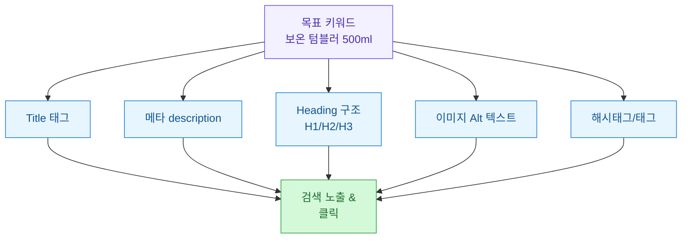
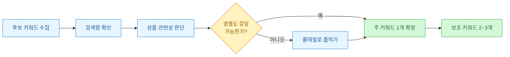
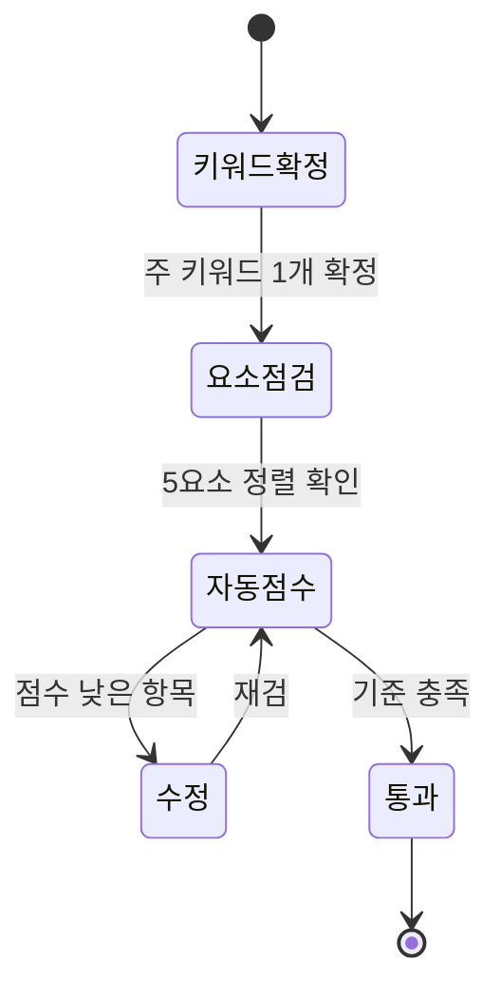

블로그 글 SEO는 자료가 많은데, 커머스 상세페이지 SEO는 의외로 정리된 게 드물다. 나는 상세페이지를 만들 때마다 "이 페이지의 목표 키워드가 뭐지?"를 잊고 예쁜 이미지부터 붙이곤 했다. 그러다 검색 유입이 기대만큼 안 나오는 페이지를 뜯어보면, 언제나 **온페이지(on-page) 요소**가 제각각 다른 말을 하고 있었다. Title은 A를 말하는데 Heading은 B, Alt 텍스트는 아예 비어 있는 식이다.

그래서 상세페이지 하나를 검수하는 나만의 "한 장 점검표"를 만들었다. 이 글은 그 점검표를 도식으로 정리한 것이다. 예시로 나오는 상품·수치는 전부 **합성(더미) 데이터**이며, 실제 브랜드·상품과는 무관하다. 가상의 상품 "제품X"(카테고리: 가상의 텀블러)를 예로 든다.

## 온페이지 SEO 요소는 어떻게 연결되나?

먼저 큰 그림부터. 상세페이지의 SEO 요소는 따로 노는 항목이 아니라, **하나의 목표 키워드(target keyword)**를 중심으로 서로를 강화하는 구조여야 한다.



핵심은 위 다섯 요소가 **같은 목표 키워드를 일관되게 반영**하느냐다. 하나라도 딴소리를 하면 검색엔진이 "이 페이지가 무엇에 관한 것인지" 헷갈려 하고, 사용자도 검색 결과에서 클릭할 이유를 못 찾는다.

## 왜 상세페이지는 SEO가 유독 취약한가?

블로그 글과 달리 커머스 상세페이지는 구조적으로 SEO에 불리한 지점이 있다. 아래 표로 정리했다.

| 취약 지점 | 왜 문제인가 | 점검 포인트 |
| --- | --- | --- |
| 본문이 이미지 한 장 | 텍스트가 없어 검색엔진이 읽을 게 없음 | 이미지 밖 텍스트 영역 확보, Alt 활용 |
| Title이 상품명뿐 | 검색 키워드가 안 들어감 | 키워드+혜택+수식어 조합 |
| 메타 description 없음 | 스니펫이 자동 생성돼 클릭률 저하 | 직접 작성 |
| Heading 태그 미사용 | 문서 구조가 평평함 | H1 1개 + H2로 섹션화 |
| Alt 텍스트 공백 | 이미지 검색·접근성 손해 | 서술형 Alt 작성 |

특히 첫 줄, "본문이 이미지 한 장"이 커머스의 고질병이다. 디자이너가 만든 예쁜 상세 이미지 안에 모든 정보가 그림으로 박혀 있으면, 검색엔진에게 그 페이지는 사실상 백지다. 그래서 이미지 밖에 최소한의 텍스트를 확보하고, Alt를 성실히 채우는 게 중요하다.

## 목표 키워드는 어떻게 하나로 정하나?

점검의 출발점은 "이 페이지의 목표 키워드 1개"를 못 박는 것이다. 여러 개를 욕심내면 페이지가 어느 것에도 집중하지 못한다.



예를 들어 가상의 텀블러 "제품X"라면, "텀블러"는 너무 넓고 경쟁이 세다. 반면 **보온 텀블러 500ml** 정도로 좁히면 관련성·검색 의도가 뚜렷해지고 상위 노출 가능성도 올라간다. 이게 주 키워드가 되고, "출근용 텀블러", "누수 없는 텀블러" 같은 게 보조 키워드로 붙는다.

## 각 요소를 어떻게 채워야 하나?

주 키워드가 정해지면, 다섯 요소를 그에 맞춰 정렬한다. 아래는 합성 데이터로 만든 좋은/나쁜 예시다.

```
[나쁜 예 — 제각각]
Title:      제품X 텀블러 (상품명만)
메타:       (없음 → 자동 생성)
H1:         상품 소개
Alt:        img1, img2, thumb (의미 없음)
해시태그:   #텀블러 #예쁨 #굿즈

[좋은 예 — 키워드 정렬]
Title:      보온 텀블러 500ml 제품X | 6시간 보온·누수 방지
메타:       출근길에 딱 맞는 보온 텀블러 500ml. 6시간 보온,
            원터치 잠금으로 가방 속 누수 걱정 없이 사용하세요.
H1:         보온 텀블러 500ml 제품X
H2:         6시간 보온 성능 / 누수 방지 설계 / 세척과 관리
Alt:        은색 500ml 보온 텀블러 제품X 정면 컷
해시태그:   #보온텀블러 #500ml텀블러 #출근용텀블러
```

포인트를 요소별로 정리하면 이렇다.

| 요소 | 권장 길이/개수 | 넣을 것 | 피할 것 |
| --- | --- | --- | --- |
| Title | 한글 25~30자 내외 | 주 키워드+핵심 혜택 | 키워드 반복 남발 |
| 메타 description | 한글 70~80자 내외 | 요약+행동 유도 | 자동 생성 방치 |
| H1 | 페이지당 1개 | 주 키워드 포함 | 여러 개 남발 |
| H2 | 섹션당 1개 | 보조 키워드 자연스럽게 | 디자인용 큰 글씨를 H로 |
| Alt | 이미지당 1문장 | 무엇이 보이는지 서술 | 파일명·공백·키워드 나열 |
| 해시태그 | 5~10개 | 주+보조+롱테일 | 무관한 인기 태그 |

Title에 키워드를 반복해서 욱여넣는 건 오히려 역효과다. 사람이 읽어서 자연스러운 문장이 우선이고, 그 안에 키워드가 한 번 자연스럽게 들어가면 충분하다.

## 이걸 어떻게 자동으로 점검하나?

페이지가 몇십 개가 되면 눈으로 검수하기 어렵다. 그래서 각 요소가 "목표 키워드를 반영하는지"를 점수화하는 작은 스크립트를 쓴다. 아래는 **합성 데이터** 기반으로 동작하는 예시다. 실제 페이지 HTML 대신 딕셔너리로 요소를 표현했다.

```python
# 합성(더미) 데이터 — 실제 상품/페이지와 무관
page = {
    "title": "보온 텀블러 500ml 제품X | 6시간 보온·누수 방지",
    "meta": "출근길에 딱 맞는 보온 텀블러 500ml. 6시간 보온, "
            "원터치 잠금으로 가방 속 누수 걱정 없이 사용하세요.",
    "h1": ["보온 텀블러 500ml 제품X"],
    "h2": ["6시간 보온 성능", "누수 방지 설계", "세척과 관리"],
    "alts": ["은색 500ml 보온 텀블러 제품X 정면 컷", ""],  # 두 번째는 빈 Alt
    "tags": ["#보온텀블러", "#500ml텀블러", "#출근용텀블러"],
}

target = "보온 텀블러"          # 주 키워드
sub = ["500ml", "누수", "출근"]  # 보조 키워드

def has_kw(text, kw):
    return kw.replace(" ", "") in text.replace(" ", "")

def audit(page, target, sub):
    checks = []
    # Title
    t = page["title"]
    checks.append(("Title 길이(<=30)", len(t) <= 30))
    checks.append(("Title 키워드 포함", has_kw(t, target)))
    # 메타
    m = page["meta"]
    checks.append(("메타 존재", bool(m)))
    checks.append(("메타 길이(40~90)", 40 <= len(m) <= 90))
    # H1
    checks.append(("H1 정확히 1개", len(page["h1"]) == 1))
    checks.append(("H1 키워드 포함", any(has_kw(h, target) for h in page["h1"])))
    # Alt
    filled = [a for a in page["alts"] if a.strip()]
    checks.append(("Alt 모두 채움", len(filled) == len(page["alts"])))
    # 태그
    checks.append(("태그 5개 이상", len(page["tags"]) >= 5))
    return checks

results = audit(page, target, sub)
passed = sum(1 for _, ok in results if ok)
for name, ok in results:
    print(f"[{'PASS' if ok else 'FAIL'}] {name}")
print(f"\n점수: {passed}/{len(results)}")
```

실행하면 이런 결과가 나온다(합성 데이터 기준).

```
[PASS] Title 길이(<=30)
[PASS] Title 키워드 포함
[PASS] 메타 존재
[PASS] 메타 길이(40~90)
[PASS] H1 정확히 1개
[PASS] H1 키워드 포함
[FAIL] Alt 모두 채움
[FAIL] 태그 5개 이상

점수: 6/8
```

빈 Alt 하나와 부족한 태그 개수가 바로 잡힌다. 이런 식으로 페이지별 점수를 뽑아두면, 낮은 점수부터 우선 손보면 된다.

## 점검 순서는 어떻게 잡나?

마지막으로 실제 검수 흐름을 상태도로 정리했다. 페이지를 하나 열면 이 순서를 따른다.



순서가 중요하다. **키워드를 먼저 못 박지 않으면** 나머지 요소를 아무리 다듬어도 방향이 없다. 나는 예전에 이 순서를 거꾸로 해서, 예쁜 Title부터 짓고 나중에 키워드를 끼워 맞추다 페이지 전체를 다시 뜯은 적이 있다.

## 한 장 요약

핵심만 3줄로 남긴다.

- 상세페이지 SEO는 **목표 키워드 1개**를 정하고 Title·메타·Heading·Alt·해시태그를 그에 맞춰 정렬하는 일이다.
- 커머스의 고질병은 "이미지 한 장 본문"과 "빈 Alt" — 텍스트를 확보하고 Alt를 성실히 채우면 절반은 해결된다.
- 페이지가 많아지면 요소별 통과/실패를 점수화하는 작은 스크립트로 낮은 점수부터 손보자.
