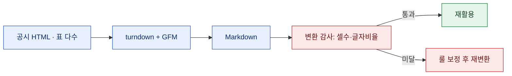
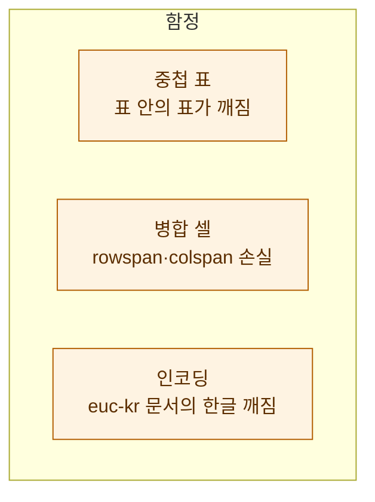

# 공시 HTML을 '누락 0'으로 Markdown 변환하기

> 공시 문서를 LLM에 넣거나 재가공하려면 HTML보다 Markdown이 훨씬 다루기 좋다. 그런데 공시 HTML은 표가 절반이다. 변환기를 아무거나 돌리면 표가 통째로 날아가거나 텍스트가 한 줄로 뭉개진다. 더 무서운 건 **조용히** 사라진다는 것 — 변환은 성공한 것처럼 보이는데 안에서 데이터가 빠져 있다. 그래서 변환보다 **변환 검증**에 더 공을 들였다. (공개 DART 데이터 기준의 기술 예시다.)

## 왜 굳이 HTML을 Markdown으로?

이유는 셋이다. **LLM 입력** — 토큰이 절약되고 구조가 또렷해 모델이 표를 더 잘 읽는다. **재활용** — Markdown은 그대로 블로그·문서·git에 얹힌다. **diff** — 텍스트라 버전 비교가 된다. HTML을 그대로 들고 다니면 이 셋이 다 불편하다.



## turndown만으로는 표가 죽는다

`turndown`은 HTML→Markdown 변환의 표준격 라이브러리다. 그런데 순정 turndown은 **표를 지원하지 않는다.** `<table>`을 만나면 셀 텍스트만 죽 늘어놓아 구조가 사라진다. 그래서 **GFM 플러그인**을 반드시 얹는다. GitHub Flavored Markdown의 표 문법으로 변환해줘서 그제야 표가 표로 남는다.

```javascript
import TurndownService from "turndown";
import { gfm } from "turndown-plugin-gfm";

const td = new TurndownService({
  headingStyle: "atx",
  codeBlockStyle: "fenced",
});
td.use(gfm);                    // 표·취소선·태스크리스트 지원 (표가 핵심)

const markdown = td.turndown(html);
```

## 커스텀 룰로 잡음을 걷어낸다

공시 HTML엔 인쇄용 스타일, 빈 `<span>`, 각주 앵커 같은 잡태그가 많다. 이걸 그대로 두면 Markdown이 지저분해진다. turndown의 `addRule`로 필요 없는 걸 지우거나, 살려야 할 걸 명시적으로 처리한다.

```javascript
// 예: 빈 앵커/스크립트/스타일 제거
td.remove(["script", "style"]);
td.addRule("stripEmptyAnchor", {
  filter: (node) => node.nodeName === "A" && !node.textContent.trim(),
  replacement: () => "",
});
```

포인트는 **삭제는 보수적으로**. 잡음 같아 보여도 각주 번호나 단위 표기가 섞여 있을 수 있으니, 지우기 전에 정말 버려도 되는지 확인한다. 애매하면 남긴다.

## 핵심 — '누락 0'을 어떻게 증명하나?

변환이 됐다고 끝이 아니다. **안 빠졌는지**를 숫자로 확인해야 한다. 나는 두 지표를 원본 HTML과 변환 Markdown 사이에서 대조한다.

- **표 셀 수**: 원본의 `<td>`/`<th>` 개수와, Markdown 표의 셀 개수가 맞는가. 표가 통째로 날아가면 여기서 바로 걸린다.
- **글자 비율**: 원본에서 태그를 벗긴 순수 텍스트 길이 대비, 변환 결과의 텍스트 길이 비율. 0.9 밑으로 떨어지면 뭔가 증발한 것이다.

```javascript
function auditCoverage(html, markdown) {
  const srcCells = (html.match(/<t[dh][\s>]/gi) || []).length;
  const mdCells  = (markdown.match(/\|/g) || []).length;   // 근사
  const srcText  = html.replace(/<[^>]+>/g, "").replace(/\s+/g, "").length;
  const mdText   = markdown.replace(/[#>*`|-]/g, "").replace(/\s+/g, "").length;
  return { srcCells, mdCells, textRatio: mdText / srcText };
}
```

이 감사를 파이프라인에 박아두면, "변환 성공"이 아니라 **"셀 수 일치, 글자 비율 0.97 — 통과"**라는 근거가 남는다. 미달이면 룰을 고쳐 재변환한다. 정성이 아니라 게이트다.

## 자주 터지는 곳



**중첩 표**는 Markdown 표 문법이 표현을 못 해서 평탄화가 불가피하다 — 이건 감사에서 예외로 표시한다. **병합 셀**은 GFM 표에 개념이 없어 값이 어긋날 수 있으니, 중요한 문서는 병합을 풀어 채운 뒤 변환한다. **인코딩**은 옛 공시가 `euc-kr`인 경우가 있어, 바이트를 먼저 올바른 인코딩으로 디코딩하지 않으면 한글이 통째로 깨진다.

## 대량 변환은 실패를 '격리'한다

문서 하나 변환은 쉽다. 수백·수천 건을 배치로 돌릴 때가 진짜다. 여기서 원칙은 **한 건의 실패가 전체를 멈추지 않게 하는 것**. 문서마다 try/except로 감싸고, 감사 미달·예외를 별도 목록에 모아 나중에 몰아서 본다. 성공분은 바로 저장하고, 실패분만 룰을 손봐 재처리하는 식이다.

```javascript
const failures = [];
for (const doc of docs) {
  try {
    const md = td.turndown(doc.html);
    const audit = auditCoverage(doc.html, md);
    if (audit.textRatio < 0.9) { failures.push({ id: doc.id, audit }); continue; }
    save(doc.id, md);
  } catch (e) {
    failures.push({ id: doc.id, error: String(e) });
  }
}
console.log(`성공 ${docs.length - failures.length} / 실패 ${failures.length}`);
```

이렇게 해두면 "1,000건 중 12건이 감사 미달"처럼 **실패가 눈에 보이는 숫자**로 남는다. 조용한 누락이 제일 위험하다고 했는데, 배치에서도 마찬가지다. 실패를 세지 않으면 "다 됐다"는 착각만 남는다.

## 정리 — 변환은 절반, 검증이 나머지 절반

| 단계 | 도구/방법 | 목적 |
|---|---|---|
| 변환 | turndown + GFM | 표를 살린 Markdown |
| 정리 | addRule/remove | 잡태그 제거(보수적) |
| 감사 | 셀 수·글자 비율 | '누락 0' 증명 |

> 변환기를 돌리는 건 쉽다. 어려운 건 **안 빠졌다는 걸 스스로 증명하는 것**이다. 표 셀 수 하나 세는 감사 코드를 붙이는 순간, 변환 파이프라인은 "됐겠지"에서 "0.97로 통과"로 바뀐다. 데이터를 옮기는 일에선, 옮겼다는 사실보다 안 흘렸다는 증거가 값지다.

*공개 DART 데이터 기준의 기술 예시입니다. 특정 기업 분석·회계 판단이 아닙니다.*
