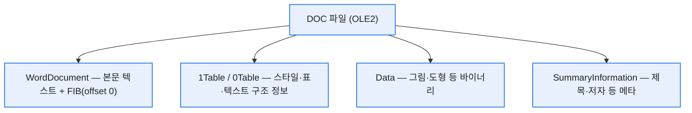
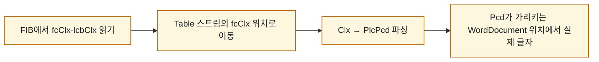

# 워드 DOC와 DOCX는 속이 왜 이렇게 다른가

> HWP를 뜯어본 김에 워드도 열어봤다. `.docx`는 예상대로 금방 풀렸는데 — 사실 압축된 XML 묶음이니까 — 구형 `.doc`는 HWP처럼 바이너리라 또 미로였다. 재밌는 건 이 대비가 HWP·HWPX와 똑같다는 거다. **바이너리 vs XML**, 오래된 포맷의 숙명 같은 갈림길. 한컴 개발 블로그의 DOC·DOCX 시리즈(유영·정다소 님)를 길잡이 삼아 그 속을 정리했다.

## DOC와 DOCX, 뿌리부터 갈린다

| | .doc (97~2003) | .docx (2007~) |
|---|---|---|
| 저장 방식 | **OLE2 바이너리** (Compound File) | **XML들을 ZIP으로** 묶음 (OOXML) |
| 표준 | [MS-DOC] 명세 | 국제표준 ISO/IEC 29500 |
| 사람이 읽기 | 거의 불가(헥사) | XML이라 읽힘 |
| 손상 취약성 | 1바이트만 깨져도 위험 | 파일 단위라 상대적으로 안전 |

HWP(바이너리) → HWPX(XML)로 간 것과 판박이다. 옛 포맷은 용량을 아끼려 바이너리로 짰고, 개방성·호환성을 위해 XML로 옮겨갔다.

## DOC는 왜 '미로'인가?

`.doc`도 HWP처럼 **OLE2** — 파일 하나 안에 폴더 구조(Storage/Stream)가 든 형식이다. 주요 스트림은 이렇게 나뉜다.



핵심은 **FIB(File Information Block)** 다. WordDocument 스트림의 맨 앞(offset 0)에 있고, "무슨 데이터가 어디에 몇 바이트로 있는지"를 알려주는 지도다. 거의 모든 데이터는 이 FIB를 기준점으로 위치(fc)와 크기(lcb)를 찾는다. 또 하나 알아둘 개념이 **CP(Character Position)** — 문서 내 문자의 논리적 인덱스다. `Hello!`라면 CP0~CP6(문자 수 +1)로 잡힌다.

## 텍스트 하나 읽는데 왜 이렇게 멀리 도나?

DOC의 진짜 난이도는 여기다. '가' 한 글자를 읽으려 해도 스트림을 몇 번이나 건너뛴다.



풀어보면 이렇다. ① FIB에서 '텍스트 정보(Clx)가 어디 있는지'(fcClx)를 읽고 → ② Table 스트림의 그 위치로 가서 Clx를 꺼내고 → ③ Clx 안 **PlcPcd**(CP 배열 + Pcd 배열)를 파싱하고 → ④ Pcd가 가리키는 **WordDocument 스트림의 물리적 위치**에서 진짜 글자를 읽는다. 논리 위치(CP)와 물리 위치(Pcd)를 따로 두고 이어붙이는 구조라, 한 글자도 '지도 따라 보물찾기'다.

여기서 자주 보는 접두어도 정리해두면 편하다. **PLC**는 'CP 배열 + 데이터 배열'(데이터 개수 = CP 개수 −1), **STTB**는 헤더 달린 문자열 배열, **RG**는 그냥 단순 반복 배열이다. 접두어만 봐도 구조가 대충 그려진다.

## DOCX는 왜 이렇게 편한가?

`.docx`는 확장자를 zip으로 바꿔 풀면 폴더가 쏟아진다.

```
내문서.docx/
├── [Content_Types].xml
├── word/
│   ├── document.xml    ← 실제 본문
│   ├── styles.xml      ← 스타일
│   ├── numbering.xml   ← 목록
│   └── media/          ← 이미지 원본
└── docProps/core.xml   ← 제목·저자 메타
```

본문 텍스트는 **p → r → t** 3단 계층으로 담긴다. w:p(문단) 안에 w:r(같은 서식의 텍스트 묶음), 그 안에 w:t(실제 문자). 그래서 t 태그 안 텍스트만 긁어도 본문이 나온다. DOC의 보물찾기와 비교하면 천국이다.


## DOCX에 왜 '페이지'가 없을까?

의외의 사실 하나. `.docx`엔 "1페이지가 어디서 끝나는지" 정보가 없다. 워드 문서는 종이가 아니라 **흐르는 스트림**으로 설계됐기 때문이다. HTML처럼, 창 너비·폰트·OS 렌더링에 따라 한 줄 글자 수가 달라지니 페이지는 **여는 순간 계산**한다. 대신 페이지 방향·여백 같은 규칙은 **섹션**(w:sectPr) 단위로 담는다.

단위도 독특하다. 여백에 `1440`, 이미지 크기에 `914400` 같은 큰 정수가 찍히는데, 오타가 아니라 **부동소수점 오차를 원천 차단하려는 정수 단위**다.

| 단위 | 용도 | 관계 |
|---|---|---|
| Twip | 레이아웃(여백·너비) | 1 inch = 1440 twip |
| Half-point | 글자 크기(w:sz) | 12pt → val=24 |
| EMU | 이미지·도형 | 1 inch = 914400 EMU |

## 오늘의 정리

HWP·HWPX 때와 똑같은 교훈이었다. 옛 포맷(DOC·HWP)은 **바이너리라 지도(FIB)를 따라 오프셋을 좇는** 세계고, 새 포맷(DOCX·HWPX)은 **XML이라 태그만 긁으면 되는** 세계다. 그래서 내 추출기도 docx/xlsx/pptx 같은 OOXML은 파이썬 네이티브로 금방 붙었고, 구형 바이너리만 전용 파서가 필요했다. '왜 어떤 파일은 쉽고 어떤 건 어려운가'의 답이, 결국 이 바이너리 대 XML 한 줄에 다 있었다.

*참고: 한컴디벨로퍼 블로그 '워드 문서 파일 형식' 시리즈(유영·정다소 님, 2026), [MS-DOC]·OOXML(ISO/IEC 29500) 공식 명세. 구조 설명은 원 시리즈를 바탕으로 재구성했습니다.*
