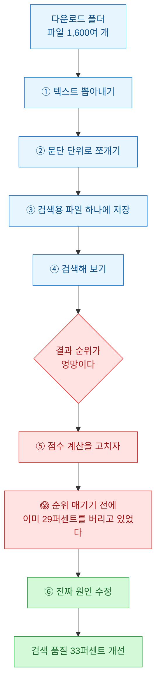
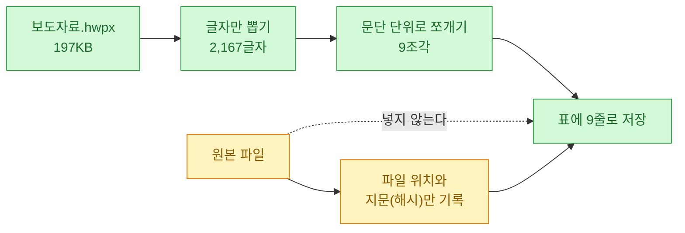
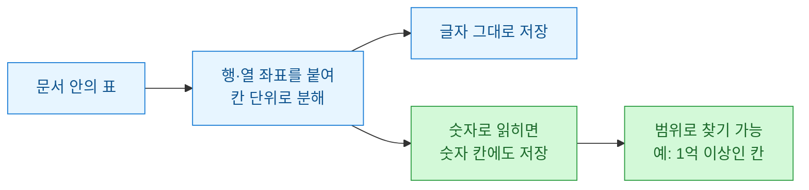
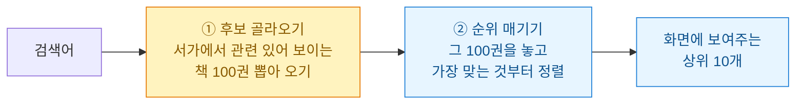
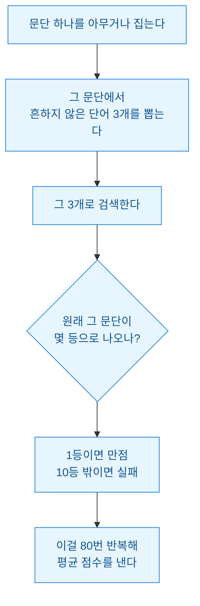
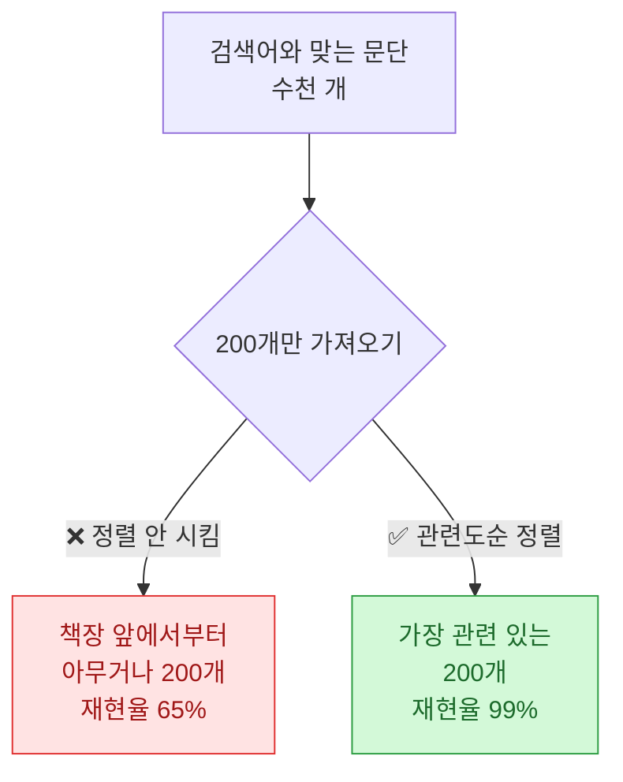
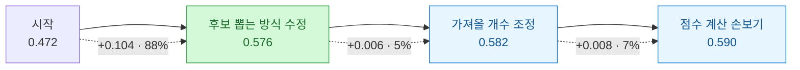

다운로드 폴더를 열었다가 한숨이 나왔다. PDF 296개, 한글 파일 149개, 엑셀 88개. 전부 언젠가 쓸 것 같아서 받아 둔 보도자료와 자료집인데, **정작 필요할 때 어디 있는지 못 찾는다.**

윈도우 검색은 파일 이름만 찾아 준다. 파일 안에 뭐라고 쓰여 있는지는 모른다. 그래서 매번 폴더를 뒤지다가 포기하고 다시 인터넷에서 받는다.

그래서 만들기로 했다. **파일 안의 내용까지 검색되는 도구.** 만드는 것 자체는 반나절이면 됐는데, 그 뒤에 **내가 짠 코드에 속는 경험**을 했다. 그 얘기를 쓰려고 한다.

## 오늘 한 일 전체 흐름



⑤에서 ⑥으로 넘어가는 대목이 오늘의 전부다.

## "파일을 DB에 넣는다"는 게 대체 무슨 뜻인가?

여기부터 헷갈렸다. 나도 처음엔 **PDF 파일을 통째로 어딘가에 집어넣는 것**인 줄 알았다.

아니었다. **DB(데이터베이스)는 잘 정리된 표 여러 장이 든 파일 하나**라고 생각하면 된다. 엑셀 파일 하나에 시트가 여러 장 있는 것과 비슷하다. 그러니 PDF를 그대로 넣을 수가 없다. **글자만 뽑아서 표의 행(줄)으로 만들어 넣는 것**이다.



실제로 금융위 보도자료 한글 파일(197KB) 하나를 넣어 봤더니 **9줄**이 됐다. 원본 파일은 그대로 폴더에 두고, DB에는 **어디 있는지 주소와 지문만** 남긴다. 지문을 남기는 이유는 다음에 돌릴 때 **안 바뀐 파일은 건너뛰기 위해서**다.

| DB에 들어가는 것 | 안 들어가는 것 |
|---|---|
| 뽑아낸 글자 (문단 단위 줄) | 원본 파일 그 자체 |
| 표의 칸 값 (몇 행 몇 열인지 포함) | 글꼴·색·이미지 |
| 파일 위치 + 지문 + 처리 상태 | 파일 사본 |

이렇게 1,633개 파일을 넣으니 **문단 70,862줄, 표 6,467개, 표 안의 칸 133,511개**가 됐다.

## 표는 왜 따로 빼야 했나?

처음엔 표도 그냥 글자로 뽑았다. 그랬더니 이렇게 됐다.

```
| 보도시점 | 배포시 | 배포 | 2025.12.12.(금) 10시 |
```

읽을 수는 있는데 **쓸모가 없다.** "매출 100억 넘는 줄 찾아줘" 같은 걸 못 한다. 숫자가 숫자로 안 들어가 있고 그냥 글자 뭉치라서다.

그래서 표는 **몇 행 몇 열인지 좌표를 붙여서 따로** 저장했다. 그리고 칸 값이 숫자로 읽히면 숫자 칸에도 같이 넣었다.



이렇게 하니 **숫자 칸이 30,510개** 잡혔다. 이제 금액 범위로 검색이 된다.

## 한국어 검색은 왜 이렇게 까다로운가?

여기서 예상 못 한 벽을 만났다.

검색을 빠르게 하려면 **색인**이 필요하다. 책 맨 뒤에 있는 "찾아보기"와 같다. 어떤 단어가 몇 쪽에 나오는지 미리 적어 두는 것이다. 그런데 **한국어는 그 색인을 만드는 방식이 두 가지**고, 둘 다 반쪽짜리였다.

두 방식을 실제로 재 봤다.

| 내가 검색한 말 | 방식 A (세 글자씩 자르기) | 방식 B (띄어쓰기로 자르기) |
|---|---|---|
| **수습** (두 글자) | 🔴 **0건** | 3건 |
| **AI** (두 글자) | 🔴 **0건** | — |
| **회계사** | ✅ 6건 | 🔴 **0건** |

이게 왜 이러냐면 이렇다.

**방식 A는 글자를 세 개씩 잘라서 색인**한다. "공인회계사"를 `공인회`, `인회계`, `회계사`로 쪼개 둔다. 그래서 **"회계사"로 검색하면 "공인회계사" 안에 있는 걸 찾아낸다.** 대신 세 글자씩 쪼갰으니 **두 글자로는 검색이 안 된다.** "수습", "AI", "세법" 같은 중요한 말들이 통째로 안 잡힌다.

**방식 B는 띄어쓰기 기준**이다. 두 글자도 잘 찾는다. 대신 **"공인회계사"는 한 덩어리**라서, "회계사"로 검색하면 못 찾는다. 앞부분만 맞춰 보는 검색을 써도 안 된다 — "회계사"가 앞이 아니라 **중간**에 있으니까.

한국어는 한자어를 붙여 쓰는 게 워낙 흔하다. 공인**회계사**, 이연**법인세**, 손금**산입**. 그래서 이 문제가 계속 터진다.

**답은 둘 다 쓰는 것이었다.** 찾아내는 건 A가, 순위 매기는 건 B가 담당하고, 두 글자짜리는 그냥 통째로 훑는 방식으로 메웠다.

⚠️ 이걸 실제로 재 보지 않고 하나만 골랐다면, **어느 쪽을 골랐든 절반은 못 찾았을 것이다.**

## 검색은 왜 두 단계로 나뉘나?

이 구조를 알아야 다음 얘기가 이해된다. 검색은 한 번에 되는 게 아니라 **두 단계**다. 도서관에 비유하면 이렇다.



여기서 중요한 게 있다. **①에서 안 가져온 책은 ②에서 아무리 정렬을 잘해도 나올 수가 없다.**

너무 당연한 말인데, 나는 이걸 잊고 ②만 몇 시간 만졌다.

## 순위가 이상해서 점수 계산을 고치려던 참이었다

검색은 됐는데 원하는 게 위에 안 떴다. 그래서 점수 계산을 손보기로 했다. 제목에 있으면 몇 점, 본문에 있으면 몇 점, 이런 걸 조절하는 작업이다.

그런데 **고치기 전에 지금이 얼마나 나쁜지부터 재야** 뭐가 나아졌는지 알 수 있다. 그래서 채점표를 먼저 만들었다.

정답지가 없는 게 문제였다. "이 검색어엔 이 문서가 정답"이라고 사람이 일일이 달아야 하는데, 그럴 시간이 없다. 그래서 이렇게 했다.



**답을 아는 문제를 스스로 내고 스스로 푸는 것**이다. 사람이 정답을 안 달아도 되고, 뭔가 고치면 점수가 바로 반응한다.

그리고 여기에 **하나를 더 쟀다.** 이게 오늘의 전환점이었다 — **"정답이 ① 단계에서 후보로 뽑히기라도 했나?"**

## 순위 매기기 전에 이미 29퍼센트를 버리고 있었다

첫 채점 결과다.

```
1등으로 맞힌 비율   39.3%
10등 안에 든 비율   63.3%
후보에 들어오기라도 한 비율   70.7%   ← 여기
```

마지막 줄을 보고 멈췄다. **정답이 후보로 뽑히기라도 한 게 70.7퍼센트.** 나머지 **29퍼센트는 순위를 매기기도 전에 이미 사라졌다.**

점수 계산을 아무리 정교하게 만들어도 소용없는 손실이다. 없는 책은 정렬할 수 없으니까.

원인은 내가 짠 이 한 줄이었다.

```sql
-- 관련된 것 200개만 가져와라
SELECT 문단 FROM 색인 WHERE 색인 MATCH '검색어' LIMIT 200
```

문제는 **"관련된 것"이라고 썼지만 정렬을 안 시켰다는 것**이다.

도서관 비유로 돌아가면 이렇다. 사서에게 **"관련 있는 책 200권만 가져와"**라고 했는데, **"어떤 게 관련 있는지"를 안 알려줬다.** 그러니 사서가 **책장 맨 앞에서부터 그냥 200권**을 집어 왔다. 검색어와 관련이 있든 없든.



## 그래서 후보 뽑는 방식을 다시 짰다

전략을 여러 개 재 봤다.

| 후보 뽑는 방식 | 정답이 들어온 비율 | 가져온 개수 |
|---|---|---|
| 기존 (정렬 없이 200개) | **65.3%** | 143개 |
| 정렬 없이 5,000개로 늘리기 | 98.7% | 392개 |
| **단어를 전부 포함한 것만** | **96.7%** | **34개** |
| 관련도순 정렬 후 200개 | 99.3% | 164개 |
| **위 둘을 합치기** | **100%** | 328개 |

세 번째 줄이 인상적이었다. **"검색한 단어를 전부 포함한 문단만"** 가져오게 했더니, **가져오는 양은 5분의 1로 줄었는데 정답률은 65%에서 97%로 뛰었다.** 당연하다면 당연하다 — 단어 세 개를 다 가진 문단은 애초에 얼마 없고, 그런 게 정답일 확률이 높다.

여기에 관련도순 정렬을 합치니 **정답이 후보에서 빠지는 일이 아예 없어졌다.**

**결과가 이랬다.**

| 지표 | 이전 | 이후 |
|---|---|---|
| 후보에 정답이 들어온 비율 | 70.7% | **100%** |
| 1등으로 맞힌 비율 | 39.3% | 46.0% |
| 10등 안에 든 비율 | 63.3% | **84.0%** |

**점수 계산은 한 글자도 안 고쳤다.** 후보 뽑는 방식만 바꿨다.

## 그런데 채점표 자체가 틀렸던 적도 있다

이 얘기도 해야 공평하다.

처음에 점수 계산을 이리저리 바꿔 가며 채점했는데, 결과가 이상했다.

| 실행 | 설정 | 점수 |
|---|---|---|
| 1회차 | 기본값 | 0.695 |
| 1회차 | **기본값과 똑같은 설정** | 0.684 |
| 2회차 | 기본값 | **0.549** |

**똑같은 설정인데 점수가 다르다.** 이러면 뭘 고쳐도 나아졌는지 알 수가 없다.

원인은 어이없었다. **파일을 넣는 작업이 뒤에서 계속 돌고 있었다.** 채점하는 동안에도 문서가 계속 늘고 있으니, 경쟁하는 후보가 많아져서 같은 검색어도 순위가 밀린 것이다.

**시험 보는 도중에 문제집이 두꺼워지고 있었던 셈이다.**

그래서 채점 전에 **데이터를 복사해서 얼려 두는 기능**을 넣었다. 지금은 같은 설정으로 세 번 돌리면 세 번 다 같은 값이 나온다.

> ⭐ **뭘 고치기 전에, 재는 도구부터 믿을 수 있는지 확인해야 한다.** 같은 걸 두 번 재서 같은 값이 나오는지. 이걸 안 했으면 이후 작업이 전부 헛수고였다.

## 마지막으로 점수 계산도 손봤다 — 그런데 거의 안 움직였다

이제 후보 문제가 해결됐으니 진짜로 점수 계산을 만질 차례였다. 값을 하나씩 바꿔 가며 재 봤다.

그런데 여기서 **또 속을 뻔했다.**

어떤 값을 바꿨더니 점수가 올랐다. 적용하려다가, 혹시 몰라 **문제를 다른 걸로 바꿔서 네 번 더** 재 봤다.

| 설정 | 문제세트1 | 세트2 | 세트3 | 세트4 | **평균** |
|---|---|---|---|---|---|
| 기본값 | 0.590 | 0.588 | 0.564 | 0.588 | **0.5824** |
| 바꾼 값 | **0.592** ⭐ | 0.587 | **0.553** 🔴 | 0.597 | **0.5820** ❌ |

**첫 세트에서 제일 좋았던 값이, 평균으로는 기본값보다 나빴다.** 세트3에서 크게 무너진다.

80문제 한 세트로 재면 이 정도 차이는 **그냥 운**이다. 문제를 어떤 걸 뽑느냐에 따라 오르락내리락한다. 그걸 "개선"으로 착각하고 적용했다면, 실제 검색은 더 나빠졌을 것이다.

네 세트 평균으로 다시 걸러 보니 **실제로 도움이 되는 건 두 개뿐**이었고, 개선 폭은 0.008이었다.

## 그래서 결국 뭐가 얼마나 기여했나



**개선의 88퍼센트가 "후보를 제대로 가져오게 한 것"에서 나왔다.** 내가 처음에 고치려던 점수 계산은 다 합쳐서 7퍼센트였다.

그리고 여기에 재밌는 게 하나 더 있다. 가져올 후보 개수를 **500개에서 100개로 줄였더니 결과가 오히려 좋아졌다.** 많이 가져올수록 좋을 줄 알았는데 반대였다 — **관련 없는 것들이 섞여 들어와 좋은 걸 밀어냈다.** 게다가 속도까지 빨라졌다.

## 측정 안 된 것과 효과 없는 것은 다르다

마지막으로 하나만 더. 이건 스스로 조심한 대목이다.

점수 계산 항목 중에 **"검색어 전체가 그대로 들어 있으면 가산점"**이라는 게 있다. 채점해 보니 **점수 변화가 정확히 0**이었다. 쓸모없으니 빼자는 생각이 자연스럽게 들었다.

그런데 채점 방식을 다시 봤다. 내 채점은 **문단에서 흩어진 단어 3개를 뽑아** 검색어로 쓴다. 그러니 **"검색어 전체가 그대로 들어 있는 경우"가 구조적으로 절대 생기지 않는다.** 가산점이 작동할 기회 자체가 없었던 것이다.

실제 사람은 "공인회계사 수습 개선"처럼 **붙여서** 검색한다. 그때는 작동한다.

> **"측정되지 않았다"를 "효과가 없다"로 읽으면 안 된다.** 채점표가 못 보는 구석이 어디인지도 같이 알고 있어야 한다.

그래서 이 항목은 지우지 않고 **"현재 채점 방식으로는 측정 불가"라고 주석만 달아** 뒀다.

## 오늘 남은 것

만든 결과물은 단순하다. 폴더를 지정하면 그 안의 PDF·한글·엑셀을 전부 읽어서 검색 가능한 파일 하나로 만들어 준다. 지금 `"공인회계사 수습"`으로 검색하면 관련 보도자료가 1·2등으로 뜨고, PDF 표 안에 파묻힌 숫자도 찾아낸다.

그런데 **도구보다 오래 남을 것 같은 건 세 문장**이다.

- **문제는 느린 곳이 아니라 버려지는 곳에 있을 수 있다.** 나는 "순위가 이상하다"는 증상만 보고 순위 계산을 고치려 했다. 정작 정답의 29퍼센트는 순위 계산에 도달하지도 못하고 있었다. 증상이 보이는 자리와 원인이 있는 자리가 달랐다.
- **고치기 전에 재는 도구부터 믿을 수 있게 만든다.** 같은 걸 두 번 재서 다른 값이 나오면, 그 뒤 작업은 전부 모래 위다. 나는 이걸 늦게 알아차렸다.
- **한 번 재고 좋아진 것 같으면 한 번 더 다르게 재 본다.** 첫 시험에서 최고였던 값이 평균으로는 손해였다. 표본이 작으면 개선과 우연을 구별할 수 없다.

이건 검색 도구 얘기지만, 숫자를 보고 뭔가를 판단하는 일이면 어디든 같다고 생각한다. 마케팅 지표를 볼 때도, 실험 결과를 볼 때도. **개선한 것 같은 기분과 실제로 개선된 것은 다르고, 그 둘을 가르는 건 결국 잴 줄 아느냐**다.
