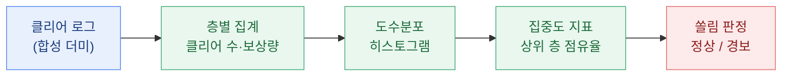
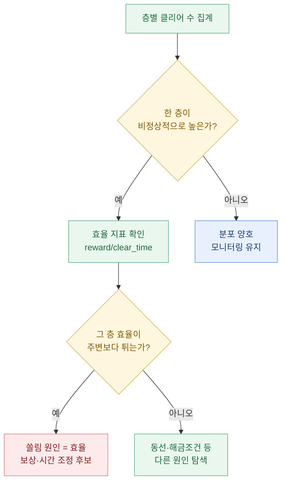
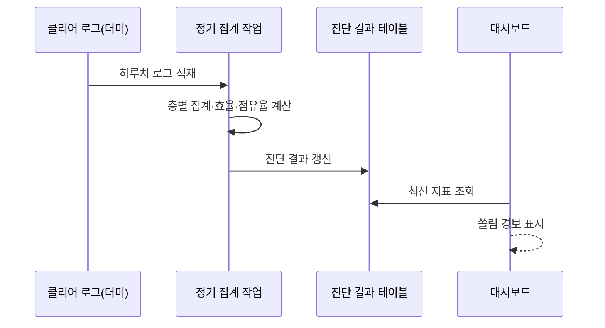

> "유저가 '가장 효율 좋은 한 층'만 무한 반복하고 있다면, 그건 재미가 아니라 밸런스가 새는 소리다."

던전을 새로 열 때마다 기획팀이 늘 걱정하는 게 있다. "혹시 유저들이 특정 층만 계속 돌면서 보상을 쓸어 담고, 나머지 콘텐츠는 텅 비어버리는 거 아냐?" 감으로는 다들 안다. 그런데 "그 감이 진짜인지" 숫자로 보여달라는 요청이 오면, 결국 내 자리로 온다. 오늘은 그 요청을 어떻게 클리어 로그 하나로 풀어냈는지, 내 작업 일기처럼 적어본다. (참고로 이 글의 모든 데이터·수치·던전 이름은 전부 합성한 더미 예시다. 실제 서비스 데이터가 아니다.)

## 애초에 '보상 쏠림'이 왜 문제일까?

쏠림(skew)이라는 말을 먼저 풀어보자. 원래 의도대로라면 유저는 자기 성장 단계에 맞는 여러 난이도·층을 골고루 돈다. 초보는 낮은 층, 고인물은 높은 층. 그런데 어떤 층의 "시간 대비 보상 효율"이 유독 좋으면, 실력과 상관없이 모두가 그 한 층으로 몰린다. 이게 쏠림이다.

쏠림이 심해지면 세 가지가 무너진다.

| 무너지는 것 | 증상 | 왜 나쁜가 |
| --- | --- | --- |
| 콘텐츠 수명 | 특정 층만 붐비고 나머지는 유령 던전 | 만든 콘텐츠의 대부분이 안 쓰임 |
| 경제 밸런스 | 특정 보상만 과잉 공급 | 재화 인플레·아이템 가치 폭락 |
| 성장 경험 | 다음 단계로 갈 이유가 사라짐 | 유저가 "할 게 없다"고 느낌 |

그래서 내 목표는 하나다. "정말 한 층으로 쏠렸는지, 쏠렸다면 얼마나 심한지"를 반박 불가능한 숫자로 만드는 것.

## 어떤 로그가 있어야 진단이 될까?

거창한 데이터 웨어하우스가 필요한 게 아니다. 클리어 한 건이 한 행으로 남는 로그면 충분하다. 최소 스키마는 이 정도다. (컬럼명은 전부 예시다.)

| 컬럼 | 의미 | 예시 값 |
| --- | --- | --- |
| user_id | 유저 식별자(해시) | u_00417 |
| dungeon_id | 던전 종류 | dg_forest |
| difficulty | 난이도 | normal / hard / hell |
| floor | 층 | 1 \~ 30 |
| cleared_at | 클리어 시각 | 2026-07-01 21:14 |
| reward_value | 그 판에서 얻은 보상 환산치 | 320 (더미 포인트) |
| clear_time_sec | 클리어 소요 시간(초) | 88 |

여기서 내가 파생시키는 핵심 지표가 하나 있다. 바로 "효율", 즉 `reward_value / clear_time_sec` 다. 초당 얼마를 버는가. 유저는 무의식적으로 이 효율이 가장 높은 곳으로 모인다. 그래서 이 값이 유독 튀는 층이 있으면, 그 층이 바로 쏠림의 진원지일 확률이 높다.

## 쏠렸는지 어떻게 눈으로 확인하지? — 도수분포

가장 먼저 하는 건 언제나 도수분포(히스토그램)다. 어려운 말 같지만 별거 없다. "각 구간에 몇 건이 들어있는지 세서 막대로 그리는 것"이다. 여기서는 층을 가로축에 놓고, 그 층의 클리어 횟수를 세로 막대로 세운다.

이걸 처음 배우던 시절, 나는 이 단순한 막대 그림 하나가 회의실의 논쟁을 몇 번이나 끝내는지를 보고 놀랐다. 말로 "많이 도는 것 같아요"는 반박당하지만, 한 층만 천장을 뚫는 막대는 아무도 못 이긴다.

합성 예시로 하드 난이도 층별 클리어 수를 세어보니 이런 모양이 나왔다고 하자.

| 층 | 클리어 수(더미) | 전체 대비 |
| --- | --- | --- |
| 12층 | 1,200 | 6% |
| 13층 | 1,350 | 7% |
| 14층 | 1,500 | 8% |
| 15층 | 11,800 | 60% |
| 16층 | 1,100 | 6% |
| 17층 | 980 | 5% |
| 그 외 | 1,600 | 8% |

15층 하나가 전체의 60%를 먹었다. 도수분포를 그리면 15층만 혼자 하늘을 찌른다. 이게 전형적인 쏠림 신호다. 왜 15층이냐? 앞서 만든 효율 지표를 붙여보면 답이 보인다. 15층의 초당 보상이 옆 층보다 눈에 띄게 높았던 것. 유저는 정직하게 가장 이득인 곳으로 갔을 뿐이다.

## '얼마나 심한지'를 한 숫자로 말할 수 있을까? — 집중도 지표

막대 그림은 직관적이지만, 리포트에 "쏠림 60%"처럼 한 줄로 못 박으려면 숫자 지표가 필요하다. 나는 보통 두 가지를 같이 쓴다.

첫째, 상위 점유율. "가장 많이 도는 상위 1개(또는 3개) 층이 전체의 몇 퍼센트를 차지하는가." 위 예시라면 상위 1개 층 점유율이 60%다. 계산이 쉽고 비개발자에게 설명하기도 좋아서, 대시보드 맨 위에 올리는 대표 숫자로 애용한다.

둘째, 분위수(percentile) 기반 확인. 클리어 로그를 유저별로 묶어 "한 유저가 며칠 동안 얼마나 같은 층만 반복했는가"를 볼 때 유용하다. 예를 들어 하위 25%, 중앙값, 상위 25% 유저의 "반복 집중도"를 나란히 보면, 쏠림이 소수 헤비 유저만의 현상인지 전체 유저의 보편적 행동인지가 갈린다. 예전에 성장·과금 분포를 볼 때 이 분위수 라인(25/50/75%)을 자주 썼는데, 던전 반복 패턴에도 그대로 응용된다.

| 지표 | 계산 방법 | 읽는 법 |
| --- | --- | --- |
| 상위 1층 점유율 | 최다 층 클리어수 / 전체 | 40% 넘으면 경보 |
| 상위 3층 점유율 | 상위 3개 합 / 전체 | 70% 넘으면 위험 |
| 유저별 반복 집중도(중앙값) | 유저마다 최다 층 비중의 중앙값 | 높을수록 "한 곳만 판다" |

숫자 기준(40%, 70%)은 절대 진리가 아니다. 던전 개수와 설계 의도에 따라 다르다. 다만 한 번 기준선을 정해두면, 패치 전후로 이 값이 어떻게 움직이는지 추적하는 게 핵심이다.

## 이 진단을 매번 손으로 돌려야 할까? — 자동화

여기까지는 한 번 분석하면 끝나는 일회성 작업처럼 보인다. 하지만 던전 밸런스는 살아있는 생물이라, 패치 한 번에 쏠림 진원지가 옮겨 다닌다. 그래서 나는 이 진단을 "매일 아침 자동으로 갱신되는 것"으로 만들어 둔다.

방식은 단순하다. 층별 집계와 상위 점유율 계산을 하나의 저장 프로시저(stored procedure) 같은 정기 작업으로 감싸고, 하루치 로그가 쌓이면 자동으로 결과 테이블을 새로 쓴다. 그리고 그 결과를 대시보드가 읽어간다. 그러면 기획자는 SQL을 몰라도, 아침에 대시보드만 열면 "어제 어느 층이 얼마나 쏠렸는지"를 본다.

이렇게 해두면 진단이 "이벤트"가 아니라 "상태"가 된다. 밸런스는 한 번 맞추고 끝나는 게 아니라 계속 지켜봐야 하는 거니까.

## 그래서 무엇을 바꾸라고 말할까?

데이터 분석가의 일은 "쏠렸다"에서 끝나면 안 된다. 그다음 한 문장, "그러니 이렇게 손보자"까지 가야 한다. 위 예시의 15층 쏠림이라면 내가 제안할 카드는 대략 이렇다.

- 효율 평탄화: 15층 보상을 줄이는 게 아니라, 주변 층 효율을 15층 근처로 끌어올려 선택지를 넓힌다. (뺏기보다 채우는 쪽이 유저 반발이 적다.)
- 해금·동선 손질: 15층만 진입 조건이 유독 헐거웠다면, 다음 층으로 넘어갈 이유(신규 보상·재료)를 만든다.
- 반복 상한: 하루 보상 한도를 둬서, 한 층 무한 반복의 이득을 자연스럽게 깎는다.

어떤 카드를 쓰든, 패치 후에 같은 진단을 다시 돌려서 상위 점유율이 60%에서 얼마나 내려왔는지 확인한다. 숫자가 안 움직이면 처방이 틀린 거다. 이 "진단 → 처방 → 재진단" 루프가 밸런스 작업의 전부라고 해도 과언이 아니다.

## 마무리

오늘 한 일을 요약하면 이렇다. 거창한 모델 없이, 클리어 로그 한 장에서 (1) 도수분포로 쏠림을 눈으로 보고, (2) 상위 점유율·분위수로 심각도를 숫자화하고, (3) 정기 작업으로 자동화한 뒤, (4) 처방과 재진단 루프로 연결했다.

내가 늘 되새기는 건 이거다. 유저는 거짓말을 하지 않는다. 그들이 한 층으로 몰렸다면, 그 층이 제일 이득이라고 우리 게임이 말하고 있는 것이다. 분석가는 그 무언의 목소리를 숫자로 번역해 기획팀 앞에 놓아주는 사람이다. 오늘도 나는 막대 하나를 그려서, 회의실의 "그런 것 같아요"를 "60%입니다"로 바꿔놓았다.

## 참고자료

- [[game-metrics-7-definitions]] — 픽률·효율 등 기본 지표 정의
- [[game-data-sql-recipes-retention-ltv]] — 집계·분위수 SQL 레시피
- [[pick-rate-content-homogenization]] — 쏠림이 콘텐츠 획일화로 이어지는 사례
- [[revenue-simulation-dau-pu-arppu]] — 분포·시뮬레이션으로 밸런스 보기
- game-data-recipes 저장소: https://github.com/DBhyeong/game-data-recipes

<!-- 안전: 합성/더미 데이터, 회사·실데이터·PII 없음. -->
