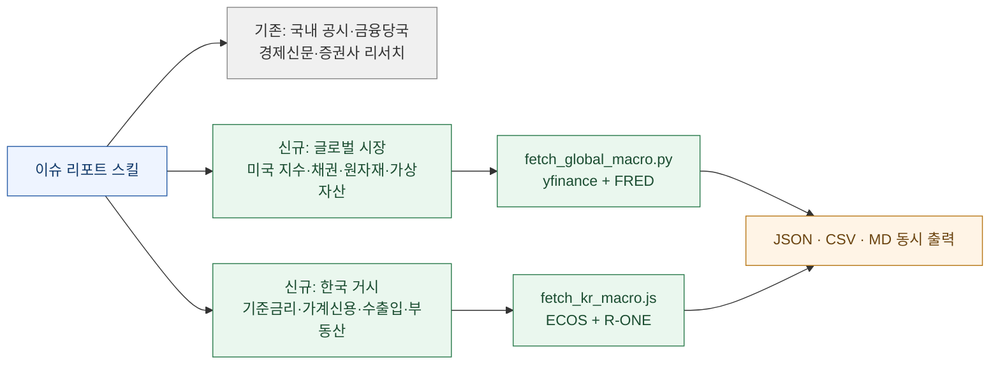
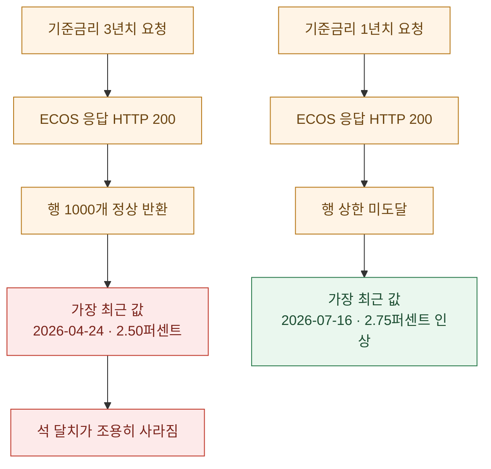
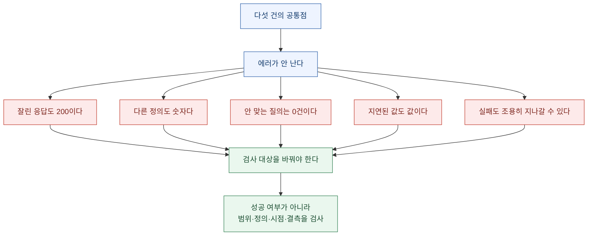

매일 아침 이슈 리포트를 만드는 스킬이 하나 있다. 전자공시와 금융당국 발표, 경제신문 헤드라인을 하나로 합치는 물건이다. 여기에 오늘 **글로벌 시장과 한국 거시 레이어**를 붙였다.

작업 자체는 수집기 두 개를 새로 쓰는 일이었다. 다 짜고 실행했더니 **전부 성공**으로 끝났다. 시세 65종목 중 65개, ECOS 101개 지표, 부동산 통계 3개 표. 실패 0건.

그런데 출력물을 눈으로 훑다가 하나가 걸렸다.

**기준금리가 2.50퍼센트로 찍혀 있었다.** 7월 16일에 2.75퍼센트로 인상됐는데.

에러는 없었다. 경고도 없었다. HTTP 200이었고 JSON은 정상이었고 행 개수도 넉넉했다. 다만 **그 안에 최근 석 달이 없었다.**

> **수집 성공은 원한 걸 가져왔다는 뜻이 아니다. 스크립트는 앞의 것만 검사한다.**

지난주에도 같은 문장을 썼다. 그때는 티커가 없어서 값이 안 나오는 경우와, 값은 나오는데 다른 값인 경우를 나눴다. 오늘 건은 그중 나쁜 쪽인데, 한 단계 더 고약하다. **값도 나오고 형식도 맞는데 범위가 잘렸다.**

## 무엇을 붙였나

먼저 결과물부터. 기존 스킬은 국내 공시와 금융당국 중심이었고, 여기에 두 레이어를 얹었다.

| 파일 | 상태 | 내용 |
|---|---|---|
| `SKILL.md` | 개편 (147줄) | 트리거에 미국 증시·FOMC·글로벌·아시아·환율·귀금속·가상자산·기준금리·가계부채·부동산·수출입 추가. 절차에 병렬 수집 단계와 FOMC 웹 교차검증 단계 신설. 리포트 템플릿 15개 섹션으로 확장 |
| `scripts/fetch_global_macro.py` | 신규 (409줄) | 키 불필요. yfinance 65종목 + FRED 20시리즈 |
| `scripts/fetch_kr_macro.js` | 신규 (503줄) | 환경변수 키 사용. ECOS + 부동산원 R-ONE + 수출입은행 |
| `references/market_macro.md` | 신규 (168줄) | 티커·FRED 코드·ECOS 코드·R-ONE 표 ID 전부 + 실측 함정 + 조합 판정 매트릭스 |

### 두 수집기가 실제로 덮는 범위

| 수집기 | 범위 |
|---|---|
| 글로벌 (파이썬) | 미국 지수·AI 반도체·빅테크 / 미국채 2년·5년·10년·30년·달러지수 / 일본 / 아시아 / 환율 / 유가·가스 / 금·은·구리·백금 / 주요 가상자산 — **65종목** |
| 한국 거시 (노드) | 한국은행 핵심통계 목록 **1콜에 101지표** + 시계열 8종(기준금리·가계신용·가계대출·수출입·물가·환율) + 부동산원 주간 아파트 매매·전세·수급 + 수출입은행 매매기준율 |

한국 쪽에서 설계상 이득이 컸던 건 **핵심통계 목록을 한 번에 받는 엔드포인트**였다. 지표를 하나씩 코드로 지정해 개별 호출하면 호출 수가 늘고 그만큼 실패 지점도 늘어난다. 목록 엔드포인트는 한 번에 101개를 주므로, **대시보드에 쓸 최신 스냅샷은 이걸로 덮고 시계열이 필요한 것만 따로 호출**하는 2단 구조가 된다.

그런데 바로 그 "따로 호출하는 시계열" 쪽에서 오늘 사고가 났다.

### 왜 새 스킬을 안 만들었나

이게 첫 번째 설계 결정이었고, 결론은 **기존 스킬을 확장**하는 쪽이었다.

이유는 하나다. **트리거 충돌**이다.

"오늘 이슈"라는 말로 발동하는 스킬이 둘이 되면, 어느 쪽이 잡힐지가 그때그때 달라진다. 사용자가 같은 말을 했는데 어떤 날은 공시만 나오고 어떤 날은 거시만 나오는 상황이 된다. 이건 기능이 부족한 것보다 나쁘다. **결과가 불안정한 것보다 예측 가능하게 부족한 게 낫다.**

그래서 새 파일을 만드는 대신 기존 스킬의 트리거 목록과 절차, 템플릿을 넓혔다. 오늘 오전 글에서 다룬 HANDBOOK.md 이야기와 이어 붙이면 이유가 더 분명해진다. **문서가 길어질수록 그 안의 조항이 지켜질 확률은 떨어진다.** 그런데 스킬이 둘로 갈리면 조항이 지켜지느냐 이전에 **어느 문서가 읽히느냐**부터 불확실해진다. 그건 다른 층위의 실패다.

### 절차에 웹 교차검증 단계를 따로 넣은 이유

이번 개편에서 절차 단계를 두 개 신설했는데, 그중 하나가 **FOMC 결과의 웹 교차검증**이다. 그리고 이 단계에는 확인해야 할 항목을 명시적으로 박아 뒀다. **표결 수, 반대자 명단, 기자회견 내용**이다.

이유는 단순하다. 정책금리 값 자체는 API로 정확하게 온다. 그런데 **"동결"이라는 결과만으로는 리포트가 틀리지 않지만 쓸모가 없다.** 오늘만 해도 표결이 9대 3이고 반대가 전원 인상 쪽이었는데, 그 구성은 어떤 시계열 API에도 안 들어 있다.

그래서 수집 자동화의 경계를 이렇게 그었다.

| 성격 | 처리 |
|---|---|
| 수치로 존재하는 값 | API로 수집, 자동 |
| 결정의 구성과 맥락 | 웹 교차검증, 절차로 강제 |

이건 오늘 오전 글의 36.2퍼센트 이야기와 같은 처방이다. 반드시 지켜져야 하는 항목은 서술로 두지 않고 **절차 단계로 올린다.**

### 출력을 세 형식으로 동시에 내는 이유

두 수집기 모두 JSON·CSV·MD를 한 번에 쓴다. 중복처럼 보이지만 각각 역할이 다르다.

- **JSON**: 다음 단계 스크립트가 먹는 정본
- **CSV**: 표 계산 도구로 바로 열어 눈으로 검산하는 용도
- **MD**: 사람이 읽는 리포트에 그대로 붙는 조각

그리고 파일명에 날짜를 박아 **덮어쓰기를 금지**했다. 이유는 지난주에 정리한 그대로다. **재현이 불가능해지는 시점에 분석은 관찰기록이 된다.** 어제 FRED가 정상이었고 오늘 전량 실패했다는 사실도, 어제 파일이 남아 있어서 알 수 있었다.

## 함정 1 — 성공한 응답이 잘린 응답이었다

가장 위험했던 건이다.

한국은행 ECOS API는 **한 번 호출에 반환 행 수 상한이 1,000행**이다. 문서에도 적혀 있는 제약이고, 여기까지는 평범하다.

문제는 상한에 걸렸을 때의 **동작**이다.

**넓게 요청할수록 최신이 사라진다.** 이게 직관과 정반대다.

보통 우리는 "기간을 넓게 잡으면 데이터를 더 많이 받는다"고 생각한다. 그래서 안전하게 3년을 달라고 했다. 그런데 상한에 걸리는 순간 잘려 나간 쪽이 **오래된 데이터가 아니라 최근 데이터**였다.

그리고 이 실패는 어떤 신호도 남기지 않는다.

| 검사 항목 | 결과 |
|---|---|
| HTTP 상태 | 200 |
| JSON 파싱 | 성공 |
| 행 개수 | 1,000개 (넉넉함) |
| 필드 구조 | 정상 |
| 값 형식 | 정상 |
| **실제 최신값** | **석 달 전에서 멈춤** |

내가 스크립트에 넣어 둔 검사는 전부 통과했다. 통과할 수밖에 없다. **나는 "응답이 왔는가"를 검사했지 "응답이 오늘까지 오는가"를 검사하지 않았다.**

고친 방법은 두 가지다.

1. **요청 창을 지표별로 좁혔다.** 기준금리처럼 변동이 드문 시계열은 1년 창이면 충분하다. 3년이 필요하면 창을 나눠 여러 번 호출한다.
2. **최신 관측일 검사를 추가했다.** 각 시계열의 마지막 날짜가 오늘로부터 허용 지연일 안에 들어오는지 본다. 월간 지표는 45일, 분기 지표는 120일, 일간 지표는 5일 식으로 기준을 다르게 뒀다.

두 번째가 핵심이다. **행 개수를 세는 검사는 이 유형을 영원히 못 잡는다.** 잘렸어도 개수는 많기 때문이다. 잡히는 검사는 **"이 데이터가 언제까지 오는가"** 뿐이다.

> 하마터면 오늘 리포트에 한국 기준금리를 틀리게 쓸 뻔했다. 그것도 인상이 있었던 걸 없었던 것으로.

## 함정 2 — 같은 이름의 환율이 두 개다

ECOS의 환율 통계 코드 `731Y001`을 그대로 가져오면 **1,466.2원**이 나온다. 그런데 같은 날 KRX 종가는 **1,446.7원**이다.

**19.5원 차이**다. 이걸 모르고 쓰면 환율 이야기를 하는 문단 전체가 어긋난다.

원인은 단순하다. **이 계열은 종가가 아니라 매매기준율**이다. 둘은 다른 개념이고, 다른 시점에 다른 방식으로 산출된다.

여기서 배운 건 코드 확인의 순서다.

| 잘못된 순서 | 올바른 순서 |
|---|---|
| 이름으로 검색 → 코드 획득 → 값 사용 | 이름으로 검색 → 코드 획득 → **정의 확인** → 값 사용 |

"원달러환율"이라는 이름으로 검색해서 나오는 코드는 여럿이고, 이름만으로는 종가인지 기준율인지 평균인지가 안 갈린다. 통계표 설명을 한 번 열어 보는 데 30초가 걸리고, 안 열면 19.5원이 조용히 들어온다.

그래서 `references/market_macro.md`에는 코드마다 **정의 한 줄**을 같이 박았다. 다음에 이 코드를 다시 쓸 사람은 나이고, 그때의 나는 오늘 왜 이 코드를 골랐는지 기억하지 못한다.

## 함정 3 — 검색어가 통계표 이름과 다르다

한국부동산원 R-ONE에서 주간 아파트 통계를 찾는데 계속 **0건**이 나왔다. API가 죽은 줄 알았다.

원인은 이랬다.

- 통계표 이름의 접두어가 **`(주)`** 다. `주간`이 아니다.
- `주간`으로 검색하면 결과가 **0건**이 된다.
- 주기 파라미터는 **`WK`**.
- 시점 형식은 `YYYYMMDD`가 아니라 **`YYYYWW`**, 즉 연도에 주차를 붙인다.

이 네 개를 다 맞춰야 데이터가 나온다. 하나라도 틀리면 **에러가 아니라 빈 결과**가 온다.

지난주에 청년정책 크롤러를 만들면서 얻은 교훈이 그대로 재현됐다.

> **파싱 결과가 0건이면 사이트가 아니라 내 파서를 먼저 의심하라.**

그때는 지역명이 정확히 안 맞아서 0건이 나왔고, 이번엔 접두어가 안 맞아서 0건이 나왔다. **0건은 "없다"가 아니라 "내 질의가 이 데이터에 안 닿았다"는 뜻일 때가 훨씬 많다.**

## 함정 4 — 같은 소스 안에서 신선도가 다르다

yfinance로 아시아 지수를 받았는데 코스피 지수가 **7월 28일에서 멈춰** 있었다. 그런데 같은 호출로 받은 개별 종목들은 **7월 29일까지 정상**이었다.

| 대상 | 최신 관측일 |
|---|---|
| 코스피 지수 (`^KS11`) | 7월 28일 |
| 국내 대형 반도체주 2종 | 7월 29일 |

같은 API, 같은 요청, 같은 응답 안에서 신선도가 다르다. 지수 계열이 하루 지연되는 것으로 보인다.

이게 왜 위험하냐면, **지수와 개별 종목을 같은 표에 놓고 비교하는 순간 하루가 어긋나기 때문**이다. "지수는 빠졌는데 대형주는 올랐다" 같은 문장이 만들어지는데, 실은 서로 다른 날을 비교한 것이다.

조치는 **출처를 갈랐다.** 한국 지수는 yfinance를 쓰지 않고 ECOS와 거래소 정본을 쓴다.

그리고 이 건에서 일반화할 수 있는 원칙이 하나 나온다.

> **한 소스에서 온 값이라고 같은 시점의 값은 아니다.** 표를 만들 때 값 옆에 관측일을 같이 실어야 이 어긋남이 눈에 보인다.

그래서 출력 스키마에 각 계열의 **최신 관측일 컬럼**을 넣었다. 리포트에 그대로 찍히지는 않지만, 표를 만들 때 두 계열의 관측일이 다르면 경고가 뜬다.

## 함정 5 — 어제 되던 게 오늘 전량 실패했다

FRED 20개 시리즈가 **전량 실패**했다. timeout이고, 파이썬을 의심해서 curl로 직접 때려 봤는데 `http_code=000`이 나왔다. 연결 자체가 안 됐다는 뜻이다.

중요한 건 **7월 28일에는 정상이었다**는 점이다. 코드는 그대로다. 그래서 일시적 장애일 가능성이 높다.

여기서 판단이 갈린다. 재시도를 무한정 걸 것인가, 실패를 데이터에 남기고 넘어갈 것인가.

지난주에 정한 원칙을 그대로 적용했다. **실패를 데이터 안에 남긴다.** 예외로 멈추지도 않고 조용히 건너뛰지도 않는다. 행은 유지하고 `error` 컬럼에 사유를 적는다.

그 결과 오늘 리포트에는 미국 물가·고용·신용스프레드가 **비어 있다.** 금리는 대체 티커로 메웠지만 나머지는 못 메웠다.

비운 채로 두는 게 맞다고 본다. 이유는 이렇다.

- 대체값으로 메우면 **다음에 그 대체 사실이 사라진다.** 표에 숫자가 있으면 읽는 사람은 그게 정본이라고 가정한다.
- 오늘 리포트를 읽는 사람이 "미국 물가는 어떻게 됐지"라고 물었을 때, **"비어 있다"가 "이 값이다"보다 정확한 답**이다.

다만 대체 티커로 메운 금리 항목에는 **출처가 다르다는 표시**를 남겼다. 함정 2에서 배운 것과 같은 이유다. 같은 이름의 값이 다른 정의를 가질 수 있다.

### 후속: 같은 날 재시도해서 전량 복구됐다

이 글을 올린 뒤 같은 날 다시 돌려 봤다. **17개 시리즈가 전부 정상 응답했다.** 코드는 한 줄도 안 고쳤다.

| 재시도 결과 | |
|---|---|
| 성공 | **17 / 17** |
| 코드 변경 | 없음 |
| 결론 | **일시적 장애 확정** |

이 결과가 앞의 판단을 두 가지로 검증해 준다.

첫째, **일시적일 가능성이 높다고 보고 재시도 여지를 남긴 게 맞았다.** 여기서 코드를 뜯어고치기 시작했다면 멀쩡한 것을 고치는 데 시간을 썼을 것이다. 실패의 성격을 먼저 판정하는 게 순서다.

둘째, 그리고 이쪽이 더 중요한데, **결측을 대체값으로 안 메운 덕에 무엇이 없는지가 정확히 남아 있었다.** 그래서 재시도했을 때 **그 자리만 정확히 채울 수 있었다.** 만약 추정값으로 덮어 뒀다면 어느 칸이 진짜이고 어느 칸이 메운 것인지를 다시 가려내야 했을 것이고, 실무에서 그 구분은 대체로 복구되지 않는다.

> **비워 두는 건 포기가 아니라 자리를 남겨 두는 일이다.**

그리고 채워 넣고 나서 [시장 글](/blog/market-macro-digest-2026-07-30)의 판단 하나가 실제로 뒤집혔다. 장기금리 상승의 원인 후보 중 "인플레이션 기대"를 나는 정황 수준으로만 적어 뒀는데, 기대인플레이션 실측값을 넣으니 **당일 기준으로는 지지되고 두 달 창에서는 반대**로 갈렸다. 비워 뒀기 때문에 나중에 고칠 수 있었던 자리다.

## 다섯 건을 한 줄로 줄이면

다섯 건 중 **에러를 낸 건 하나뿐**이다. FRED 건만 timeout으로 시끄럽게 실패했고, 나머지 넷은 전부 조용히 지나갔다. 그리고 조용한 넷이 더 위험했다.

그래서 수집기에 넣은 검사를 성격별로 다시 정리하면 이렇다.

| 검사 | 잡는 함정 | 없으면 |
|---|---|---|
| 최신 관측일이 허용 지연 내인가 | 1, 4 | 석 달 전 값을 오늘 값으로 씀 |
| 코드마다 정의 한 줄이 문서에 있는가 | 2 | 매매기준율을 종가로 씀 |
| 결과 0건일 때 질의 파라미터를 먼저 덤프하는가 | 3 | API가 죽었다고 오진 |
| 실패가 행으로 남는가 | 5 | 결측을 정상으로 오인 |

**"응답이 왔는가"만 검사하면 다섯 개 중 하나만 잡힌다.**

### 경계선을 코드에 박아 둔 것

수집기에 임계값을 상수로 넣었다. 10년물 4.8퍼센트, 30년물 5퍼센트, 변동성지수 22, 유가 90달러, 달러지수 105다. 넘으면 출력에 표시가 붙는다.

이걸 넣은 이유는 알림을 받으려는 게 아니다. **판단 기준을 미리 적어 두면 나중에 결과를 보고 기준을 만드는 걸 막을 수 있기 때문**이다.

지표를 먼저 보고 나서 "이 정도면 높은 편"이라고 쓰면, 그 문장은 사실상 그날의 값을 설명하려고 만든 기준이다. 반대로 기준을 먼저 박아 두면 **안 넘었다는 사실도 정보가 된다.** 오늘은 30년물과 유가가 경계선을 넘었고 달러지수는 안 넘었는데, 그 조합 자체가 읽을거리가 된다.

이건 값을 수집하는 문제가 아니라 **해석의 순서를 고정하는 문제**다.

### 키를 어디에 두었나

글로벌 수집기는 **키가 필요 없다.** 그래서 다른 환경에 그대로 복사해도 돌아간다. 한국 거시 수집기만 키가 필요하고, 이건 환경변수 파일로 분리했다. 코드에는 키 이름만 등장하고 값은 들어가지 않는다.

여기서 한 번 데인 적이 있어서 규칙을 하나 더 뒀다. **환경변수 파일을 통째로 다시 쓰는 도구는 쓰지 않는다.** 예전에 토큰 하나를 갱신하려고 쓴 명령이 파일 전체를 새로 써 버려서 다른 키들이 같이 날아간 적이 있다. 지금은 임시 파일에 한 줄만 만들고 병합하는 방식으로 바꿨다.

키 자체보다 **키 파일을 건드리는 도구의 기본 동작**이 더 위험했다. 오늘 오전에 정리한 오케스트레이션 플랫폼 취약점도 같은 성격이었다. 설계에 권한 개념은 있었는데 기본값이 그걸 강제하지 않았다.

## 오늘 세 편이 같은 이야기인 이유

오늘 아침에 [AI 다이제스트](/blog/ai-llm-it-news-2026-07-30)를 정리하면서 HANDBOOK.md 벤치마크를 읽었다. 긴 정책 문서를 컨텍스트에 넣고 에이전트를 돌리면 최고 성적이 36.2퍼센트라는 결과다. **문서는 들어갔는데 구속은 안 됐다.**

[시장 다이제스트](/blog/market-macro-digest-2026-07-30)에서는 연준이 동결을 발표한 날 30년물이 19년 최고로 갔다. **결정은 발표됐는데 가격이 안 믿었다.**

그리고 이 글은 API가 200을 돌려준 날 값이 석 달 전에서 멈춰 있었다는 이야기다. **응답은 성공했는데 데이터가 안 왔다.**

셋 다 같은 모양이다.

> **앞단의 신호가 정상이라는 것과, 뒷단에서 원한 일이 일어났다는 것은 다른 사실이다.**

그리고 셋 다 처방이 같다. **검사 지점을 앞에서 뒤로 옮기는 것.** 문서에 적는 대신 스크립트로 강제하고, 발표문 대신 표결과 가격을 보고, 응답 코드 대신 최신 관측일을 본다.

내가 오늘 고친 건 스크립트 두 개지만, 실제로 고친 건 **무엇을 확인하면 확인한 것으로 치는가**에 대한 기준이었다.

## 레퍼런스 문서에 무엇을 남겼나

수집기와 함께 만든 참조 문서에는 코드 목록만 넣지 않았다. 세 덩어리로 나눴다.

| 구획 | 내용 | 목적 |
|---|---|---|
| 식별자 | 티커·통계 코드·표 ID 전부 | 다시 찾지 않기 |
| 실측 함정 | 오늘 잡은 다섯 건 포함 | 같은 데 두 번 안 빠지기 |
| 조합 판정 매트릭스 | 지표 조합별 해석 후보 | 단일 지표로 결론 안 내기 |

세 번째가 이번에 새로 넣은 것이다. 지표 하나로는 방향만 알 수 있고 원인은 조합에서만 나오기 때문에, **"이 둘이 같이 움직이면 후보가 무엇인가"** 를 미리 표로 만들어 뒀다.

예를 들어 장기금리와 금이 같이 오르면 후보는 인플레이션 우려 쪽이고, 장기금리가 오르는데 금이 빠지면 후보는 위험선호 회복이나 실질금리 상승 쪽이다. 오늘은 앞쪽 조합이 나왔다.

이 표를 미리 만들어 두는 이유는 판단을 자동화하려는 게 아니다. **결과를 보고 나서 해석을 만들지 않기 위해서다.** 숫자를 먼저 보면 그 숫자를 설명하는 서사가 자동으로 떠오르고, 그 서사는 대체로 그날의 값에 맞춰 재단된다. 조합표를 먼저 두면 적어도 **후보가 여럿이었다는 사실**이 남는다.

## 다음에 API를 하나 더 붙일 때

이번 작업을 절차로 남기면 이렇게 된다. 새 소스를 붙일 때마다 이 순서로 확인한다.

1. **상한이 있는가, 걸리면 어느 쪽이 잘리는가.** 문서에 행 수 제한이 적혀 있으면 반드시 일부러 초과 요청을 한 번 보내 보고, 잘린 쪽이 앞인지 뒤인지 눈으로 확인한다. 오늘 건은 이 확인 하나로 막을 수 있었다.
2. **이름이 같은 계열이 여럿인가.** 여럿이면 정의를 열어 보고, 고른 이유를 문서에 한 줄 남긴다.
3. **0건이 나올 수 있는 파라미터가 있는가.** 접두어·주기·시점 형식처럼 틀려도 에러가 안 나는 자리를 미리 적어 둔다.
4. **한 응답 안에서 신선도가 갈리는가.** 지수와 개별 종목처럼 성격이 다른 계열이 섞여 있으면 관측일을 각각 확인한다.
5. **실패했을 때 무엇이 남는가.** 행이 남고 사유가 적히는지, 아니면 조용히 사라지는지 본다.

그리고 이 다섯 개를 관통하는 원칙 하나만 기억하면 된다.

> **성공 신호를 검사하지 말고, 원했던 결과의 성질을 검사하라.**

응답 코드는 성공 신호다. 최신 관측일은 원했던 결과의 성질이다. 둘은 대체로 같이 움직이지만, 오늘처럼 갈라지는 날이 있고 그런 날에만 이 구분이 값을 한다.

## 남은 것

- FRED 결측은 일시적일 가능성이 높지만, 재발하면 대체 소스를 정해 둬야 한다. 지금은 금리만 대체가 있다.
- ECOS 창 나누기는 지금 지표별 상수로 박혀 있다. 상한에 걸렸는지를 **응답에서 감지해 자동으로 창을 쪼개는** 쪽이 맞다. 상수는 지표가 늘면 또 틀린다.
- 최신 관측일 허용 지연 기준을 지표 성격별로 뒀는데, 공휴일이 긴 구간에서 오탐이 날 수 있다. 영업일 기준으로 바꾸는 게 다음 작업이다.
