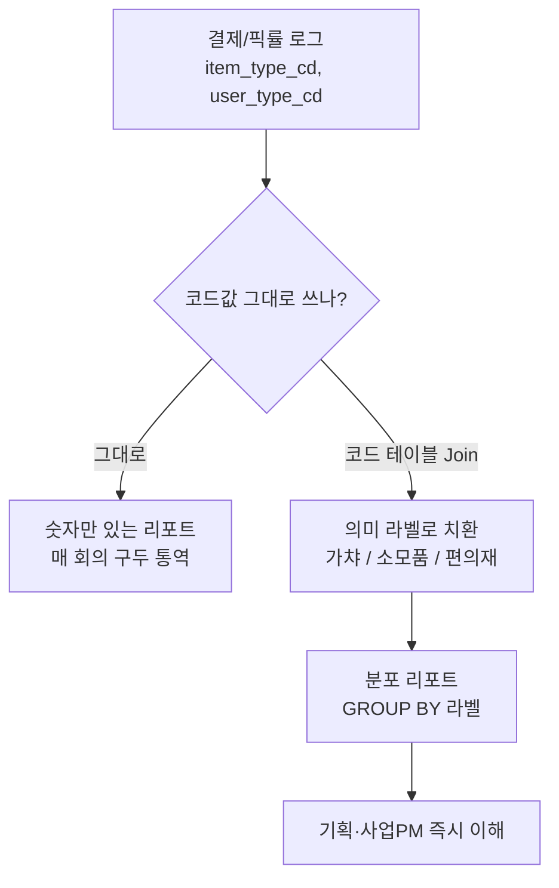
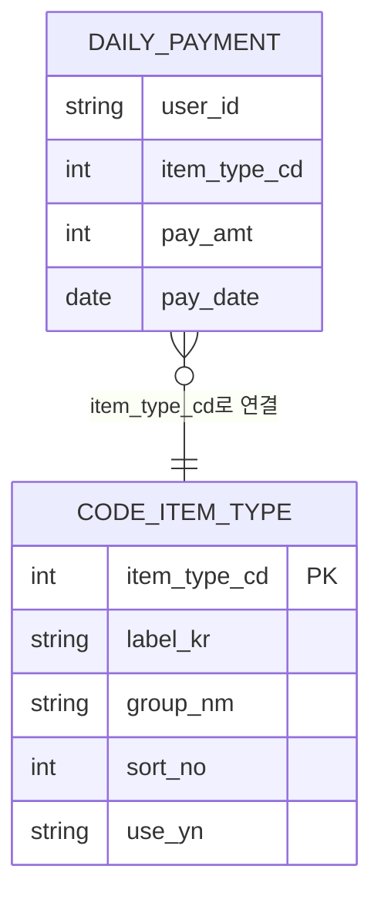
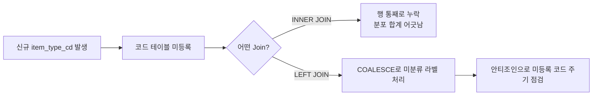

리포트를 넘기고 나면 늘 같은 질문이 돌아왔다. "item_type 1이 뭐예요?" "user_type 2는 신규예요, 복귀예요?" 숫자는 정확한데 그 숫자가 뭘 뜻하는지는 나만 알고 있었다. 회의 때마다 코드값을 구두로 통역해야 리포트가 완성되는 구조였다.

더 아팠던 건 다른 분석가 쿼리를 물려받았을 때다. item_type=3이 예전엔 다른 항목이었다가 어느 시점에 재정의됐는데, 그걸 모르고 옛 의미 그대로 집계에 넣은 적이 있다. 숫자는 안 틀렸는데 뜻이 틀린 거였다. 그 뒤로 코드값은 절대 리포트에 날것으로 올리지 않는다. **코드 테이블을 따로 두고, Join으로 라벨을 입힌다.**

이 글은 매출·컨텐츠 분포 리포트를 만들 때 실제로 쓰던 Enum(값의 종류를 미리 정해둔 코드 집합)·코드 테이블·Join 설계를 — 실제 스키마와 수치는 빼고 — 방법론 중심으로 정리한 것이다.



## 코드값을 그대로 리포트에 올리면 무슨 일이 생기나?

로그와 DB에는 결국 코드값만 쌓인다. item_type_cd=1, user_type_cd=2 같은 정수 하나가 "이 결제가 무슨 항목이었는지", "이 유저가 신규인지 복귀인지"를 대신한다. 문제는 이 숫자가 **엔지니어에게만 자명**하다는 점이다. 기획팀·사업PM은 코드표를 외우고 있지 않다.

처음엔 그냥 `SELECT item_type_cd, SUM(pay_amt) ...` 로 뽑아서 넘겼다. 매번 "1이 뭐예요" 질문이 돌아왔고, 나는 매 회의 코드값을 구두로 통역하는 사람이 됐다. 더 위험했던 건 각자 자기 쿼리에 `CASE WHEN item_type_cd=1 THEN '가챠' ...` 식으로 라벨을 **하드코딩**해둔 상황이었다. 코드 의미가 바뀌거나 새 코드가 추가되면, 이 CASE 문을 가진 쿼리는 반영되고 저 쿼리는 안 반영된다. 같은 지표인데 리포트마다 숫자가 미묘하게 달라지는 사고가 이렇게 시작된다.

## 코드 테이블은 어떤 모양으로 설계했나?

그래서 코드→라벨 매핑을 쿼리마다 흩어두지 않고 **테이블 하나로 중앙화**했다. 최소한 이 다섯 컬럼은 필요했다.

```sql
-- 개념 예시(합성). 실제 스키마 아님.
CREATE TABLE code_item_type (
    item_type_cd  INT          PRIMARY KEY,        -- 로그에 찍히는 원본 코드
    label_kr      NVARCHAR(50) NOT NULL,            -- 리포트에 노출할 한글 라벨
    group_nm      NVARCHAR(50) NOT NULL,            -- 상위 분류(가챠/소모품/편의재)
    sort_no       INT          NOT NULL,            -- 차트·범례 정렬 순서
    use_yn        CHAR(1)      NOT NULL DEFAULT 'Y' -- 폐기된 코드 구분
);

INSERT INTO code_item_type VALUES
  (1, N'프리미엄 가챠', N'가챠',   1, 'Y'),
  (2, N'강화 소모품',   N'소모품', 2, 'Y'),
  (3, N'편의 아이템',   N'편의재', 3, 'Y');
```

이 테이블 하나만 관리하면, 코드 의미가 바뀌어도 **행 하나 업데이트**로 모든 리포트에 반영된다. `sort_no`를 넣어둔 이유는 따로 있다. 라벨만 붙이고 정렬을 안 해두면 파이차트·도수분포에서 범례 순서가 매번 제멋대로 나온다. `use_yn`은 코드가 폐기되거나 재사용될 때를 대비한 안전장치다.



## Join 하나로 분포 리포트가 실제로 어떻게 달라지나?

`item_type_cd`만 GROUP BY 하던 쿼리에 코드 테이블 Join 한 줄을 얹으면 이렇게 바뀐다.

```sql
-- 코드 테이블 Join → 라벨·정렬순서까지 붙은 분포
SELECT
    c.group_nm    AS category,
    c.label_kr    AS item_label,
    SUM(p.pay_amt) AS revenue,
    SUM(p.pay_amt) * 100.0 / SUM(SUM(p.pay_amt)) OVER () AS revenue_pct
FROM   daily_payment  p
JOIN   code_item_type c ON p.item_type_cd = c.item_type_cd
WHERE  p.pay_date = @target_date
GROUP  BY c.group_nm, c.label_kr, c.sort_no
ORDER  BY c.sort_no;
```

Join 결과에는 "가챠 > 소모품 > 편의재" 순으로 매출 비중이 정렬돼 나온다. 이 우선순위 자체는 숫자표만 보던 시절에도 알고는 있었지만, 라벨과 비중(%)이 한 화면에 붙어 나오는 순간 사업 부서가 그 자리에서 "가챠 비중이 저렇게 크구나"를 체감했다. 코드값 나열로는 절대 안 되던 일이다.

여러 서버 로그를 ODBC로 한곳에 모을 때도 이 코드 테이블이 기준점이 됐다. 서버마다 라벨을 따로 정의하면 통합 리포트에서 같은 항목이 다른 이름으로 찍히는 사고가 난다. 코드 테이블을 **단일 기준**으로 두고 Join하면, 소스가 몇 개든 결과 라벨은 하나로 맞는다.

## 코드 테이블에 없는 코드가 나타나면 어떻게 되나?

여기서 한 번 크게 삽질했다. 처음엔 위 쿼리를 `JOIN`(정확히는 INNER JOIN)으로만 짰다. 그런데 신규 항목 유형이 로그에 새로 찍히기 시작했는데 코드 테이블엔 아직 등록 전이었다. INNER JOIN은 양쪽에 매칭되는 행만 남기기 때문에, **코드 테이블에 없는 코드를 가진 행은 통째로 사라졌다.** 분포 합계가 실제 매출 합계보다 작게 나왔고, 한참 동안 "결제 로그가 유실됐나" 하고 엉뚱한 곳을 뒤졌다.



해법은 두 가지였다. `LEFT JOIN` + `COALESCE`로 라벨이 없어도 행을 살리고, **안티조인**(왼쪽 기준으로 매칭되지 않는 행만 골라내는 조회)으로 미등록 코드를 주기적으로 감시한다.

```sql
-- 라벨이 없어도 행은 살린다
SELECT COALESCE(c.group_nm, N'미분류') AS category,
       SUM(p.pay_amt)                  AS revenue
FROM   daily_payment p
LEFT   JOIN code_item_type c ON p.item_type_cd = c.item_type_cd
GROUP  BY COALESCE(c.group_nm, N'미분류');

-- 코드 테이블에 없는 코드를 찾아내는 안전장치(안티조인)
SELECT DISTINCT p.item_type_cd
FROM   daily_payment p
LEFT   JOIN code_item_type c ON p.item_type_cd = c.item_type_cd
WHERE  c.item_type_cd IS NULL;   -- 여기 걸리면 신규/미등록 코드
```

이 점검 쿼리를 배치에 넣어둔 뒤로는 "분포 합계가 안 맞는다"는 사고가 사라졌다. 오히려 신규 코드가 찍히자마자 감지되는 조기경보가 됐다.

## 결국 이 설계에서 남는 건 무엇인가?

코드 테이블과 Join은 화려한 기술이 아니다. 하지만 숫자를 사람이 읽는 언어로 바꿔주는 최소 단위의 인프라다.

- 코드-라벨 매핑을 쿼리마다 하드코딩하지 않고 **테이블로 중앙화**하면 리포트 간 정합성이 보장된다.
- `sort_no`·`group_nm`으로 차트 범례까지 통제하면 분포 리포트가 한 번에 읽힌다.
- `use_yn`과 안티조인으로 코드 드리프트를 조기에 잡으면, INNER JOIN이 조용히 행을 삼키는 사고를 막는다.

AI가 SQL을 대신 짜주는 시대에도 "이 숫자가 무엇을 의미하는지 사람이 읽게 만든다"는 설계 판단은, 리포트를 실제로 넘겨보고 "1이 뭐예요"라는 질문을 여러 번 받아본 사람 몫이다. 다음 글에서는 이 코드 테이블에 기간 개념을 얹어, 재구매율 하락을 조기에 잡는 코호트 분석을 정리한다.

- 방법론·합성 스키마 레시피: [github.com/DBhyeong/game-data-recipes](https://github.com/DBhyeong/game-data-recipes)
