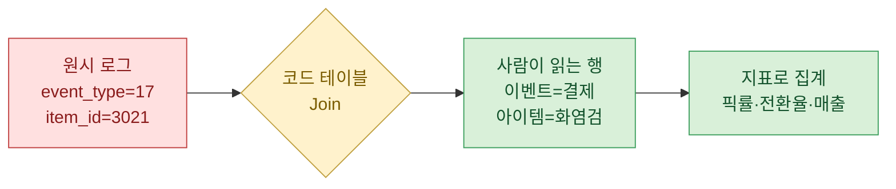
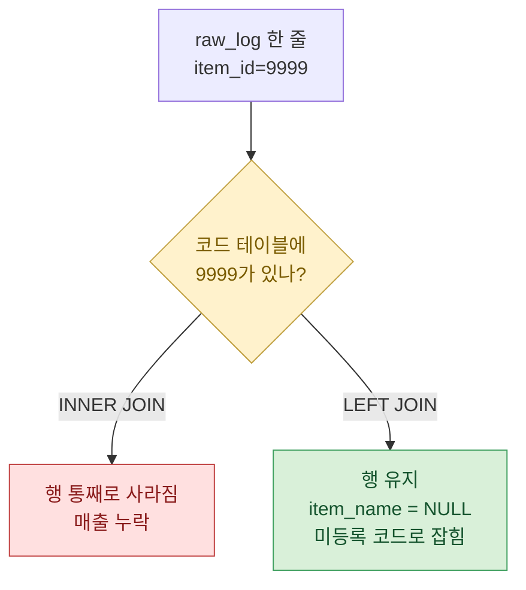
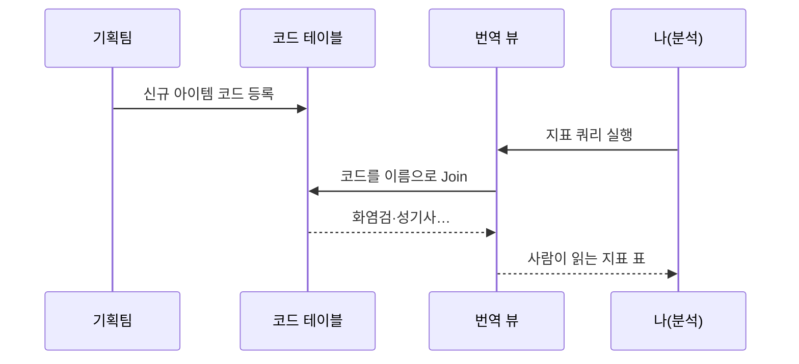

> 로그 테이블을 처음 열면 온통 숫자다. `event_type = 17`. 이게 로그인인지 결제인지 튕김인지, 나는 모른다. 기획팀만 안다.

## 원시 로그는 왜 사람이 못 읽을까?

데이터 분석가로 일하면서 제일 자주 하는 일이, 사실은 화려한 모델링이 아니라 이거다. **숫자를 말로 바꾸는 일.**

게임 서버가 남기는 로그는 성능과 저장 용량 때문에 값을 전부 정수 코드로 눌러 담는다. 유저가 상점에서 무기를 하나 샀다고 하자. 그 순간 남는 로그 한 줄은 대략 이렇게 생겼다(전부 합성 예시다).

| log_id | user_key | event_type | item_id | result_code | ts |
|--------|----------|------------|---------|-------------|----|
| 90001 | u_4471 | 17 | 3021 | 0 | 2026-07-01 21:14 |
| 90002 | u_4471 | 22 | 0 | 3 | 2026-07-01 21:15 |

여기서 사람이 바로 읽을 수 있는 정보가 있나? 거의 없다. `event_type=17`이 결제인지, `item_id=3021`이 어떤 무기인지, `result_code=3`이 성공인지 실패인지 — 이 숫자들은 그 자체로는 아무 뜻이 없다. 뜻은 전부 **기획팀이 관리하는 별도의 코드 테이블**에 적혀 있다.

그래서 나는 이 코드값을 "사전"과 맞대어 번역하는 작업부터 한다. 그 사전이 바로 Enum/Code 테이블이다.



## Enum 테이블과 Code 테이블은 뭐가 다를까?

말이 헷갈릴 수 있어서 내가 실무에서 쓰는 기준으로 정리해 둔다.

- **Enum 테이블**: 값의 종류가 적고 거의 안 변하는 것. 예를 들어 `result_code`(0=성공, 1=취소, 2=잔액부족, 3=오류)처럼 몇 개로 고정된 상태값. 코드에 박아도 되지만, 나는 DB 테이블로 빼둔다. 나중에 "3이 뭐였더라" 하고 소스코드를 뒤지는 일이 없어진다.
- **Code 테이블(콘텐츠 코드)**: 값이 수백~수천 개고 기획팀이 계속 추가하는 것. 아이템, 캐릭터, 스테이지, 상점 상품 같은 것. 신규 영웅이 나오면 여기 한 줄이 늘어난다.

둘 다 하는 일은 같다. **정수 코드 → 사람이 읽는 이름**으로 바꿔주는 사전이다. 구조도 단순하다.

| code | name_kr | category |
|------|---------|----------|
| 17 | 결제 | event |
| 22 | 전투종료 | event |
| 3021 | 화염검 | item_weapon |
| 3022 | 얼음창 | item_weapon |

이 표만 있으면 아까 그 숫자 범벅 로그가 갑자기 문장으로 읽힌다. "u_4471이 21시 14분에 화염검을 결제 성공했다."

## Join 하나로 로그가 어떻게 문장이 될까?

핵심은 정말 딱 이거다. 원시 로그를 왼쪽에 두고, 코드 테이블을 코드 값 기준으로 `LEFT JOIN` 한다.

```sql
-- 전부 합성/더미 테이블·컬럼명이다
SELECT
    L.log_id,
    L.user_key,
    E.name_kr  AS event_name,   -- 17 -> '결제'
    I.name_kr  AS item_name,    -- 3021 -> '화염검'
    R.name_kr  AS result_name,  -- 0 -> '성공'
    L.ts
FROM   raw_log AS L
LEFT JOIN code_event  AS E ON E.code = L.event_type
LEFT JOIN code_item   AS I ON I.code = L.item_id
LEFT JOIN code_result AS R ON R.code = L.result_code;
```

왜 `INNER`가 아니라 `LEFT JOIN`이냐고 물으면, 이게 실무에서 제일 중요한 판단이다. **로그는 한 줄도 잃으면 안 되기 때문이다.** 만약 로그에 `item_id=9999`가 찍혔는데 코드 테이블에 9999가 아직 없다면(기획팀이 등록을 깜빡했다면), `INNER JOIN`은 그 줄을 조용히 통째로 버린다. 매출 집계에서 결제 한 건이 소리 없이 증발하는 것이다. `LEFT JOIN`으로 붙이면 그 줄은 살아남고 `item_name`만 `NULL`로 남아서, "여기 사전에 없는 코드가 있다"고 나에게 신호를 준다.



그래서 나는 파이프라인 끝에 항상 감시용 쿼리를 하나 붙여 둔다. `WHERE item_name IS NULL`로 미등록 코드를 세서, 하루라도 0이 아니면 기획팀에 "이 코드 등록 좀요" 하고 알린다. 코드 테이블은 살아 있는 사전이라, 관리하지 않으면 금세 구멍이 생긴다.

## 번역한 로그를 어떻게 지표로 접을까?

코드를 이름으로 바꾸고 나면, 그때부터가 진짜 분석이다. 이제 `GROUP BY`가 사람 말로 된다.

예를 들어 캐릭터 **픽률**(어떤 영웅을 얼마나 고르는가)을 보고 싶다고 하자. 코드 테이블을 붙이기 전에는 `GROUP BY hero_id` 결과가 `3001, 3002, 3003…` 숫자 나열이라 기획 회의에 못 들고 간다. 코드 테이블을 붙이면 이렇게 바뀐다.

```sql
SELECT
    H.name_kr AS hero_name,
    COUNT(*)  AS pick_cnt,
    -- 전체 대비 비율 = 픽률
    CAST(100.0 * COUNT(*) / SUM(COUNT(*)) OVER () AS DECIMAL(5,1)) AS pick_rate_pct
FROM   raw_battle AS B
LEFT JOIN code_hero AS H ON H.code = B.hero_id
GROUP BY H.name_kr
ORDER BY pick_cnt DESC;
```

결과는 이렇게 사람이 읽는 표가 된다(수치는 전부 더미).

| hero_name | pick_cnt | pick_rate_pct |
|-----------|----------|---------------|
| 화염술사 | 41,200 | 24.8 |
| 성기사 | 33,500 | 20.2 |
| 도적 | 18,900 | 11.4 |

이제 이 표는 그대로 기획팀 슬라이드에 붙는다. "신규 영웅 화염술사 픽률이 첫 주 약 25%까지 올라왔다" 같은 문장이 숫자에서 바로 나온다. 코드 테이블 Join이 없었다면 "3001이 41200이에요"라고 말했을 텐데, 그건 아무도 안 듣는다.

## 상태 코드는 어떻게 '성공률'로 바뀔까?

Enum 성격의 `result_code`는 조금 다르게 쓴다. 이름으로 바꾸는 것도 하지만, 더 자주 하는 건 **성공/실패를 나눠 비율로 접는 것**이다. `CASE WHEN`으로 성공 여부를 1과 0으로 만들어 평균 내면 그게 곧 성공률이다.

```sql
SELECT
    S.name_kr AS shop_name,
    COUNT(*)  AS try_cnt,
    -- result_code = 0 이 성공. 성공만 1로 세서 평균 = 전환율
    CAST(100.0 * SUM(CASE WHEN P.result_code = 0 THEN 1 ELSE 0 END)
         / COUNT(*) AS DECIMAL(5,1)) AS success_rate_pct
FROM   raw_purchase AS P
LEFT JOIN code_shop AS S ON S.code = P.shop_id
GROUP BY S.name_kr;
```

| shop_name | try_cnt | success_rate_pct |
|-----------|---------|------------------|
| 일반상점 | 12,400 | 96.7 |
| 한정패키지 | 3,100 | 88.2 |

여기서 한정패키지 성공률이 88%로 눈에 띄게 낮으면, 나는 실패 코드를 다시 쪼갠다. `result_code=2`(잔액부족)가 많은지, `result_code=3`(오류)이 많은지. 전자면 가격 문제, 후자면 결제 시스템 버그다. Enum 테이블 덕분에 실패의 "종류"까지 말로 읽히니까, 원인 가설을 숫자로 좁힐 수 있다.

## 이 사전을 어디에 둬야 재사용될까?

한 번 하고 버릴 쿼리라면 위처럼 그때그때 Join하면 된다. 하지만 매일 도는 지표라면, 나는 이 번역 로직을 **뷰(View)나 저장 프로시저**로 굳혀 둔다.



이렇게 해두면 좋은 점이 분명하다. 기획팀이 신규 콘텐츠 코드를 테이블에 한 줄 추가하는 순간, 내 지표 뷰는 **코드를 안 고쳐도** 다음 날부터 새 아이템을 이름으로 집계한다. 번역 사전과 집계 로직을 분리했기 때문이다. 반대로 사전을 쿼리 안에 `CASE WHEN`으로 직접 박아 넣으면(`WHEN 3021 THEN '화염검'`…), 아이템이 하나 늘 때마다 모든 쿼리를 손봐야 하는 지옥이 열린다. 그래서 코드 매핑은 절대 쿼리에 하드코딩하지 않는다. 이게 내 원칙이다.

## 마무리

정리하면, 게임 로그 분석의 절반은 화려한 통계가 아니라 이 소박한 번역 작업이다.

- 원시 로그의 정수 코드는 그 자체로 뜻이 없다. 뜻은 **Enum/Code 테이블**이라는 사전에 있다.
- `LEFT JOIN`으로 붙여야 로그를 한 줄도 안 잃고, 미등록 코드는 `NULL`로 잡아낸다.
- 번역이 끝나면 `GROUP BY`가 사람 말이 되어, 픽률·전환율·성공률 같은 지표가 바로 나온다.
- 매핑은 쿼리에 박지 말고 테이블로 빼서, 기획팀이 코드를 늘려도 지표가 스스로 따라오게 한다.

숫자를 말로 바꾸는 이 한 단계가, 데이터를 "분석가만 보는 표"에서 "회의에서 쓰는 문장"으로 옮겨준다. 나에게는 이게 로그 분석의 진짜 시작점이다.

## 참고자료

- [[game-metrics-7-definitions]] — 픽률·리텐션·ARPPU 등 핵심 지표 7종의 정의
- [[paying-tier-distribution-bm-balancing]] — `CASE WHEN` 버킷과 데실로 과금 분포 읽기
- [[game-data-sql-recipes-retention-ltv]] — 리텐션·LTV까지 이어지는 SQL 레시피 모음
- 코드 예시 저장소: https://github.com/DBhyeong/game-data-recipes

<!-- 안전: 합성/더미 데이터, 회사·실데이터·PII 없음. -->
