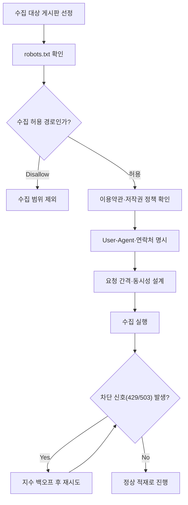
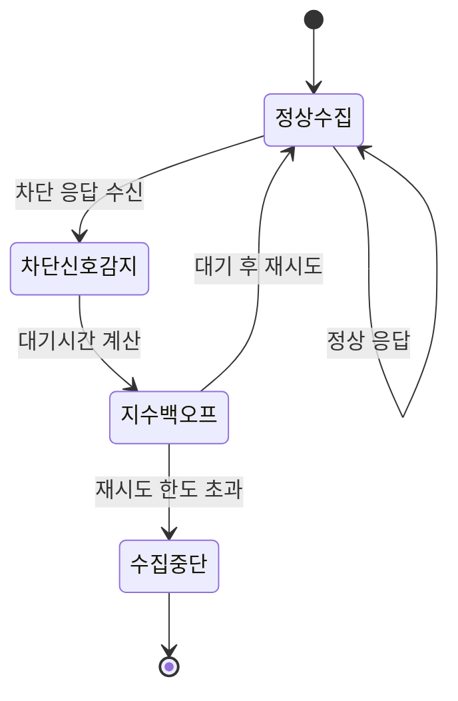

게임 현금시세를 자동으로 모으는 사이드 프로젝트를 처음 시작했을 때, 내 머릿속엔 관심사가 딱 하나였다. "얼마나 빨리, 얼마나 많이 긁어올 수 있나." Selenium과 BeautifulSoup으로 거래 게시판을 돌면서 시세를 뽑고, `pymssql`로 MS-SQL에 적재하고, 매일 아침 SMTP로 리포트를 쏘는 파이프라인을 짜는 동안 속도는 은근한 자랑거리였다.

문제는 며칠 뒤에 터졌다. 어느 날 아침 리포트가 텅 비어 있었다. 크롤러는 오류 없이 "성공"이라고 로그를 남겼는데, 정작 받아온 페이지는 빈 껍데기였다. 뒤져보니 접근 자체가 막혀 있었다. 그날 깨달았다. 크롤링에서 진짜 무서운 건 코드 버그가 아니라 **차단**이라는 것을. 그 뒤로 이 파이프라인을 보는 기준이 바뀌었다. 얼마나 빨리 모으느냐가 아니라, **얼마나 오래 안 끊기고 도느냐**로.

전체 흐름을 먼저 그려보면 이렇다.



## 크롤링 시작 전에 뭘 제일 먼저 열어봐야 하나?

나는 코드를 짜기 전에 브라우저로 `대상도메인/robots.txt`부터 열어보는 습관을 들였다. robots.txt는 사이트 운영자가 "여긴 긁어가도 되고, 여긴 안 된다"를 공개적으로 적어둔 규칙 문서다(로봇 배제 표준·Robots Exclusion Protocol). 법적 강제력이 절대적인 건 아니지만, 운영자의 의사를 가장 먼저 확인할 수 있는 1차 자료라서 여길 무시하고 시작하는 건 처음부터 매너가 없는 셈이다.

robots.txt만으로는 부족했다. 거래 게시판은 회원 약관에 "게시물 무단 수집·상업적 재배포 금지" 같은 조항을 따로 두는 경우가 많다. 그래서 나는 아래 네 가지를 수집 착수 전 체크리스트로 굳혔다.

| 확인 항목 | 왜 확인하나 |
|---|---|
| robots.txt의 Disallow 경로 | 운영자가 명시적으로 접근을 막은 영역 |
| robots.txt의 Crawl-delay | 사이트가 원하는 최소 요청 간격의 힌트 |
| 게시판 이용약관의 수집 관련 조항 | 크롤링 자체를 금지하는 규정이 있는지 |
| 수집 항목의 범위 | 목적(시세)에 필요한 필드만 남기고 나머지는 배제 |

마지막 항목이 은근히 중요했다. 거래 게시글에는 시세 숫자 말고도 연락처 같은 개인정보가 섞여 나올 때가 있다. 그래서 적재 단계에서 임시테이블에 남긴 건 시세 텍스트를 bigint로 변환한 숫자값뿐이었다. 애초에 목적 밖의 필드는 저장 대상에 넣지 않는 것도 "매너"의 일부라고 생각한다.

## 요청 간격은 어떻게 정했나?

robots.txt를 통과했다고 끝이 아니다. 사람이 게시판을 눈으로 훑는 속도와 스크립트가 반복문으로 페이지를 요청하는 속도는 차원이 다르다. 서버 입장에서 후자는 트래픽 폭탄으로 보일 수 있다.

나는 요청 사이에 고정 간격 대신 **랜덤 지터(jitter)**를 뒀다. 매번 정확히 3초씩 찍히는 패턴은 오히려 "이건 봇이다"라는 신호를 더 또렷하게 남기고, 서버 부하도 특정 순간에 몰릴 수 있어서다. 그리고 동시 연결은 1개로 제한했다. 여러 창을 띄워 병렬로 긁으면 짧은 시간에 얻는 양은 늘지만, 그만큼 서버가 받는 순간 부하도 커진다.

```python
import time
import random

# 실제 수집기는 Selenium 기반이었지만, 레이트리밋 로직만 뽑아 pseudo-code로 정리
HEADERS = {
    "User-Agent": "PriceMonitorBot/1.0 (+YOUR_CONTACT_EMAIL)"
}

def polite_delay():
    # 고정 간격이 아니라 2~4초 사이 랜덤 대기
    time.sleep(random.uniform(2.0, 4.0))

def fetch_one(session, url):
    resp = session.get(url, headers=HEADERS, timeout=10)
    polite_delay()
    return resp
```

배치 실행 시간대도 신경 썼다. 이 크롤러는 매일 자동으로 도는 배치였기 때문에, 게시판 트래픽이 몰릴 낮 시간대보다는 새벽 시간대에 돌게 스케줄을 잡았다. 같은 데이터를 모으더라도 서버가 한가한 시간에 부담을 주는 편이 낫다.

## 차단 신호가 오면 그냥 다시 시도하면 되나?

레이트리밋을 지켜도 차단 신호는 온다. 네트워크 문제일 수도 있고, 사이트 쪽 정책이 바뀌었을 수도 있다. 처음엔 오류가 나면 무조건 즉시 재시도하도록 짰는데, 이게 오히려 최악이었다. 막힌 상태에서 곧바로 다시 두드리면 서버 입장에선 "얘가 더 심하게 긁는다"로 보일 뿐이다.

그래서 지수 백오프(exponential backoff)로 바꿨다. 실패하면 대기 시간을 2배씩 늘려가며 재시도하고, 응답에 재시도 대기 시간을 알려주는 값이 있으면 그 값을 그대로 존중한다. 그리고 재시도 횟수에 상한을 뒀다. 몇 번을 기다려도 계속 막히면, 그건 "지금은 접근하지 말라"는 신호로 받아들이고 그날 수집은 조용히 포기했다.



여기서 배운 건, "차단을 우회하는 기술"과 "차단 신호를 존중하는 설계"는 완전히 다른 방향이라는 점이다. 나는 후자를 선택했다. 우회는 당장은 데이터를 더 얻지만 관계를 태우고, 존중은 당장은 손해 같아도 파이프라인을 오래 살린다.

## User-Agent는 왜 숨기지 않고 오히려 밝혔나?

크롤링 관련 글을 찾아보면 "차단을 피하려면 User-Agent를 실제 브라우저처럼 위장하라"는 팁이 흔하다. 나는 반대로 갔다. User-Agent 헤더에 이 요청이 봇이라는 사실과 연락 가능한 이메일을 그대로 남겼다.

이유는 단순하다. 내 수집 패턴이 이상 트래픽으로 보였을 때, 운영자가 "이거 뭐 하는 봇이냐"고 확인할 방법이 있어야 한다고 생각했다. 신원을 감추고 몰래 도는 크롤러는 운영자 입장에서 대화 상대가 아니라 제거 대상일 뿐이다. 반대로 정체와 연락처를 밝혀두면, 문제가 생겨도 차단이 아니라 대화로 풀 여지가 남는다. 결과적으로 이 파이프라인은 그런 문의를 받은 적이 없었지만, 언제든 받을 수 있다는 전제로 설계한 것 자체가 태도의 차이라고 본다.

## 이 체크리스트가 파이프라인에 실제로 남긴 건 뭔가?

robots.txt·약관 확인, 랜덤 지터를 둔 레이트리밋, 지수 백오프, 신원을 밝힌 User-Agent. 화려한 기술은 하나도 없다. 그런데 이 네 가지를 지킨 뒤로 수집이 끊기는 일이 눈에 띄게 줄었고, 그 위에 얹은 MS-SQL 적재·SMTP 리포트·Metabase 대시보드가 매일 아침 조용히 돌아갔다. 크롤링 파이프라인의 신뢰성은 수집 코드의 정교함이 아니라, 상대 서버와의 관계를 얼마나 존중하느냐에서 갈린다는 걸 이 사이드 프로젝트로 체감했다.

AI가 크롤링 코드를 몇 초 만에 짜주는 시대에도, "이 요청이 상대에게 어떤 부담인지"를 판단하는 감각은 여전히 사람의 몫이다. 다음 글에서는 이 체크리스트를 통과한 데이터가 MS-SQL 적재부터 자동 리포트·대시보드까지 어떻게 이어지는지, 파이프라인 전체 구조를 정리한다.

- 현금시세 모니터링 파이프라인: [github.com/DBhyeong/game-data-analysis](https://github.com/DBhyeong/game-data-analysis)
