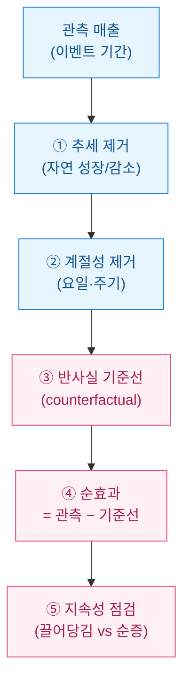
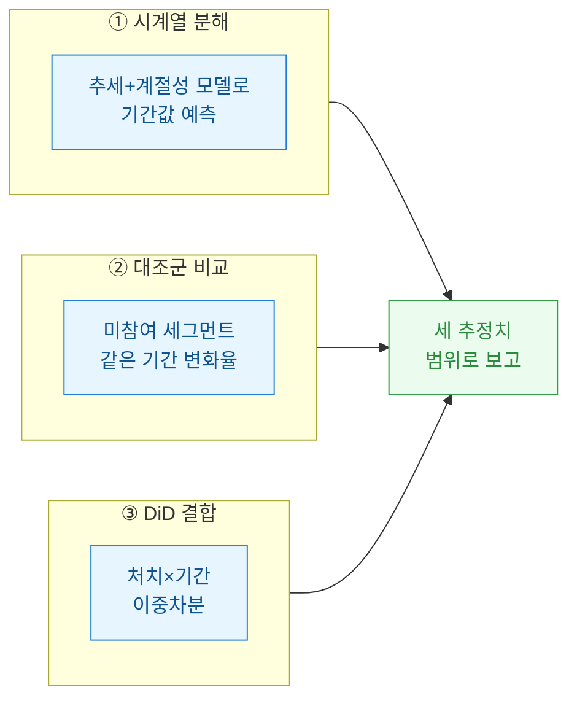
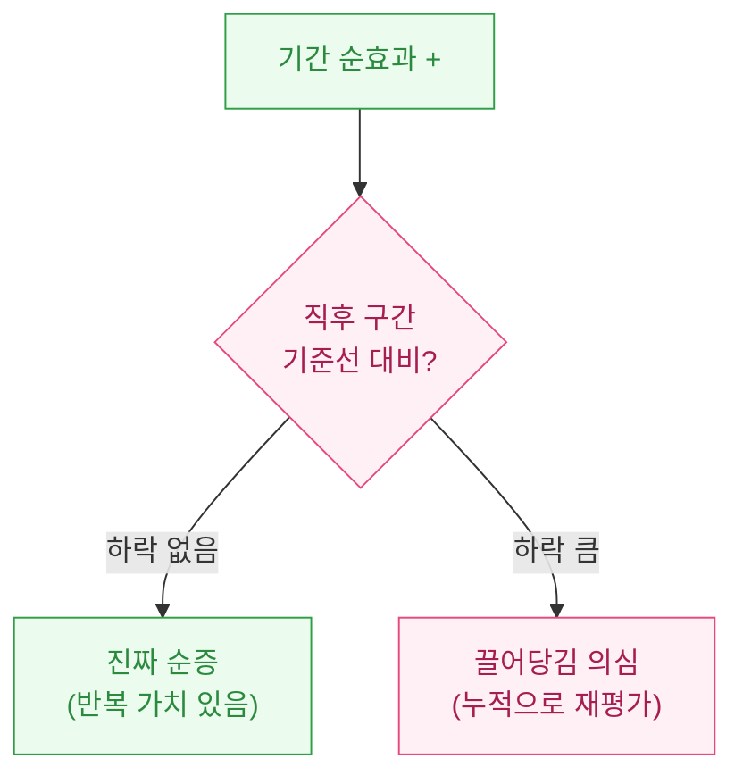

> 공개·더미 데이터 기준의 방법론 정리이며, 특정 상품의 성과 보증이나 투자·회계 판단이 아니다.

이벤트를 돌린 주가 끝나면 늘 같은 슬라이드가 올라온다. "이벤트 기간 매출 +40%". 나는 이 숫자를 볼 때마다 조금 불편하다. 그 40% 안에는 이벤트가 아니어도 어차피 올랐을 몫이 섞여 있기 때문이다. 자연 증가와 이벤트 기여를 나누지 않으면, 우리는 매번 이벤트를 과대평가하고 다음 분기 목표를 잘못 세운다. 오늘은 이 둘을 어떻게 갈라내는지 정리한다.



## 왜 "기간 매출 +40%"는 위험한 숫자인가?

관측된 상승분은 세 덩어리의 합이다. 이걸 하나로 뭉뚱그리면 이벤트의 공을 부풀리게 된다.

| 구성 요소 | 정의 | 이벤트 성과인가? |
|---|---|---|
| **추세(trend)** | 신규 유입·업데이트로 인한 장기 성장/감소 | ❌ 아님 |
| **계절성(seasonality)** | 주말·급여일·방학 등 반복 주기 | ❌ 아님 |
| **순효과(net effect)** | 오직 이벤트 때문에 생긴 증가분 | ✅ 이것만 |

핵심 개념 하나만 잡으면 된다. **반사실 기준선(counterfactual baseline)**, 즉 "이벤트를 안 했다면 그 기간에 얼마였을까"를 추정한 값이다. 순효과는 `관측값 − 기준선`이다. 기준선을 그냥 "직전 주"로 잡으면 추세와 계절성이 그대로 새어 들어온다.

## 기준선은 어떻게 만드나?

세 가지 접근을 병행한다. 하나만 믿지 않는 게 실무 감각이다.



**대조군(control group)**이 있으면 가장 깔끔하다. 이벤트에 노출되지 않은 유저 세그먼트의 같은 기간 변화율을 "자연 변화"로 보고, 처치군에서 그만큼 빼는 것이다. 이게 **이중차분(DiD, Difference-in-Differences)**의 뼈대다. 노출을 못 나눴다면 시계열 분해로 대체한다.

## 합성 데이터로 순효과만 뽑아보자

아래는 더미 데이터다. 실데이터·실코드가 아니라 방법을 보여주는 예시다. 금액은 실제 매출이 아니라 **기준 대비 지수(index)**로만 다룬다.

```python
import numpy as np
import pandas as pd

rng = np.random.default_rng(7)
days = pd.date_range("2026-05-01", periods=56, freq="D")

# 합성: 완만한 상승 추세 + 주말 계절성 + 잡음
trend = np.linspace(100, 112, len(days))          # 자연 성장(지수)
weekend = np.where(days.weekday >= 5, 8, 0)        # 주말 부스트
noise = rng.normal(0, 2.5, len(days))
base = trend + weekend + noise

df = pd.DataFrame({"date": days, "revenue_idx": base})

# 이벤트: 7일간 실제 순효과 +10 지수 주입
event = (df.date >= "2026-06-15") & (df.date <= "2026-06-21")
df.loc[event, "revenue_idx"] += 10
```

이제 기준선을 만든다. 이벤트 전 구간으로 요일 효과와 추세를 학습해, 이벤트 기간을 "안 했다면" 값으로 예측한다.

```python
pre = df[df.date < "2026-06-15"].copy()
pre["t"] = (pre.date - df.date.min()).dt.days
pre["is_weekend"] = (pre.date.weekday >= 5).astype(int)

# 아주 단순한 선형 기준선: 추세(t) + 주말 더미
import numpy as np
X = np.c_[np.ones(len(pre)), pre.t, pre.is_weekend]
coef, *_ = np.linalg.lstsq(X, pre.revenue_idx, rcond=None)

ev = df[event].copy()
ev["t"] = (ev.date - df.date.min()).dt.days
ev["is_weekend"] = (ev.date.weekday >= 5).astype(int)
Xe = np.c_[np.ones(len(ev)), ev.t, ev.is_weekend]

ev["baseline"] = Xe @ coef
ev["net_effect"] = ev.revenue_idx - ev.baseline

print(round(ev.net_effect.sum(), 1))   # 주입한 순효과(약 70지수)에 근사
```

관측 상승분을 통째로 이벤트 공으로 돌렸다면 추세+주말까지 얹혀 과대평가됐을 것이다. 기준선을 빼면 실제로 주입한 순효과 근처로 수렴한다.

## 순효과가 "진짜 증가"인지 어떻게 확인하나?

숫자가 나왔다고 끝이 아니다. 마지막 함정은 **끌어당김 효과(pull-forward)**다. 이벤트가 미래 수요를 앞으로 당겨왔을 뿐이면, 기간 안엔 순증처럼 보여도 직후에 매출이 꺼진다.

| 점검 | 보는 것 | 위험 신호 |
|---|---|---|
| **직후 구간(post window)** | 이벤트 종료 후 1\~2주 기준선 대비 | 기준선 아래로 하락 |
| **누적 순효과** | (기간 순증) − (직후 감소분) | 합이 0에 수렴 |
| **세그먼트 분해** | 신규 vs 기존 유저 기여 | 기존 유저 재분배만 |



## 정리 — 보고 한 줄을 바꾸는 습관

내가 팀에 요청하는 건 딱 하나다. "이벤트 기간 +40%" 대신 "**추세·계절성 제거 후 순효과 +지수 N, 직후 끌어당김 확인됨/없음**"으로 쓰자는 것. 문장이 길어진 만큼 다음 이벤트 예산과 목표가 정확해진다.

- **기준선 없는 상승분은 성과가 아니다.** 반사실을 먼저 세운다.
- **대조군 > 시계열 분해.** 노출을 나눌 수 있으면 무조건 나눈다.
- **끝난 뒤 2주를 꼭 본다.** 끌어당김이면 순증은 신기루다.
- 모든 수치는 상대지표(지수·변화율)로. 절대 금액은 보고에 필요 없다.
