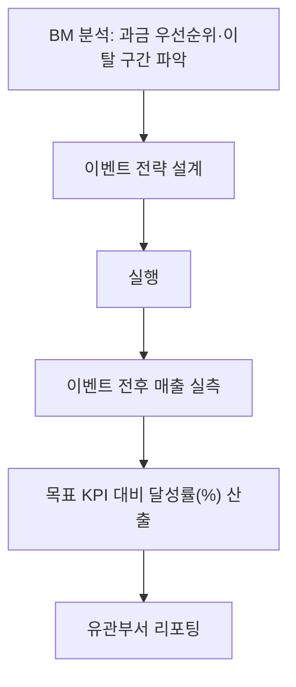
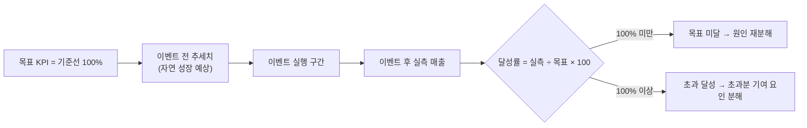
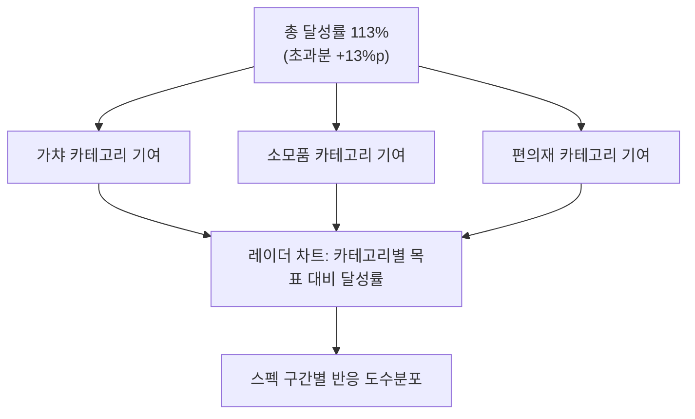

이벤트가 끝나면 꼭 듣는 질문이 있다. "그래서 얼마 벌었어요?" 예전엔 이 질문에 숫자 하나로 답하려고 했다. 그런데 숫자만 던지면 듣는 사람은 판단을 못 한다. 많이 번 건지 적게 번 건지는 **기준이 있어야 보인다.** 기준 없는 매출은 그냥 크거나 작은 숫자일 뿐이다.

동남아 시장에서 만렙 개방 이후 접속·과금 이탈이 두드러지던 시기가 있었다. BM(비즈니스모델·과금구조) 분석을 해보니 과금 우선순위는 가챠 > 소모품 > 편의재 순이었고, 스펙이 낮은 유저는 레이드에 아예 참여를 못 해 이탈로 이어지는 그림이 보였다. 여기서 세운 이벤트 전략이 상반기 동남아 목표 KPI 대비 **약 113% 초과 달성**으로 이어졌다. 이 글은 그 결과가 아니라 **측정 방식**에 관한 것이다. 절대 금액 대신 목표 대비 달성률(%)로 이벤트 효과를 측정하고 보고하는 방식을 정리한다.



## 왜 초과 매출액이 아니라 달성률(%)로 봐야 하나?

한국 시장과 동남아 시장은 규모 자체가 다르다. 절대 금액을 나란히 놓고 비교하면 "어느 쪽이 잘했나"를 말할 수 없다. 시장이 큰 쪽이 항상 유리해 보이기 때문이다. 반면 **목표 KPI**는 지역 시장 규모·이전 실적·성장률을 반영해 정한 상대적 기준선이다. 그 기준선 대비 몇 %를 냈는지 보면, 시장 크기와 무관하게 같은 잣대로 비교할 수 있다.

실무적인 이유도 있다. 절대 매출 금액은 민감정보라 공유할 때마다 노출 범위를 따져야 한다. 달성률(%)은 그 자체로 완결된 언어다. "113%"라는 숫자는 통화 단위도 시장 규모도 필요 없이 "목표를 13%포인트 넘겼다"는 뜻을 그대로 전달한다. 그래서 리포트 표의 첫 줄엔 절대 금액이 아니라 항상 달성률(%)을 앞세웠다.

## 달성률은 정확히 무엇을 무엇으로 나눈 값인가?

계산 자체는 단순하다.

```
달성률(%) = 이벤트 기간 실측 매출 ÷ 목표 KPI × 100
```

중요한 건 분모다. 목표 KPI는 사업PM·기획이 이전 실적과 시장 전망을 근거로 합의한 값이다. 그 목표선을 기준선(100%)으로 두고, 이벤트 전 추세치·실행 구간·이벤트 후 실측치를 같은 축 위에 올려서 비교했다.



이 값은 매일 집계했다. 목표선을 100으로 정규화해두면, 일간 리포트는 절대 매출 숫자 없이도 "오늘 달성률 몇 %"라는 한 줄로 끝났다.

```sql
-- 개념 예시(합성). 실제 스키마 아님. 절대 금액 대신 목표 대비 비율만 산출
SELECT
    period_type,                          -- 'pre_event' / 'event' / 'post_event'
    bm_category,                          -- 'gacha' / 'consumable' / 'convenience'
    ROUND(SUM(revenue_amt) * 100.0 / NULLIF(target_kpi, 0), 1) AS achievement_rate_pct
FROM   daily_revenue
JOIN   kpi_target USING (region, period_type)
WHERE  region = @target_region
GROUP  BY period_type, bm_category, target_kpi
ORDER  BY period_type;
```

## 목표를 넘긴 게 정말 이벤트 효과인지 어떻게 검증하나?

달성률이 100%를 넘었다고 바로 "이벤트가 먹혔다"고 결론 내면 안 된다. 시즌성이나 자연 성장만으로도 목표를 넘기는 경우가 있다. 그래서 목표선 하나만 보지 않고, "이벤트가 없었다면 이어졌을 자연 성장 추세치"를 별도로 그려 함께 봤다. 실측이 목표선 위에 있는 것과 **자연 성장 추세치보다도** 위에 있는 것은 다른 의미다. 후자의 간격이 이벤트가 실제로 얹어준 몫에 가깝다.

두 번째 교차검증은 BM 카테고리 분해였다. 이벤트가 가챠 접근성과 저스펙 유저를 겨냥해 설계됐다면, 초과분도 가챠 카테고리에서 크게 나와야 앞뒤가 맞는다. 초과분이 편의재 카테고리에서 튀었다면 이벤트 효과가 아니라 다른 변수를 의심해야 한다. 숫자 하나로 끝내지 않고, 설계 의도와 같은 방향에서 나왔는지를 항상 같이 확인했다.

## 113%라는 숫자 뒤에는 어떤 분해가 있었나?

과금 우선순위가 가챠 > 소모품 > 편의재였기 때문에, 이벤트도 가챠 접근성과 저스펙 유저의 레이드 참여 장벽을 낮추는 방향으로 설계했다. 그래서 리포트에서도 달성률 113%라는 총합 하나만 던지지 않고, 초과분(+13%포인트)이 어느 카테고리에서 왔는지를 쪼개서 보여줬다.



레이더 차트로는 카테고리별 목표 대비 달성률을 비교했고, 파이 차트로는 초과분 안에서 각 카테고리가 차지하는 비중을 봤다. 저스펙 구간 유저의 반응을 도수분포로 겹쳐보니, 초과분의 상당 부분이 애초에 겨냥했던 저스펙·가챠 접근성 층에서 나왔다는 게 확인됐다. 설계 의도와 실측 초과분의 출처가 일치했다는 점이 "우연히 시장이 좋았다"가 아니라 "이벤트가 작동했다"고 말할 수 있는 근거였다.

## 이 리포트는 유관부서에 어떻게 공유했나?

일간 달성률을 100% 기준선과 함께 그래프로 올려두고, 사업PM·기획·글로벌 파트너에게는 절대 매출 대신 이 그래프와 카테고리별 기여도만 공유했다. 숫자가 아니라 **기준선 대비 위치**로 대화하니 지역·시장 규모가 달라도 같은 언어로 진행 상황을 얘기할 수 있었다. 이 흐름이 쌓여 상반기 동남아 KPI 최종 달성까지 이어졌다.

## 정리 — 이벤트 효과는 금액이 아니라 기준선 대비 위치로 증명한다

- 절대 매출은 시장마다 규모가 달라 비교가 안 된다. **달성률(%) = 실측 ÷ 목표 KPI × 100** 이 공통 언어다.
- 목표선만이 아니라 **자연 성장 추세치**까지 그려야 초과분이 진짜 이벤트 효과인지 구분된다.
- 총 달성률 하나로 끝내지 말고 **카테고리별 기여도로 분해**해 설계 의도와 방향이 일치하는지 검증한다.
- 절대 금액이 아니라 기준선 대비 위치로 리포팅하면, 지역·규모가 달라도 같은 잣대로 성과를 말할 수 있다.

AI가 그래프도 그려주는 시대지만, "이 숫자를 절대값으로 말할지 상대값으로 말할지"를 판단하는 건 결국 데이터를 누구와 왜 공유하는지 아는 사람의 몫이다. 다음 글에서는 이 달성률 집계를 매일 자동 갱신되는 리포트로 만든 흐름을 정리한다.

- 방법론·합성 스키마 레시피: [github.com/DBhyeong/game-data-recipes](https://github.com/DBhyeong/game-data-recipes)
