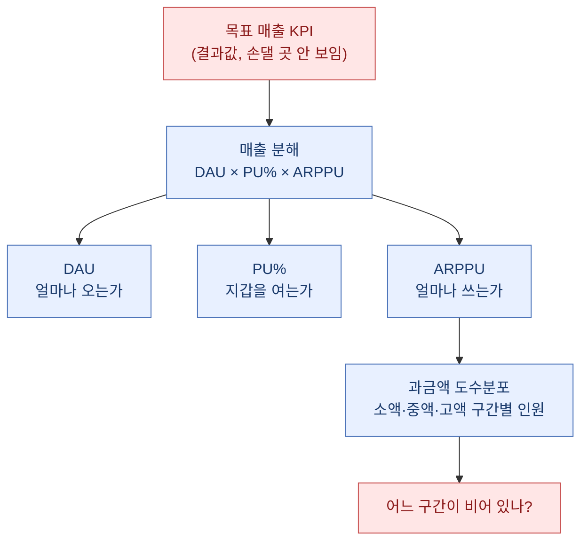
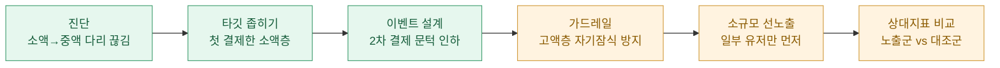
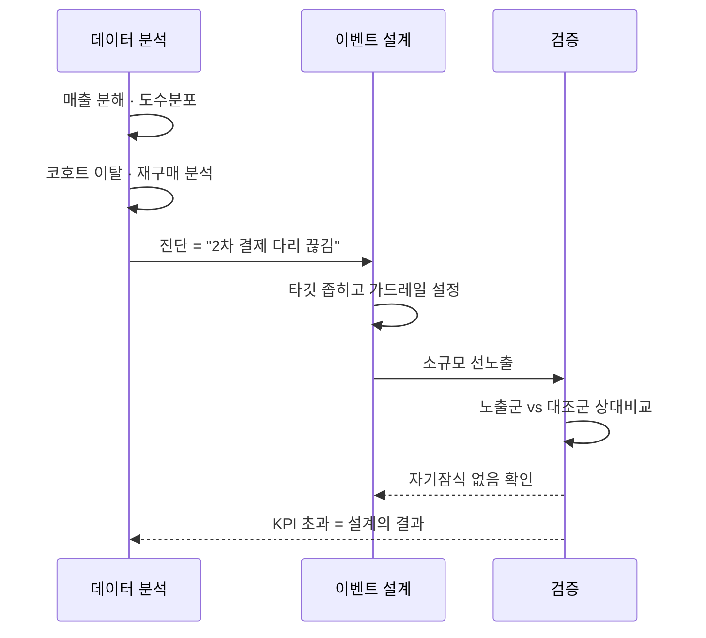

> "매출을 올리자"는 목표는 실행이 안 된다. "어느 구간의 누가, 왜 안 사는가"로 바꾸는 순간에야 이벤트가 설계된다.

분기 목표를 받아 든 날의 기억이 아직 선명하다. 상단에는 "목표 매출 KPI"라는 큰 숫자 하나가 떡하니 놓여 있었고, 나는 그 숫자를 한참 노려봤다. 이걸 어떻게 달성하지? 광고를 더 태울까, 아이템을 하나 더 팔까. 그런데 그 질문들은 전부 "감"에서 나온 거였다. 나는 습관대로 방향을 틀었다. 매출이라는 결과값 말고, 그 결과를 만드는 사람들의 분포부터 다시 보기로 했다.

이 글은 그 분기의 사고 과정을 처음부터 끝까지 되짚은 기록이다. 등장하는 게임·수치·구간은 전부 합성한 더미 예시이고, 실제 회사나 게임과는 무관하다. 나는 방법과 판단의 흐름만 남기려 한다.

## 왜 "매출"이 아니라 "분포"부터 봤나?

매출은 결과다. 결과를 아무리 노려봐도 손댈 곳이 안 보인다. 그래서 나는 늘 매출을 잘게 쪼갠다. 게임 매출은 대략 이렇게 분해된다.

예상 매출 = DAU × PU% × ARPPU

- DAU: 하루에 접속한 사람 수
- PU%: 그중 돈을 쓴 사람의 비율(과금 전환율)
- ARPPU: 돈 쓴 한 명이 평균적으로 낸 금액

이렇게 쪼개 놓으면 "매출을 올리자"가 세 갈래 질문으로 갈라진다. 사람을 더 데려올까(DAU), 안 쓰던 사람을 지갑 열게 할까(PU%), 이미 쓰는 사람이 더 쓰게 할까(ARPPU). 각각은 완전히 다른 액션이고, 다른 부서가 움직인다.

여기서 나는 하나 더 나아갔다. 돈 쓴 사람들을 금액대별로 줄 세워 도수분포를 그려봤다. 몇 명이 소액을 쓰고, 몇 명이 중액, 몇 명이 고액을 쓰는지. 이걸 보면 "우리 매출을 누가 떠받치고 있나"가 한눈에 들어온다.

더미 예시로 분포를 그려보니 흥미로운 그림이 나왔다. 소액 구간에 사람은 많은데 그 위 중액 구간이 뚝 끊겨 있었다. 소액과 고액 사이에 '계단'이 없었던 거다. 첫 결제까지는 잘 오는데, 그다음 결제로 넘어가는 다리가 없었다.

## 이탈은 어디에서 새고 있었나?

분포가 "누가 있나"를 보여준다면, 이탈 분석은 "누가 사라지나"를 보여준다. 나는 코호트(같은 시점에 들어온 사람들을 한 묶음으로 추적하는 방법)로 이 둘을 겹쳐봤다.

특히 첫 결제를 한 사람들이 그 후에도 남아 있는지, 재구매로 이어지는지를 봤다. 상대지표로만 표현하면 이런 더미 예시가 나온다.

| 구간 | 첫 결제 후 7일 잔존 | 재구매율 | 해석 |
|---|---|---|---|
| 소액 첫 결제층 | 낮음 | 매우 낮음 | 한 번 사고 떠남 — 다리 끊김 |
| 중액층 | 중간 | 중간 | 얇지만 충성도는 있음 |
| 고액층 | 높음 | 높음 | 소수가 매출을 떠받침 |

숫자를 절대값으로 말하지 않는 이유가 있다. 절대 금액은 게임마다, 시기마다 천차만별이라 비교가 안 된다. 하지만 "소액층의 재구매율이 고액층의 몇 분의 일"이라는 상대지표는 어느 게임에 갖다 놔도 말이 된다. 나는 늘 이 상대지표로 사고한다.

여기서 진단이 또렷해졌다. 문제는 신규 유입(DAU)도, 큰손(고액층)도 아니었다. 첫 결제까지 온 사람을 두 번째 결제로 못 넘기고 있는 것, 즉 소액층에서 새는 물이 핵심이었다. 매출을 광고로 끌어올리려던 처음 발상은 완전히 잘못된 곳을 겨누고 있었다.

## 그래서 어떤 이벤트를 설계했나?

진단이 "소액 → 중액으로 넘어가는 다리가 없다"였으니, 이벤트의 목표도 거기에 정확히 맞췄다. 목표는 "매출 올리기"가 아니라 "두 번째 결제의 문턱을 낮추기"였다.

설계 원칙을 세 개로 압축했다.

1. 이미 첫 결제를 한 소액층을 정조준한다(신규나 고액층에 살포하지 않는다).
2. 두 번째 결제를 하면 체감되는 보상을 준다 — 계단의 다음 칸을 눈에 보이게 만든다.
3. 기존 고액층의 결제를 갉아먹지 않도록, 보상 구간을 겹치지 않게 설계한다(자기잠식 방지).

세 번째 원칙이 사실 제일 중요했다. 이벤트가 매출을 '새로 만드는' 게 아니라, 원래 쓸 사람의 지출을 '앞당기거나 옮기는' 것에 그치면 KPI는 숫자놀음이 된다. 그래서 나는 이벤트를 전체에 뿌리기 전에 일부 유저에게만 먼저 노출하고, 노출군과 비노출 대조군의 지표를 상대비교했다. 전체 매출이 올랐는지가 아니라, "노출군의 2차 결제 전환율이 대조군 대비 몇 퍼센트 높은가"를 봤다.

## KPI를 초과했다는 걸 어떻게 확신했나?

이벤트가 끝나고 대시보드를 열었을 때, 나는 총매출부터 보지 않았다. 총매출은 그날 우연히 큰손 한 명이 지르면 튀는, 신뢰하기 어려운 숫자다. 대신 설계 때 정한 그 지표, 소액층의 2차 결제 전환율을 노출군과 대조군으로 나눠 봤다.

더미 예시로 표현하면 이런 그림이었다.

| 지표(상대비교) | 대조군 | 노출군 | 방향 |
|---|---|---|---|
| 2차 결제 전환율 | 기준선 | 뚜렷이 상승 | 의도대로 |
| 소액→중액 구간 이동 비율 | 낮음 | 상승 | 다리 생김 |
| 고액층 결제 빈도 | 유지 | 유지 | 자기잠식 없음 |
| 구간 전체 ARPPU | 기준선 | 상승 | 매출 기여 |

핵심은 세 번째 줄이었다. 고액층 지표가 흔들리지 않았다는 것 — 이게 "새 매출이 진짜로 만들어졌다"는 증거였다. 만약 고액층이 함께 떨어졌다면, 그건 지출을 옮긴 것뿐이라 KPI 초과는 착시였을 거다.

이 흐름을 다 확인하고 나서야 나는 총매출을 봤고, 목표 KPI를 넉넉히 넘겨 있었다(더미 기준 약 두 자릿수 퍼센트 초과). 하지만 내가 보고서 맨 위에 올린 건 총매출이 아니라, "소액층 2차 결제 전환이 대조군 대비 얼마나 올랐는가"였다. 그게 이 KPI 초과가 운이 아니라 설계의 결과라는 유일한 증거였기 때문이다.

## 마무리

이 분기에서 내가 배운 건 기술이 아니라 순서였다. 매출이라는 결과값을 노려보는 대신 그걸 만드는 사람들의 분포와 이탈로 내려가고, 거기서 나온 진단에 이벤트를 정확히 겨누고, 전체에 뿌리기 전에 상대지표로 검증하는 순서. 이 순서를 지키면 "이벤트 덕에 매출이 올랐다"가 아니라 "어느 구간의 누구를, 어떻게 움직여서, 얼마나 올렸다"까지 말할 수 있게 된다. KPI 초과라는 결과보다, 그 결과를 재현 가능한 이야기로 설명할 수 있게 된 게 더 값진 소득이었다.

다음 분기에도 나는 같은 질문으로 시작할 거다. "이 숫자, 누가 만들고 있지?" 그리고 절대값이 아니라 상대지표로 말할 거다. 게임이 바뀌고 시기가 바뀌어도, 그 언어만은 어디서든 통하니까.

## 참고자료

- [[game-metrics-7-definitions]] — DAU·PU·ARPPU 등 기본 지표 정의
- [[revenue-simulation-dau-pu-arppu]] — 매출을 세 요소로 분해하는 시뮬레이션
- [[arpu-vs-arppu]] — 헷갈리는 두 지표의 차이
- [[cohort-m1-retention-sql]] — 코호트로 잔존을 추적하는 방법
- [[retention-curve-beyond-m1]] — M1 이후로 리텐션 곡선 읽기
- [[repurchase-rate-churn-early-warning]] — 재구매율로 이탈을 조기 감지하기
- [[kpi-miss-revenue-decomposition-tree]] — KPI 미달을 분해 트리로 진단
- [[paying-flag-segmentation]] — 과금/무과금 플래그로 세그먼트 분석
- [[game-data-sql-recipes-retention-ltv]] — 리텐션·LTV SQL 레시피
- [game-data-recipes (GitHub)](https://github.com/DBhyeong/game-data-recipes)

<!-- 안전: 합성/더미 데이터, 회사·실데이터·PII 없음. -->
