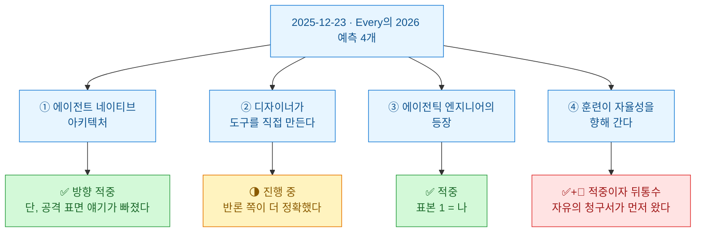
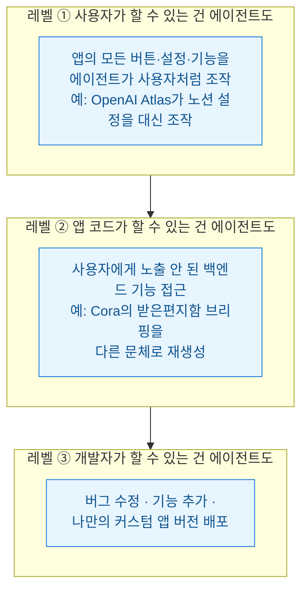
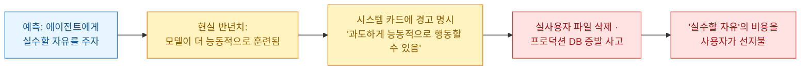

GeekNews 스트림을 훑다가 6개월 전 글 하나에 멈췄다. [Every의 '2026년 AI가 소프트웨어를 바꾸는 4가지 예측'](https://every.to/ai-and-i/four-predictions-for-how-ai-will-change-software-in-2026). 발행일이 **2025년 12월 23일**이다. 새해를 하루 앞두고 CEO 댄 시퍼(Dan Shipper)와 COO 브랜든 겔(Brandon Gell)이 팟캐스트에서 내년 내기를 건 글이다.

예측 글은 나올 때 읽으면 흥미롭고 **반년 뒤에 읽으면 채점이 된다.** 오늘이 7월 17일이니 2026년이 정확히 절반 지났다. 마침 나는 이번 주 내내 [[ai-llm-it-news-2026-07-16|AI 이슈 다이제스트]]를 쓰면서 반년치 사건을 손에 쥐고 있다. 그래서 이 글은 요약이 아니라 **채점표**다.

## 오늘 한 줄 요약

## 이 예측은 누가 왜 걸었나?

먼저 화자의 위치부터. **Every**는 뉴스레터로 시작해 AI 앱 번들(이메일 비서 Cora, 고스트라이터 Spiral, 파일 정리 Sparkle, 받아쓰기 Monologue)로 확장한 소규모 회사다. 팟캐스트에서 두 사람이 밝힌 바로는 월 반복 매출 약 15만 달러, 인원 5명에서 20명으로 성장했다고 한다. ⚠️ **전부 자기 방송에서 밝힌 자체 수치**다. 외부 검증은 없다.

그리고 이건 짚고 시작해야 한다 — **이 예측은 포지션 토크(자기 이해관계가 걸린 방향으로 하는 전망)와 분리가 안 된다.** Every는 에이전트 도구를 만들어 파는 회사고 예측 ①과 ③은 정확히 자기네 제품(컴파운드 엔지니어링 플러그인)이 잘 되는 미래다. 틀렸다는 게 아니라, **자기가 베팅한 말이 이긴다고 전망하는 글**이라는 걸 알고 읽어야 한다는 얘기다.

그걸 감안하고도 채점할 가치가 있었다. 구체적이었기 때문이다. 좋은 예측과 나쁜 예측의 차이는 적중이 아니라 **채점 가능성**인데, 이 글은 네 개 다 채점이 가능하게 쓰여 있다.

## 예측 ①: "에이전트가 일급 시민이 된다"는 무슨 말인가?

댄 시퍼가 건 첫 예측은 **에이전트 네이티브 아키텍처(agent-native architecture)**다. 인간용으로 설계된 앱에 AI를 덧붙이는 게 아니라, 인간과 에이전트를 **둘 다 일급 시민**으로 두고 소프트웨어를 짓게 된다는 예측이다. 그는 이걸 3단 사다리로 설명했다.

**채점: 방향 적중.** 반년 사이에 이 사다리는 예측이 아니라 로드맵이 됐다. 노션과 Anthropic이 이 방향으로 가고 있다는 본문의 관찰도 맞았고 브라우저(Atlas류)가 "모든 앱을 조금씩 에이전트 네이티브로 만든다"는 관찰은 지금 보면 평범한 사실이 됐다.

**그런데 이 사다리에는 뒷면이 있고 예측에는 그 얘기가 없다.** 내가 반년치 사건에서 확인한 건 이거다 — **에이전트가 일급 시민이 되는 순간, 공격자도 일급 시민이 된다.**

- "사용자가 할 수 있는 건 에이전트도"의 어두운 버전이 지난주 공개된 PromptFiction이다. `claude://` 링크 하나로 **사용자가 보내기 버튼을 누르기도 전에** 프롬프트가 자동 제출됐다(패치됨). 사용자의 권한을 에이전트가 갖는다는 건, 그 에이전트를 조종하는 링크도 그 권한을 갖는다는 뜻이었다.
- "폴더를 여는 것"조차 실행 표면이 된 게 Cursor의 윈도우 RCE 건이다. 에이전트 시대엔 클론·열기·탐색이 전부 실행이다.
- 그리고 [[anthropic-embody-benchmark-llm-robot-control|Embody 벤치마크를 뜯었을 때]] 내 결론이 정확히 이거였다 — **능력은 모델이 아니라 접근 수준(access level)의 함수다.** 시퍼의 사다리는 접근 수준의 사다리고 접근 수준의 사다리는 곧 공격 표면의 사다리다.

그러니 이 예측의 정확한 채점은 이렇다. **레벨 1\~3 사다리: 적중. 사다리를 오를수록 계약서에 깨알같이 적히는 보안 조항: 언급 없음.**

## 예측 ②: 디자이너가 정말 자기 도구를 만들기 시작했나?

두 번째 예측은 코딩을 못 해서 막혀 있던 디자이너·크리에이터가 직접 도구를 만들기 시작한다는 것. Every의 크리에이티브 리드가 자기 작업용 앱을 바이브 코딩하게 됐다는 사내 사례를 들었다.

**채점: 진행 중, 그런데 반론 쪽이 더 정확했다.** 흥미롭게도 이 예측의 가장 좋은 부분은 같은 방송에서 브랜든 겔이 단 반론이다 — "나도 터미널이 무서웠다. 디자이너들은 Cursor 같은 코드 에디터 앞에서 같은 공포를 느낄 것이고, **코드를 추상화해서 치우지 않으면** 대중화는 안 된다."

반년 지난 지금, 디자이너 개개인이 도구를 만드는 사례는 늘고 있지만 "새로운 빌더 계층"이라 부를 만한 규모는 아직 아니다. 병목은 겔이 짚은 그대로다. 능력이 아니라 **진입 인터페이스**. 바이브 코딩이 가능해진 것과, 디자이너가 검은 화면 앞에 앉는 것 사이의 거리는 생각보다 멀다.

## 예측 ③: 에이전틱 엔지니어는 실재하나?

세 번째 예측이 개인적으로 제일 재밌었다. 소프트웨어를 만드는 사람이 네 부류로 갈린다고 봤다.

| 부류 | 특징 | 코드와의 관계 |
|---|---|---|
| 전통 엔지니어 | AI 회의론, 직접 작성 | 전부 읽고 전부 쓴다 |
| AI 가속 엔지니어 | AI를 가속 수단으로 쓰되 사고방식은 전통 | 여전히 읽고, 일부 쓴다 |
| 바이브 코더 | 내부를 이해 못 해도 결과물을 만든다 | 안 읽는다 (그리고 못 읽는다) |
| **에이전틱 엔지니어** | **에이전트 지휘로 직무 자체를 재정의** | **안 읽기로 선택했다** |

**채점: 적중. 표본 1이 여기 있다.** 나는 데이터 분석가지 개발자가 아닌데, 올해 내 작업 방식은 저 네 번째 칸의 정의와 소름 돋게 일치한다. 무엇을 만들지 정의하고 문제를 분해한다. 그다음 에이전트 여러 개를 조율하고 프로그래밍 자체는 거의 전부 위임한다. 이 블로그의 자동화 파이프라인 대부분이 그렇게 만들어졌다.

다만 반년 살아 본 입장에서 정의를 한 줄 고치고 싶다. 예측은 "코딩 감각을 포기하는 대신 **에이전트 관리 역량**을 얻는 트레이드"라고 했는데, 실무에서 그 관리 역량의 정체는 지휘가 아니었다. **검증 체계 설계다.** 코드를 안 읽는 대신 나는 다른 걸 짠다 — 재실행해도 이중 발행이 안 나게 멱등으로 설계했는지, 실패가 카운터가 아니라 실제 상태로 확인되는지, 에이전트가 "됐다"고 한 것을 실측으로 되짚을 경로가 있는지. **코드를 읽는 시간이 검증 절차를 설계하는 시간으로 바뀌는 것**, 그게 이 직무의 실체에 가깝다.

같은 주제로 GeekNews에는 ["2026년에 왜 코드를 작성하는가"](https://news.hada.io/topic?id=31411)라는 반대 방향 글도 올라와 있다. 프로그래밍의 진짜 산출물은 개발자들이 공유하는 멘털 모델이고 시스템을 이해하려면 직접 코드를 만져야 한다는 쪽. 두 글을 겹쳐 읽으면 논점이 선명해진다 — **갈림길은 "AI를 쓰냐"가 아니라 "이해의 소재지를 어디에 두냐"다.** 에이전틱 엔지니어는 이해를 코드에서 검증 체계로 옮긴 사람이다.

## 예측 ④: 자율성 훈련은 어떻게 됐나?

네 번째 예측은 훈련의 방향이다. 지금의 정렬 훈련은 에이전트를 예측 가능하고 순종적으로 만드는데, 진짜 자율성엔 **탐색하고 실수할 자유**가 필요하다. 2026년엔 그 고삐를 푸는 훈련 접근이 나온다는 것. 시퍼는 아동 발달에 비유했다 — 5분만 혼자 둘 수 있던 아기가 점점 오래 혼자 놀 수 있게 되는 과정.

**채점: 적중했다. 그래서 뒤통수를 쳤다.**

고삐는 실제로 풀리는 중이다. 에이전트의 무개입 실행 시간은 계속 늘고 있고 OpenAI가 자기 모델을 공격하는 레드팀 모델을 자기대전 강화학습으로 훈련해 공개한 것도 "모델이 스스로 탐색하게 두는" 훈련의 한 형태다. 방향 예측으로는 맞았다.

그런데 반년치 사건을 겹치면 순서가 다르다. **자유가 오기 전에 청구서가 먼저 왔다.**

[[ai-llm-it-news-2026-07-16|어제 다이제스트]]에서 다뤘듯, 최신 플래그십 모델의 시스템 카드에는 "과도하게 능동적으로 행동하며 지시를 과도하게 폭넓게 해석할 수 있다"는 경고가 출시 전부터 적혀 있었고 출시 뒤 실제로 누군가의 파일이 날아갔다. 아동 발달 비유의 함정이 여기 있다. **아이는 자기 방에서 놀지만 에이전트는 내 프로덕션 DB 옆에서 논다.** 실수할 자유를 주려면 실수해도 되는 방부터 만들어야 하는데, 그 방(샌드박스·권한 설계·멱등성)에 대한 투자는 자율성에 대한 투자보다 항상 한 박자 늦다.

## 팩트체크는 어떻게 나왔나?

읽으면서 검증 가능한 대목은 직접 확인했다.

| 주장 | 판정 | 근거 |
|---|---|---|
| 원문 발행일 2025-12-23 | ✅ 확인 | every.to 원문 페이지. 2026-07-07 업데이트 표기 |
| "Opus 4.5로 코딩 에이전트가 신뢰 수준 도달" | ✅ 시점 정합 | Opus 4.5는 2025년 11월 출시 — 12월 예측 글의 근거로 시점이 맞다 |
| OpenAI Atlas 브라우저 사례 | ✅ 실재 | 2025년 10월 출시된 실제 제품 |
| Every 월 매출 15만 달러 · 인원 20명 | ⚠️ 자체 주장 | 자기 팟캐스트 발언, 외부 검증 없음 |
| "빅 AI CEO들이 2025를 에이전트의 해로 선언" | ✅ 대체로 정확 | 2024년 말\~2025년 초 양사 공개 발언과 부합 |
| 예측 ①·③의 이해관계 | ⚠️ 포지션 토크 | 자사 제품(에이전트 도구·플러그인)이 이기는 미래를 전망 |

GeekNews 요약본과 원문 사이의 왜곡은 없었다. 요약이 원문의 구조를 그대로 따랐고 수치 과장도 없다. 이건 기록해 둘 만하다 — 내가 팩트체크에서 "이상 없음"을 적는 일은 생각보다 드물다.

## 내가 챙긴 것

최종 채점표.

| 예측 | 채점 | 한 줄 |
|---|---|---|
| ① 에이전트 네이티브 아키텍처 | ✅ 적중 | 다만 사다리의 각 레벨은 공격 표면의 레벨이기도 했다 |
| ② 디자이너가 도구를 만든다 | 🌗 진행 중 | 병목은 능력이 아니라 터미널 공포 — 반론이 더 정확했다 |
| ③ 에이전틱 엔지니어 | ✅ 적중 | 실체는 지휘가 아니라 검증 체계 설계였다 |
| ④ 자율성 훈련 | ✅+🔴 적중이자 뒤통수 | 실수할 자유보다 실수의 청구서가 먼저 도착했다 |

그리고 이번 채점에서 내 작업에 가져갈 것 세 개.

- **예측 글은 반년 묵혀 읽는다.** 나올 때 읽으면 감상이 되고 채점할 수 있을 때 읽으면 공부가 된다. 글감 스트림에서 오래된 예측 글을 만나면 버리지 말고 채점하자. 오늘처럼.
- **에이전트에게 권한을 한 칸 올려 줄 때마다, 같은 칸만큼 공격 표면이 늘었는지 확인한다.** 시퍼의 사다리와 Embody의 접근 수준 결론과 7월의 보안 사고들이 전부 같은 문장을 가리킨다. 이건 우연이 아니다.
- **"에이전트 관리 역량"이라는 말을 쓰지 않기로 했다.** 너무 지휘처럼 들린다. 내가 실제로 하는 일의 이름은 검증 체계 설계이고 그 이름으로 불러야 시간을 어디에 쓸지가 명확해진다.

덤으로 하나. 이 팟캐스트에서 두 사람은 "2027년에 AGI는 없을 것"이라는 데도 합의했다. 그것도 언젠가 채점하러 돌아오겠다. 캘린더에 적어 뒀다 — 2027년 12월 31일.
