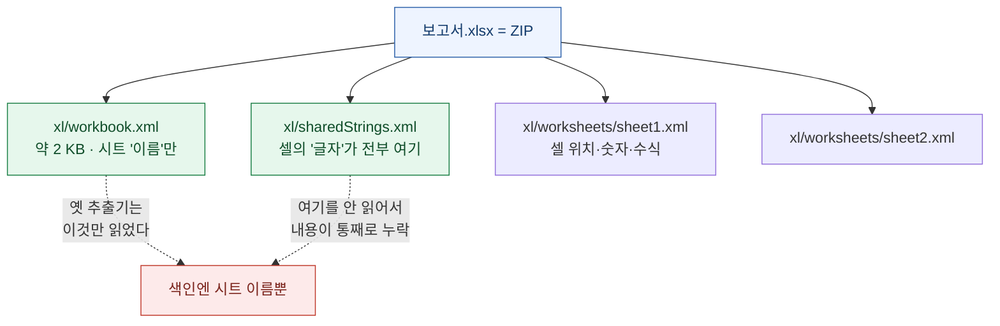
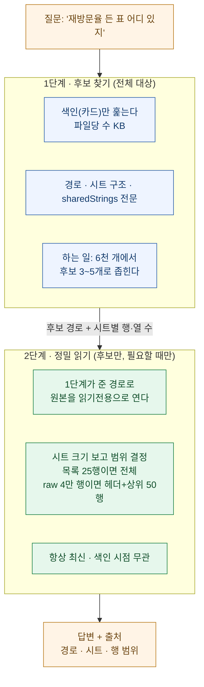
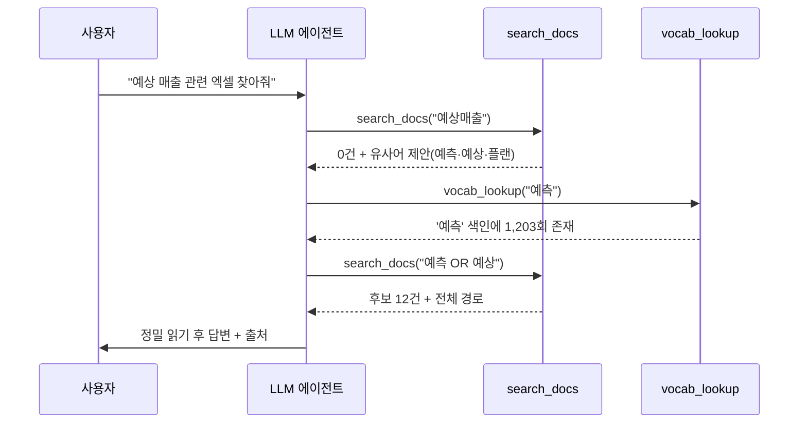
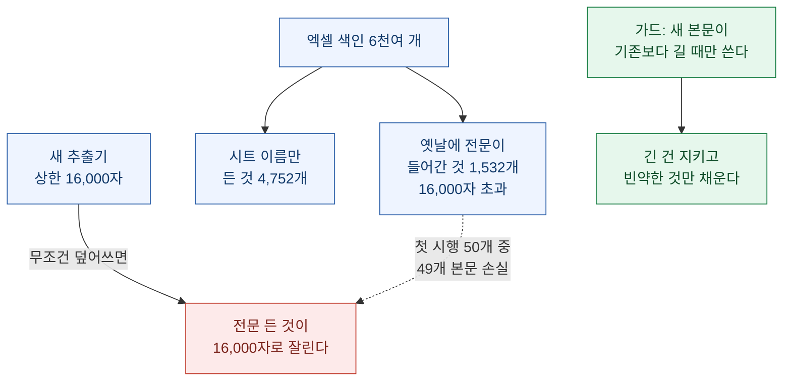

내 컴퓨터에는 엑셀 파일이 수천 개 있다. 몇 년치 리포트, 집계표, 원본 데이터 덤프, 언젠가 쓸 것 같아서 받아둔 자료집. 문제는 **정작 필요할 때 어디 있는지 못 찾는다**는 것이다.

파일 이름이 기억나면 찾는다. 그런데 대부분은 이름이 기억나지 않는다. 기억나는 건 **그 안에 뭐가 적혀 있었는지**다. "그때 그 표에 '재방문율'이라는 열이 있었는데…" 하는 식으로. 그런데 파일 탐색기도, 윈도우 검색도, 엑셀 안 글자로는 파일을 찾아주지 않는다.

그래서 검색엔진을 하나 만들어 붙였다. 로컬 파일 전체를 색인하는 SQLite 데이터베이스 하나에 [FTS5 전문검색과 관계 그래프를 담고, MCP로 AI 에이전트에 물린 도구](knowledge-vault-fts-graph-mcp-search)다. 이걸로 5만 개가 넘는 파일이 키워드·함수·테이블 단위로 검색되기 시작했다.

그런데 **엑셀만은 여전히 안 잡혔다.** "재방문율"로 검색하면 0건. 분명히 그 단어가 든 엑셀이 수백 개일 텐데. 이번 글은 그 구멍을 메운 이야기다 — 엑셀 파일을 **"검색되는 DB"로 바꾸고**, 그걸 **LLM이 직접 뒤지게** 만든 과정.

## 먼저, 여기서 "DB로 만든다"는 게 무슨 뜻인가?

프로그래밍을 모르면 "파일을 DB로 만든다"는 말이 낯설 텐데, 어렵지 않다. 그냥 **흩어진 파일들의 '내용 요약본'을 검색 잘 되는 표 하나에 모아둔다**는 뜻이다. 도서관으로 치면 책 자체가 아니라 **카드 목록(색인 카드)**을 만드는 일이다.


핵심 부품 세 가지만 이해하면 된다.

| 부품 | 하는 일 | 비유 |
|---|---|---|
| **index.db** | 파일 하나에 모든 색인을 담는 SQLite 데이터베이스 | 도서관 카드 서랍 전체 |
| **FTS5** | SQLite에 내장된 전문(全文) 검색 엔진. 긴 텍스트에서 단어를 빠르게 찾는다 | 카드에 적힌 글자로 뒤지기 |
| **MCP** | AI 에이전트가 외부 도구를 호출하는 표준. 이걸로 LLM이 검색을 직접 실행한다 | 사서에게 말로 부탁하기 |

원본 파일은 **끝까지 손대지 않는다.** 색인은 전부 별도의 `index.db`에만 쌓는다. 원본을 건드리면 수정일이 바뀌고, 최악의 경우 파일이 깨진다. 검색을 위해 원본을 위험에 빠뜨릴 이유는 없다. 이 원칙이 나중에 저장 설계 전체를 결정한다.

여기까지가 검색엔진의 뼈대다. docx·pdf·pptx·코드 파일은 이 구조로 잘 검색됐다. 그런데 엑셀은 유독 안 됐다. 왜일까?

## 왜 엑셀만 검색이 안 됐나?

원인을 재보려고 형식별로 **"본문이 제대로 들어간 비율"**을 쟀다. 결과가 한쪽만 무너져 있었다.

| 형식 | 총 건수 | 본문 정상 | 판정 |
|---|---|---|---|
| 워드(DOCX) | 287 | 98% | 정상 |
| 파워포인트(PPTX) | 292 | 99% | 정상 |
| PDF | 690 | 94% | 대체로 정상 |
| **엑셀(XLSX)** | **6,306** | 🔴 **27%** | **문제** |
| 엑셀 매크로(XLSM) | 108 | 🔴 **7%** | **문제** |

워드·PPT의 빈약분은 갈라 보니 대부분 **진짜로 짧은 문서**였다(빈 템플릿, 표지 한 장). 그런데 엑셀은 달랐다. 6,306개 중 4,570개가 **내용이 거의 안 들어가 있었다.** 그것도 실제로는 셀이 수만 칸씩 꽉 찬 파일들이.

범인은 색인 추출기의 주석이 그대로 자백하고 있었다.

```python
# 색인용 초고속 xlsx: zip에서 시트명만 직접 추출
# (셀 내용 미포함, 대용량도 ~수십 ms).
# 파일 찾기엔 파일명 + 시트명이면 충분.
```

**설계가 틀린 게 아니라 전제가 바뀌어 있었다.** 처음엔 목표가 "파일 찾기"였다. 파일 이름과 시트 이름만 알면 됐다. 그런데 어느새 목표가 **"파일 안 내용 찾기"**로 이동했는데, 추출기는 옛날 목표에 맞춰 여전히 시트 이름만 읽고 있었다.

## .xlsx를 열어보면 사실 압축파일이다

왜 시트 이름만 읽는 게 "빨랐는지"를 이해하려면 엑셀 파일의 속을 들여다봐야 한다. `.xlsx` 파일은 사실 **여러 파일을 묶은 ZIP 압축파일**이다. 확장자만 `.zip`으로 바꿔서 풀면 이런 게 나온다.



핵심은 이거다. **엑셀에서 셀은 글자를 직접 갖고 있지 않다.** 셀은 "3번 문자열"처럼 **번호만** 갖고, 실제 글자는 `sharedStrings.xml`이라는 파일 한 곳에 모여 있다. 같은 단어가 만 번 나와도 글자는 한 번만 저장하려는 압축 설계다.

그래서 시트 이름이 든 `workbook.xml`은 셀이 백만 개든 거의 커지지 않는다. 옛 추출기가 "수십 ms"로 빨랐던 이유가 여기 있다 — **내용을 통째로 포기했기 때문에** 빨랐다.

그런데 재보니 황당한 사실이 나왔다. 1MB짜리 엑셀 하나로 추출 방식을 비교했다.

| 방식 | 뽑은 글자 수 | 걸린 시간 |
|---|---|---|
| A. 시트 이름만 (기존) | 29자 | 338 ms |
| B. + sharedStrings 전문 | 1,022자 | **1 ms** |
| C. 엑셀 라이브러리로 전체 파싱 | 122만 자 | 3,273 ms |

**B가 A보다 빠르다.** A의 338ms는 ZIP을 처음 여는 비용이고, 이미 열린 ZIP에서 파일 하나(sharedStrings) 더 읽는 건 사실상 공짜다. 즉 기존 방식은 *빠르려고 내용을 포기했는데, 빠르지도 않았다.* C처럼 전체를 파싱하면 122만 자가 되어 다른 문제(뒤에 나온다)를 일으키니, 정답은 **B: sharedStrings만 읽는다**였다.

## 전체를 깊게 팔까, 얕게 팔까 — 2계층으로 나눴다

그럼 셀 내용을 전부 색인에 넣으면 될까? 여기서 함정이 있다. 어떤 엑셀은 한 시트가 **4만 행 × 9열**짜리 원본 데이터 덤프다. 이걸 6천 개나 전부 통째로 색인하면 데이터베이스가 수 GB로 부풀고 재색인에 몇 시간이 걸린다. 반대로 지금처럼 얕게만 하면 못 찾는다.

그래서 **전체는 얕게, 소수만 깊게** 파는 2계층으로 나눴다. 검색을 시간 순서로 두 단계로 쪼갠 것이다.



두 단계의 성격이 정확히 반대다.

| | 1단계 (후보 찾기) | 2단계 (정밀 읽기) |
|---|---|---|
| 대상 | 전체 6천여 개 | 후보 3\~5개 |
| 깊이 | 얕게 (텍스트 라벨) | 깊게 (셀 값·숫자까지) |
| 비용 | 전체 13 MB · 파일당 수십 ms | 파일당 수 초 |
| 시점 | 미리 (색인할 때) | 물어볼 때 |
| 최신성 | 색인 시점 고정 | 항상 최신 |

이 구조의 핵심은 **1단계에 무엇을 넣느냐**다. 여기서 후보에 못 들면 2단계는 시작조차 못 하니까. 그래서 1단계 색인에 **sharedStrings 전문**(상한 16,000자)과 **시트별 행·열 수**를 넣기로 했다.

시트별 행·열 수가 왜 중요하냐면, **2단계에서 원본을 얼마나 읽을지 정하는 유일한 근거**이기 때문이다. "이 시트는 25행이니 통째로 읽어도 되고, 저 시트는 4만 행이니 헤더랑 위 50행만 보자"를 이 숫자로 판단한다. 없으면 4만 행짜리를 통째로 읽으려다 터진다.

## 셀 내용을 어디에 어떻게 저장했나

저장 위치를 정할 때 **원본 엑셀에 메타데이터로 넣는 안은 처음부터 버렸다.** 6천 개 회사 엑셀을 다시 써서 저장하는 건 수정일 변경·무결성 훼손·쓰기 중 손상 위험을 다 떠안는 일이다. 게다가 사용자가 엑셀에서 한 번 저장하면 그 메타데이터는 날아간다. **모든 건 index.db에만, 원본은 끝까지 읽기전용.**

index.db 안에서는 값의 성격에 따라 세 곳에 나눠 담았다.

| 저장 위치 | 넣는 것 | 이유 |
|---|---|---|
| `files` 컬럼 | 자주 거르고 정렬하는 값 (크기·수정일) | 인덱스를 걸 수 있음 |
| `card` (JSON) | 형식마다 모양이 다른 값 (시트 목록·행·열 수) | 스키마 안 바꿔도 됨 |
| `fts.body` | 검색어로 맞춰야 하는 텍스트 (sharedStrings 전문) | 전문검색 대상 |

여기서 한 가지 결정이 리콜(재현율, 찾아낼 확률)을 갈랐다. **셀 내용을 통째로 넣을까, 키워드 몇 개로 압축할까?** 압축하면 용량은 줄지만 함정이 있다.

| 방식 | 파일당 | 6천 개 환산 | 사각지대 |
|---|---|---|---|
| 키워드 15개로 압축 | 131 B | 0.8 MB | 🔴 **38%** |
| **sharedStrings 전문** | 2,185 B | **13.1 MB** | ✅ **0%** |

키워드 15개로 압축하면 빈도 높은 단어만 남고 `시작일` `완료여부` 같은 **헤더·메타 용어가 전부 탈락**한다. 정작 검색할 땐 그런 단어로 찾는데 말이다. **아끼는 건 12 MB, 잃는 건 리콜 38%.** 압축할 이유가 없었다. 전문을 넣었다.

## LLM이 이 DB를 어떻게 검색하나 — 0건일 때가 진짜다

색인을 두껍게 채웠으면, 이제 LLM이 그걸 잘 쓰게 만들어야 한다. 여기가 검색엔진의 **2층(검색 도구)**이다. MCP로 노출한 도구 중 핵심은 두 개다.

- **search_docs** — 문서를 검색한다. 전체 경로·개수 조절·폴더 필터를 지원하고, **0건이면 색인에 실제로 있는 유사어를 제안**한다.
- **vocab_lookup** — 색인에 그 단어가 실제로 몇 번 나오는지(문서 빈도) 확인한다.

두 번째가 왜 필요한지가 이 설계의 묘미다. LLM이 검색어를 **감으로** 넣기 때문이다. 사람이 "예상 매출"로 찾는데 문서엔 "매출 예측"으로 적혀 있으면 0건이 나온다. 이때 그냥 "결과 없음"으로 끝나면 거기서 막힌다. 대신 이렇게 되게 만들었다.



**검색 실패가 막다른 길이 아니라 다음 행동의 힌트가 된다.** "예상매출 0건 → 색인엔 예측(1,203)·예상(892)·플랜(445)이 있음 → '예측 OR 예상'으로 재검색"으로 스스로 이어간다. 이 어휘 사전(vocab 테이블)은 셀 내용을 색인하는 김에 부산물로 만들어졌다 — 93만 개 토큰이 담겼다.

## 결과 — 12%에서 98.5%로

표본 150개 파일에 질문 200개를 던져 **10위 안에 정답이 드는 비율(리콜@10)**을 쟀다.

| | 정답 적중 | 리콜@10 |
|---|---|---|
| 이전 (시트 이름만) | 23 / 200 | **11.5%** |
| 이후 (셀 내용까지) | 197 / 200 | **98.5%** |

실제 프로덕션 데이터베이스에 적용한 결과도 옮긴다. 6,414개 엑셀을 재색인해서:

- 본문이 빈약(1,500자 미만)하던 파일: **4,752개 → 1,494개**
- 잔여 1,494개는 표본 확인 결과 **원본 자체에 셀 텍스트가 거의 없는 파일**이었다(숫자만 든 수치 전용 표). 추출 실패가 아니다.
- 전체 추가된 본문: 약 **85 MB**, 소요 시간 약 12분

체감되는 변화는 이 한 줄이다.

```
이전:   파일 이름을 알아야 찾을 수 있다
이후:   안에 뭐가 들었는지로 찾을 수 있다
```

이득은 **"파일 이름이 내용을 설명하지 않을 때"** 나온다. 파일명이 `2024-03_월간리포트_v1.1.xlsx`처럼 이미 설명적이면 이전에도 찾았다. 그런데 파일명이 `분석_최종_진짜최종.xlsx`인데 안에 "재방문 코호트별 이탈률"이 있으면? 이전엔 이 파일을 찾을 방법이 아예 없었다. 이제는 찾는다.

## 21시간 걸릴 뻔한 재색인을 36초로 — 실수 두 개

여기까지가 설계고, 실제로 돌릴 때 두 번 넘어졌다. 둘 다 **"로컬 빌드는 멀쩡히 통과하는데 프로덕션에서 터지는"** 종류라 기록해 둔다.

### 실수 ① 삭제 한 줄이 전체 스캔이었다

기존 색인을 지우고 새로 넣으려고 `DELETE ... WHERE path = ?`를 파일마다 실행했다. 그런데 FTS5 전문검색 테이블은 **경로(path) 컬럼에 인덱스가 없다.** 그래서 삭제 한 번마다 5만 8천 행 × 평균 13만 자를 전부 훑었다. **파일당 11.8초.** 6,414개면 **21시간**이 나온다.

해결은 발상을 뒤집는 것이었다. 시작할 때 `경로 → (내부 행번호, 길이)` 지도를 **딱 한 번** 만들어두고, 그 다음부터는 인덱스가 있는 내부 행번호로 삭제했다. **21시간 → 36초.**

### 실수 ② 같은 확장자인데 색인 이력이 섞여 있었다

이게 더 무서웠다. 엑셀 항목은 사실 **두 부류**가 섞여 있었다.



새 추출기는 sharedStrings를 16,000자 상한으로 넣는다. 그런데 예전에 **다른 경로로 전문(50만 자)이 들어간** 파일이 1,532개 있었다. 여기에 새 추출기를 무조건 적용한 첫 시행에서, 50개 중 **49개가 본문을 잃었다**(50만 자 → 1.8만 자). 재색인이 개선이 아니라 개악이 된 것이다.

다행히 재색인 전에 **데이터베이스 백업(4.5 GB)을 만들어 둔** 덕에 되돌렸고, 규칙 한 줄을 넣었다.

```python
# 새 본문이 기존보다 짧으면 건드리지 않는다
if len(new_body) <= old_len:
    continue
```

**재색인의 기본 원칙: 길이가 늘어날 때만 쓴다.** 대량 갱신 전 백업은 선택이 아니라 필수라는 것도 이날 배웠다.

## 정리 — 그리고 이 설계로도 안 되는 것

파일을 "검색되는 DB"로 만드는 일은 결국 세 층을 쌓는 것이었다.

| 층 | 결정하는 것 | 이번에 한 일 |
|---|---|---|
| **1층 · 색인** | 찾을 수 있는가 (리콜 상한) | 시트 이름만 → **셀 내용 전문** (12% → 98.5%) |
| **2층 · 검색 도구** | 몇 번 만에 찾는가 | 전체 경로·유사어 제안·어휘 사전 |
| **3층 · LLM** | 맞게 판단하는가 | 0건이면 어휘로 재검색, 후보만 정밀 읽기 |

경계도 분명히 해둔다. 이 방식으로도 **셀의 숫자 값 검색**(sharedStrings엔 텍스트만 있다), **전체 집계**("전 파일 매출 합계"), **유사어 매칭**("이탈"으로 "churn" 찾기)은 안 된다. 각각 2단계 원본 읽기, 데이터 파이프라인, 임베딩의 영역이다. 하지만 처음 목표 — **"안에 뭐가 들었는지로 파일을 찾는다"** — 는 이제 된다.

엑셀은 특별히 까다로운 형식이 아니었다. 그저 **글자가 셀이 아니라 다른 파일에 모여 있었을 뿐**이고, 옛 추출기가 그 파일을 안 읽고 있었을 뿐이다. 압축을 한 겹 열어보는 것으로 6천 개의 엑셀이 검색되기 시작했다.
