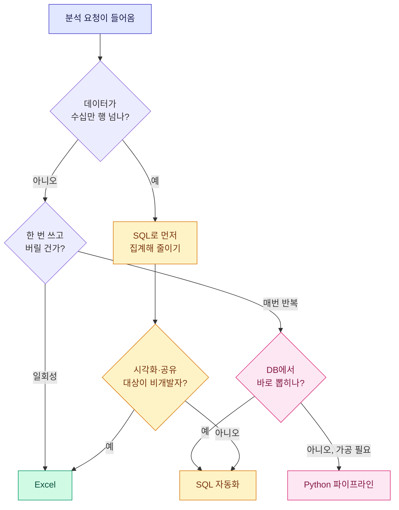
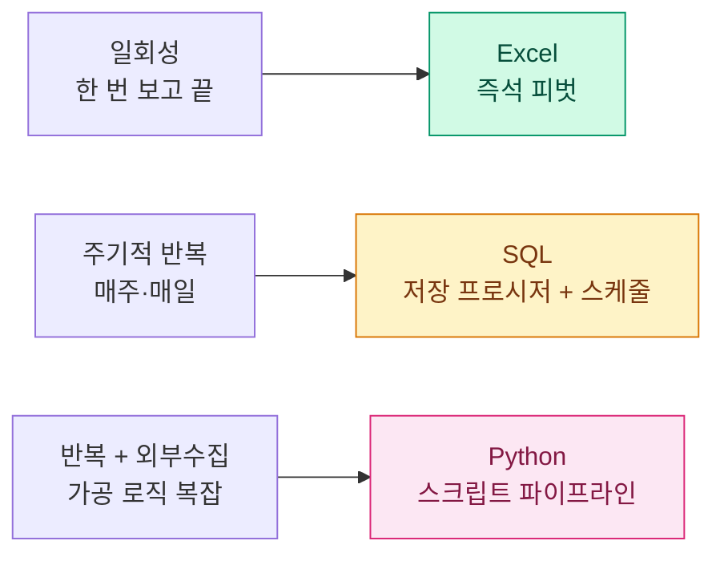
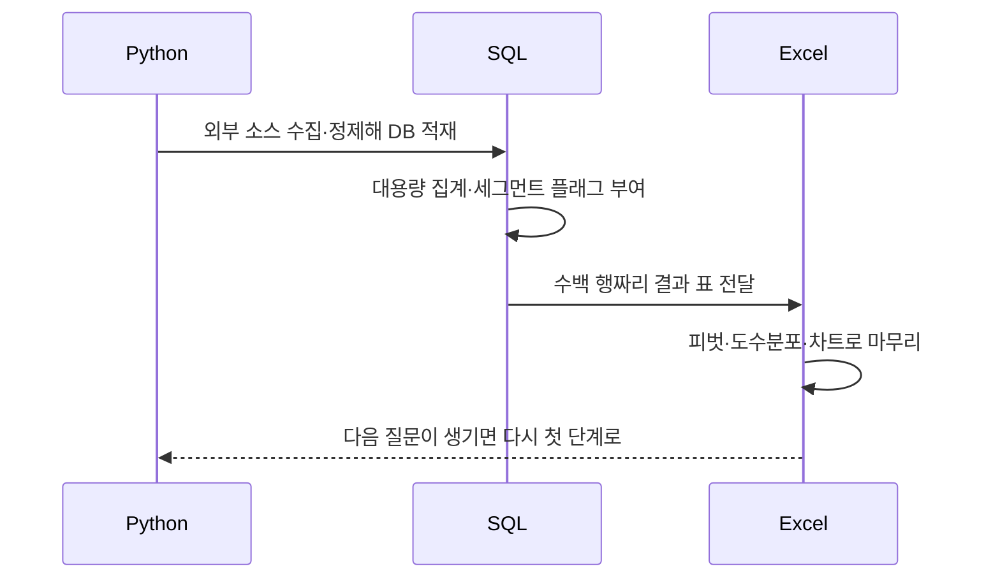

> "이거 엑셀로 하면 안 돼요?"라는 질문을 받을 때마다, 나는 되묻는다. "데이터가 몇 줄인데요? 이거 다음 주에 또 해요? 누가 봐요?"

데이터 분석가로 일하면서 가장 자주 받는 질문 중 하나가 "그 분석 무슨 도구로 했어요?"다. 그리고 가장 자주 하는 대답이 "상황 봐서요"다. 성의 없어 보이지만 진심이다. Excel, SQL, Python은 서로 대체재가 아니라 서로 다른 지점에서 빛나는 도구다. 오늘은 내가 게임 지표를 다룰 때 이 셋을 어떤 기준으로 갈라 쓰는지, 머릿속 분기(分岐)를 한 번 꺼내서 정리해 본다.

미리 밝혀둘 것. 이 글에 나오는 숫자·게임·지표는 전부 예시용 더미다. 실제 회사나 서비스 데이터가 아니라, 개념을 설명하려고 지어낸 값이라는 뜻이다.

## 애초에 왜 도구를 고민해야 하지?

솔직히 말하면, 도구 하나만 잘해도 웬만한 분석은 다 된다. Excel만으로도 리텐션 표를 그릴 수 있고, SQL만으로도 매출 시뮬레이션을 돌릴 수 있다. 그런데도 내가 굳이 셋을 나눠 쓰는 이유는 딱 하나, **시간**이다.

같은 결과를 내더라도, 100만 행짜리 로그를 Excel로 열면 노트북이 5분간 멈춘다. 반대로 동료에게 "이 숫자 좀 봐줘" 하고 넘기는 자리에 SQL 콘솔을 띄우면 상대가 당황한다. 도구를 고른다는 건 결국 "지금 이 작업에서 내 시간과 상대의 시간을 어디서 아낄까"를 고르는 일이다.

나는 이 판단을 세 개의 질문으로 압축했다. 데이터가 **얼마나 큰가**(규모), 이 일을 **또 할 건가**(반복성), 결과를 **누가 볼 건가**(공유 대상). 이 세 축으로 도구가 거의 자동으로 정해진다.

## 데이터 규모: 몇 줄부터 Excel을 놓아줘야 하나?

가장 먼저 걸리는 벽은 규모다. Excel은 편하지만 물리적 한계가 있다. 시트 하나가 약 100만 행에서 끊기고, 그 근처만 가도 수식 하나 바꿀 때마다 재계산이 돌아 화면이 얼어붙는다.

게임 로그는 이 한계를 아주 쉽게 넘는다. 예를 들어 일일 접속 유저가 5만 명이고, 한 명이 하루에 남기는 이벤트가 평균 200줄이라고 치자. 하루치만 1000만 행이다. 이걸 Excel로 열겠다는 건, 바다를 국자로 퍼서 옮기겠다는 얘기다.

내 기준은 단순하다.

| 데이터 규모(예시) | 1차 도구 | 이유 |
|---|---|---|
| 수천\~수만 행 | Excel | 눈으로 훑고 손으로 만지는 게 제일 빠름 |
| 수십만\~수억 행 | SQL | 집계·필터를 DB가 대신 감당 |
| 원천이 여러 곳에 흩어짐 | Python | 수집·정제·병합을 코드로 묶음 |

핵심은 "큰 데이터를 큰 채로 다루지 않는다"는 것. SQL로 먼저 **집계해서 줄인** 뒤, 결과 표가 수백 행짜리로 작아지면 그때 Excel로 옮겨 마무리한다. 도수분포(값을 구간별로 나눠 몇 개씩 있는지 세는 것)나 피벗 같은 최종 손질은 여전히 Excel이 제일 손에 붙는다. 원본 1000만 행을 DB에서 씹어 200행으로 뱉어내고, 그 200행을 Excel에서 색칠하는 식이다.

## 반복성: 이 작업, 다음 주에 또 하나?

두 번째 축은 반복성이다. 이게 실무에서 도구를 가장 크게 가른다.

한 번 쓰고 버릴 분석이라면 Excel이 압도적으로 빠르다. 굳이 코드를 짜서 재사용 구조를 만들 이유가 없다. "이번 이벤트 기간 매출만 한 번 보자" 같은 일회성 요청은 그냥 데이터 붙여넣고 피벗 돌리는 게 정답이다.

그런데 "매주 월요일마다 지난주 리텐션 뽑아줘" 같은 요청이면 얘기가 완전히 달라진다. 매번 손으로 하면 그건 분석이 아니라 노동이다. 나는 이런 반복 작업을 만나면 SQL 쪽으로 넘긴다. 특히 MS-SQL 계열에서는 저장 프로시저(stored procedure, 자주 쓰는 쿼리 묶음을 DB에 이름 붙여 저장해 두고 호출만 하는 것)로 만들어두면, 다음부터는 실행 한 번으로 같은 표가 나온다.

한 번은 매일 반복되는 지표 리포트를 프로시저로 묶어두고 스케줄만 걸어놨더니, 아침마다 30분씩 하던 일이 사라졌다. 그렇게 아낀 시간은 "숫자를 뽑는" 일이 아니라 "숫자를 해석하는" 일에 썼다.

반복성이 높으면서 데이터 가공까지 복잡하면 그때 Python이 나선다. 예를 들어 DB 밖 여러 소스에서 자료를 긁어와야 하거나, 웹에서 값을 수집해 정제한 뒤 다시 DB에 적재해야 하는 흐름. 이건 SQL만으로는 손이 닿지 않는 영역이라 파이썬으로 수집·정제·적재를 한 줄기 파이프라인으로 엮는다. `pymssql` 같은 커넥터로 결과를 다시 DB에 밀어넣어 두면, 그다음 분석은 또 SQL로 이어받는다.

## 공유 대상: 이 결과를 누가 보나?

세 번째 축은 자주 잊히지만 실은 제일 중요하다. 분석은 나 혼자 보려고 하는 게 아니기 때문이다.

결과를 받는 사람이 기획자나 사업 담당처럼 비개발 직군이면, 아무리 SQL 결과가 깔끔해도 콘솔 화면을 넘기면 안 된다. 그들이 직접 숫자를 눌러보고 정렬하고 필터링할 수 있어야 한다. 그래서 최종 산출물은 결국 Excel 표나 대시보드 형태로 떨어진다. "만질 수 있는 결과"가 설득력을 만든다.

반대로 같은 분석을 다른 분석가나 개발자와 나눌 거라면, 재현 가능한 쿼리나 스크립트를 통째로 넘기는 게 낫다. 그래야 상대가 조건을 바꿔가며 스스로 검증할 수 있다.

| 공유 대상 | 좋은 산출물 형태 | 피해야 할 것 |
|---|---|---|
| 기획·사업(비개발) | Excel 표, 대시보드, 차트 | 날것의 쿼리 결과 |
| 동료 분석가·개발자 | 재현 가능한 SQL·Python 코드 | 스크린샷만 던지기 |
| 경영진 보고 | 한 장짜리 요약 + 핵심 수치 | 원본 로그 전체 |

내가 세그먼트(유저를 특정 기준으로 묶은 집단) 분석을 할 때 자주 쓰는 패턴이 이 세 축을 한 번에 보여준다. 과금/무과금을 가르는 플래그(flag, 조건 충족 여부를 0/1로 표시하는 한 컬럼) 하나를 SQL 앞단계에서 미리 심어둔다. 그러면 "신규 무과금 유저의 리텐션", "고액 과금층의 재구매율" 같은 질문이 전부 그 플래그 하나로 갈라진다. 규모가 큰 원본은 SQL이 감당하고(규모), 플래그를 한 번 심어두면 여러 질문에 재사용되며(반복성), 최종 세그먼트 표는 Excel로 떨어져 누구나 본다(공유). 값싼 컬럼 하나가 세 축을 동시에 만족시키는 셈이다.

## 그래서 셋 중 뭐가 제일 좋냐고?

이 질문을 받으면 나는 항상 "그건 좋은 질문이 아니에요"라고 답한다. 셋은 경쟁 관계가 아니라 **릴레이**이기 때문이다. 실제 하나의 분석은 대개 이렇게 흐른다.

Python이 흩어진 데이터를 그러모아 DB에 채우고, SQL이 그 큰 덩어리를 씹어 작은 표로 줄이고, Excel이 그 표를 사람이 읽을 모양으로 다듬는다. 도구를 고른다는 건 이 릴레이에서 지금 내가 몇 번째 주자인지를 아는 일이다.

굳이 한 줄 원칙으로 압축하면 이렇다. **"큰 건 SQL에 맡기고, 반복은 코드로 굳히고, 사람에게 줄 건 Excel로 편다."** 규모·반복성·공유 대상, 이 세 질문만 스스로에게 던져도 도구는 거의 저절로 정해진다.

## 마무리

도구에 정답은 없지만 순서에는 감각이 있다. 초보 시절의 나는 "어떤 도구가 제일 강력한가"를 고민했는데, 지금은 "이 작업의 성격이 무엇인가"를 먼저 본다. 데이터가 크면 SQL, 반복되면 자동화, 사람에게 넘길 거면 Excel. 그리고 이 흐름을 잇는 접착제가 Python이다.

혹시 지금 "이거 엑셀로 될까, 파이썬 짜야 하나" 고민 중이라면, 도구 이름을 먼저 떠올리지 말고 세 질문부터 던져보길 권한다. 얼마나 큰가, 또 할 건가, 누가 보는가. 이 세 개면 대부분 답이 나온다. 나머지는 손이 기억한다.

## 참고자료

- [[game-metrics-7-definitions]] — 리텐션·ARPPU·픽률 등 게임 지표 기본기
- [[paying-flag-segmentation]] — 과금/무과금 플래그 한 컬럼으로 세그먼트를 가르는 SQL 패턴
- [[game-data-sql-recipes-retention-ltv]] — 리텐션·LTV를 뽑는 SQL 레시피 모음
- [[revenue-simulation-dau-pu-arppu]] — DAU·PU%·ARPPU로 매출을 시뮬레이션하는 법
- game-data-recipes 저장소: https://github.com/DBhyeong/game-data-recipes

<!-- 안전: 합성/더미 데이터, 회사·실데이터·PII 없음. -->
