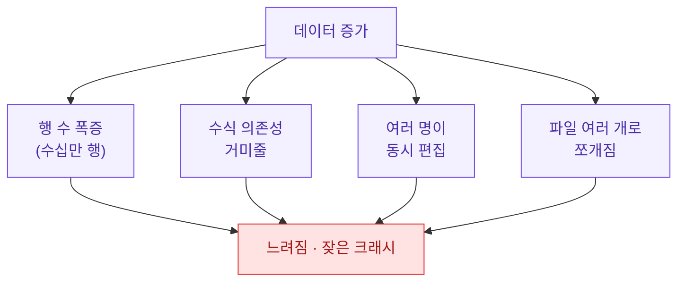
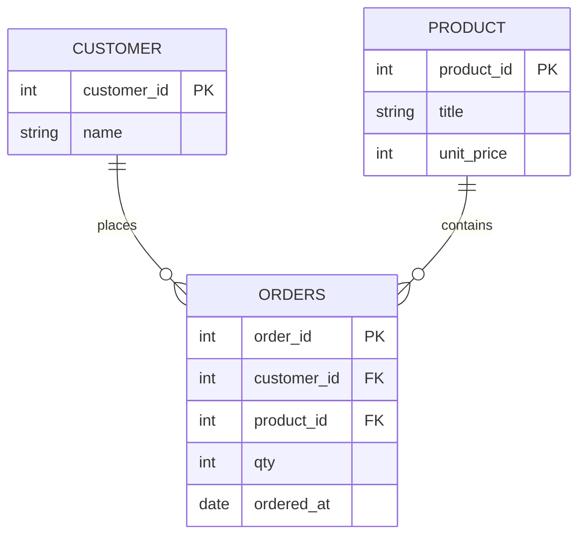
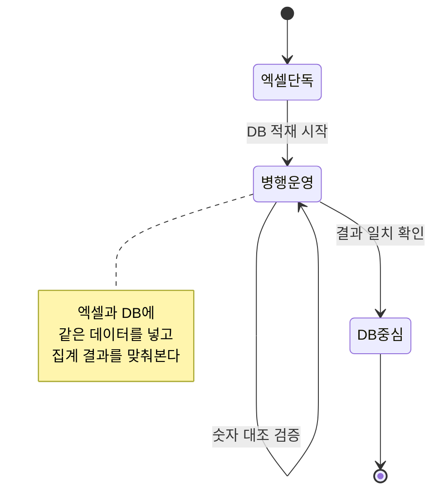
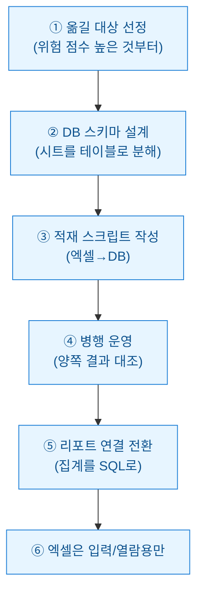

엑셀은 참 좋은 도구다. 나도 데이터 일을 시작할 때 거의 모든 걸 xlsx로 처리했다. 그런데 어느 순간부터 파일을 열 때마다 커피 한 잔을 내려야 할 만큼 느려지고, 가끔은 열자마자 "복구할 수 없습니다"라는 창이 뜨기 시작했다. 그때가 바로 "이제 엑셀을 벗어날 때"라는 신호였다.

이 글은 그 신호를 어떻게 알아채고, 무엇을 준비해서, 어떤 순서로 DB로 넘어갈지를 실무자 관점에서 정리한 회고다. 등장하는 수치·표·스키마는 전부 **합성(더미) 데이터**이고, 특정 회사의 실제 파일이나 구성과는 무관하다.

## 한눈에 보면 이야기가 어떻게 흐르나?


엑셀이 나쁜 게 아니라, 데이터가 자라면서 엑셀이 감당할 수 있는 범위를 넘어가는 순간이 온다는 얘기다. 그 순간을 놓치면 "느린데 참고 쓰다가 결국 파일이 깨져서 하루를 날리는" 사고가 난다.

## 왜 엑셀이 어느 순간 한계에 부딪히나?

엑셀은 태생이 "사람이 눈으로 보고 손으로 고치는" 스프레드시트다. 데이터가 작을 때는 이게 장점인데, 커지면 바로 그 특성이 발목을 잡는다.



핵심은 이렇다. 엑셀은 데이터와 로직(수식)과 표현(서식)이 한 파일에 뒤엉켜 있다. 반면 DB는 데이터를 순수하게 저장만 하고, 계산과 표현은 분리한다. 데이터가 커질수록 이 분리가 주는 이점이 커진다.

## 그래서 '넘어갈 때'라는 신호는 어떻게 알아채나?

한두 개 신호는 그냥 참고 쓸 수 있다. 문제는 여러 개가 동시에 켜질 때다. 나는 아래 표를 체크리스트처럼 쓴다. (수치는 합성 데이터 기준의 감각적 임계값이다.)

| 신호 | 엑셀이 편한 구간 | 슬슬 위험 | DB로 넘어갈 때 |
| --- | --- | --- | --- |
| 행 수 | 1만 행 이하 | 5만~10만 행 | 수십만 행 이상 |
| 파일 크기 | 5MB 이하 | 20~50MB | 파일 열기만 수십 초 |
| 동시 편집자 | 1명 | 2~3명 | 여러 명이 같은 파일 다툼 |
| 파일 개수 | 1개 | 월별로 쪼갠 몇 개 | 이름만 다른 사본 난립 |
| 깨짐 빈도 | 없음 | 가끔 복구 창 | 한 달에 여러 번 손상 |
| 이력 추적 | 필요 없음 | 수동 버전 관리 | "누가 언제 바꿨나"가 중요 |

한 열만 오른쪽 끝에 걸려도 신경 쓰이지만, 세 개 이상이 "DB로 넘어갈 때" 칸에 몰리면 나는 거의 무조건 전환을 준비한다.


## 신호를 숫자로 확인해볼 수는 없나?

감으로만 판단하면 설득이 안 된다. 그래서 나는 옮기기 전에 지금 쓰는 파일들의 상태를 간단히 스캔한다. 아래는 합성 데이터로 만든 예시 스크립트다. 폴더 안 xlsx들의 크기·행 수를 훑어서 "위험 점수"를 매긴다.

```python
# 합성 데이터 예시입니다. 실제 회사 파일과 무관합니다.
from pathlib import Path
import pandas as pd

# 실제로는 폴더를 훑지만, 여기서는 더미 목록으로 대체
dummy_files = [
    {"name": "sales_2026.xlsx", "size_mb": 42.0, "rows": 180_000},
    {"name": "sales_2026_backup.xlsx", "size_mb": 41.5, "rows": 179_800},
    {"name": "members.xlsx", "size_mb": 3.1, "rows": 4_200},
    {"name": "log_daily.xlsx", "size_mb": 66.0, "rows": 320_000},
]

def risk_score(f):
    score = 0
    if f["size_mb"] >= 20: score += 1
    if f["size_mb"] >= 50: score += 1
    if f["rows"] >= 50_000: score += 1
    if f["rows"] >= 150_000: score += 1
    if "backup" in f["name"] or "사본" in f["name"]: score += 1
    return score

df = pd.DataFrame(dummy_files)
df["risk"] = df.apply(risk_score, axis=1)
df["verdict"] = df["risk"].map(
    lambda s: "DB 권장" if s >= 3 else ("주의" if s >= 1 else "엑셀 유지")
)
print(df[["name", "size_mb", "rows", "risk", "verdict"]])
```

출력은 대략 이렇게 나온다(합성 데이터).

```
                     name  size_mb    rows  risk    verdict
0         sales_2026.xlsx     42.0  180000     3     DB 권장
1  sales_2026_backup.xlsx     41.5  179800     3     DB 권장
2            members.xlsx      3.1    4200     0   엑셀 유지
3           log_daily.xlsx     66.0  320000     4     DB 권장
4  ... (이하 생략)
```

`members.xlsx`처럼 작고 사람이 직접 관리하는 표는 굳이 옮길 필요가 없다. 반대로 로그성·거래성 데이터는 점수가 금방 올라간다. 전부 다 옮기는 게 아니라 **점수 높은 것부터** 옮기는 게 요령이다.

## 엑셀의 표를 DB 테이블로 어떻게 바꾸나?

가장 헷갈리는 지점이다. 엑셀은 한 시트에 모든 걸 다 넣는 경향이 있는데, DB는 성격이 다른 정보를 나눠서 저장한다. 예를 들어 "주문 시트" 하나에 고객 이름·상품명·수량이 다 들어 있다면, DB에서는 이렇게 쪼갠다.



엑셀에서 고객 이름을 100번 반복해 적던 걸, DB에서는 고객을 한 번만 등록하고 주문에서 번호로 참조한다. 이렇게 하면 이름이 바뀌어도 한 곳만 고치면 되고, 오타로 인한 "김철수 / 김 철수 / 김철수 " 같은 중복 집계 사고가 사라진다.

옮기는 것 자체는 파이썬 몇 줄로 끝난다(합성 데이터 예시).

```python
# 합성 데이터 예시입니다.
import pandas as pd
import sqlite3

# 엑셀 → DataFrame (여기서는 더미 프레임으로 대체)
orders = pd.DataFrame({
    "order_id": [1, 2, 3],
    "customer_id": [10, 11, 10],
    "product_id": [100, 100, 101],
    "qty": [2, 1, 5],
    "ordered_at": ["2026-07-01", "2026-07-01", "2026-07-02"],
})

# DataFrame → DB 테이블
con = sqlite3.connect("shop.db")
orders.to_sql("orders", con, if_exists="append", index=False)

# 집계는 이제 SQL로
q = """
SELECT ordered_at, SUM(qty) AS total_qty
FROM orders
GROUP BY ordered_at
ORDER BY ordered_at
"""
print(pd.read_sql(q, con))
con.close()
```

엑셀에서 피벗테이블로 끙끙대던 일별 합계가 SQL 세 줄로 끝난다. 처음엔 SQLite처럼 파일 하나로 되는 가벼운 DB로 시작해도 충분하다. 서버형 DB는 나중에 필요할 때 옮기면 된다.

## 한 번에 다 갈아엎어야 하나?

이게 제일 흔한 실수다. 잘 돌아가던 걸 어느 날 통째로 DB로 바꾸겠다고 덤비면, 기존 리포트가 다 멈추고 팀이 패닉에 빠진다. 나는 항상 병행 운영 구간을 둔다.



순서를 풀어 쓰면 이렇다.



④번 병행 운영이 핵심이다. 같은 기간의 매출 합계가 엑셀과 DB에서 똑같이 나오는지 며칠 대조해보고, 어긋나면 원인을 잡는다. 여기서 신뢰가 쌓여야 리포트를 DB로 갈아탈 수 있다.

그리고 ⑥번, 엑셀을 완전히 버릴 필요는 없다. 사람이 손으로 입력하거나 눈으로 훑어보는 용도로는 여전히 최고다. 무거운 저장과 집계만 DB로 넘기고, 엑셀은 "입력 창구 겸 뷰어"로 남겨두는 하이브리드가 현실적으로 가장 오래간다.

## 넘어가고 나면 뭐가 달라지나?

| 항목 | 엑셀 중심 | DB 중심 |
| --- | --- | --- |
| 대용량 집계 | 파일 열기부터 지연 | 쿼리로 즉시 |
| 동시 작업 | 파일 잠김·충돌 | 여러 명이 동시에 조회 |
| 중복/오타 | 사람이 눈으로 방지 | 참조 구조로 예방 |
| 이력 추적 | 사본 파일로 수동 | 적재 시각 컬럼으로 자동 |
| 사고 위험 | 파일 손상 = 전체 손실 | 백업·복구 체계화 |
| 진입 장벽 | 낮음(누구나) | SQL 학습 필요 |

물론 공짜는 아니다. SQL을 배워야 하고, 초기 설계에 품이 든다. 그래서 "무조건 DB가 옳다"가 아니라, 앞의 신호들이 겹칠 때 그 비용을 감수할 가치가 생긴다는 얘기다.

## 핵심 3줄 요약

- 엑셀이 느려지고 자주 깨지고 사본이 난립하기 시작하면, 그게 DB로 넘어갈 신호다. 여러 신호가 겹칠 때 움직인다.
- 통째로 갈아엎지 말고, 위험 점수 높은 데이터부터 골라 병행 운영으로 숫자를 대조하며 단계적으로 옮긴다.
- 엑셀을 완전히 버리는 게 아니라, 무거운 저장·집계는 DB로, 입력·열람은 엑셀로 나누는 하이브리드가 오래간다.
