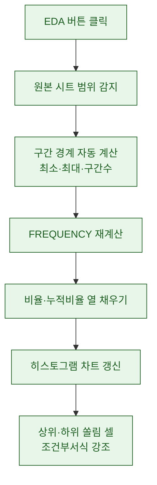
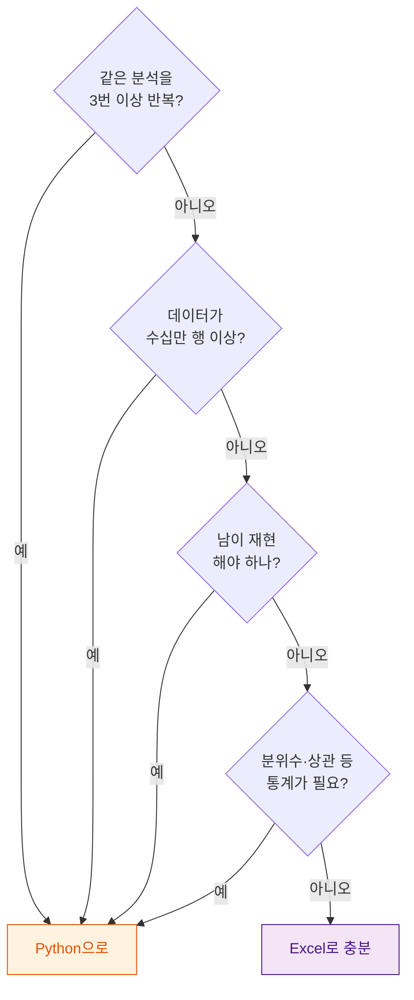

> "일단 분포부터 보자." — 데이터를 처음 받으면 내가 늘 중얼거리던 말이다. 그리고 한동안 그 '분포 보기'는 전부 Excel 안에서 끝났다.

지금이야 노트북 열고 `df.hist()` 한 줄이면 끝나는 일이지만, 몇 년 전의 나는 데이터를 받으면 반사적으로 Excel부터 켰다. 파이썬을 몰라서가 아니라, 그게 제일 빨랐기 때문이다. 오늘은 그 시절 내가 셀과 매크로만으로 도수분포와 EDA(탐색적 데이터 분석, 데이터를 본격적으로 파고들기 전에 "얘 대충 어떻게 생겼나" 훑어보는 작업)를 어떻게 반자동화했는지, 그리고 왜 결국 Python으로 넘어갈 수밖에 없었는지를 일기처럼 적어본다.

## 왜 하필 Excel이었나?

이유는 단순하다. 진입 장벽이 0에 가까웠다. 데이터를 CSV로 받아 더블클릭하면 바로 표가 뜬다. 정렬 한 번, 필터 한 번이면 "아 이 값이 이상하게 크네" 하는 감이 즉시 온다. 분석 환경을 세팅하고 라이브러리를 임포트하는 절차 자체가 없다.

내가 Excel에서 반복적으로 하던 EDA는 대략 이런 흐름이었다.


핵심은 "코드 없이, 손이 기억하는 속도로" 데이터의 생김새를 파악하는 것이었다. 정확한 통계를 뽑으려는 게 아니라 방향을 잡으려는 단계라, 이 빠릿함이 정말 소중했다.

## 도수분포는 어떻게 반자동으로 만들었나?

도수분포(frequency distribution)는 쉽게 말해 "어떤 값이 몇 번 나왔나"를 구간별로 세는 것이다. 예를 들어 유저별 하루 접속 시간을 0\~10분, 10\~20분, 20\~30분… 이렇게 칸(bin)으로 나눠 각 칸에 몇 명이 들어가는지 세면, 그게 곧 히스토그램의 재료가 된다.

Excel에서 이걸 손으로 세면 미치는 일이지만, `FREQUENCY` 함수 하나로 반자동화가 된다. 구간 경계값을 한 열에 죽 적어두고, 배열 수식으로 데이터 전체를 한 번에 세는 방식이다.

| 구간(분) | 경계값(bin) | 도수(명) | 비율 |
|---|---|---|---|
| 0\~10 | 10 | 1,820 | 42% |
| 10\~20 | 20 | 1,140 | 26% |
| 20\~30 | 30 | 610 | 14% |
| 30\~40 | 40 | 430 | 10% |
| 40 이상 | — | 350 | 8% |

(위 수치는 전부 합성 더미다.) 여기서 한 발 더 나가면 VBA 매크로로 완전 반자동화를 했다. 새 데이터를 붙여넣고 버튼 하나 누르면, 매크로가 경계값 열을 읽어 `FREQUENCY`를 다시 계산하고, 옆에 비율 열을 채우고, 막대그래프까지 새로 그려주게 만든 것이다. 매주 같은 포맷의 데이터가 들어올 때 이 버튼 하나의 위력은 대단했다. 반복 작업을 손에서 떼어내는 것, 그게 내가 생각하는 자동화의 시작점이다.

## VBA 매크로는 어디까지 해줬나?

VBA로 짠 "EDA 버튼"이 해주던 일을 정리하면 이렇다.



여기에 피벗테이블을 곁들이면 EDA가 한층 입체적이 됐다. 같은 데이터를 접속시간 축으로 봤다가, 가입경로 축으로 돌렸다가, 요일 축으로 다시 세는 걸 드래그 몇 번으로 해냈다. 조건부서식으로 값이 큰 셀에 진한 색을 입히면, 표를 눈으로 훑기만 해도 어디가 쏠려 있는지 색으로 튀어나왔다. 색 히트맵을 코드 없이 만드는 셈이다.

이 조합만으로도 "신규 유저는 초반 10분에 몰려 있고, 특정 구간이 텅 비어 있다" 정도의 관찰은 회의 들어가기 전에 충분히 잡아냈다. 감이 아니라 최소한의 근거를 손에 쥐고 들어가는 것, EDA의 목적은 딱 거기까지다.

## 그런데 어디서 벽을 만났나?

문제는 데이터가 커지고, 질문이 반복되고, 남에게 결과를 넘겨야 하는 순간부터 시작됐다. Excel이 나빠서가 아니라, 애초에 설계된 용도를 벗어나는 지점에 도달한 것이다.

| 벽 | Excel에서의 증상 | 넘어야 할 선 |
|---|---|---|
| 규모 | 수십만 행 넘어가면 배열수식에서 버벅 | 메모리·속도 한계 |
| 재현성 | 어제 그 표를 어떤 순서로 만들었더라? | 과정이 기록에 안 남음 |
| 반복 | 데이터 소스 3개로 늘자 버튼도 3배 | 매크로 유지보수 지옥 |
| 협업 | 파일_최종_진짜최종.xlsx 난립 | 버전 관리 불가 |
| 통계 | 분위수·상관·구간최적화는 수동 | 함수 조합의 한계 |

특히 뼈아팠던 건 재현성이었다. VBA 매크로는 '무엇을 했는지'를 코드로 남기긴 하지만, 정작 내가 셀에서 손으로 정렬하고 필터 걸고 임시로 열 하나 추가한 그 즉흥적인 손놀림은 아무 데도 기록되지 않는다. 한 달 뒤 "그 분석 다시 해줘" 소리를 들으면, 내 기억력에 의존해 그 손놀림을 복원해야 했다. 이건 자동화가 아니라 그냥 잘 훈련된 수작업이었다.

## 언제 Python으로 넘어가야 하는가?

내 경험으로 정리한 '이제 넘어갈 때' 신호는 이렇다.



Python으로 넘어가면 앞의 도수분포는 이렇게 압축된다. 개념은 완전히 똑같은데, 과정 전체가 텍스트로 남는다는 게 결정적 차이다.

```python
import pandas as pd

df = pd.read_csv("play_log_dummy.csv")  # 합성 더미 데이터
bins = [0, 10, 20, 30, 40, float("inf")]
labels = ["0~10", "10~20", "20~30", "30~40", "40+"]

df["bucket"] = pd.cut(df["play_min"], bins=bins, labels=labels)
dist = df["bucket"].value_counts(sort=False)
dist_ratio = (dist / dist.sum() * 100).round(1)

print(pd.concat([dist, dist_ratio], axis=1))
df["play_min"].plot.hist(bins=8, rwidth=0.9)  # 히스토그램 한 줄
```

Excel에서 버튼 만들고 매크로 짜고 차트 서식 맞추던 그 모든 과정이, 몇 줄의 코드로 압축되면서 동시에 '기록'이 된다. 이 파일 하나를 넘기면 누구든 똑같은 결과를 다시 뽑는다. 데이터가 백만 행이든 십만 행이든 같은 코드가 돈다. 그게 Excel 버튼으로는 결코 넘을 수 없던 선이었다.

## 마무리

돌아보면 Excel/VBA 시절이 시간 낭비였느냐 하면, 전혀 아니다. 오히려 그 시절 손으로 도수분포를 수백 번 세면서 "분포를 본다는 게 무슨 뜻인지", "EDA에서 뭘 눈으로 확인해야 하는지"를 몸으로 익혔다. Python으로 넘어온 지금도 나는 새 데이터를 받으면 머릿속으로 먼저 그 Excel 표를 그린다. 도구가 바뀌었을 뿐, 분포부터 본다는 습관은 그대로다.

정리하자면 이렇다. Excel/VBA는 '빠르게 감 잡기'에 여전히 최고의 도구다. 단발성 탐색, 즉석 확인, 비개발 부서와의 즉흥 회의에는 셀만 한 게 없다. 하지만 반복되고, 커지고, 남이 재현해야 하는 순간 — 그때가 Python으로 짐을 옮길 때다. 두 도구는 경쟁 관계가 아니라, EDA라는 같은 여정의 서로 다른 구간을 담당한다. 나는 그 경계선을 아는 게 곧 분석가의 감각이라고 믿는다.

## 참고자료

- [[paying-tier-distribution-bm-balancing]] — 분포를 근거로 만드는 실전 확장(데실·구간 버킷)
- [[game-metrics-7-definitions]] — EDA로 감 잡은 뒤 정의해야 할 핵심 지표들
- [[game-data-sql-recipes-retention-ltv]] — Excel 다음 단계, 쿼리로 분포를 재현하기
- GitHub: [game-data-recipes](https://github.com/DBhyeong/game-data-recipes)

<!-- 안전: 합성/더미 데이터, 회사·실데이터·PII 없음. -->
