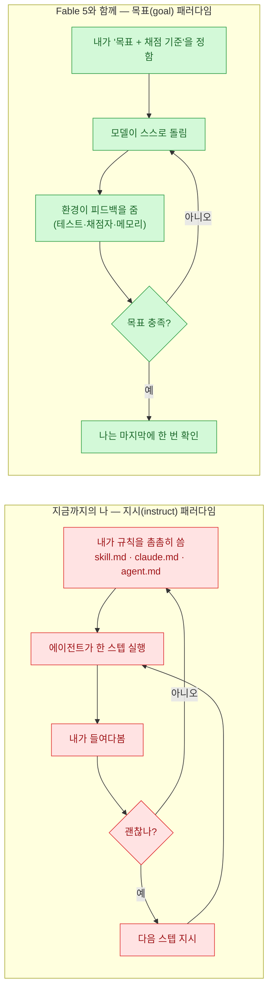
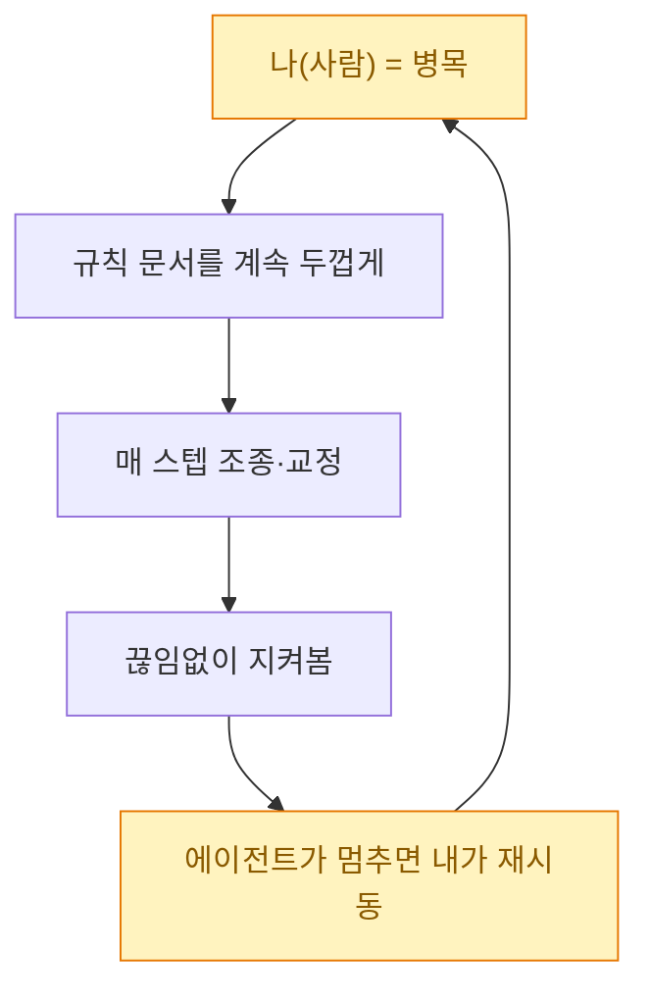
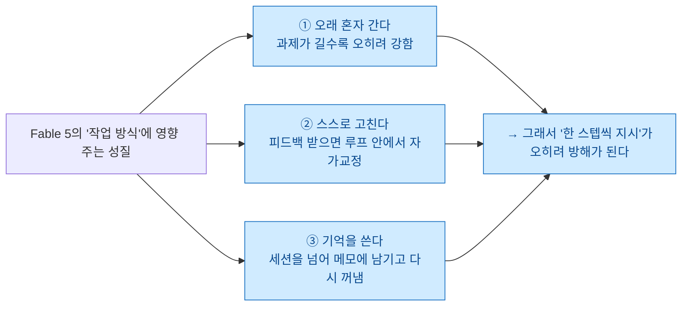
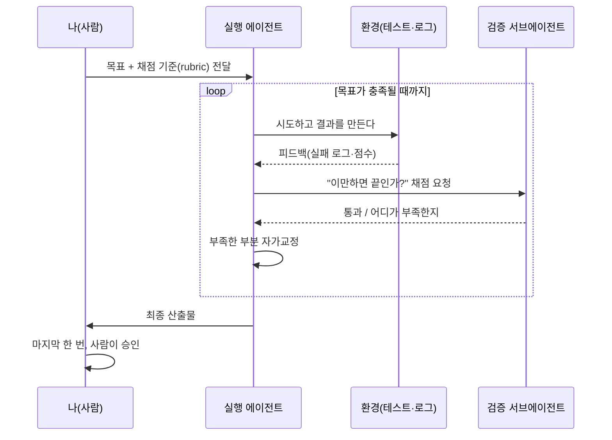
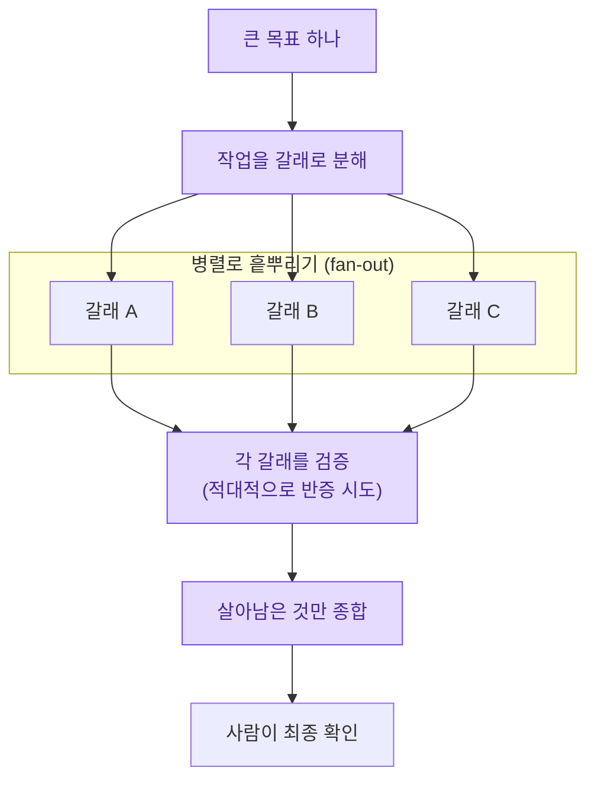

> 오늘의 일기. Fable 5가 나온 김에, 벤치마크 점수 말고 **"그래서 나는 앞으로 어떻게 일하게 되는가"**만 붙들고 생각을 정리해 봤다. 성능 자랑이 아니라, 내 손버릇이 바뀌는 이야기다.

며칠 전 Anthropic이 **Claude Fable 5**를 내놨다. Opus 위에 있는 이른바 **Mythos급(Mythos-class)** 모델을 일반 사용자도 쓸 수 있게 안전장치를 씌워 푼 것이라고 한다. 소개 글을 읽는데, 정작 내 눈을 오래 붙든 건 성능 표가 아니었다. 딱 한 문장이었다 — *"과제가 길고 복잡할수록 격차가 더 벌어진다."* 그리고 그 아래로 자꾸 반복되던 단어, **루프(loop)**.

솔직히 나는 그동안 좀 다른 방식으로 일해 왔다. Claude Code를 쓰면서 내가 만진 거라곤 결국 `skill.md`, `claude.md`, `agent.md` 몇 개였다. 에이전트가 헤매지 않게 **규칙을 촘촘히 적어 두고**, 한 스텝 갈 때마다 들여다보고, 어긋나면 프롬프트를 고쳐 다시 밀어 넣고. 말하자면 나는 **감독이자 조종사**였다. 그런데 요즘 사람들이 말하는 Fable 5의 사용법은 결이 달랐다. *"목표만 주고 놔둬라. 알아서 하게."* 처음엔 무슨 소린가 싶었는데, 며칠 곱씹으니 이게 꽤 큰 방향 전환이더라. 그 생각을 도식으로 정리해 둔다.

## 한눈에: 무엇이 바뀌는가?

왼쪽이 지금까지의 내 습관이다. **개입 지점이 매 스텝마다** 있다. 오른쪽이 사람들이 말하는 새 방식이다. 개입 지점이 **맨 앞(목표 설정)과 맨 뒤(최종 확인)로 몰린다.** 가운데는 모델과 환경이 알아서 돈다. 이 그림 하나가 오늘 일기의 전부라고 해도 된다.

## 예전의 나는 정확히 무엇을 하고 있었나?

부끄럽지만 솔직하게 적으면, 나는 **모델을 못 믿어서** 규칙을 늘리는 사람이었다. 에이전트가 엉뚱한 파일을 건드릴까 봐 `claude.md`에 "이건 하지 마라"를 추가하고, 스킬이 이상하게 발동할까 봐 `skill.md`의 트리거 문구를 계속 다듬고, 에이전트가 헤맬까 봐 `agent.md`에 절차를 1번, 2번, 3번… 번호까지 매겨 적었다.

이 방식이 틀린 건 아니었다. Opus 시절엔 이게 **합리적**이었다. 모델이 30분씩 혼자 두면 슬슬 길을 잃었으니까. 문제는, 이 구조에선 **내가 곧 병목**이라는 거다. 에이전트가 아무리 빨라도, 매 스텝 나를 거쳐야 하면 결국 내 리뷰 속도가 전체 속도다. 규칙 문서를 아무리 두껍게 써도, 세상의 모든 예외를 미리 적어 둘 수는 없었다.

## 무엇이 바뀌었길래 방식을 바꾸라는 걸까?

여기서 성능 얘기는 일부러 건너뛴다(그건 소개 글의 표를 보면 된다). 대신 **"일하는 방식"에 직접 영향을 주는 성질** 세 가지만 뽑았다.

Anthropic 소개 글의 표현을 빌리면, Fable 5는 **이전 어떤 Claude보다 오래 자율적으로 일한다.** 특히 재미있던 대목은 게임 얘기였다. 예전 모델은 포켓몬을 깨려고 지도·이동 보조 같은 온갖 보조 장치(하네스)를 붙여 줘야 했는데, Fable 5는 **화면 스크린샷만 보고** 깼다더라. 보조 장치가 덜 필요하다는 것 — 이게 핵심이다. **내가 만들어 줘야 했던 비계(scaffold)가 줄어든다.**

두 번째로, Anthropic이 콕 집은 게 **메모리**였다. 덱빌딩 게임에서 파일 기반 메모리를 줬더니, 그 효과가 **Opus보다 훨씬 크게** 나타났다고 한다. 모델이 스스로 메모를 남기고 다음 판에 꺼내 쓰는 것 — 이게 뒤에서 얘기할 **바깥 루프**의 씨앗이다.

세 번째는 Anthropic 사람인 Lance Martin이 쓴 글에서 가져왔다. 그가 못을 박듯 말한다. *"Fable 5를 직접 프롬프트하고 조종하기보다는, 모델이 환경 피드백에 반응해 스스로 고치도록 루프를 설계하는 편이 낫다."* 내가 며칠째 곱씹던 그 문장이다.

## 그래서 일하는 방식이 구체적으로 어떻게 달라지나?

이 표가 오늘 일기의 심장이다. 성능이 아니라 **손버릇**의 비교다.

| 관점 | Opus 시절 (지시) | Fable 5 (목표) |
|---|---|---|
| 내가 쓰는 문서 | **절차서** — "1번 이거, 2번 저거 하지 마" | **목표·채점 기준** — "이 상태가 되면 끝" |
| skill/claude/agent.md의 역할 | 매 스텝을 조종하는 **대본** | 목표·가드레일·검증 방법을 정하는 **헌법** |
| 개입 빈도 | 매 스텝 | 시작(목표)과 끝(확인) |
| 누가 '끝'을 판정하나 | 내가 눈으로 | **채점자(rubric)·검증 에이전트** |
| 실패했을 때 | 내가 프롬프트를 고쳐 재시동 | 모델이 피드백 보고 **스스로 재시도** |
| 병목 | 나 | 목표 설계의 품질 |
| 나의 자리 | 조종사 | **환경 설계자** |

한 줄로 줄이면 이렇다. 예전엔 **"어떻게 할지"**를 내가 적었다. 이제는 **"무엇이 되면 끝인지"**를 적고, "어떻게"는 모델과 환경에 맡긴다. 대본을 쓰던 사람이 무대와 규칙을 짜는 사람이 되는 셈이다.

## '루프 엔지니어링'이라는 게 대체 뭔데?

말은 거창한데, 뜯어보면 단순하다. **모델이 스스로 채점받고 고치기를, 목표가 충족될 때까지 반복**하게 만드는 것. 핵심은 "채점을 누가 하느냐"다.

여기서 내가 새로 배운 포인트가 하나 있다. **채점을 모델 자신에게 맡기지 말 것.** Lance Martin도, Anthropic 엔지니어링 블로그도 같은 얘기를 한다 — 모델은 **자기 출력을 자기가 비평하는 데 약하다.** 그래서 채점은 **독립된 문맥(context)을 가진 별도의 검증 서브에이전트**에게 시키는 게 낫다. 만드는 쪽과 검사하는 쪽을 분리하는 것 — 나는 이걸 예전 글들에서 **"Doer는 Checker가 아니다"**라고 적어 뒀었는데, 루프에서도 정확히 같은 원리가 반복된다.

그리고 **메모리**는 이 루프의 **바깥 루프**다. 한 세션 안에서 도는 게 안쪽 루프라면, 세션을 넘어 "실패했다 → 왜인지 조사했다 → 사실로 검증했다 → 규칙으로 일반화했다 → 다음엔 그 규칙을 꺼내 쓴다"로 이어지는 게 바깥 루프다. Fable 5는 이 진행을 끝까지 밟는 편이라고 한다. 예전 모델이 "실패 메모"만 잔뜩 쌓아 두고 다시 안 읽었다면, 이건 **검증된 규칙까지 증류해 다음 과제에 써먹는다.**

## '다이나믹 워크플로'는 또 뭐고?

루프가 "같은 일을 목표까지 반복"이라면, 다이나믹 워크플로는 **"큰 일을 잘게 쪼개 여러 갈래로 흩뿌리고, 각각을 검증한 뒤 다시 합치는"** 구조다. 제어 흐름(control flow)은 내가 코드처럼 확정해 두고, 그 안의 판단만 모델에게 맡긴다.

이게 왜 Fable 5와 잘 맞느냐면 — 갈래마다 **오래 혼자 파고들 수 있고**, 검증 갈래가 **독립 문맥에서 반증**해 주고, 종합 단계가 **메모리처럼 결과를 모아** 주기 때문이다. 앞의 세 성질(오래 감·자가교정·기억)이 그대로 들어맞는다. 나는 앞선 글들에서 이걸 여러 번 다뤘는데, 이제야 "왜 하필 지금 이게 뜨는가"가 몸으로 이해된다. **모델이 그만큼 오래·정확히 혼자 갈 수 있어야, 흩뿌려도 무너지지 않기 때문이다.**

## 그럼 skill.md · claude.md · agent.md는 이제 필요 없나?

이게 내가 가장 헷갈렸던 지점이라 정직하게 적는다. **아니다. 없어지는 게 아니라 역할이 바뀐다.**

예전엔 이 파일들에 **"어떻게 걸어라"**를 적었다. 이제는 같은 파일에 **"어디가 결승선이고, 어느 선은 넘지 말고, 끝났는지는 이렇게 채점하라"**를 적는다. 지시가 사라지는 게 아니라, **지시의 층위가 올라간다.** 스텝을 지시하던 데서 목표와 판정 기준을 지시하는 데로. 그러니 "목표만 주고 놔둬라"는 말은 **"아무것도 안 적어도 된다"가 아니라, "적을 것이 스텝이 아니라 목표·검증으로 바뀐다"**는 뜻이었다.

## 물러선다고 다 맡겨도 되는 걸까?

여기서 브레이크를 한 번 밟아야겠다. 며칠 전에 읽은 Armin Ronacher의 글이 자꾸 걸린다. 루프가 커질수록 **각 반복이 작은 방어 코드를 덧대면서, 시스템이 더 튼튼해 보이지만 실은 점점 이해 불가능해진다**는 경고였다. 목표만 주고 물러서는 게 매력적일수록, 위험한 건 **내가 결과를 더는 이해하지 못하게 되는 것**이다.

그래서 나는 "물러서기"에 세 개의 말뚝을 박아 두기로 했다.

- **만드는 쪽과 검사하는 쪽을 분리한다.** 채점은 항상 별도 검증자에게. 자기 채점 금지.
- **오래 갈 것과 짧게 쓸 것을 구분한다.** 포팅·리서치·실험처럼 **수명이 짧거나 검증 가능한 일**은 과감히 맡기고, 오래 유지할 핵심 코드는 아직 내가 붙어 있는다.
- **마지막 승인은 사람이 쥔다.** 공개·배포처럼 되돌리기 어려운 마지막 한 걸음은, 루프가 아무리 잘 돌아도 내가 직접 누른다.

목표 패러다임은 "판단을 버리는 것"이 아니다. **판단을 어디에 둘지 옮기는 것**이다 — 매 스텝에서, 목표 설계와 최종 승인으로.

## 마무리 — 오늘의 결론

일기를 닫으며 정리하면 이렇다. Fable 5가 바꾼 건 내 성능 기대치가 아니라 **내 자리**였다. 대본을 쓰던 조종사에서, 무대와 규칙과 심판을 배치하는 **설계자**로. 앞으로 나는 `skill.md`·`claude.md`·`agent.md`를 열 때 스스로에게 이렇게 물어보려 한다 — *"나 지금 스텝을 적고 있나, 아니면 목표와 결승선을 적고 있나?"*

물론 이 글도 완전히 손 놓고 쓴 건 아니다. 자료를 모으고 얼개를 짜는 데 루프와 워크플로를 썼지만, **문장의 목소리와 마지막 발행 버튼은 내가 쥐었다.** 그게 오늘 내가 내린 균형점이다. 목표는 모델에게, 판단은 나에게.

## 참고자료

- [Anthropic — Claude Fable 5 and Claude Mythos 5 (2026)](https://www.anthropic.com/news/claude-fable-5-mythos-5)
- [Lance Martin — Designing loops with Fable 5 (@RLanceMartin)](https://x.com/RLanceMartin)
- 관련(내 글): [[loop-engineering-four-loops-loopcraft|루프 엔지니어링 — 네 개의 루프]] · [[claude-code-dynamic-workflow-deepresearch-vs-ultracode|다이나믹 워크플로]] · [[the-coming-loop-armin-ronacher-harness-critique|루프의 시대가 온다]] · [[claude-tag-multiplayer-agents|팀 하네스 — Doer는 Checker가 아니다]]

<!-- 안전: 회사 실데이터·고객/제3자 PII·API키/쿠키/토큰 없음. 외부 자료는 요약·논평 + 출처 링크. 성능 벤치마크 수치는 의도적으로 최소화하고 작업 패러다임에 집중. -->
