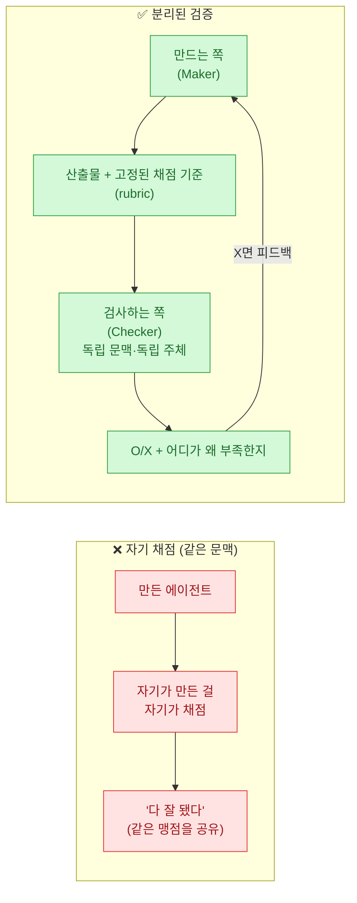
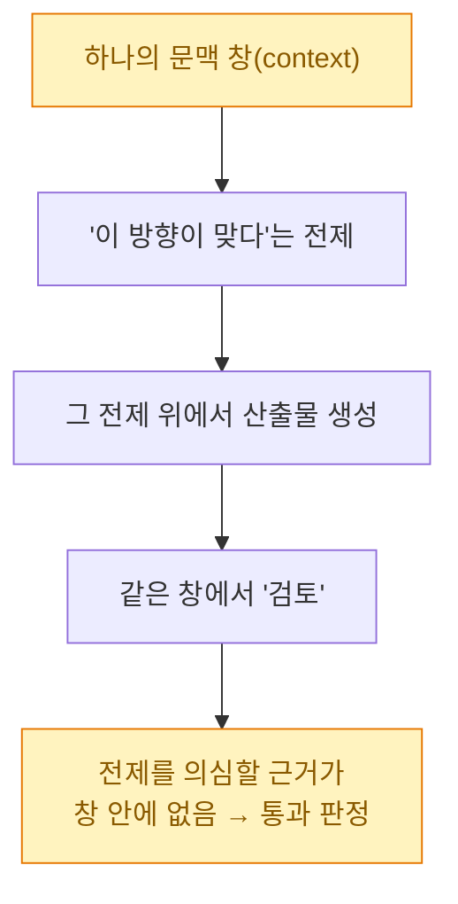
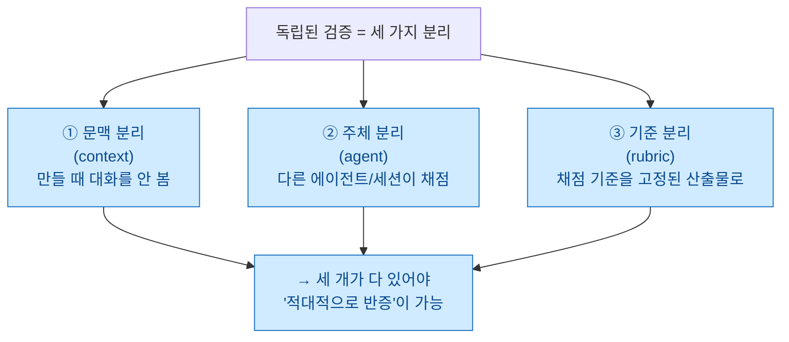
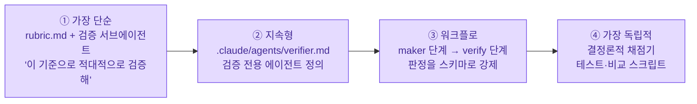

> **Fable 5 일기 시리즈** — ① [[fable5-from-instructing-agents-to-designing-loops|지시에서 목표로]] · **② 만드는 쪽 ≠ 검사하는 쪽 (이 글)**

지난 글을 발행하고, 스스로 읽어 보다 걸린 대목이 있었다. 마지막에 **"만드는 쪽과 검사하는 쪽을 분리하라"**고 규칙처럼 적어 놓고는, 정작 **"그래서 그걸 어떻게 세팅하는데?"**를 하나도 안 적었더라. 독립된 곳에서 검증하게 만든다는 게 말은 멋진데, 실제로는 뭘 분리하라는 건지, 채점 기준을 **별도 파일**로 빼야 하는 건지, Claude Code에서 어디에 뭘 두라는 건지 — 그 구체가 비어 있었다. 오늘 일기는 그 빈칸을 채우는 글이다.

## 한눈에: 무엇을 분리하는가?



왼쪽이 함정이다. **만든 놈이 자기가 만든 걸 채점하면**, 만들 때 가졌던 맹점을 채점할 때도 똑같이 가지고 있다. "나는 잘했다"에 도달하기 쉽다. 오른쪽이 오늘 세팅할 구조다. 만드는 쪽과 검사하는 쪽 사이에 **고정된 채점 기준**을 두고, 검사는 **다른 자리**에서 한다.

## 왜 자기가 자기를 못 채점하나?

이건 성격이 나빠서가 아니라 구조의 문제다. LLM은 **자기 출력을 자기가 비평하는 데 약하다**는 게 여러 곳에서 확인됐다(Anthropic 엔지니어링 블로그도, Fable 5로 루프를 돌린 Lance Martin도 같은 얘기를 한다). 이유를 그림으로 그리면 단순하다.



핵심은 **"같은 창 안에는 자기 전제를 뒤집을 재료가 없다"**는 것이다. 그래서 채점자는 **처음부터 다른 창에서** 시작해야 한다. 만드는 과정을 못 본 채, 오직 **산출물과 기준만** 받아서, "이게 기준을 충족하나?"만 본다. 그래야 "왜 이렇게 만들었는지"에 물들지 않는다.

## '독립된 검증'은 정확히 무엇을 분리하나?

막연히 "따로 검사해"가 아니다. 분리할 축이 세 개다.



- **문맥 분리**: 검사하는 쪽은 만들 때의 대화·시행착오를 보지 않는다. 산출물만 본다.
- **주체 분리**: 만든 세션이 아니라 **다른 에이전트(혹은 새 세션)**가 채점한다.
- **기준 분리**: 채점 기준이 채점자 머릿속(혹은 만든 쪽 머릿속)에 있으면 안 된다. **밖에 고정**돼 있어야, 만드는 쪽도 검사하는 쪽도 같은 자를 쓴다.

## 그래서 채점 기준을 별도 .md 파일로 만들어야 하나?

내가 가장 궁금했던 질문이라 정직하게 답을 갈라 적는다. **둘을 구분하면 헷갈리지 않는다.**

| 무엇 | 파일로 빼나? | 왜 |
|---|---|---|
| **채점 기준(rubric)** | **응, 빼는 게 좋다** | 만드는 쪽·검사하는 쪽이 **같은 기준**을 봐야 함. 파일이면 대화가 길어져도 안 흔들리고, 재사용·버전관리도 된다 |
| **검사하는 쪽(checker)** | 파일이 아니라 **별도 문맥/에이전트** | 채점은 '행위'라 파일이 아니라 **독립 실행 주체**로 존재. (에이전트 정의를 파일로 둘 순 있지만, 그건 checker의 '설정'이지 checker 자체는 아님) |

정리하면, **"별도 .md로 만들어야 하나?"의 답은 '채점 기준은 그렇다'**이다. 완료 정의(Definition of Done)를 `rubric.md`(혹은 작업 프롬프트 안의 고정 섹션)로 박아 두고, 검사는 그 파일을 읽는 **독립 에이전트**에게 시킨다. 채점 기준을 파일로 빼는 순간, "잘 됐나?"라는 주관적 질문이 **"이 목록을 다 통과했나?"라는 체크 가능한 질문**으로 바뀐다.

## Claude Code에서는 구체적으로 어떻게 배선하나?

추상론만 하면 안 되니까, 실제로 쓰는 네 가지 세팅을 난이도 순으로 적는다.



- **① rubric.md + 검증 서브에이전트**: 완료 정의를 파일로 적고, 만든 뒤 **새 서브에이전트**를 띄워 "이 산출물을 `rubric.md` 기준으로 **반증(refute)** 시도해"라고 시킨다. 서브에이전트는 자기 문맥 창을 갖기 때문에 ①문맥·②주체가 자동으로 분리된다. 제일 가볍고, 오늘 당장 쓸 수 있다.
- **② `.claude/agents/verifier.md`**: 검증만 하는 에이전트를 아예 정의로 박아 둔다. "너는 만들지 않는다. 오직 기준 대비 O/X와 근거만 낸다"는 성격을 고정. 반복 작업에 좋다.
- **③ 워크플로의 verify 단계**: 만드는 단계 다음에 검증 단계를 두고, 판정을 **정해진 형식(스키마)**으로 강제한다. `{통과: true/false, 실패근거: ...}` 처럼. 형식이 강제되면 "음 대체로 괜찮은 듯요" 같은 얼버무림이 안 나온다.
- **④ 결정론적 채점기**: 제일 셌다. 사람도 LLM도 아닌 **코드가 채점**한다. 테스트 스위트, 출력 비교 스크립트, 빌드 경고 카운트. 코드는 합리화를 안 한다. 가능하면 항상 이걸 1순위로 깐다.

한 가지 원칙 — **가능한 만큼 아래로 내려간다.** ④로 판정할 수 있으면 ④로, 그게 애매한 영역(문장 품질·설계 타당성)만 ①~③의 LLM 검증에 맡긴다.

## 목표형 프롬프트의 골격 (5부)

검증을 분리하려면, 애초에 프롬프트가 **채점 가능한 형태**여야 한다. 절차 번호(1번·2번…)를 지우고, **"무엇이 되면 끝인지"를 기계가 O/X로 판정 가능한 조건**으로 적는 게 전부다. 골격은 다섯이다 — **①목표 ②완료 정의 ③가드레일 ④검증 방법 ⑤루프 규칙.**

```markdown
## 목표
<도달해야 할 최종 상태 한 문장>

## 완료 정의 (Definition of Done)
- [ ] <기계 판정 가능한 조건 — diff=0, 테스트 통과, 빌드 경고 0 등>

## 가드레일
- <넘지 말 선 — 수정 금지 파일, 실행 금지 행동>

## 검증 방법
- <채점 주체·도구 — 테스트 스크립트, 독립 문맥의 검증 서브에이전트. 자기 채점 금지>

## 루프 규칙
- 완료 정의 전부 통과까지 수정-재시도 반복
- 동일 원인 N회 실패 시 로그·가설 정리 후 중단·보고
```

> ⚠️ 여기 딱 하나의 함정이 있다. **완료 정의에 "깔끔하게", "잘", "적절히" 같은 주관어가 들어가면 루프가 못 돈다.** 채점자가 O/X를 낼 수 있는 조건만 쓴다. "코드를 깔끔하게 정리"가 아니라 "`dotnet build` 경고 0, 순환 복잡도 15 이하"처럼.

## 예시 — 레거시 VBA를 .NET으로 포팅할 때

내가 실제로 해 본 종류의 작업을 **일반화해서** 옮긴다(회사 고유 모듈명·범위명은 뺐다). 오래된 VBA 계산 모듈을 .NET 서비스로 옮기는 상황이라고 하자.

**지시형(예전 습관):**

```text
LegacyCalc.bas 열어서 함수 목록 뽑아줘.
CalcService.cs 만들고 첫 함수부터 하나씩 C#으로 옮겨.
엑셀은 EPPlus로...
하나 끝나면 보여줘. 내가 확인하고 다음 거 지시할게.
```

→ 함수마다 내가 개입한다 = **내가 병목**이고, 검사도 결국 내 눈이라 **주체 분리가 안 된다.**

**목표형(전환 후):**

```markdown
## 목표
레거시 VBA 계산 모듈을 .NET(EPPlus) 서비스로 포팅

## 완료 정의
- [ ] 모듈의 모든 public 프로시저가 C#으로 구현됨
- [ ] 샘플 입력 3종: VBA 실행 결과 vs C# 출력 셀 값 diff = 0
- [ ] 기존 서비스 회귀 테스트 전부 통과 (회귀 0)
- [ ] dotnet build 경고 0

## 가드레일
- 이미 완성된 기존 서비스 파일 수정 금지
- 별도로 관리 중인 특정 이름범위(Name range) 접근 금지
- 신규 NuGet 패키지 추가 금지 (EPPlus만)

## 검증 방법
- scripts/compare_output.py 로 셀 값·서식 비교 (결정론적 채점기 = 최우선)
- 포팅 후 독립 문맥의 검증 서브에이전트가 VBA 원본 대비 로직 동등성을 적대적으로 반증

## 루프 규칙
- diff ≠ 0 → 차이 셀 좌표 기준 원인 추적 → 수정 → 재실행
- 동일 원인 5회 실패 → 실패 로그 + 가설 정리 후 중단·보고
```

여기서 검증이 **두 겹**인 걸 보라. 셀 값 비교(`compare_output.py`)는 **코드가 채점**하니 제일 독립적이다. 그리고 그걸로 못 잡는 "로직이 원본과 진짜 같은가"는 **독립 문맥의 서브에이전트**가 반증한다. 만드는 쪽은 이 둘을 통과할 때까지만 돌고, 나는 맨 끝에 한 번 본다.

## 예시 — claude.md를 '대본'에서 '헌법'으로

같은 원리가 `claude.md`에도 적용된다. 예전엔 여기에 **대본**을 적었다.

```markdown
1. 작업 전 반드시 git status 확인
2. 파일 수정 전 백업 생성
3. 함수 하나 고칠 때마다 나에게 보고
```

지금은 **헌법**을 적는다 — 스텝이 아니라 **완료의 정의와 검증 원칙.**

```markdown
## 완료의 정의 (전 작업 공통)
- 빌드/테스트 미통과 상태에서 '완료' 선언 금지
- 완료 선언 전, 독립 검증 서브에이전트 리뷰 필수

## 가드레일
- 비가역 행동(배포·실계정 게시·파일 삭제)은 실행 전 승인 요청
- main 브랜치 직접 커밋 금지

## 검증
- C#: dotnet test / Python: pytest — 자기 채점 금지, 채점은 별도 문맥에서

## 메모리
- 실패 → 원인 검증 → 규칙화를 통과한 것만 기록 (미검증 메모 축적 금지)
```

"함수 하나 고칠 때마다 보고"가 사라지고, **"완료 선언 전 독립 검증 필수"**가 그 자리를 채웠다. 개입을 매 스텝에서 **완료의 문턱 하나로** 옮긴 것이다.

## 지금 내 프롬프트가 지시형인지 목표형인지 — 자가진단 3개

- **절차 번호**(1→2→3)가 있으면 지시형, **체크박스 완료 조건**이 있으면 목표형.
- **"보여줘/확인받아"**가 중간중간 있으면 지시형, **맨 마지막에 한 번만** 있으면 목표형.
- 완료 조건을 **스크립트나 검증 에이전트가 O/X로 판정 가능한가** — 불가능하면(주관어가 섞였으면) 루프가 안 돈다.

## 마무리 — 검사하는 자리에 판단을 둔다

지난 글에서 "조종사에서 설계자로"라고 썼는데, 오늘 한 겹 더 내려가 보니 설계의 핵심은 결국 **채점대를 어디에 놓느냐**였다. 만드는 쪽은 값싸졌다. 이제 희소한 건 **"이게 진짜 됐다고 누가, 무엇으로 판정하는가"**다. 그 판정을 만든 놈에게 맡기지 않고, 고정된 기준과 독립된 검사자에게 넘기는 것 — 그게 목표형으로 일하면서도 결과를 계속 믿을 수 있는 유일한 방법이더라.

그래서 요즘 나는 새 작업을 시작할 때 프롬프트보다 `rubric`을 먼저 쓴다. **무엇이 되면 끝인지**를 O/X로 적을 수 있으면, 나머지는 루프가 알아서 한다. 못 적겠으면 — 그건 아직 내가 그 일을 충분히 이해 못 했다는 신호고.

## 참고자료

- [Anthropic — Claude Fable 5 and Claude Mythos 5 (2026)](https://www.anthropic.com/news/claude-fable-5-mythos-5)
- [Lance Martin — Designing loops with Fable 5 (@RLanceMartin)](https://x.com/RLanceMartin)
- 시리즈 ①: [[fable5-from-instructing-agents-to-designing-loops|지시에서 목표로, 루프를 설계하는 법]]
- 관련(내 글): [[claude-tag-multiplayer-agents|팀 하네스 — Doer는 Checker가 아니다]] · [[planning-harness-detailed-spec-automation|기획 하네스 — 검증 기둥]] · [[the-coming-loop-armin-ronacher-harness-critique|루프의 시대가 온다]]

<!-- 안전: 회사 실데이터·고객/제3자 PII·API키/쿠키/토큰 없음. VBA→.NET 예시는 실제 회사 모듈명·범위명을 제거하고 일반화한 합성 예시. 외부 자료는 요약·논평 + 출처 링크. -->
