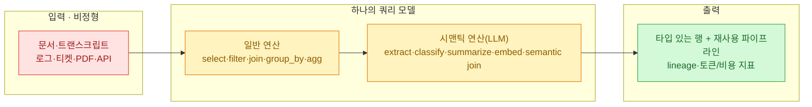
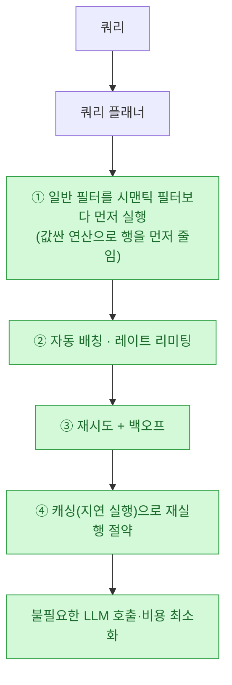

나는 데이터 분석가라 데이터프레임(pandas·PySpark)이 손에 익다. `filter`, `join`, `group_by`, `agg`로 표를 주무르는 감각 말이다. 그런데 요즘 비정형 데이터 — 상담 트랜스크립트, 로그, 티켓, PDF — 를 다룰 때마다 나는 **데이터프레임을 잠깐 빠져나와 파이썬 for 루프로 LLM을 덕지덕지 호출**하곤 했다. 분류 한 번, 요약 한 번, 추출 한 번. 그러다 보면 배칭·재시도·비용 추적을 매번 손으로 짜고, 그 결과는 노트북 셀 어딘가로 흩어졌다.

그래서 GeekNews에서 본 [`typedef-ai/fenic`](https://github.com/typedef-ai/fenic)이 반가웠다. **"데이터프레임 안에 LLM 연산자를 넣으면 어떨까"**라는, 내가 매번 손으로 하던 걸 정식 연산으로 만든 프로젝트였다.

## fenic이 뭔가 — 한 문장으로



한마디로 **시맨틱 데이터프레임(Semantic DataFrames)**이다. PySpark/SQL 스타일 연산과, **언어 모델을 호출하는 시맨틱 연산자**를 **하나의 쿼리 모델** 안에서 같이 다룬다. 문서·트랜스크립트·로그·eval 트레이스·티켓·테이블·API를 **타입 지정된 행(typed rows)**과 반복 가능한 워크플로로 바꾼다. 라이선스는 Apache-2.0.

## 왜 데이터프레임에 LLM을 넣나?

핵심은 `extract`, `classify`, `summarize`, `embed`, 그리고 **시맨틱 조인(semantic join)** 같은 AI 연산자가 **스키마와 타입을 가진 1급 연산자**로 쿼리 모델에 내장됐다는 점이다. 특히 두 가지가 데이터쟁이 입장에서 크다.

- **비정형 텍스트를 Pydantic 스키마에 바인딩** → 조회 가능한 **구조화 컬럼**으로 돌려준다. "이 리뷰에서 제품명·감정·불만유형을 뽑아 컬럼으로" 같은 걸 추출 연산 하나로 정형화한다.
- **정확한 키가 아닌 '의미 기반' 조인(semantic join)**. 예전엔 조인하려면 정확히 일치하는 키가 있어야 했다. fenic은 의미가 비슷하면 잇는다 — 예컨대 "고객 문의"와 "FAQ 항목"을 뜻으로 매칭.

아래는 내가 매번 for 루프로 짜던 걸 fenic이 어떻게 연산으로 바꾸는지 보여주는 **개념 예시**다(정확한 메서드 명칭은 저장소 문서 기준).

```python
# 개념 예시 — 실제 API 명칭은 fenic 문서 참고
tickets = (
    df.read_markdown("tickets/*.md")            # Markdown을 일급 타입으로
      .filter(col("priority") == "high")        # ① 일반 필터 먼저 (싸다)
      .semantic.extract("body", schema=Issue)   # ② LLM 추출 → 구조화 컬럼
      .semantic.classify("body", labels=[...])  # ③ 분류
      .semantic.join(faq, on="meaning")         # ④ 의미 기반 조인
)
```

## 비용·속도는 어떻게 잡나?

LLM을 데이터프레임에 넣을 때 진짜 무서운 건 **비용과 호출 폭증**이다. fenic이 이걸 다루는 방식이 영리하다.



특히 **"일반 필터를 시맨틱 필터보다 먼저"** 돌린다는 게 데이터 최적화의 정석이다 — 값싼 조건으로 행을 먼저 쳐내면, 비싼 LLM 호출 대상 자체가 줄어든다. 여기에 자동 배칭·레이트 리미팅·재시도+백오프·캐싱이 붙는다. 일반 데이터 연산은 **Polars/DuckDB**로 처리하고, 데이터 교환은 **Apache Arrow**로 하며, 로컬에서 간단히 돈다. 추론 특유의 레이트리밋·타임아웃·**비결정적 출력**을 다루려고 비동기 실행·타입 검사에 집중한 티가 난다.

## '파이프라인이 곧 산출물'이라는 철학

내가 가장 공감한 대목. fenic은 **탐색 결과가 채팅 기록으로 사라지지 않고 코드·데이터·파이프라인으로 남는다**고 말한다. 그래서 파이프라인 자체를 검사할 수 있다.

- **행 단위 lineage** — 이 행이 어떤 입력에서 왔는지 추적
- **explain** — 쿼리 계획을 들여다보기
- **쿼리별 토큰/비용 지표** — 어디서 돈이 나갔는지 정량 확인
- **지연 실행 + 캐싱** → 재실행 가능, 명명된 테이블/뷰로 승격 가능

LLM을 만지다 보면 "아까 그 좋은 결과, 어떻게 나왔더라?"가 늘 문제였다. 채팅 안에서 한 탐색은 재현이 안 된다. 파이프라인으로 남기면 **재현·감사·재사용**이 된다. 이건 내가 [[parsing-korean-public-docs-pdf-hwp-to-markdown-reindexing|관보를 마크다운 코퍼스로 재인덱싱한 글]]에서 밑줄 그은 "source first, 재현 가능성"과 같은 정신이다.

## 사람과 에이전트가 '같은 파이프라인'을 쓴다

fenic이 요즘 흐름과 맞닿는 지점이 여기다. 이 파이프라인을 **카탈로그에 도구로 등록해 MCP로 노출**할 수 있고, 코딩 에이전트용 **`fenic skill install`**과 정적 검사기 **`fenic check`**를 제공한다. 즉 사람이 짠 데이터 파이프라인을, 에이전트가 호출할 수 있는 **타입 지정 도구**로 그대로 승격시킨다.

fenic은 스스로를 **"에이전트를 위한 선언적 컨텍스트 엔지니어링(declarative context engineering)"**으로 정의하고, **무거운 배치 추론을 에이전트 런타임 밖으로 분리(decouple)**한다고 밝힌다. 이렇게 하면 에이전트는 더 예측 가능하고 반응성이 좋아진다 — 무거운 처리는 파이프라인에 맡기고, 에이전트는 그 결과를 도구로 부르기만 하면 되니까.

> 오늘 같이 정리한 [[gpt-5-6-model-guidance-prompt-diet-and-agent-skills|GPT-5.6 가이드 글]]과 겹치는 대목이 바로 이거다. 한쪽(OpenAI)은 "프롬프트를 걷어내고 지식은 스킬로 주입하라"고 하고, fenic은 "무거운 추론은 파이프라인으로 분리하고 에이전트엔 도구로 넘겨라"고 한다. **에이전트의 컨텍스트를 가볍게 유지하려는 같은 방향**이다.

## 내 생각 — 데이터쟁이에게 뭐가 달라지나

fenic을 보며 든 생각은 두 가지다. 첫째, **"LLM 호출을 데이터 연산으로 취급한다"**는 발상이 결국 옳다. 나처럼 for 루프로 분류·요약을 돌리던 사람에겐, 배칭·재시도·비용 추적을 엔진이 대신 해 주는 것만으로도 큰 해방이다. 둘째, **비정형을 타입 있는 행으로 바꾸는 일**은 요즘 내 관심사 전부와 겹친다 — [[dart-ipo-financial-data-pipeline|공시 데이터 파이프라인]]도, [[knowledge-vault-fts-graph-mcp-search|코드·문서를 인덱싱해 검색하던 도구]]도 결국 "흩어진 비정형을 조회 가능한 구조로"라는 같은 목표였다.

물론 아직 지켜볼 것도 있다. 시맨틱 연산은 편리한 만큼 **비결정적**이고, 조인이 '의미로' 이어지는 순간 결과 검증이 어려워진다. fenic이 lineage·비용 지표·타입 검사를 앞세운 건 바로 그 불안을 달래려는 장치일 것이다. 그래서 나라면 **작게 시작해 lineage로 검증하며** 범위를 넓힐 것 같다. 어쨌든 "데이터프레임에 LLM을 넣는다"는 방향은, 데이터로 먹고사는 사람에게 분명 반가운 소식이다.

## 참고자료

- fenic 저장소: [typedef-ai/fenic (GitHub, Apache-2.0)](https://github.com/typedef-ai/fenic)
- 소개: [GeekNews — fenic, 사람과 에이전트를 위한 시맨틱 데이터프레임](https://news.hada.io/) (by xguru)
- 기반 기술: [Polars](https://pola.rs/) · [DuckDB](https://duckdb.org/) · [Apache Arrow](https://arrow.apache.org/) · [Pydantic](https://docs.pydantic.dev/)
- 관련(내 글): [[gpt-5-6-model-guidance-prompt-diet-and-agent-skills|GPT-5.6 가이드 — 프롬프트 다이어트]] · [[parsing-korean-public-docs-pdf-hwp-to-markdown-reindexing|비정형 문서를 구조화 마크다운으로]] · [[knowledge-vault-fts-graph-mcp-search|전 파일형식 코드·문서 검색 도구]] · [[dart-ipo-financial-data-pipeline|DART 재무 파이프라인]]

<!-- 안전: 회사 실데이터·고객/제3자 PII·API키/쿠키/토큰 없음. 공개 저장소(typedef-ai/fenic)와 GeekNews 소개를 요약·논평하고 1차 출처 링크. 코드 예시는 '개념 예시'로 명시(정확한 API는 저장소 문서 기준). -->
